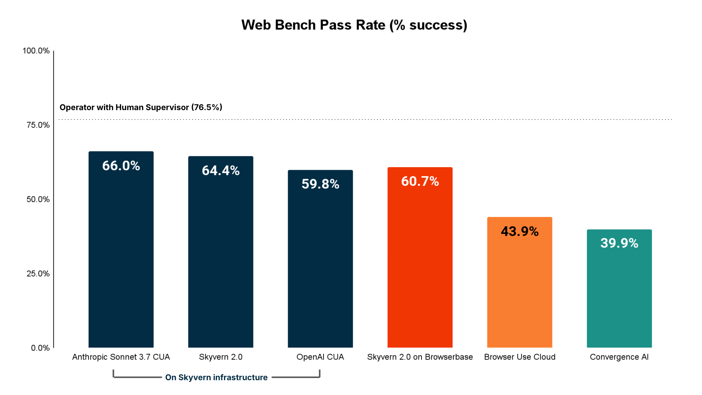
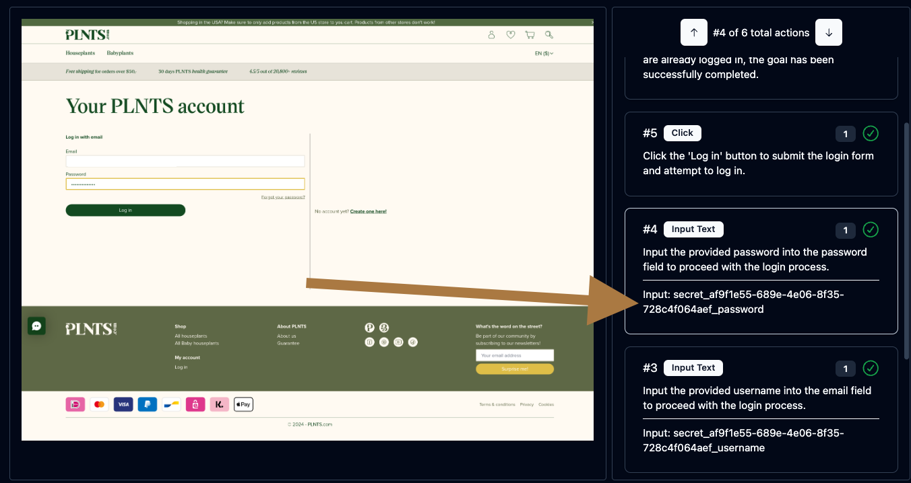
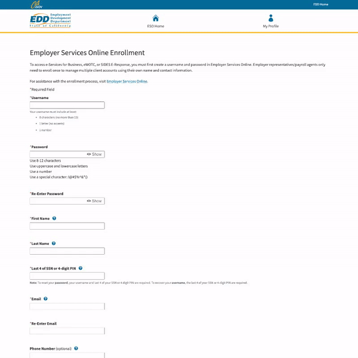
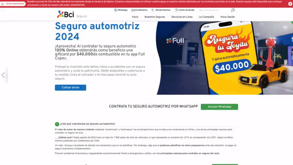

<!-- DOCTOC SKIP -->

<h1 align="center">
 <a href="https://www.skyvern.com">
  <picture>
    <source media="(prefers-color-scheme: dark)" srcset="fern/images/skyvern_logo.png"/>
    
  </picture>
 </a>
 <br />
</h1>
<p align="center">
🐉 LLM과 컴퓨터 비전을 사용한 브라우저 기반 워크플로우 자동화 🐉
</p>
<p align="center">
  <a href="https://www.skyvern.com/"></a>
  <a href="https://www.skyvern.com/docs/"></a>
  <a href="https://discord.gg/fG2XXEuQX3"></a>
  <!-- <a href="https://pepy.tech/project/skyvern" target="_blank"></a> -->
  <a href="https://github.com/skyvern-ai/skyvern"></a>
  <a href="https://github.com/Skyvern-AI/skyvern/blob/main/LICENSE"></a>
  <a href="https://twitter.com/skyvernai"></a>
  <a href="https://www.linkedin.com/company/95726232"></a>
</p>

[Skyvern](https://www.skyvern.com)은 LLM과 컴퓨터 비전을 사용하여 브라우저 기반 워크플로우를 자동화합니다. 간단한 API 엔드포인트를 제공하여 다수의 웹사이트에서 수동 워크플로우를 완전히 자동화하며, 취약하거나 신뢰할 수 없는 자동화 솔루션을 대체합니다.

<p align="center">
  
</p>

브라우저 자동화에 대한 기존 접근 방식은 웹사이트별로 맞춤 스크립트를 작성해야 했으며, 웹사이트 레이아웃이 변경될 때마다 중단되는 DOM 파싱 및 XPath 기반 상호작용에 의존했습니다.

코드로 정의된 XPath 상호작용에만 의존하는 대신, Skyvern은 Vision LLM을 활용하여 웹사이트를 학습하고 상호작용합니다.

# 작동 방식
Skyvern은 [BabyAGI](https://github.com/yoheinakajima/babyagi)와 [AutoGPT](https://github.com/Significant-Gravitas/AutoGPT)에서 대중화된 작업 주도형 자율 에이전트 설계에서 영감을 받았습니다. 여기에 한 가지 주요 보너스가 있습니다: Skyvern에게 [Playwright](https://playwright.dev/)와 같은 브라우저 자동화 라이브러리를 사용하여 웹사이트와 상호작용할 수 있는 능력을 부여했습니다.

Skyvern은 에이전트 군집을 사용하여 웹사이트를 이해하고, 작업을 계획하고 실행합니다:

<picture>
  <source media="(prefers-color-scheme: dark)" srcset="fern/images/skyvern_2_0_system_diagram.png" />
  
</picture>

이 접근 방식은 몇 가지 장점이 있습니다:

1. Skyvern은 이전에 본 적이 없는 웹사이트에서도 작동할 수 있습니다. 맞춤 코드 없이 워크플로우를 완료하는 데 필요한 작업에 시각적 요소를 매핑할 수 있기 때문입니다
1. Skyvern은 웹사이트 레이아웃 변경에 강합니다. 시스템이 탐색하려고 할 때 찾는 미리 정의된 XPath나 다른 선택자가 없기 때문입니다
1. Skyvern은 단일 워크플로우를 다수의 웹사이트에 적용할 수 있습니다. 워크플로우를 완료하는 데 필요한 상호작용을 추론할 수 있기 때문입니다
1. Skyvern은 LLM을 활용하여 상호작용을 추론함으로써 복잡한 상황을 처리할 수 있습니다. 예를 들어:
    1. Geico에서 자동차 보험 견적을 받고 싶다면, "18세에 운전할 자격이 있었나요?"라는 일반적인 질문에 대한 답변은 운전자가 16세에 면허를 받았다는 사실에서 추론할 수 있습니다
    1. 경쟁사 분석을 하는 경우, 7/11의 Arnold Palmer 22 oz 캔이 Gopuff의 23 oz 캔과 거의 확실히 동일한 제품임을 이해합니다(크기가 약간 다르더라도 반올림 오류일 수 있습니다!)

자세한 기술 보고서는 [여기](https://www.skyvern.com/blog/skyvern-2-0-state-of-the-art-web-navigation-with-85-8-on-webvoyager-eval/)에서 확인할 수 있습니다.

# 데모
<!-- Redo demo -->
https://github.com/user-attachments/assets/5cab4668-e8e2-4982-8551-aab05ff73a7f

# 성능 및 평가

Skyvern은 [WebBench 벤치마크](webbench.ai)에서 64.4%의 정확도로 최고 수준의 성능을 보여줍니다. 기술 보고서 및 평가는 [여기](https://www.skyvern.com/blog/web-bench-a-new-way-to-compare-ai-browser-agents/)에서 확인할 수 있습니다

<p align="center">
  
</p>

## WRITE 작업 성능 (예: 양식 작성, 로그인, 파일 다운로드 등)

Skyvern은 주로 RPA(로봇 프로세스 자동화) 관련 작업에 사용되는 WRITE 작업(예: 양식 작성, 로그인, 파일 다운로드 등)에서 최고의 성능을 보입니다.

<p align="center">
  
</p>

# 빠른 시작

## Skyvern Cloud
[Skyvern Cloud](https://app.skyvern.com)는 인프라에 대해 걱정할 필요 없이 Skyvern을 실행할 수 있는 관리형 클라우드 버전입니다. 여러 Skyvern 인스턴스를 병렬로 실행할 수 있으며, 안티봇 탐지 메커니즘, 프록시 네트워크 및 CAPTCHA 솔버가 함께 제공됩니다.

사용해보고 싶으시면 [app.skyvern.com](https://app.skyvern.com)으로 이동하여 계정을 생성하세요.

## 설치 및 실행

필요한 의존성:
- [Python 3.11.x](https://www.python.org/downloads/), 3.12와 호환되지만 3.13은 아직 준비되지 않음
- [NodeJS & NPM](https://nodejs.org/en/download/)

추가로, Windows의 경우:
- [Rust](https://rustup.rs/)
- C++ 개발 도구 및 Windows SDK가 포함된 VS Code

### 1. Skyvern 설치

```bash
pip install skyvern
```

### 2. Skyvern 실행
첫 실행 시 가장 유용합니다 (DB 설정, DB 마이그레이션 등).

```bash
skyvern quickstart
```

### 3. 작업 실행

#### UI (권장)

Skyvern 서비스 및 UI 시작 (DB가 실행 중일 때)

```bash
skyvern run all
```

http://localhost:8080으로 이동하여 UI를 사용하여 작업 실행

#### 코드

```python
from skyvern import Skyvern

skyvern = Skyvern()
task = await skyvern.run_task(prompt="오늘 해커뉴스의 최상위 게시물 찾기")
print(task)
```
Skyvern은 팝업되는 브라우저에서 작업 실행을 시작하고 작업이 완료되면 닫습니다. http://localhost:8080/history에서 작업을 볼 수 있습니다

다른 대상에서도 작업을 실행할 수 있습니다:
```python
from skyvern import Skyvern

# Skyvern Cloud에서 실행
skyvern = Skyvern(api_key="SKYVERN API KEY")

# 로컬 Skyvern 서비스
skyvern = Skyvern(base_url="http://localhost:8000", api_key="LOCAL SKYVERN API KEY")

task = await skyvern.run_task(prompt="오늘 해커뉴스의 최상위 게시물 찾기")
print(task)
```

## 고급 사용법

### 자신의 브라우저 제어 (Chrome)
> ⚠️ 경고: [Chrome 136](https://developer.chrome.com/blog/remote-debugging-port)부터 Chrome은 기본 user_data_dir을 사용하는 브라우저에 대한 모든 CDP 연결을 거부합니다. 브라우저 데이터를 사용하려면 Skyvern이 로컬 브라우저에 처음 연결할 때 기본 user_data_dir을 `./tmp/user_data_dir`로 복사합니다. ⚠️

1. Python 코드만 사용
```python
from skyvern import Skyvern

# Chrome 브라우저의 경로입니다. 이 예시 경로는 Mac용입니다.
browser_path = "/Applications/Google Chrome.app/Contents/MacOS/Google Chrome"
skyvern = Skyvern(
    base_url="http://localhost:8000",
    api_key="YOUR_API_KEY",
    browser_path=browser_path,
)
task = await skyvern.run_task(
    prompt="오늘 해커뉴스의 최상위 게시물 찾기",
)
```

2. Skyvern 서비스 사용

.env 파일에 두 개의 변수 추가:
```bash
# Chrome 브라우저의 경로입니다. 이 예시 경로는 Mac용입니다.
CHROME_EXECUTABLE_PATH="/Applications/Google Chrome.app/Contents/MacOS/Google Chrome"
BROWSER_TYPE=cdp-connect
```

Skyvern 서비스 `skyvern run all`을 재시작하고 UI 또는 코드를 통해 작업 실행

### 모든 원격 브라우저와 Skyvern 실행
cdp 연결 URL을 가져와 Skyvern에 전달

```python
from skyvern import Skyvern

skyvern = Skyvern(cdp_url="your cdp connection url")
task = await skyvern.run_task(
    prompt="오늘 해커뉴스의 최상위 게시물 찾기",
)
```

### 실행에서 일관된 출력 스키마 가져오기
`data_extraction_schema` 매개변수를 추가하여 이를 수행할 수 있습니다:
```python
from skyvern import Skyvern

skyvern = Skyvern()
task = await skyvern.run_task(
    prompt="오늘 해커뉴스의 최상위 게시물 찾기",
    data_extraction_schema={
        "type": "object",
        "properties": {
            "title": {
                "type": "string",
                "description": "최상위 게시물의 제목"
            },
            "url": {
                "type": "string",
                "description": "최상위 게시물의 URL"
            },
            "points": {
                "type": "integer",
                "description": "게시물이 받은 포인트 수"
            }
        }
    }
)
```

### 문제 디버깅에 유용한 명령어


```bash
# Skyvern 서버를 별도로 시작*
skyvern run server

# Skyvern UI 시작
skyvern run ui

# Skyvern 서비스 상태 확인
skyvern status

# Skyvern 서비스 중지
skyvern stop all

# Skyvern UI 중지
skyvern stop ui

# Skyvern 서버 별도로 중지
skyvern stop server
```

## Docker Compose 설정

1. [Docker Desktop](https://www.docker.com/products/docker-desktop/)이 설치되어 있고 컴퓨터에서 실행 중인지 확인
1. postgres가 로컬에서 실행되고 있지 않은지 확인 (`docker ps`로 확인)
1. 저장소를 복제하고 루트 디렉토리로 이동
1. `skyvern init llm`을 실행하여 `.env` 파일 생성. 이 파일은 Docker 이미지에 복사됩니다.
1. [docker-compose.yml](./docker-compose.yml)에서 LLM 제공자 키를 입력하세요. *원격 서버에서 Skyvern을 실행하려면 [docker-compose.yml](./docker-compose.yml)의 UI 컨테이너에 대한 올바른 서버 IP를 설정해야 합니다.*
2. 명령줄을 통해 다음 명령어 실행:
   ```bash
    docker compose up -d
   ```
3. 브라우저에서 `http://localhost:8080`으로 이동하여 UI 사용 시작

> **중요:** 한 번에 하나의 Postgres 컨테이너만 포트 5432에서 실행할 수 있습니다. CLI 관리형 Postgres에서 Docker Compose로 전환하는 경우 먼저 원본 컨테이너를 제거해야 합니다:
> ```bash
> docker rm -f postgresql-container
> ```

Docker를 사용하여 Skyvern을 실행하는 동안 데이터베이스 관련 오류가 발생하면 `docker ps`로 실행 중인 Postgres 컨테이너를 확인하세요.


# Skyvern 기능

## Skyvern 작업
작업은 Skyvern의 기본 구성 요소입니다. 각 작업은 Skyvern에 대한 단일 요청으로, 웹사이트를 탐색하고 특정 목표를 달성하도록 지시합니다.

작업은 `url`, `prompt`를 지정해야 하며, 선택적으로 `data schema`(출력이 특정 스키마를 따르도록 하려는 경우) 및 `error codes`(특정 상황에서 Skyvern이 실행을 중지하도록 하려는 경우)를 포함할 수 있습니다.

<p align="center">
  
</p>


## Skyvern 워크플로우
워크플로우는 여러 작업을 연결하여 일관된 작업 단위를 형성하는 방법입니다.

예를 들어, 1월 1일 이후의 모든 송장을 다운로드하려는 경우, 먼저 송장 페이지로 이동한 다음 1월 1일 이후의 송장만 표시하도록 필터링하고, 모든 적격 송장 목록을 추출하고, 각 송장을 반복하여 다운로드하는 워크플로우를 만들 수 있습니다.

또 다른 예는 전자상거래 매장에서 제품 구매를 자동화하려는 경우, 먼저 원하는 제품으로 이동한 다음 장바구니에 추가하는 워크플로우를 만들 수 있습니다. 두 번째로, 장바구니로 이동하여 장바구니 상태를 확인합니다. 마지막으로, 결제 프로세스를 진행하여 품목을 구매합니다.

지원되는 워크플로우 기능은 다음과 같습니다:
1. 브라우저 작업
1. 브라우저 액션
1. 데이터 추출
1. 검증
1. For 루프
1. 파일 파싱
1. 이메일 전송
1. 텍스트 프롬프트
1. HTTP 요청 블록
1. 사용자 정의 코드 블록
1. 블록 스토리지에 파일 업로드
1. (곧 출시) 조건문

<p align="center">
  
</p>

## 라이브스트리밍
Skyvern을 사용하면 브라우저의 뷰포트를 로컬 컴퓨터로 라이브스트리밍하여 Skyvern이 웹에서 정확히 무엇을 하고 있는지 확인할 수 있습니다. 이는 디버깅 및 Skyvern이 웹사이트와 상호작용하는 방식을 이해하고 필요할 때 개입하는 데 유용합니다

## 양식 작성
Skyvern은 웹사이트의 양식 입력을 기본적으로 작성할 수 있습니다. `navigation_goal`을 통해 정보를 전달하면 Skyvern이 정보를 이해하고 그에 따라 양식을 작성할 수 있습니다.

## 데이터 추출
Skyvern은 웹사이트에서 데이터를 추출할 수도 있습니다.

메인 프롬프트 내에 직접 `data_extraction_schema`를 지정하여 jsonc 형식으로 웹사이트에서 추출하려는 정확한 데이터를 Skyvern에게 알릴 수 있습니다. Skyvern의 출력은 제공된 스키마에 따라 구조화됩니다.

## 파일 다운로드
Skyvern은 웹사이트에서 파일을 다운로드할 수도 있습니다. 다운로드된 모든 파일은 자동으로 블록 스토리지에 업로드되며(구성된 경우), UI를 통해 액세스할 수 있습니다.

## 인증
Skyvern은 로그인 뒤에 있는 작업을 더 쉽게 자동화하기 위해 다양한 인증 방법을 지원합니다. 사용해보고 싶으시면 [이메일](mailto:founders@skyvern.com) 또는 [discord](https://discord.gg/fG2XXEuQX3)를 통해 문의하세요.

<p align="center">
  
</p>


### 🔐 2FA 지원 (TOTP)
Skyvern은 2FA가 필요한 워크플로우를 자동화할 수 있도록 다양한 2FA 방법을 지원합니다.

예시:
1. QR 기반 2FA (예: Google Authenticator, Authy)
1. 이메일 기반 2FA
1. SMS 기반 2FA

🔐 2FA 지원에 대해 자세히 알아보려면 [여기](https://www.skyvern.com/docs/credentials/totp)를 참조하세요.

### 비밀번호 관리자 통합
Skyvern은 현재 다음 비밀번호 관리자 통합을 지원합니다:
- [x] Bitwarden
- [ ] 1Password
- [ ] LastPass


## 모델 컨텍스트 프로토콜 (MCP)
Skyvern은 MCP를 지원하는 모든 LLM을 사용할 수 있도록 모델 컨텍스트 프로토콜(MCP)을 지원합니다.

MCP 문서는 [여기](https://github.com/Skyvern-AI/skyvern/blob/main/integrations/mcp/README.md)를 참조하세요

## Zapier / Make.com / N8N 통합
Skyvern은 Zapier, Make.com 및 N8N을 지원하여 Skyvern 워크플로우를 다른 앱과 연결할 수 있습니다.

* [Zapier](https://www.skyvern.com/docs/integrations/zapier)
* [Make.com](https://www.skyvern.com/docs/integrations/make.com)
* [N8N](https://www.skyvern.com/docs/integrations/n8n)

🔐 2FA 지원에 대해 자세히 알아보려면 [여기](https://www.skyvern.com/docs/credentials/totp)를 참조하세요.


# Skyvern의 실제 사례
Skyvern이 실제로 어떻게 사용되는지 보는 것을 좋아합니다. 다음은 Skyvern이 실제로 워크플로우를 자동화하는 데 사용되는 몇 가지 예입니다. 자신의 예를 추가하려면 PR을 여세요!

## 다양한 웹사이트에서 송장 다운로드
[데모를 예약하여 실시간으로 확인하기](https://meetings.hubspot.com/skyvern/demo)

<p align="center">
  
</p>

## 구직 신청 프로세스 자동화
[💡 실행 중인 모습 보기](https://app.skyvern.com/tasks/create/job_application)
<p align="center">
  
</p>

## 제조 회사를 위한 자재 조달 자동화
[💡 실행 중인 모습 보기](https://app.skyvern.com/tasks/create/finditparts)
<p align="center">
  
</p>

## 정부 웹사이트로 이동하여 계정 등록 또는 양식 작성
[💡 실행 중인 모습 보기](https://app.skyvern.com/tasks/create/california_edd)
<p align="center">
  
</p>
<!-- Add example of delaware entity lookups x2 -->

## 임의의 문의 양식 작성
[💡 실행 중인 모습 보기](https://app.skyvern.com/tasks/create/contact_us_forms)
<p align="center">
  
</p>


## 모든 언어로 보험 제공업체에서 보험 견적 가져오기
[💡 실행 중인 모습 보기](https://app.skyvern.com/tasks/create/bci_seguros)
<p align="center">
  
</p>

[💡 실행 중인 모습 보기](https://app.skyvern.com/tasks/create/geico)

<p align="center">
  
</p>

# 기여자 설정
[uv](https://docs.astral.sh/uv/getting-started/installation/)가 설치되어 있는지 확인하세요.
1. 다음을 실행하여 가상 환경(`.venv`) 생성
    ```bash
    uv sync --group dev
    ```
2. 초기 서버 구성 수행
    ```bash
    uv run skyvern quickstart
    ```
3. 브라우저에서 `http://localhost:8080`으로 이동하여 UI 사용 시작
   *Skyvern CLI는 Windows, WSL, macOS 및 Linux 환경을 지원합니다.*

# 문서

더 광범위한 문서는 [📕 문서 페이지](https://www.skyvern.com/docs)에서 찾을 수 있습니다. 불분명하거나 누락된 내용이 있으면 이슈를 열거나 [이메일](mailto:founders@skyvern.com) 또는 [discord](https://discord.gg/fG2XXEuQX3)를 통해 문의하세요.

# 지원되는 LLM
| 제공자 | 지원되는 모델 |
| -------- | ------- |
| OpenAI   | gpt4-turbo, gpt-4o, gpt-4o-mini |
| Anthropic | Claude 3 (Haiku, Sonnet, Opus), Claude 3.5 (Sonnet) |
| Azure OpenAI | 모든 GPT 모델. 멀티모달 LLM(azure/gpt4-o)으로 더 나은 성능 |
| AWS Bedrock | Anthropic Claude 3 (Haiku, Sonnet, Opus), Claude 3.5 (Sonnet) |
| Gemini | Gemini 2.5 Pro 및 flash, Gemini 2.0 |
| Ollama | [Ollama](https://github.com/ollama/ollama)를 통해 로컬에서 호스팅되는 모든 모델 실행 |
| OpenRouter | [OpenRouter](https://openrouter.ai)를 통해 모델 액세스 |
| OpenAI-compatible | OpenAI API 형식을 따르는 모든 사용자 정의 API 엔드포인트([liteLLM](https://docs.litellm.ai/docs/providers/openai_compatible)을 통해) |

#### 환경 변수

##### OpenAI
| 변수 | 설명| 타입 | 샘플 값|
| -------- | ------- | ------- | ------- |
| `ENABLE_OPENAI`| OpenAI 모델 등록 | Boolean | `true`, `false` |
| `OPENAI_API_KEY` | OpenAI API 키 | String | `sk-1234567890` |
| `OPENAI_API_BASE` | OpenAI API Base, 선택 사항 | String | `https://openai.api.base` |
| `OPENAI_ORGANIZATION` | OpenAI 조직 ID, 선택 사항 | String | `your-org-id` |

권장 `LLM_KEY`: `OPENAI_GPT4O`, `OPENAI_GPT4O_MINI`, `OPENAI_GPT4_1`, `OPENAI_O4_MINI`, `OPENAI_O3`

##### Anthropic
| 변수 | 설명| 타입 | 샘플 값|
| -------- | ------- | ------- | ------- |
| `ENABLE_ANTHROPIC` | Anthropic 모델 등록| Boolean | `true`, `false` |
| `ANTHROPIC_API_KEY` | Anthropic API 키| String | `sk-1234567890` |

권장`LLM_KEY`: `ANTHROPIC_CLAUDE3.5_SONNET`, `ANTHROPIC_CLAUDE3.7_SONNET`, `ANTHROPIC_CLAUDE4_OPUS`, `ANTHROPIC_CLAUDE4_SONNET`

##### Azure OpenAI
| 변수 | 설명| 타입 | 샘플 값|
| -------- | ------- | ------- | ------- |
| `ENABLE_AZURE` | Azure OpenAI 모델 등록 | Boolean | `true`, `false` |
| `AZURE_API_KEY` | Azure 배포 API 키 | String | `sk-1234567890` |
| `AZURE_DEPLOYMENT` | Azure OpenAI 배포 이름 | String | `skyvern-deployment`|
| `AZURE_API_BASE` | Azure 배포 API 기본 URL| String | `https://skyvern-deployment.openai.azure.com/`|
| `AZURE_API_VERSION` | Azure API 버전| String | `2024-02-01`|

권장 `LLM_KEY`: `AZURE_OPENAI`

##### AWS Bedrock
| 변수 | 설명| 타입 | 샘플 값|
| -------- | ------- | ------- | ------- |
| `ENABLE_BEDROCK` | AWS Bedrock 모델 등록. AWS Bedrock을 사용하려면 [AWS 구성](https://github.com/boto/boto3?tab=readme-ov-file#using-boto3)이 먼저 올바르게 설정되어 있는지 확인해야 합니다. | Boolean | `true`, `false` |

권장 `LLM_KEY`: `BEDROCK_ANTHROPIC_CLAUDE3.7_SONNET_INFERENCE_PROFILE`, `BEDROCK_ANTHROPIC_CLAUDE4_OPUS_INFERENCE_PROFILE`, `BEDROCK_ANTHROPIC_CLAUDE4_SONNET_INFERENCE_PROFILE`

##### Gemini
| 변수 | 설명| 타입 | 샘플 값|
| -------- | ------- | ------- | ------- |
| `ENABLE_GEMINI` | Gemini 모델 등록| Boolean | `true`, `false` |
| `GEMINI_API_KEY` | Gemini API 키| String | `your_google_gemini_api_key`|

권장 `LLM_KEY`: `GEMINI_2.5_PRO_PREVIEW`, `GEMINI_2.5_FLASH_PREVIEW`

##### Ollama
| 변수 | 설명| 타입 | 샘플 값|
| -------- | ------- | ------- | ------- |
| `ENABLE_OLLAMA`| Ollama를 통해 로컬 모델 등록 | Boolean | `true`, `false` |
| `OLLAMA_SERVER_URL` | Ollama 서버 URL | String | `http://host.docker.internal:11434` |
| `OLLAMA_MODEL` | 로드할 Ollama 모델 이름 | String | `qwen2.5:7b-instruct` |

권장 `LLM_KEY`: `OLLAMA`

참고: Ollama는 아직 비전을 지원하지 않습니다.

##### OpenRouter
| 변수 | 설명| 타입 | 샘플 값|
| -------- | ------- | ------- | ------- |
| `ENABLE_OPENROUTER`| OpenRouter 모델 등록 | Boolean | `true`, `false` |
| `OPENROUTER_API_KEY` | OpenRouter API 키 | String | `sk-1234567890` |
| `OPENROUTER_MODEL` | OpenRouter 모델 이름 | String | `mistralai/mistral-small-3.1-24b-instruct` |
| `OPENROUTER_API_BASE` | OpenRouter API 기본 URL | String | `https://api.openrouter.ai/v1` |

권장 `LLM_KEY`: `OPENROUTER`

##### OpenAI-Compatible
| 변수 | 설명| 타입 | 샘플 값|
| -------- | ------- | ------- | ------- |
| `ENABLE_OPENAI_COMPATIBLE`| 사용자 정의 OpenAI 호환 API 엔드포인트 등록 | Boolean | `true`, `false` |
| `OPENAI_COMPATIBLE_MODEL_NAME` | OpenAI 호환 엔드포인트의 모델 이름 | String | `yi-34b`, `gpt-3.5-turbo`, `mistral-large`, 등|
| `OPENAI_COMPATIBLE_API_KEY` | OpenAI 호환 엔드포인트의 API 키 | String | `sk-1234567890`|
| `OPENAI_COMPATIBLE_API_BASE` | OpenAI 호환 엔드포인트의 기본 URL | String | `https://api.together.xyz/v1`, `http://localhost:8000/v1`, 등|
| `OPENAI_COMPATIBLE_API_VERSION` | OpenAI 호환 엔드포인트의 API 버전, 선택 사항| String | `2023-05-15`|
| `OPENAI_COMPATIBLE_MAX_TOKENS` | 완료를 위한 최대 토큰, 선택 사항| Integer | `4096`, `8192`, 등|
| `OPENAI_COMPATIBLE_TEMPERATURE` | 온도 설정, 선택 사항| Float | `0.0`, `0.5`, `0.7`, 등|
| `OPENAI_COMPATIBLE_SUPPORTS_VISION` | 모델이 비전을 지원하는지 여부, 선택 사항| Boolean | `true`, `false`|

지원되는 LLM 키: `OPENAI_COMPATIBLE`

##### 일반 LLM 구성
| 변수 | 설명| 타입 | 샘플 값|
| -------- | ------- | ------- | ------- |
| `LLM_KEY` | 사용하려는 모델의 이름 | String | 위의 지원되는 LLM 키 참조 |
| `SECONDARY_LLM_KEY` | Skyvern이 실행하는 미니 에이전트의 모델 이름 | String | 위의 지원되는 LLM 키 참조 |
| `LLM_CONFIG_MAX_TOKENS` | LLM에서 사용하는 최대 토큰 재정의 | Integer | `128000` |

# 기능 로드맵
이것은 향후 몇 개월 동안의 계획된 로드맵입니다. 제안 사항이 있거나 추가하고 싶은 기능이 있으면 [이메일](mailto:founders@skyvern.com) 또는 [discord](https://discord.gg/fG2XXEuQX3)를 통해 주저하지 말고 문의하세요.

- [x] **오픈 소스** - Skyvern의 핵심 코드베이스 오픈 소스화
- [x] **워크플로우 지원** - 여러 Skyvern 호출을 함께 연결할 수 있도록 지원
- [x] **향상된 컨텍스트** - 텍스트 프롬프트를 통해 관련 레이블 컨텍스트를 제공하여 상호작용 가능한 요소 주변의 콘텐츠를 이해하는 Skyvern의 능력 향상
- [x] **비용 절감** - Skyvern에 전달되는 컨텍스트 트리를 최적화하여 Skyvern의 안정성을 개선하고 실행 비용 절감
- [x] **셀프 서비스 UI** - 사용자가 Skyvern에서 새 작업을 시작할 수 있는 React 기반 UI 구성 요소를 위해 Streamlit UI 중단
- [x] **워크플로우 UI 빌더** - 사용자가 워크플로우를 시각적으로 빌드하고 분석할 수 있는 UI 도입
- [x] **Chrome 뷰포트 스트리밍** - Chrome 뷰포트를 사용자의 브라우저로 라이브 스트리밍하는 방법 도입(셀프 서비스 UI의 일부로)
- [x] **과거 실행 UI** - 과거 실행 및 결과를 시각화할 수 있는 React 기반 UI를 위해 Streamlit UI 중단
- [X] **자동 워크플로우 빌더("관찰자") 모드** - 웹을 탐색하는 동안 Skyvern이 워크플로우를 자동으로 생성하여 새 워크플로우를 더 쉽게 빌드할 수 있도록 허용
- [x] **프롬프트 캐싱** - LLM 호출에 캐싱 레이어를 도입하여 Skyvern 실행 비용을 크게 절감(과거 작업을 기억하고 반복하세요!)
- [x] **웹 평가 데이터 세트** - 시간이 지남에 따라 모델의 품질을 추적하기 위해 Skyvern을 공개 벤치마크 테스트와 통합
- [ ] **향상된 디버그 모드** - Skyvern이 작업을 계획하고 실행하기 전에 "승인"을 받을 수 있도록 하여 작업을 디버그하고 프롬프트를 더 쉽게 반복할 수 있도록 허용
- [ ] **Chrome 확장 프로그램** - 사용자가 Chrome 확장 프로그램을 통해 Skyvern과 상호작용할 수 있도록 허용(음성 모드, 작업 저장 등 포함)
- [ ] **Skyvern 액션 레코더** - Skyvern이 사용자가 작업을 완료하는 것을 지켜보고 자동으로 워크플로우를 생성할 수 있도록 허용
- [ ] **상호작용 가능한 라이브스트림** - 사용자가 라이브스트림과 실시간으로 상호작용하여 필요할 때 개입할 수 있도록 허용(예: 민감한 양식 수동 제출)
- [ ] **LLM 관찰 가능성 도구 통합** - 특정 데이터 세트로 프롬프트 변경 사항을 백테스트하고 시간에 따른 Skyvern의 성능을 시각화할 수 있도록 LLM 관찰 가능성 도구 통합
- [x] **Langchain 통합** - langchain_community에서 Langchain 통합을 생성하여 Skyvern을 "도구"로 사용

# 기여하기

PR과 제안을 환영합니다! [이메일](mailto:founders@skyvern.com) 또는 [discord](https://discord.gg/fG2XXEuQX3)를 통해 PR/이슈를 여는 것을 주저하지 마세요.
[기여 가이드](CONTRIBUTING.md) 및
["도움 필요" 이슈](https://github.com/skyvern-ai/skyvern/issues?q=is%3Aopen+is%3Aissue+label%3A%22help+wanted%22)를 확인하여 시작하세요!

skyvern 리포지토리와 채팅하여 구조화 방법, 빌드 방법 및 사용 질문 해결 방법에 대한 높은 수준의 개요를 얻으려면 [Code Sage](https://sage.storia.ai?utm_source=github&utm_medium=referral&utm_campaign=skyvern-readme)를 확인하세요.

# 원격 측정

기본적으로 Skyvern은 기본 사용 통계를 수집하여 Skyvern이 어떻게 사용되는지 이해하는 데 도움이 됩니다. 원격 측정을 선택 해제하려면 `SKYVERN_TELEMETRY` 환경 변수를 `false`로 설정하세요.

# 라이선스
Skyvern의 오픈 소스 리포지토리는 관리형 클라우드를 통해 지원됩니다. Skyvern을 구동하는 핵심 로직은 관리형 클라우드 오퍼링에서 사용할 수 있는 안티봇 조치를 제외하고 [AGPL-3.0 라이선스](LICENSE)에 따라 이 오픈 소스 리포지토리에서 사용할 수 있습니다.

라이선스에 대한 질문이나 우려 사항이 있으면 [문의](mailto:support@skyvern.com)하시면 기꺼이 도와드리겠습니다.

# 스타 기록

[](https://star-history.com/#Skyvern-AI/skyvern&Date)
