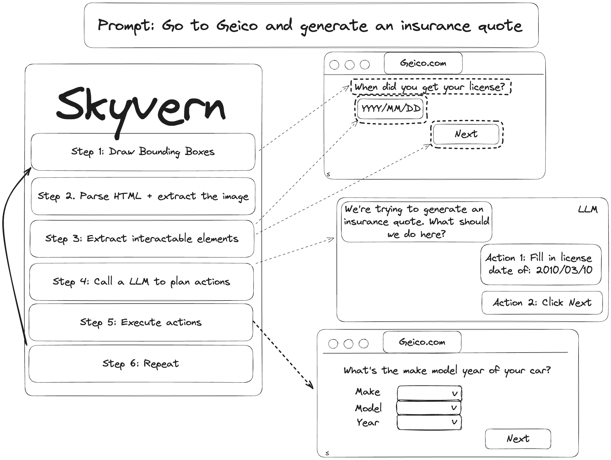
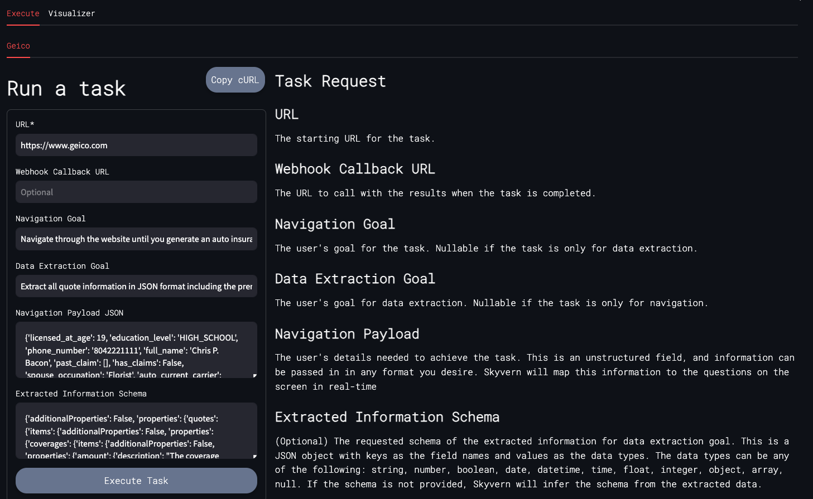
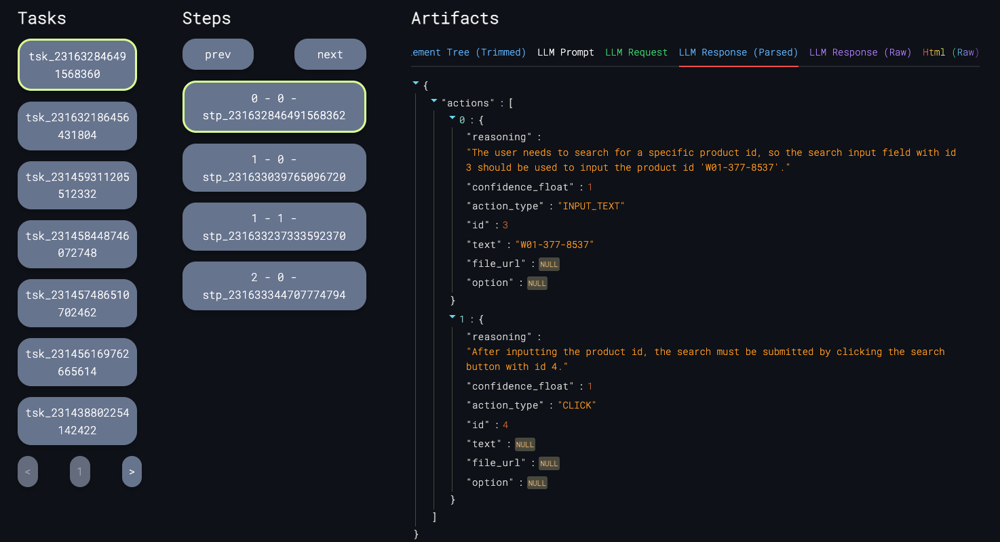
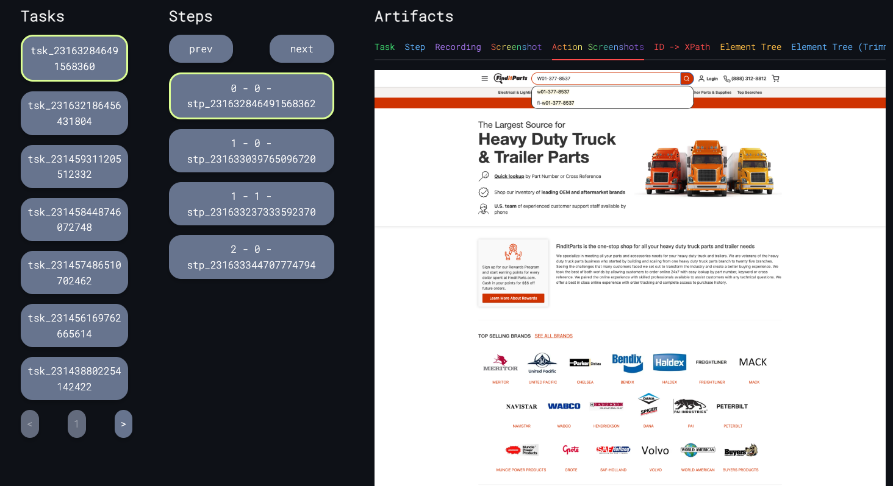

<!-- DOCTOC SKIP -->

<h1 align="center">
 <a href="https://www.skyvern.com">
  <picture>
    <source media="(prefers-color-scheme: dark)" srcset="docs/images/skyvern_logo.png"/>
    
  </picture>
 </a>
 <br />
</h1>
<p align="center">
🐉 Automate Browser-based workflows using LLMs and Computer Vision 🐉
</p>
<p align="center">
  <a href="https://www.skyvern.com/"></a>
  <!-- 
  <a href="https://docs.skyvern.com/"></a>
  -->
  <a href="https://discord.gg/fG2XXEuQX3"></a>
  <!-- <a href="https://pepy.tech/project/skyvern" target="_blank"></a> -->
  <a href="https://github.com/skyvern-ai/skyvern"></a>
  <a href="https://github.com/Skyvern-AI/skyvern/blob/main/LICENSE"></a>
  <a href="https://twitter.com/skyvernai"></a>
  <a href="https://www.linkedin.com/company/95726232"></a>
</p>

[Skyvern](https://www.skyvern.com) automates browser-based workflows using LLMs and computer vision. It provides a simple API endpoint to fully automate manual workflows on a large number of websites, replacing brittle or unreliable automation solutions. 

<p align="center">
  
</p>

Traditional approaches to browser automations required writing custom scripts for websites, often relying on DOM parsing and XPath-based interactions which would break whenever the website layouts changed.

Instead of only relying on code-defined XPath interactions, Skyvern relies on prompts in addition to computer vision and LLMs to the mix to parse items in the viewport in real-time, create a plan for interaction and interact with them.

This approach gives us a few advantages:

1. Skyvern can operate on websites it’s never seen before, as it’s able to map visual elements to actions necessary to complete a workflow, without any customized code
1. Skyvern is resistant to website layout changes, as there are no pre-determined XPaths or other selectors our system is looking for while trying to navigate
1. Skyvern is able to take a single workflow and apply it to a large number of websites, as it’s able to reason through the interactions necessary to complete the workflow
1. Skyvern leverages LLMs to reason through interactions to ensure we can cover complex situations. Examples include:
    1. If you wanted to get an auto insurance quote from Geico, the answer to a common question “Were you eligible to drive at 18?” could be inferred from the driver receiving their license at age 16
    1. If you were doing competitor analysis, it’s understanding that an Arnold Palmer 22 oz can at 7/11 is almost definitely the same product as a 23 oz can at Gopuff (even though the sizes are slightly different, which could be a rounding error!)


Want to see examples of Skyvern in action? Jump to [#real-world-examples-of-skyvern](#real-world-examples-of-skyvern)

# How it works
Skyvern was inspired by the Task-Driven autonomous agent design popularized by [BabyAGI](https://github.com/yoheinakajima/babyagi) and [AutoGPT](https://github.com/Significant-Gravitas/AutoGPT) -- with one major bonus: we give Skyvern the ability to interact with websites using browser automation libraries like [Playwright](https://playwright.dev/).

<picture>
  <source media="(prefers-color-scheme: dark)" srcset="docs/images/skyvern-system-diagram-dark.png" />
  
</picture>

<!-- TODO (suchintan): 
Expand the diagram above to go deeper into how:
1. We draw bounding boxes
2. We parse the HTML + extract the image to generate an interactable element map
-->

# Demo
https://github.com/Skyvern-AI/skyvern/assets/3853670/4fd87a66-39a1-4c3b-b9ac-64c165da6336


# Skyvern Cloud
We offer a managed cloud version of Skyvern that allows you to run Skyvern without having to manage the infrastructure. It allows to you run multiple Skyvern instances in parallel to automate your workflows at scale. In addition, Skyvern cloud comes bundled with anti-bot detection mechanisms, proxy network, and CAPTCHA solving to allow you to complete more complicated workflows.

If you'd like to try it out, 
1. Navigate to [app.skyvern.com](https://app.skyvern.com)
2. Create an account
3. Set up your credit card information to get $5 of credits on us
4. Kick off your first task and see Skyvern in action!

Here are some tips that may help you on your adventure:
1. Skyvern is really good at carrying out one task. If you give it too many instructions to do, it has a high likelihood of getting confused along the way.
2. Being really explicit about goals is very important. For example, if you're generating an insurance quote, let it know very clearly how it can identify it's accomplished its goals. Use words like "COMPLETE" or "TERMINATE" to indicate success and failure modes, respectively.
3. If you'd like to do more advanced things such as chaining multiple instructions together, or securely logging in, please feel free to book some time with me! I'm always happy to help


# Quickstart
This quickstart guide will walk you through getting Skyvern up and running on your local machine. 

## Docker Compose setup (Recommended)

1. Make sure you have [Docker Desktop](https://www.docker.com/products/docker-desktop/) installed and running on your machine
1. Make sure you don't have postgres running locally (Run `docker ps` to check)
1. Clone the repository and navigate to the root directory
1. Fill in the LLM provider key on the [docker-compose.yml](./docker-compose.yml)
2. Run the following command via the commandline:
   ```bash
    docker compose up -d
   ```
3. Navigate to `http://localhost:8501` in your browser to start using the UI


## Full Setup (Contributors) - Prerequisites 

### :warning: :warning: MAKE SURE YOU ARE USING PYTHON 3.11 :warning: :warning:
Before you begin, make sure you have the following installed:

- [Brew (if you're on a Mac)](https://brew.sh/)
- [Poetry](https://python-poetry.org/docs/#installation)
    - `brew install poetry`
- [Docker](https://docs.docker.com/engine/install/)
  
Note: Our setup script does these two for you, but they are here for reference.
- [Python 3.11](https://www.python.org/downloads/)
    - `poetry env use 3.11`
- [PostgreSQL 14](https://www.postgresql.org/download/) (if you're on a Mac, setup script will install it for you if you have homebrew installed)
    - `brew install postgresql`

## Setup (Contributors)
1. Clone the repository and navigate to the root directory
1. Open Docker Desktop (Works for Windows, macOS, and Linux) or run Docker Daemon
1. Run the setup script to install the necessary dependencies and setup your environment
    ```bash
    ./setup.sh
    ```
1. Start the server
    ```bash
    ./run_skyvern.sh
    ```
1. You can start sending requests to the server, but we built a simple UI to help you get started. To start the UI, run the following command:
    ```bash
    ./run_ui.sh
    ```
1. Navigate to `http://localhost:8501` in your browser to start using the UI

## Additional Setup for Contributors
If you're looking to contribute to Skyvern, you'll need to install the pre-commit hooks to ensure code quality and consistency. You can do this by running the following command:
```bash
pre-commit install
```

## Running your first automation

### Executing tasks (UI)
Once you have the UI running, you can start an automation by filling out the fields shown in the UI and clicking "Execute" 

<p align="center" >
  
</p>

### Executing tasks (cURL)

```
curl -X POST -H 'Content-Type: application/json' -H 'x-api-key: {Your local API key}' -d '{
    "url": "https://www.geico.com",
    "webhook_callback_url": "",
    "navigation_goal": "Navigate through the website until you generate an auto insurance quote. Do not generate a home insurance quote. If this page contains an auto insurance quote, consider the goal achieved",
    "data_extraction_goal": "Extract all quote information in JSON format including the premium amount, the timeframe for the quote.",
    "navigation_payload": "{Your data here}",
    "proxy_location": "NONE"
}' http://0.0.0.0:8000/api/v1/tasks
```

## Debugging Skyvern
Skyvern's visualizer allows you to debug every interaction Skyvern takes on the web.

https://github.com/Skyvern-AI/skyvern/assets/3853670/99827aaf-6818-420e-a90a-edc1593ff71e


### Tasks, Steps, and Actions
Each API request you sent to Skyvern is called a "task". Each task is made up of "steps" which are the individual actions Skyvern takes to complete the task. Each step is made up of "actions" which are the individual interactions Skyvern takes on a particular website.

Every time you call the API, you will be given a task_id you can use to find a task within the visualizer. Within each task, you'll be able to interact with each step, and see the specific actions Skyvern took to complete the task.

In the screenshot below, we're navigating to finditparts.com and searching for a truck part. You'll see each action it took listed there, alongside the reasoning behind each action.
<p align="center">
  
</p>


In addition to the actions suggested by the LLM in text form, Skyvern's visualizer also shows the state of the screen at the time of the action, with a 1:1 action to screenshot mapping. This allows you to see exactly what Skyvern saw when it made a decision, and debug any issues that may have arisen. 

<p align="center">
  
</p>


# Real-world examples of Skyvern
<!-- > TODO (suchintan):
Preload these examples inside of our UI so that users can see them in action
Provide a way to run these examples in the UI (via the commandline?) -->
We love to see how Skyvern is being used in the wild. Here are some examples of how Skyvern is being used to automate workflows in the real world. Please open PRs to add your own examples!

You'll need to have Skyvern running locally if you want to try these examples out. Please run the following command after going through the quickstart guide:
```
./run_skyvern.sh
```

## Invoice Downloading on many different websites
Reach out to us (founders@skyvern.com) to see this live

<p align="center">
  
</p>

## Automate the job application process
💡 See it in action at [app.skyvern.com](https://app.skyvern.com)
<p align="center">
  
</p>

## Automate materials procurement for a manufacturing company
💡 See it in action
```
./run_ui.sh finditparts
```
<p align="center">
  
</p>

## Navigating to government websites to register accounts or fill out forms 
💡 See it in action
```
./run_ui.sh california_edd 
```
<p align="center">
  
</p>
<!-- Add example of delaware entity lookups x2 -->

## Retrieving insurance quotes from insurance providers in any language
💡 See it in action
```
./run_ui.sh bci_seguros
```
<p align="center">
  
</p>

💡 See it in action
```
./run_ui.sh geico
```
<p align="center">
  
</p>

<!---
[## Documentation]

More extensive documentation can be found on our [documentation website](https://docs.skyvern.ai). Please let us know if something is unclear or missing by opening an issue or reaching out to us [via email](mailto:founders@skyvern.com) or [discord](https://discord.gg/fG2XXEuQX3).
--->

# Frequently Asked Questions (FAQs)
### What gets us excited about Skyvern?

Our focus is bringing stability to browser-based workflows. We leverage LLMs to create an AI Agent capable of interacting with websites like you or I would — all via a simple API call.


# Feature Roadmap
This is our planned roadmap for the next few months. If you have any suggestions or would like to see a feature added, please don't hesitate to reach out to us [via email](mailto:founders@skyvern.com) or [discord](https://discord.gg/fG2XXEuQX3).

- [x] **Open Source** - Open Source Skyvern's core codebase
- [x] **[BETA] Workflow support** - Allow support to chain multiple Skyvern calls together
- [ ] **Improved context** - Improve Skyvern's ability to understand content around interactable elements by introducing feeding relevant label context through the text prompt
- [ ] **Cost Savings** - Improve Skyvern's stability and reduce the cost of running Skyvern by optimizing the context tree passed into Skyvern
- [ ] **Self-serve UI** - Deprecate the Streamlit UI in favour of a React-based UI component that allows users to kick off new jobs in Skyvern
- [ ] **Prompt Caching** - Introduce a caching layer to the LLM calls to dramatically reduce the cost of running Skyvern (memorize past actions and repeat them!)
- [ ] **Chrome Viewport streaming** - Introduce a way to live-stream the Chrome viewport to the user's browser (as a part of the self-serve UI)
- [ ] **Past Runs UI** - Deprecate the Streamlit UI in favour of a React-based UI that allows you to visualize past runs and their results
- [ ] **Integrate LLM Observability tools** - Integrate LLM Observability tools to allow back-testing prompt changes with specific data sets + visualize the performance of Skyvern over time
- [ ] **Integrate public datasets** - Integrate Skyvern with public benchmark tests to track the quality our models over time
- [ ] **Workflow UI Builder** - Introduce a UI to allow users to build and analyze workflows visually
- [ ] **Langchain Integration** - Create langchain integration in langchain_community to use Skyvern as a "tool".

# Contributing

We welcome PRs and suggestions! Don't hesitate to open a PR/issue or to reach out to us [via email](mailto:founders@skyvern.com) or [discord](https://discord.gg/fG2XXEuQX3).
Please have a look at our [contribution guide](CONTRIBUTING.md) and
["Help Wanted" issues](https://github.com/skyvern-ai/skyvern/issues?q=is%3Aopen+is%3Aissue+label%3A%22help+wanted%22) to get started!

# Telemetry

By Default, Skyvern collects basic usage statistics to help us understand how Skyvern is being used. If you would like to opt-out of telemetry, please set the `SKYVERN_TELEMETRY` environment variable to `false`.

# License
Skyvern's open source repository is supported via a managed cloud. All of the core logic powering Skyvern is available in this open source repository licensed under the [AGPL-3.0 License](LICENSE), with the exception of anti-bot measures available in our managed cloud offering. 

If you have any questions or concerns around licensing, please [contact us](mailto:founders@skyvern.com) and we would be happy to help.

# Star History

[](https://star-history.com/#Skyvern-AI/skyvern&Date)
