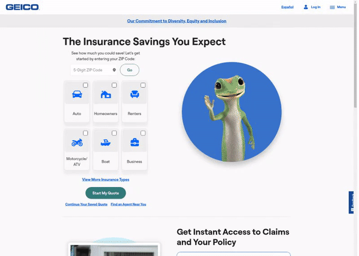
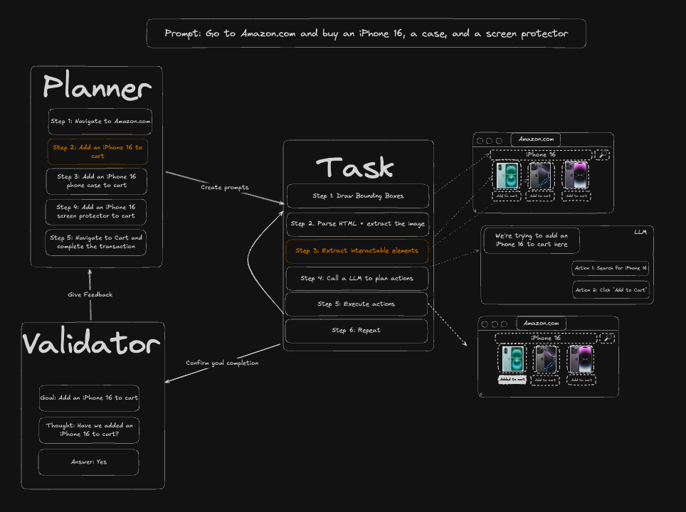
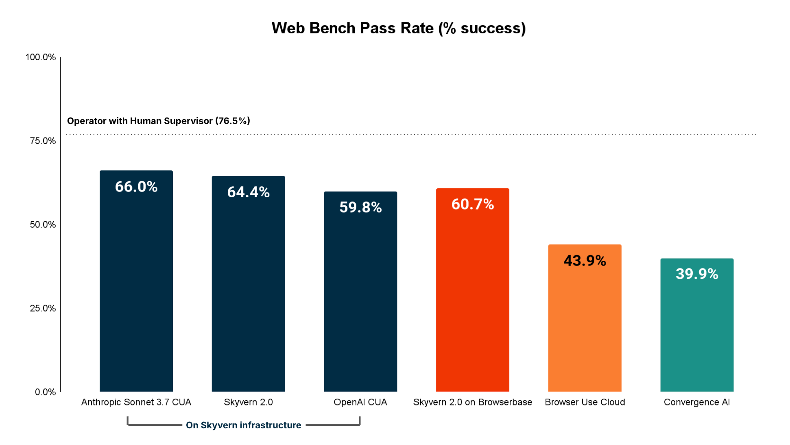
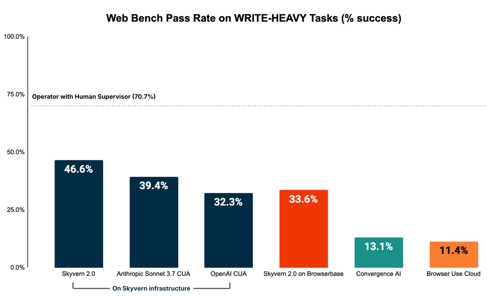
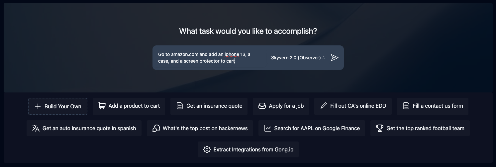
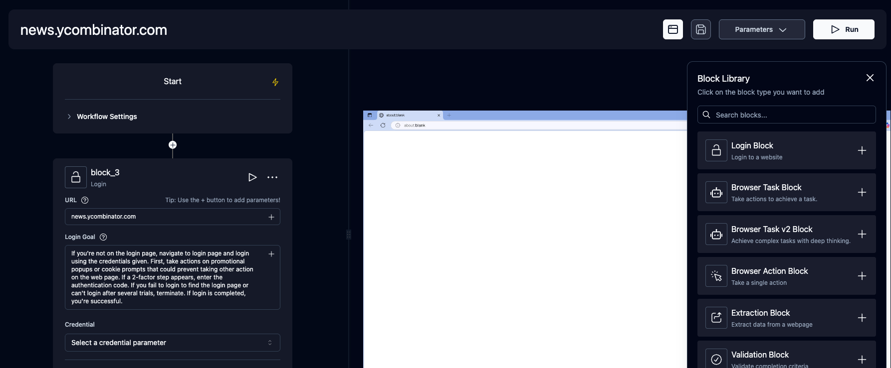
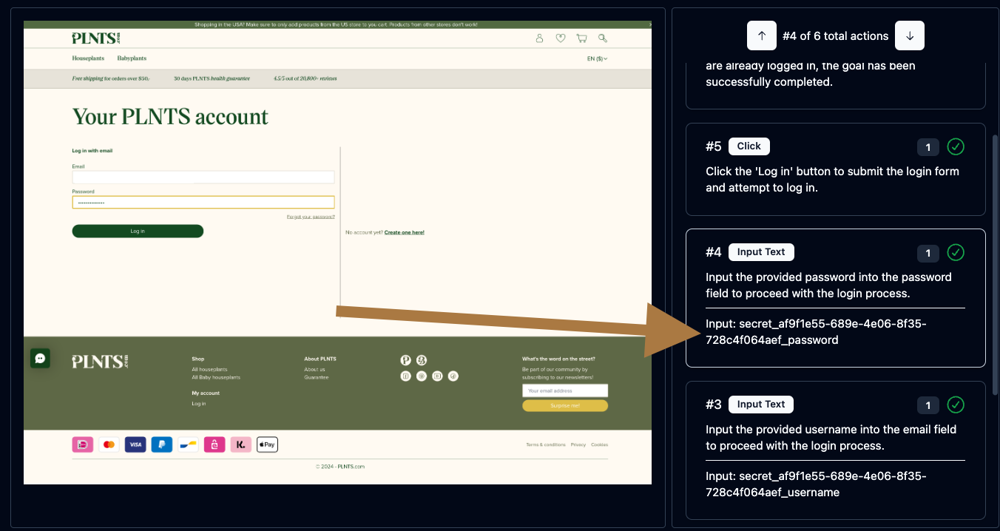
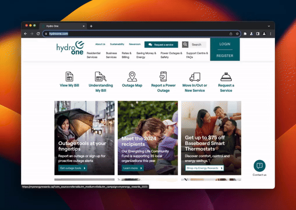
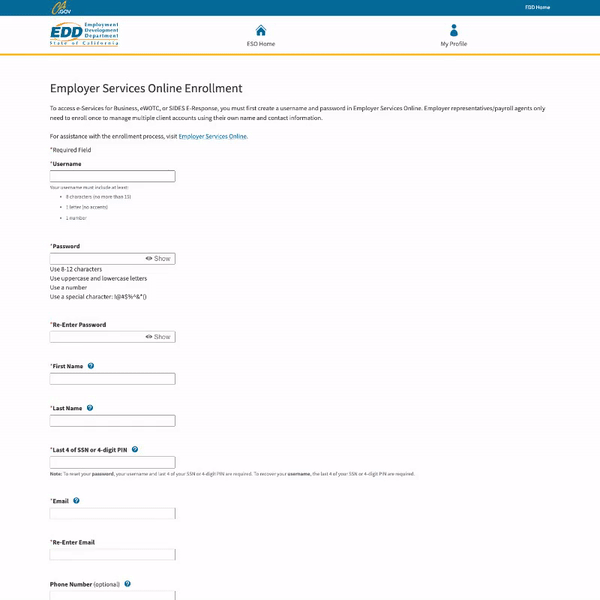

<!-- DOCTOC SKIP -->

<h1 align="center">
 <a href="https://www.skyvern.com">
  <picture>
    <source media="(prefers-color-scheme: dark)" srcset="fern/images/skyvern_logo.png"/>
    
  </picture>
 </a>
 <br />
</h1>
<p align="center">
🐉 Automate Browser-based workflows using LLMs and Computer Vision 🐉
</p>
<p align="center">
  <a href="https://www.skyvern.com/"></a>
  <a href="https://www.skyvern.com/docs/"></a>
  <a href="https://discord.gg/fG2XXEuQX3"></a>
  <!-- <a href="https://pepy.tech/project/skyvern" target="_blank"></a> -->
  <a href="https://github.com/skyvern-ai/skyvern"></a>
  <a href="https://github.com/Skyvern-AI/skyvern/blob/main/LICENSE"></a>
  <a href="https://twitter.com/skyvernai"></a>
  <a href="https://www.linkedin.com/company/95726232"></a>
</p>

[Skyvern](https://www.skyvern.com) automates browser-based workflows using LLMs and computer vision. It provides a simple API endpoint to fully automate manual workflows on a large number of websites, replacing brittle or unreliable automation solutions.

<p align="center">
  
</p>

Traditional approaches to browser automations required writing custom scripts for websites, often relying on DOM parsing and XPath-based interactions which would break whenever the website layouts changed.

Instead of only relying on code-defined XPath interactions, Skyvern relies on Vision LLMs to learn and interact with the websites.

# How it works
Skyvern was inspired by the Task-Driven autonomous agent design popularized by [BabyAGI](https://github.com/yoheinakajima/babyagi) and [AutoGPT](https://github.com/Significant-Gravitas/AutoGPT) -- with one major bonus: we give Skyvern the ability to interact with websites using browser automation libraries like [Playwright](https://playwright.dev/).

Skyvern uses a swarm of agents to comprehend a website, and plan and execute its actions:

<picture>
  <source media="(prefers-color-scheme: dark)" srcset="fern/images/skyvern_2_0_system_diagram.png" />
  
</picture>

This approach has a few advantages:

1. Skyvern can operate on websites it's never seen before, as it's able to map visual elements to actions necessary to complete a workflow, without any customized code
1. Skyvern is resistant to website layout changes, as there are no pre-determined XPaths or other selectors our system is looking for while trying to navigate
1. Skyvern is able to take a single workflow and apply it to a large number of websites, as it's able to reason through the interactions necessary to complete the workflow
1. Skyvern leverages LLMs to reason through interactions to ensure we can cover complex situations. Examples include:
    1. If you wanted to get an auto insurance quote from Geico, the answer to a common question "Were you eligible to drive at 18?" could be inferred from the driver receiving their license at age 16
    1. If you were doing competitor analysis, it's understanding that an Arnold Palmer 22 oz can at 7/11 is almost definitely the same product as a 23 oz can at Gopuff (even though the sizes are slightly different, which could be a rounding error!)

A detailed technical report can be found [here](https://www.skyvern.com/blog/skyvern-2-0-state-of-the-art-web-navigation-with-85-8-on-webvoyager-eval/).

# Demo
<!-- Redo demo -->
https://github.com/user-attachments/assets/5cab4668-e8e2-4982-8551-aab05ff73a7f

# Performance & Evaluation

Skyvern has SOTA performance on the [WebBench benchmark](webbench.ai) with a 64.4% accuracy. The technical report + evaluation can be found [here](https://www.skyvern.com/blog/web-bench-a-new-way-to-compare-ai-browser-agents/)

<p align="center">
  
</p>

## Performance on WRITE tasks (eg filling out forms, logging in, downloading files, etc)

Skyvern is the best performing agent on WRITE tasks (eg filling out forms, logging in, downloading files, etc), which is primarily used for RPA (Robotic Process Automation) adjacent tasks.

<p align="center">
  
</p>

# Quickstart

## Skyvern Cloud
[Skyvern Cloud](https://app.skyvern.com) is a managed cloud version of Skyvern that allows you to run Skyvern without worrying about the infrastructure. It allows you to run multiple Skyvern instances in parallel and comes bundled with anti-bot detection mechanisms, proxy network, and CAPTCHA solvers.

If you'd like to try it out, navigate to [app.skyvern.com](https://app.skyvern.com) and create an account.

## Install & Run

Dependencies needed:
- [Python 3.11.x](https://www.python.org/downloads/), works with 3.12, not ready yet for 3.13
- [NodeJS & NPM](https://nodejs.org/en/download/)

Additionally, for Windows:
- [Rust](https://rustup.rs/)
- VS Code with C++ dev tools and Windows SDK

### 1. Install Skyvern

```bash
pip install skyvern
```

### 2. Run Skyvern
This is most helpful for first time run (db setup, db migrations etc).

```bash
skyvern quickstart
```

### 3. Run task

#### UI (Recommended)

Start the Skyvern service and UI (when DB is up and running)

```bash
skyvern run all
```

Go to http://localhost:8080 and use the UI to run a task

#### Code

```python
from skyvern import Skyvern

skyvern = Skyvern()
task = await skyvern.run_task(prompt="Find the top post on hackernews today")
print(task)
```
Skyvern starts running the task in a browser that pops up and closes it when the task is done. You will be able to view the task from http://localhost:8080/history

You can also run a task on different targets:
```python
from skyvern import Skyvern

# Run on Skyvern Cloud
skyvern = Skyvern(api_key="SKYVERN API KEY")

# Local Skyvern service
skyvern = Skyvern(base_url="http://localhost:8000", api_key="LOCAL SKYVERN API KEY")

task = await skyvern.run_task(prompt="Find the top post on hackernews today")
print(task)
```

## SDK

**Installation:**
- Python: `pip install skyvern` then run `skyvern quickstart` for local setup
- TypeScript: `npm install @skyvern/client`

Skyvern provides SDKs for both Python and TypeScript to integrate browser automation into your applications.

### Python SDK

```python
from skyvern import Skyvern

# Connect to Skyvern Cloud
skyvern = Skyvern(api_key="your-api-key")

# Or run locally
skyvern = Skyvern.local()

# Launch a cloud browser
browser = await skyvern.launch_cloud_browser()
page = await browser.get_working_page()

# Use AI-powered actions for complex workflows
await page.agent.run_task("Navigate to the most recent invoice and download it")

# Or mix with Playwright actions
await page.goto("https://example.com")
await page.click("#button")
```

### TypeScript SDK

```typescript
import { Skyvern } from "@skyvern/client";

// Connect to Skyvern Cloud
const skyvern = new Skyvern({ apiKey: "your-api-key" });

// Launch a cloud browser
const browser = await skyvern.launchCloudBrowser();
const page = await browser.getWorkingPage();

// Use AI-powered actions for complex workflows
await page.agent.runTask("Navigate to the most recent invoice and download it");

// Or mix with Playwright actions
await page.goto("https://example.com");
await page.click("#button");
```

Skyvern enhances Playwright methods with AI capabilities. Use regular Playwright syntax with a `prompt` parameter to make any action AI-powered:

```python
# Traditional Playwright - uses selectors
await page.click("#submit-button")

# AI-augmented Playwright - uses natural language
await page.click(prompt="Click on the Submit button")
await page.fill(prompt="Enter email address", value="user@example.com")

# Mix both approaches in the same workflow
await page.goto("https://example.com/dashboard")
await page.click(prompt="Click on the most recent unpaid invoice")
await page.click("#download-button")
```

## Advanced Usage

### Control your own browser (Chrome)
> ⚠️ WARNING: Since [Chrome 136](https://developer.chrome.com/blog/remote-debugging-port), Chrome refuses any CDP connect to the browser using the default user_data_dir. In order to use your browser data, Skyvern copies your default user_data_dir to `./tmp/user_data_dir` the first time connecting to your local browser. ⚠️

1. Just With Python Code
```python
from skyvern import Skyvern

# The path to your Chrome browser. This example path is for Mac.
browser_path = "/Applications/Google Chrome.app/Contents/MacOS/Google Chrome"
skyvern = Skyvern(
    base_url="http://localhost:8000",
    api_key="YOUR_API_KEY",
    browser_path=browser_path,
)
task = await skyvern.run_task(
    prompt="Find the top post on hackernews today",
)
```

2. With Skyvern Service

Add two variables to your .env file:
```bash
# The path to your Chrome browser. This example path is for Mac.
CHROME_EXECUTABLE_PATH="/Applications/Google Chrome.app/Contents/MacOS/Google Chrome"
BROWSER_TYPE=cdp-connect
```

Restart Skyvern service `skyvern run all` and run the task through UI or code

### Run Skyvern with any remote browser
Grab the cdp connection url and pass it to Skyvern

```python
from skyvern import Skyvern

skyvern = Skyvern(cdp_url="your cdp connection url")
task = await skyvern.run_task(
    prompt="Find the top post on hackernews today",
)
```

### Get consistent output schema from your run
You can do this by adding the `data_extraction_schema` parameter:
```python
from skyvern import Skyvern

skyvern = Skyvern()
task = await skyvern.run_task(
    prompt="Find the top post on hackernews today",
    data_extraction_schema={
        "type": "object",
        "properties": {
            "title": {
                "type": "string",
                "description": "The title of the top post"
            },
            "url": {
                "type": "string",
                "description": "The URL of the top post"
            },
            "points": {
                "type": "integer",
                "description": "Number of points the post has received"
            }
        }
    }
)
```

### Helpful commands to debug issues


```bash
# Launch the Skyvern Server Separately*
skyvern run server

# Launch the Skyvern UI
skyvern run ui

# Check status of the Skyvern service
skyvern status

# Stop the Skyvern service
skyvern stop all

# Stop the Skyvern UI
skyvern stop ui

# Stop the Skyvern Server Separately
skyvern stop server
```

## Docker Compose setup

1. Make sure you have [Docker Desktop](https://www.docker.com/products/docker-desktop/) installed and running on your machine
1. Make sure you don't have postgres running locally (Run `docker ps` to check)
1. Clone the repository and navigate to the root directory
1. Run `skyvern init llm` to generate a `.env` file. This will be copied into the Docker image.
1. Fill in the LLM provider key on the [docker-compose.yml](./docker-compose.yml). *If you want to run Skyvern on a remote server, make sure you set the correct server ip for the UI container in [docker-compose.yml](./docker-compose.yml).*
2. Run the following command via the commandline:
   ```bash
    docker compose up -d
   ```
3. Navigate to `http://localhost:8080` in your browser to start using the UI

> **Important:** Only one Postgres container can run on port 5432 at a time. If you switch from the CLI-managed Postgres to Docker Compose, you must first remove the original container:
> ```bash
> docker rm -f postgresql-container
> ```

If you encounter any database related errors while using Docker to run Skyvern, check which Postgres container is running with `docker ps`.


# Skyvern Features

## Skyvern Tasks
Tasks are the fundamental building block inside Skyvern. Each task is a single request to Skyvern, instructing it to navigate through a website and accomplish a specific goal.

Tasks require you to specify a `url`, `prompt`, and can optionally include a `data schema` (if you want the output to conform to a specific schema) and `error codes` (if you want Skyvern to stop running in specific situations).

<p align="center">
  
</p>


## Skyvern Workflows
Workflows are a way to chain multiple tasks together to form a cohesive unit of work.

For example, if you wanted to download all invoices newer than January 1st, you could create a workflow that first navigated to the invoices page, then filtered down to only show invoices newer than January 1st, extracted a list of all eligible invoices, and iterated through each invoice to download it.

Another example is if you wanted to automate purchasing products from an e-commerce store, you could create a workflow that first navigated to the desired product, then added it to a cart. Second, it would navigate to the cart and validate the cart state. Finally, it would go through the checkout process to purchase the items.

Supported workflow features include:
1. Browser Task
1. Browser Action
1. Data Extraction
1. Validation
1. For Loops
1. File parsing
1. Sending emails
1. Text Prompts
1. HTTP Request Block
1. Custom Code Block
1. Uploading files to block storage
1. (Coming soon) Conditionals

<p align="center">
  
</p>

## Livestreaming
Skyvern allows you to livestream the viewport of the browser to your local machine so that you can see exactly what Skyvern is doing on the web. This is useful for debugging and understanding how Skyvern is interacting with a website, and intervening when necessary

## Form Filling
Skyvern is natively capable of filling out form inputs on websites. Passing in information via the `navigation_goal` will allow Skyvern to comprehend the information and fill out the form accordingly.

## Data Extraction
Skyvern is also capable of extracting data from a website.

You can also specify a `data_extraction_schema` directly within the main prompt to tell Skyvern exactly what data you'd like to extract from the website, in jsonc format. Skyvern's output will be structured in accordance to the supplied schema.

## File Downloading
Skyvern is also capable of downloading files from a website. All downloaded files are automatically uploaded to block storage (if configured), and you can access them via the UI.

## Authentication
Skyvern supports a number of different authentication methods to make it easier to automate tasks behind a login. If you'd like to try it out, please reach out to us [via email](mailto:founders@skyvern.com) or [discord](https://discord.gg/fG2XXEuQX3).

<p align="center">
  
</p>


### 🔐 2FA Support (TOTP)
Skyvern supports a number of different 2FA methods to allow you to automate workflows that require 2FA.

Examples include:
1. QR-based 2FA (e.g. Google Authenticator, Authy)
1. Email based 2FA
1. SMS based 2FA

🔐 Learn more about 2FA support [here](https://www.skyvern.com/docs/credentials/totp).

### Password Manager Integrations
Skyvern currently supports the following password manager integrations:
- [x] Bitwarden
- [x] Custom Credential Service (HTTP API)
- [ ] 1Password
- [ ] LastPass


## Model Context Protocol (MCP)
Skyvern supports the Model Context Protocol (MCP) to allow you to use any LLM that supports MCP.

See the MCP documentation [here](https://github.com/Skyvern-AI/skyvern/blob/main/integrations/mcp/README.md)

## Zapier / Make.com / N8N Integration
Skyvern supports Zapier, Make.com, and N8N to allow you to connect your Skyvern workflows to other apps.

* [Zapier](https://www.skyvern.com/docs/integrations/zapier)
* [Make.com](https://www.skyvern.com/docs/integrations/make.com)
* [N8N](https://www.skyvern.com/docs/integrations/n8n)

🔐 Learn more about 2FA support [here](https://www.skyvern.com/docs/credentials/totp).


# Real-world examples of Skyvern
We love to see how Skyvern is being used in the wild. Here are some examples of how Skyvern is being used to automate workflows in the real world. Please open PRs to add your own examples!

## Invoice Downloading on many different websites
[Book a demo to see it live](https://meetings.hubspot.com/skyvern/demo)

<p align="center">
  
</p>

## Automate the job application process
[💡 See it in action](https://app.skyvern.com/tasks/create/job_application)
<p align="center">
  
</p>

## Automate materials procurement for a manufacturing company
[💡 See it in action](https://app.skyvern.com/tasks/create/finditparts)
<p align="center">
  
</p>

## Navigating to government websites to register accounts or fill out forms
[💡 See it in action](https://app.skyvern.com/tasks/create/california_edd)
<p align="center">
  
</p>
<!-- Add example of delaware entity lookups x2 -->

## Filling out random contact us forms
[💡 See it in action](https://app.skyvern.com/tasks/create/contact_us_forms)
<p align="center">
  
</p>


## Retrieving insurance quotes from insurance providers in any language
[💡 See it in action](https://app.skyvern.com/tasks/create/bci_seguros)
<p align="center">
  
</p>

[💡 See it in action](https://app.skyvern.com/tasks/create/geico)

<p align="center">
  
</p>

# Contributor Setup
Make sure to have [uv](https://docs.astral.sh/uv/getting-started/installation/) installed.
1. Run this to create your virtual environment (`.venv`)
    ```bash
    uv sync --group dev
    ```
2. Perform initial server configuration
    ```bash
    uv run skyvern quickstart
    ```
3. Navigate to `http://localhost:8080` in your browser to start using the UI
   *The Skyvern CLI supports Windows, WSL, macOS, and Linux environments.*

# Documentation

More extensive documentation can be found on our [📕 docs page](https://www.skyvern.com/docs). Please let us know if something is unclear or missing by opening an issue or reaching out to us [via email](mailto:founders@skyvern.com) or [discord](https://discord.gg/fG2XXEuQX3).

# Supported LLMs
| Provider | Supported Models |
| -------- | ------- |
| OpenAI   | gpt4-turbo, gpt-4o, gpt-4o-mini |
| Anthropic | Claude 3 (Haiku, Sonnet, Opus), Claude 3.5 (Sonnet) |
| Azure OpenAI | Any GPT models. Better performance with a multimodal llm (azure/gpt4-o) |
| AWS Bedrock | Anthropic Claude 3 (Haiku, Sonnet, Opus), Claude 3.5 (Sonnet) |
| Gemini | Gemini 2.5 Pro and flash, Gemini 2.0 |
| Ollama | Run any locally hosted model via [Ollama](https://github.com/ollama/ollama) |
| OpenRouter | Access models through [OpenRouter](https://openrouter.ai) |
| OpenAI-compatible | Any custom API endpoint that follows OpenAI's API format (via [liteLLM](https://docs.litellm.ai/docs/providers/openai_compatible)) |

#### Environment Variables

##### OpenAI
| Variable | Description| Type | Sample Value|
| -------- | ------- | ------- | ------- |
| `ENABLE_OPENAI`| Register OpenAI models | Boolean | `true`, `false` |
| `OPENAI_API_KEY` | OpenAI API Key | String | `sk-1234567890` |
| `OPENAI_API_BASE` | OpenAI API Base, optional | String | `https://openai.api.base` |
| `OPENAI_ORGANIZATION` | OpenAI Organization ID, optional | String | `your-org-id` |

Recommended `LLM_KEY`: `OPENAI_GPT4O`, `OPENAI_GPT4O_MINI`, `OPENAI_GPT4_1`, `OPENAI_O4_MINI`, `OPENAI_O3`

##### Anthropic
| Variable | Description| Type | Sample Value|
| -------- | ------- | ------- | ------- |
| `ENABLE_ANTHROPIC` | Register Anthropic models| Boolean | `true`, `false` |
| `ANTHROPIC_API_KEY` | Anthropic API key| String | `sk-1234567890` |

Recommended`LLM_KEY`: `ANTHROPIC_CLAUDE3.5_SONNET`, `ANTHROPIC_CLAUDE3.7_SONNET`, `ANTHROPIC_CLAUDE4_OPUS`, `ANTHROPIC_CLAUDE4_SONNET`

##### Azure OpenAI
| Variable | Description| Type | Sample Value|
| -------- | ------- | ------- | ------- |
| `ENABLE_AZURE` | Register Azure OpenAI models | Boolean | `true`, `false` |
| `AZURE_API_KEY` | Azure deployment API key | String | `sk-1234567890` |
| `AZURE_DEPLOYMENT` | Azure OpenAI Deployment Name | String | `skyvern-deployment`|
| `AZURE_API_BASE` | Azure deployment api base url| String | `https://skyvern-deployment.openai.azure.com/`|
| `AZURE_API_VERSION` | Azure API Version| String | `2024-02-01`|

Recommended `LLM_KEY`: `AZURE_OPENAI`

##### AWS Bedrock
| Variable | Description| Type | Sample Value|
| -------- | ------- | ------- | ------- |
| `ENABLE_BEDROCK` | Register AWS Bedrock models. To use AWS Bedrock, you need to make sure your [AWS configurations](https://github.com/boto/boto3?tab=readme-ov-file#using-boto3) are set up correctly first. | Boolean | `true`, `false` |

Recommended `LLM_KEY`: `BEDROCK_ANTHROPIC_CLAUDE3.7_SONNET_INFERENCE_PROFILE`, `BEDROCK_ANTHROPIC_CLAUDE4_OPUS_INFERENCE_PROFILE`, `BEDROCK_ANTHROPIC_CLAUDE4_SONNET_INFERENCE_PROFILE`

##### Gemini
| Variable | Description| Type | Sample Value|
| -------- | ------- | ------- | ------- |
| `ENABLE_GEMINI` | Register Gemini models| Boolean | `true`, `false` |
| `GEMINI_API_KEY` | Gemini API Key| String | `your_google_gemini_api_key`|

Recommended `LLM_KEY`: `GEMINI_2.5_PRO_PREVIEW`, `GEMINI_2.5_FLASH_PREVIEW`

##### Ollama
| Variable | Description| Type | Sample Value|
| -------- | ------- | ------- | ------- |
| `ENABLE_OLLAMA`| Register local models via Ollama | Boolean | `true`, `false` |
| `OLLAMA_SERVER_URL` | URL for your Ollama server | String | `http://host.docker.internal:11434` |
| `OLLAMA_MODEL` | Ollama model name to load | String | `qwen2.5:7b-instruct` |

Recommended `LLM_KEY`: `OLLAMA`

Note: Ollama does not support vision yet.

##### OpenRouter
| Variable | Description| Type | Sample Value|
| -------- | ------- | ------- | ------- |
| `ENABLE_OPENROUTER`| Register OpenRouter models | Boolean | `true`, `false` |
| `OPENROUTER_API_KEY` | OpenRouter API key | String | `sk-1234567890` |
| `OPENROUTER_MODEL` | OpenRouter model name | String | `mistralai/mistral-small-3.1-24b-instruct` |
| `OPENROUTER_API_BASE` | OpenRouter API base URL | String | `https://api.openrouter.ai/v1` |

Recommended `LLM_KEY`: `OPENROUTER`

##### OpenAI-Compatible
| Variable | Description| Type | Sample Value|
| -------- | ------- | ------- | ------- |
| `ENABLE_OPENAI_COMPATIBLE`| Register a custom OpenAI-compatible API endpoint | Boolean | `true`, `false` |
| `OPENAI_COMPATIBLE_MODEL_NAME` | Model name for OpenAI-compatible endpoint | String | `yi-34b`, `gpt-3.5-turbo`, `mistral-large`, etc.|
| `OPENAI_COMPATIBLE_API_KEY` | API key for OpenAI-compatible endpoint | String | `sk-1234567890`|
| `OPENAI_COMPATIBLE_API_BASE` | Base URL for OpenAI-compatible endpoint | String | `https://api.together.xyz/v1`, `http://localhost:8000/v1`, etc.|
| `OPENAI_COMPATIBLE_API_VERSION` | API version for OpenAI-compatible endpoint, optional| String | `2023-05-15`|
| `OPENAI_COMPATIBLE_MAX_TOKENS` | Maximum tokens for completion, optional| Integer | `4096`, `8192`, etc.|
| `OPENAI_COMPATIBLE_TEMPERATURE` | Temperature setting, optional| Float | `0.0`, `0.5`, `0.7`, etc.|
| `OPENAI_COMPATIBLE_SUPPORTS_VISION` | Whether model supports vision, optional| Boolean | `true`, `false`|

Supported LLM Key: `OPENAI_COMPATIBLE`

##### General LLM Configuration
| Variable | Description| Type | Sample Value|
| -------- | ------- | ------- | ------- |
| `LLM_KEY` | The name of the model you want to use | String | See supported LLM keys above |
| `SECONDARY_LLM_KEY` | The name of the model for mini agents skyvern runs with | String | See supported LLM keys above |
| `LLM_CONFIG_MAX_TOKENS` | Override the max tokens used by the LLM | Integer | `128000` |

# Feature Roadmap
This is our planned roadmap for the next few months. If you have any suggestions or would like to see a feature added, please don't hesitate to reach out to us [via email](mailto:founders@skyvern.com) or [discord](https://discord.gg/fG2XXEuQX3).

- [x] **Open Source** - Open Source Skyvern's core codebase
- [x] **Workflow support** - Allow support to chain multiple Skyvern calls together
- [x] **Improved context** - Improve Skyvern's ability to understand content around interactable elements by introducing feeding relevant label context through the text prompt
- [x] **Cost Savings** - Improve Skyvern's stability and reduce the cost of running Skyvern by optimizing the context tree passed into Skyvern
- [x] **Self-serve UI** - Deprecate the Streamlit UI in favour of a React-based UI component that allows users to kick off new jobs in Skyvern
- [x] **Workflow UI Builder** - Introduce a UI to allow users to build and analyze workflows visually
- [x] **Chrome Viewport streaming** - Introduce a way to live-stream the Chrome viewport to the user's browser (as a part of the self-serve UI)
- [x] **Past Runs UI** - Deprecate the Streamlit UI in favour of a React-based UI that allows you to visualize past runs and their results
- [X] **Auto workflow builder ("Observer") mode** - Allow Skyvern to auto-generate workflows as it's navigating the web to make it easier to build new workflows
- [x] **Prompt Caching** - Introduce a caching layer to the LLM calls to dramatically reduce the cost of running Skyvern (memorize past actions and repeat them!)
- [x] **Web Evaluation Dataset** - Integrate Skyvern with public benchmark tests to track the quality of our models over time
- [ ] **Improved Debug mode** - Allow Skyvern to plan its actions and get "approval" before running them, allowing you to debug what it's doing and more easily iterate on the prompt
- [ ] **Chrome Extension** - Allow users to interact with Skyvern through a Chrome extension (incl voice mode, saving tasks, etc.)
- [ ] **Skyvern Action Recorder** - Allow Skyvern to watch a user complete a task and then automatically generate a workflow for it
- [ ] **Interactable Livestream** - Allow users to interact with the livestream in real-time to intervene when necessary (such as manually submitting sensitive forms)
- [ ] **Integrate LLM Observability tools** - Integrate LLM Observability tools to allow back-testing prompt changes with specific data sets + visualize the performance of Skyvern over time
- [x] **Langchain Integration** - Create langchain integration in langchain_community to use Skyvern as a "tool".

# Contributing

We welcome PRs and suggestions! Don't hesitate to open a PR/issue or to reach out to us [via email](mailto:founders@skyvern.com) or [discord](https://discord.gg/fG2XXEuQX3).
Please have a look at our [contribution guide](CONTRIBUTING.md) and
["Help Wanted" issues](https://github.com/skyvern-ai/skyvern/issues?q=is%3Aopen+is%3Aissue+label%3A%22help+wanted%22) to get started!

If you want to chat with the skyvern repository to get a high level overview of how it is structured, how to build off it, and how to resolve usage questions, check out [Code Sage](https://sage.storia.ai?utm_source=github&utm_medium=referral&utm_campaign=skyvern-readme).

# Telemetry

By Default, Skyvern collects basic usage statistics to help us understand how Skyvern is being used. If you would like to opt-out of telemetry, please set the `SKYVERN_TELEMETRY` environment variable to `false`.

# License
Skyvern's open source repository is supported via a managed cloud. All of the core logic powering Skyvern is available in this open source repository licensed under the [AGPL-3.0 License](LICENSE), with the exception of anti-bot measures available in our managed cloud offering.

If you have any questions or concerns around licensing, please [contact us](mailto:support@skyvern.com) and we would be happy to help.

# Star History

[](https://star-history.com/#Skyvern-AI/skyvern&Date)
