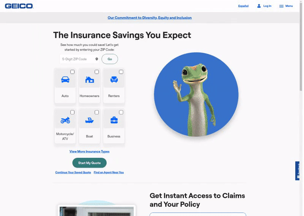
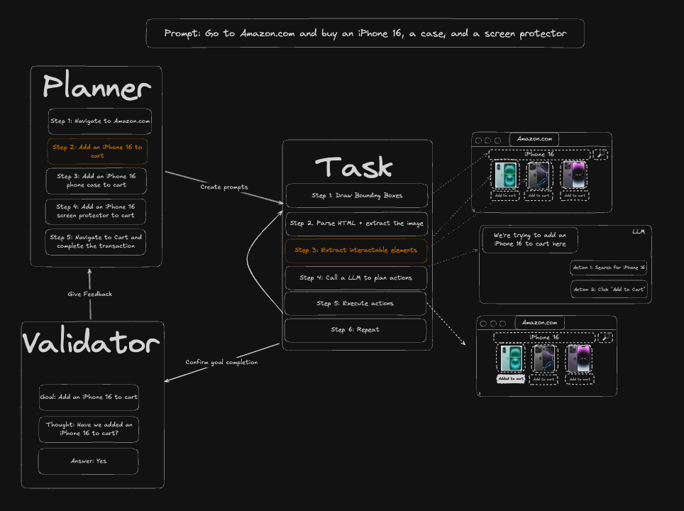
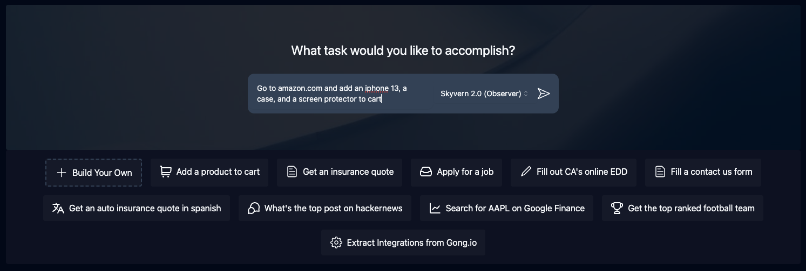
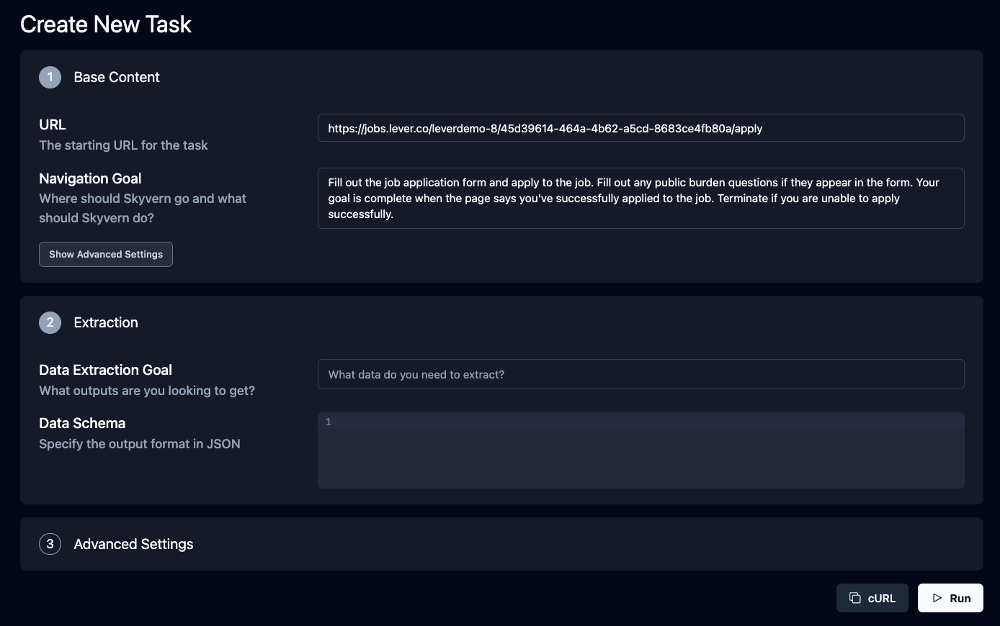
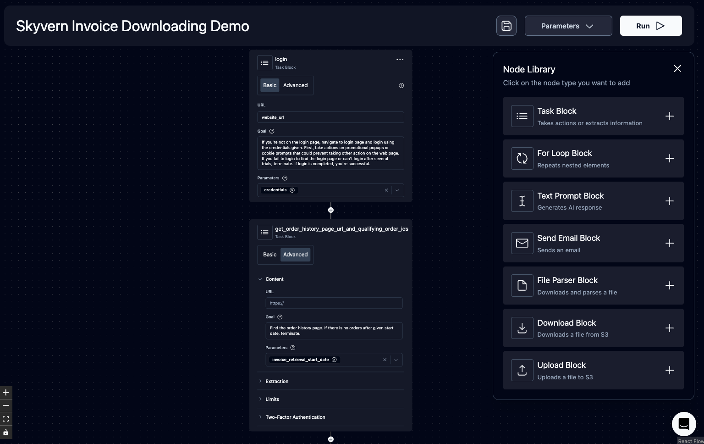
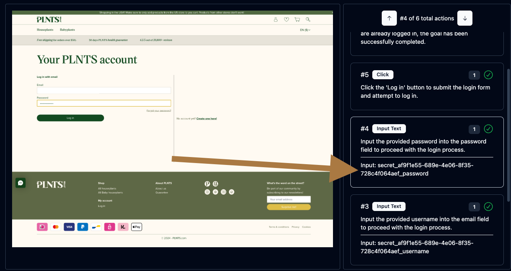
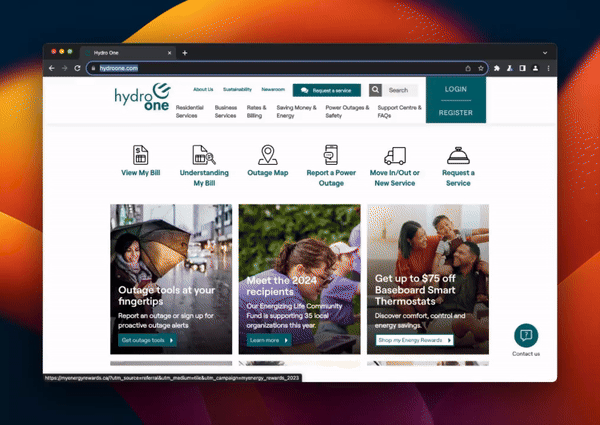
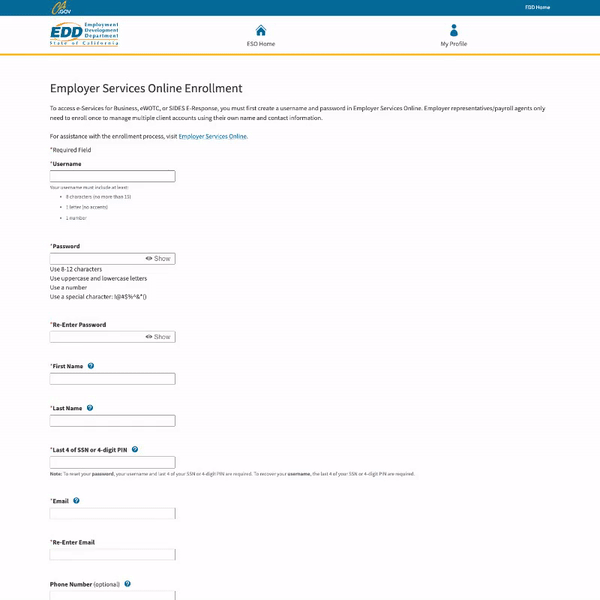

<!-- DOCTOC SKIP -->

<h1 align="center">
 <a href="https://www.skyvern.com">
  <picture>
    <source media="(prefers-color-scheme: dark)" srcset="docs/images/skyvern_logo.png"/>
    
  </picture>
 </a>
 <br />
</h1>
<p align="center">
🐉 Automate Browser-based workflows using LLMs and Computer Vision 🐉
</p>
<p align="center">
  <a href="https://www.skyvern.com/"></a>
  <a href="https://docs.skyvern.com/"></a>
  <a href="https://discord.gg/fG2XXEuQX3"></a>
  <!-- <a href="https://pepy.tech/project/skyvern" target="_blank"></a> -->
  <a href="https://github.com/skyvern-ai/skyvern"></a>
  <a href="https://github.com/Skyvern-AI/skyvern/blob/main/LICENSE"></a>
  <a href="https://twitter.com/skyvernai"></a>
  <a href="https://www.linkedin.com/company/95726232"></a>
</p>

[Skyvern](https://www.skyvern.com) automates browser-based workflows using LLMs and computer vision. It provides a simple API endpoint to fully automate manual workflows on a large number of websites, replacing brittle or unreliable automation solutions. 

<p align="center">
  
</p>

Traditional approaches to browser automations required writing custom scripts for websites, often relying on DOM parsing and XPath-based interactions which would break whenever the website layouts changed.

Instead of only relying on code-defined XPath interactions, Skyvern relies on prompts in addition to computer vision and LLMs to parse items in the viewport in real-time, create a plan for interaction and interact with them.

This approach gives us a few advantages:

1. Skyvern can operate on websites it’s never seen before, as it’s able to map visual elements to actions necessary to complete a workflow, without any customized code
1. Skyvern is resistant to website layout changes, as there are no pre-determined XPaths or other selectors our system is looking for while trying to navigate
1. Skyvern is able to take a single workflow and apply it to a large number of websites, as it’s able to reason through the interactions necessary to complete the workflow
1. Skyvern leverages LLMs to reason through interactions to ensure we can cover complex situations. Examples include:
    1. If you wanted to get an auto insurance quote from Geico, the answer to a common question “Were you eligible to drive at 18?” could be inferred from the driver receiving their license at age 16
    1. If you were doing competitor analysis, it’s understanding that an Arnold Palmer 22 oz can at 7/11 is almost definitely the same product as a 23 oz can at Gopuff (even though the sizes are slightly different, which could be a rounding error!)


Want to see examples of Skyvern in action? Jump to [#real-world-examples-of-skyvern](#real-world-examples-of-skyvern)

# How it works
Skyvern was inspired by the Task-Driven autonomous agent design popularized by [BabyAGI](https://github.com/yoheinakajima/babyagi) and [AutoGPT](https://github.com/Significant-Gravitas/AutoGPT) -- with one major bonus: we give Skyvern the ability to interact with websites using browser automation libraries like [Playwright](https://playwright.dev/).

Skyvern uses a swarm of agents to comprehend a website, and plan and execute its actions:
1. **Interactable Element Agent**: This agent is responsible for parsing the HTML of a website and extracting the interactable elements. 
2. **Navigation Agent**: This agent is responsible for planning the navigation to complete a task. Examples include clicking buttons, inserting text, selecting options, etc.
3. **Data Extraction Agent**: This agent is responsible for extracting data from a website. It's capable of reading the tables and text on the page, and extracting the output in a user-defined structured format
4. **Password Agent**: This agent is responsible for filling out password forms on a website. It's capable of reading the username and password from a password manager, and filling out the form while preserving the privacy of the user-defined secrets.
5. **2FA Agent**: This agent is responsible for filling out 2FA forms on a website. It's capable of  intercepting website requests for 2FAs, and either requesting user-defined APIs for 2FA codes or waiting for users to feed 2FA codes into it, and then completing the login process.
6. **Dynamic Auto-complete Agent**: This agent is responsible for filling out dynamic auto-complete forms on a website. It's capable of reading the options presented to it, selecting the appropriate option based on the user's input, and adjusting its inputs based on the feedback from inside the form. Popular examples include: Address forms, university dropdowns, and more.

<picture>
  <source media="(prefers-color-scheme: dark)" srcset="docs/images/skyvern_2_0_system_diagram.png" />
  
</picture>

# Demo
<!-- Redo demo -->
https://github.com/user-attachments/assets/5cab4668-e8e2-4982-8551-aab05ff73a7f


# Skyvern Cloud
We offer a managed cloud version of Skyvern that allows you to run Skyvern without having to manage the infrastructure. It allows you to run multiple Skyvern instances in parallel to automate your workflows at scale. In addition, Skyvern cloud comes bundled with anti-bot detection mechanisms, proxy network, and CAPTCHA solving to allow you to complete more complicated workflows.

If you'd like to try it out, 
1. Navigate to [app.skyvern.com](https://app.skyvern.com)
1. Create an account & Get $5 of credits on us
1. Kick off your first task and see Skyvern in action!

Here are some tips that may help you on your adventure:
1. Skyvern is really good at carrying out a single goal. If you give it too many instructions to do, it has a high likelihood of getting confused along the way. 
2. Being really explicit about goals is very important. For example, if you're generating an insurance quote, let it know very clearly how it can identify it has accomplished its goals. Use words like "COMPLETE" or "TERMINATE" to indicate success and failure modes, respectively.
3. Workflows can be used if you'd like to do more advanced things such as chaining multiple instructions together, or securely logging in. If you need any help with this, please feel free to book some time with us! We're always happy to help


# Quickstart
This quickstart guide will walk you through getting Skyvern up and running on your local machine. 

## Docker Compose setup (Recommended)

1. Make sure you have [Docker Desktop](https://www.docker.com/products/docker-desktop/) installed and running on your machine
1. Make sure you don't have postgres running locally (Run `docker ps` to check)
1. Clone the repository and navigate to the root directory
1. Fill in the LLM provider key on the [docker-compose.yml](./docker-compose.yml). *If you want to run Skyvern on a remote server, make sure you set the correct server ip for the UI container in [docker-compose.yml](./docker-compose.yml).*
2. Run the following command via the commandline:
   ```bash
    docker compose up -d
   ```
3. Navigate to `http://localhost:8080` in your browser to start using the UI


## Full Setup (Contributors) - Prerequisites 

### :warning: :warning: MAKE SURE YOU ARE USING PYTHON 3.11 :warning: :warning:
:warning: :warning: Only well-tested on MacOS :warning: :warning:

Before you begin, make sure you have the following installed:

- [Brew (if you're on a Mac)](https://brew.sh/)
- [Poetry](https://python-poetry.org/docs/#installation)
    - `brew install poetry`
- [node](https://nodejs.org/en/download/)
- [Docker](https://docs.docker.com/engine/install/)
  

Note: Our setup script does these two for you, but they are here for reference.
- [Python 3.11](https://www.python.org/downloads/)
    - `poetry env use 3.11`
- [PostgreSQL 14](https://www.postgresql.org/download/) (if you're on a Mac, setup script will install it for you if you have homebrew installed)
    - `brew install postgresql`

## Setup (Contributors)
1. Clone the repository and navigate to the root directory
1. Open Docker Desktop (Works for Windows, macOS, and Linux) or run Docker Daemon
1. Run the setup script to install the necessary dependencies and setup your environment
    ```bash
    ./setup.sh
    ```
1. Start the server
    ```bash
    ./run_skyvern.sh
    ```
1. You can start sending requests to the server, but we built a simple UI to help you get started. To start the UI, run the following command:
    ```bash
    ./run_ui.sh
    ```
1. Navigate to `http://localhost:8080` in your browser to start using the UI

## Additional Setup for Contributors
If you're looking to contribute to Skyvern, you'll need to install the pre-commit hooks to ensure code quality and consistency. You can do this by running the following command:
```bash
pre-commit install
```

# Supported Functionality

## Skyvern 2.0
Skyvern 2.0 is a major overhaul of Skyvern that includes a multi-agent architecture with a planner + validator agent, allowing Skyvern to complete more complex tasks with a zero-shot prompt.

<p align="center">
  
</p>

## Skyvern Tasks
Tasks are the fundamental building block inside Skyvern. Each task is a single request to Skyvern, instructing it to navigate through a website and accomplish a specific goal. 

Tasks require you to specify a `url`, `navigation_goal`, and optionally `data_extraction_goal` if you'd like to extract data from the website, and a `navigation_payload` if you'd like to provide additional context to help Skyvern fill information or answer questions presented by a website.

<p align="center">
  
</p>


## Skyvern Workflows
Workflows are a way to chain multiple tasks together to form a cohesive unit of work. 

For example, if you wanted to download all invoices newer than January 1st, you could create a workflow that first navigated to the invoices page, then filtered down to only show invoices newer than January 1st, extracted a list of all eligible invoices, and iterated through each invoice to download it.

Another example is if you wanted to automate purchasing products from an e-commerce store, you could create a workflow that first navigated to the desired product, then added it to a cart. Second, it would navigate to the cart and validate the cart state. Finally, it would go through the checkout process to purchase the items.

Supported workflow features include:
1. Navigation
1. Action
1. Data Extraction
1. Loops
1. File parsing
1. Uploading files to block storage
1. Sending emails
1. Text Prompts
1. Tasks (general)
1. (Coming soon) Conditionals
1. (Coming soon) Custom Code Block

<p align="center">
  
</p>

## Livestreaming
Skyvern allows you to livestream the viewport of the browser to your local machine so that you can see exactly what Skyvern is doing on the web. This is useful for debugging and understanding how Skyvern is interacting with a website, and intervening when necessary

## Form Filling
Skyvern is natively capable of filling out form inputs on websites. Passing in information via the `navigation_goal` will allow Skyvern to comprehend the information and fill out the form accordingly.

## Data Extraction
Skyvern is also capable of extracting data from a website.

You can also specify a `data_extraction_schema` directly within the main prompt to tell Skyvern exactly what data you'd like to extract from the website, in jsonc format. Skyvern's output will be structured in accordance to the supplied schema.

## File Downloading
Skyvern is also capable of downloading files from a website. All downloaded files are automatically uploaded to block storage (if configured), and you can access them via the UI.

## Authentication (Beta)
Skyvern supports a number of different authentication methods to make it easier to automate tasks behind a login. If you'd like to try it out, please reach out to us [via email](mailto:founders@skyvern.com) or [discord](https://discord.gg/fG2XXEuQX3).

### Password Manager Integrations
Skyvern currently supports the following password manager integrations:
- [x] Bitwarden 
- [ ] 1Password
- [ ] LastPass

<p align="center">
  
</p>

### 2FA
Skyvern supports a number of different 2FA methods to allow you to automate workflows that require 2FA. 

Examples include:
1. QR-based 2FA (e.g. Google Authenticator, Authy) 
1. Email based 2FA
1. SMS based 2FA


# Real-world examples of Skyvern
We love to see how Skyvern is being used in the wild. Here are some examples of how Skyvern is being used to automate workflows in the real world. Please open PRs to add your own examples!

## Invoice Downloading on many different websites
[Book a demo to see it live](https://meetings.hubspot.com/skyvern/demo)

<p align="center">
  
</p>

## Automate the job application process
[💡 See it in action](https://app.skyvern.com/tasks/create/job_application)
<p align="center">
  
</p>

## Automate materials procurement for a manufacturing company
[💡 See it in action](https://app.skyvern.com/tasks/create/finditparts)
<p align="center">
  
</p>

## Navigating to government websites to register accounts or fill out forms 
[💡 See it in action](https://app.skyvern.com/tasks/create/california_edd)
<p align="center">
  
</p>
<!-- Add example of delaware entity lookups x2 -->

## Filling out random contact us forms
[💡 See it in action](https://app.skyvern.com/tasks/create/contact_us_forms)
<p align="center">
  
</p>


## Retrieving insurance quotes from insurance providers in any language
[💡 See it in action](https://app.skyvern.com/tasks/create/bci_seguros)
<p align="center">
  
</p>

[💡 See it in action](https://app.skyvern.com/tasks/create/geico)

<p align="center">
  
</p>

# Documentation

More extensive documentation can be found on our [documentation website](https://docs.skyvern.com). Please let us know if something is unclear or missing by opening an issue or reaching out to us [via email](mailto:founders@skyvern.com) or [discord](https://discord.gg/fG2XXEuQX3).

# Supported LLMs
| Provider | Supported Models |
| -------- | ------- |
| OpenAI   | gpt4-turbo, gpt-4o, gpt-4o-mini |
| Anthropic | Claude 3 (Haiku, Sonnet, Opus), Claude 3.5 (Sonnet) |
| Azure OpenAI | Any GPT models. Better performance with a multimodal llm (azure/gpt4-o) |
| AWS Bedrock | Anthropic Claude 3 (Haiku, Sonnet, Opus), Claude 3.5 (Sonnet) |
| Ollama | Coming soon (contributions welcome) |
| Gemini | Coming soon (contributions welcome) |
| Llama 3.2 | Coming soon (contributions welcome) | 
| Novita AI | Llama 3.1 (8B, 70B), Llama 3.2 (1B, 3B, 11B Vision) |

#### Environment Variables
| Variable | Description| Type | Sample Value|
| -------- | ------- | ------- | ------- |
| `ENABLE_OPENAI`| Register OpenAI models | Boolean | `true`, `false` |
| `ENABLE_ANTHROPIC` | Register Anthropic models| Boolean | `true`, `false` |
| `ENABLE_AZURE` | Register Azure OpenAI models | Boolean | `true`, `false` |
| `ENABLE_BEDROCK` | Register AWS Bedrock models. To use AWS Bedrock, you need to make sure your [AWS configurations](https://github.com/boto/boto3?tab=readme-ov-file#using-boto3) are set up correctly first. | Boolean | `true`, `false` |
| `ENABLE_GEMINI` | Register Gemini models| Boolean | `true`, `false` |
| `ENABLE_NOVITA`| Register Novita AI models | Boolean | `true`, `false` |
| `LLM_KEY` | The name of the model you want to use | String | Currently supported llm keys: `OPENAI_GPT4_TURBO`, `OPENAI_GPT4V`, `OPENAI_GPT4O`, `OPENAI_GPT4O_MINI`, `ANTHROPIC_CLAUDE3`, `ANTHROPIC_CLAUDE3_OPUS`, `ANTHROPIC_CLAUDE3_SONNET`, `ANTHROPIC_CLAUDE3_HAIKU`, `ANTHROPIC_CLAUDE3.5_SONNET`, `BEDROCK_ANTHROPIC_CLAUDE3_OPUS`, `BEDROCK_ANTHROPIC_CLAUDE3_SONNET`, `BEDROCK_ANTHROPIC_CLAUDE3_HAIKU`, `BEDROCK_ANTHROPIC_CLAUDE3.5_SONNET`, `AZURE_OPENAI`, `GEMINI_PRO`, `GEMINI_FLASH`, `BEDROCK_AMAZON_NOVA_PRO`, `BEDROCK_AMAZON_NOVA_LITE`|
| `SECONDARY_LLM_KEY` | The name of the model for mini agents skyvern runs with | String | Currently supported llm keys: `OPENAI_GPT4_TURBO`, `OPENAI_GPT4V`, `OPENAI_GPT4O`, `OPENAI_GPT4O_MINI`, `ANTHROPIC_CLAUDE3`, `ANTHROPIC_CLAUDE3_OPUS`, `ANTHROPIC_CLAUDE3_SONNET`, `ANTHROPIC_CLAUDE3_HAIKU`, `ANTHROPIC_CLAUDE3.5_SONNET`, `BEDROCK_ANTHROPIC_CLAUDE3_OPUS`, `BEDROCK_ANTHROPIC_CLAUDE3_SONNET`, `BEDROCK_ANTHROPIC_CLAUDE3_HAIKU`, `BEDROCK_ANTHROPIC_CLAUDE3.5_SONNET`, `AZURE_OPENAI`, `GEMINI_PRO`, `GEMINI_FLASH`, `NOVITA_DEEPSEEK_R1`, `NOVITA_DEEPSEEK_V3`, `NOVITA_LLAMA_3_3_70B`, `NOVITA_LLAMA_3_2_1B`, `NOVITA_LLAMA_3_2_3B`, `NOVITA_LLAMA_3_2_11B_VISION`, `NOVITA_LLAMA_3_1_8B`, `NOVITA_LLAMA_3_1_70B`, `NOVITA_LLAMA_3_1_405B`, `NOVITA_LLAMA_3_8B`, `NOVITA_LLAMA_3_70B`|
| `OPENAI_API_KEY` | OpenAI API Key | String | `sk-1234567890` |
| `OPENAI_API_BASE` | OpenAI API Base, optional | String | `https://openai.api.base` |
| `OPENAI_ORGANIZATION` | OpenAI Organization ID, optional | String | `your-org-id` |
| `ANTHROPIC_API_KEY` | Anthropic API key| String | `sk-1234567890` |
| `AZURE_API_KEY` | Azure deployment API key | String | `sk-1234567890` |
| `AZURE_DEPLOYMENT` | Azure OpenAI Deployment Name | String | `skyvern-deployment`|
| `AZURE_API_BASE` | Azure deployment api base url| String | `https://skyvern-deployment.openai.azure.com/`|
| `AZURE_API_VERSION` | Azure API Version| String | `2024-02-01`|
| `GEMINI_API_KEY` | Gemini API Key| String | `your_google_gemini_api_key`|

# Feature Roadmap
This is our planned roadmap for the next few months. If you have any suggestions or would like to see a feature added, please don't hesitate to reach out to us [via email](mailto:founders@skyvern.com) or [discord](https://discord.gg/fG2XXEuQX3).

- [x] **Open Source** - Open Source Skyvern's core codebase
- [x] **[BETA] Workflow support** - Allow support to chain multiple Skyvern calls together
- [x] **Improved context** - Improve Skyvern's ability to understand content around interactable elements by introducing feeding relevant label context through the text prompt
- [x] **Cost Savings** - Improve Skyvern's stability and reduce the cost of running Skyvern by optimizing the context tree passed into Skyvern
- [x] **Self-serve UI** - Deprecate the Streamlit UI in favour of a React-based UI component that allows users to kick off new jobs in Skyvern
- [x] **Workflow UI Builder** - Introduce a UI to allow users to build and analyze workflows visually
- [x] **Chrome Viewport streaming** - Introduce a way to live-stream the Chrome viewport to the user's browser (as a part of the self-serve UI)
- [x] **Past Runs UI** - Deprecate the Streamlit UI in favour of a React-based UI that allows you to visualize past runs and their results
- [X] **Auto workflow builder ("Observer") mode** - Allow Skyvern to auto-generate workflows as it's navigating the web to make it easier to build new workflows
- [ ] **Prompt Caching** - Introduce a caching layer to the LLM calls to dramatically reduce the cost of running Skyvern (memorize past actions and repeat them!)
- [ ] **Web Evaluation Dataset** - Integrate Skyvern with public benchmark tests to track the quality of our models over time
- [ ] **Improved Debug mode** - Allow Skyvern to plan its actions and get "approval" before running them, allowing you to debug what it's doing and more easily iterate on the prompt
- [ ] **Chrome Extension** - Allow users to interact with Skyvern through a Chrome extension (incl voice mode, saving tasks, etc.)
- [ ] **Skyvern Action Recorder** - Allow Skyvern to watch a user complete a task and then automatically generate a workflow for it
- [ ] **Interactable Livestream** - Allow users to interact with the livestream in real-time to intervene when necessary (such as manually submitting sensitive forms)
- [ ] **Integrate LLM Observability tools** - Integrate LLM Observability tools to allow back-testing prompt changes with specific data sets + visualize the performance of Skyvern over time
- [ ] **Langchain Integration** - Create langchain integration in langchain_community to use Skyvern as a "tool".

# Contributing

We welcome PRs and suggestions! Don't hesitate to open a PR/issue or to reach out to us [via email](mailto:founders@skyvern.com) or [discord](https://discord.gg/fG2XXEuQX3).
Please have a look at our [contribution guide](CONTRIBUTING.md) and
["Help Wanted" issues](https://github.com/skyvern-ai/skyvern/issues?q=is%3Aopen+is%3Aissue+label%3A%22help+wanted%22) to get started!

If you want to chat with the skyvern repository to get a high level overview of how it is structured, how to build off it, and how to resolve usage questions, check out [Code Sage](https://sage.storia.ai?utm_source=github&utm_medium=referral&utm_campaign=skyvern-readme).

# Telemetry

By Default, Skyvern collects basic usage statistics to help us understand how Skyvern is being used. If you would like to opt-out of telemetry, please set the `SKYVERN_TELEMETRY` environment variable to `false`.

# License
Skyvern's open source repository is supported via a managed cloud. All of the core logic powering Skyvern is available in this open source repository licensed under the [AGPL-3.0 License](LICENSE), with the exception of anti-bot measures available in our managed cloud offering. 

If you have any questions or concerns around licensing, please [contact us](mailto:founders@skyvern.com) and we would be happy to help.

# Star History

[](https://star-history.com/#Skyvern-AI/skyvern&Date)
