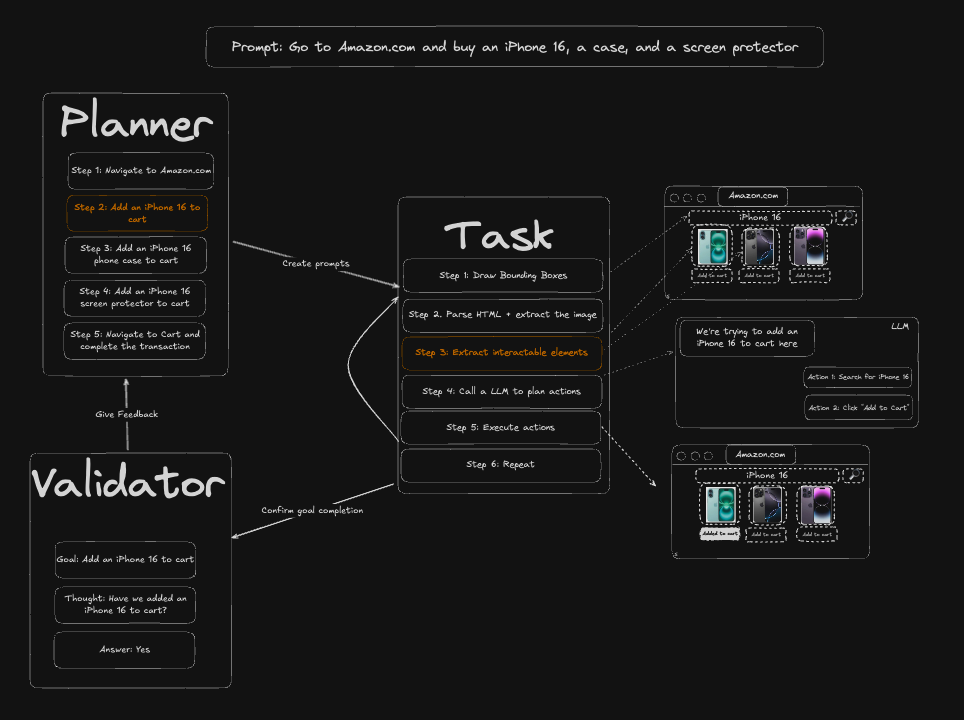

<!-- DOCTOC SKIP -->

<h1 align="center">
 <a href="https://www.skyvern.com">
  <picture>
    <source media="(prefers-color-scheme: dark)" srcset="fern/images/skyvern_logo.png"/>
    
  </picture>
 </a>
 <br />
</h1>
<p align="center">
  <a href="https://www.skyvern.com/docs">Docs</a> ·
  <a href="https://discord.gg/fG2XXEuQX3">Discord</a> ·
  <a href="https://app.skyvern.com">Skyvern Cloud</a> ·
  <a href="https://www.skyvern.com">Website</a>
</p>

**Skyvern does tasks in a web browser for you: you describe what you want in plain English, and it opens a real browser and clicks, types, and reads pages, using an AI model to decide each step, until the job is done.**

It is open source ([AGPL-3.0](LICENSE)). You can run it on your own machine or use the hosted version, [Skyvern Cloud](https://app.skyvern.com).

https://github.com/user-attachments/assets/5cab4668-e8e2-4982-8551-aab05ff73a7f

## Pick your path

| If you want to… | Do this | What you need |
| --- | --- | --- |
| Try it without installing anything | [Skyvern Cloud](#skyvern-cloud) | An account at [app.skyvern.com](https://app.skyvern.com) |
| Run it yourself, with the web UI | **[Quickstart](#quickstart-docker-compose) (recommended)** | Docker and an LLM API key |
| Call it from Python or TypeScript | [SDK reference](https://www.skyvern.com/docs/sdk-reference/overview) | Python 3.11–3.13 or Node 18+, plus a Skyvern Cloud API key or your own Skyvern server |

## Quickstart (Docker Compose)

This is the recommended way to run Skyvern yourself. It starts the API server, the web UI, a Postgres database, and a browser, all in containers.

### Before you start

- **Docker** with Compose v2 ([Docker Desktop](https://www.docker.com/products/docker-desktop/) or Docker Engine), running. The images need about 7 GB of disk.
- **git**.
- **An LLM API key. This is required and it costs money.** Skyvern sends the page to a model at every step of every task, and your provider (OpenAI, Anthropic, Gemini, Azure, Bedrock, …) bills you for it. You can use a local model through [Ollama](https://www.skyvern.com/docs/developers/self-hosted/llm-configuration) instead, with no provider bill.
- About 4 GB of free RAM.
- Ports **8000**, **8080**, **9090**, and **6080** free on your machine.

You do **not** need Python, Node, Postgres, or a browser installed. They are inside the containers.

### Steps

1. Get the code:

   ```bash
   git clone https://github.com/Skyvern-AI/skyvern.git
   cd skyvern
   ```

2. Create the two config files:

   ```bash
   cp .env.example .env
   grep -v '^VITE_SKYVERN_API_KEY=' skyvern-frontend/.env.example > skyvern-frontend/.env
   ```

   The second command copies the UI settings but leaves out the placeholder API key, so the UI picks up the real key that Skyvern generates on first start. (No `grep`? Copy the file and delete the `VITE_SKYVERN_API_KEY=YOUR_API_KEY` line by hand.)

3. Open `.env` and fill in the three LLM lines that are already there. For OpenAI:

   ```bash
   ENABLE_OPENAI=true
   OPENAI_API_KEY="sk-..."
   LLM_KEY="OPENAI_GPT5_5"
   ```

   Other providers follow the same pattern (`ENABLE_ANTHROPIC`, `ANTHROPIC_API_KEY`, …). The [LLM configuration docs](https://www.skyvern.com/docs/developers/self-hosted/llm-configuration) list every provider and valid `LLM_KEY` value.

4. Start it:

   ```bash
   docker compose up -d
   docker compose ps
   ```

   The first start downloads the images, then takes a minute or two to set up the database. Wait until `postgres` and `skyvern` show `(healthy)`; `skyvern-ui` just shows `Up`.

5. Open **http://localhost:8080**, type a task into the prompt box (for example, `Find the top post on Hacker News today`), and run it. You can watch the browser work, and the result shows up under **Runs**.

To stop: `docker compose down`. Your data stays in `./postgres-data`, `./artifacts`, and the other folders Compose creates next to the repo files.

Something not working? See [Troubleshooting](#troubleshooting).

### Run a task from code (optional)

The API listens on `http://localhost:8000`. Your API key is the `cred` value in `.skyvern/credentials.toml`, which Skyvern writes on first start.

```bash
pip install skyvern
```

```python
import asyncio
from skyvern import Skyvern

async def main():
    skyvern = Skyvern(base_url="http://localhost:8000", api_key="YOUR_API_KEY")
    run = await skyvern.run_task(
        prompt="Find the top post on Hacker News today",
        url="https://news.ycombinator.com",
        wait_for_completion=True,
    )
    print(run.status, run.output)

asyncio.run(main())
```

### Next steps

- Learn the [core concepts](https://www.skyvern.com/docs/developers/getting-started/core-concepts).
- Drive a browser from your own code with the [SDK reference](https://www.skyvern.com/docs/sdk-reference/overview).
- Start from a worked example in the [cookbooks](https://www.skyvern.com/docs/cookbooks).

## Other ways to run Skyvern

### Skyvern Cloud

[Skyvern Cloud](https://app.skyvern.com) is the hosted version run by the Skyvern team, so there is nothing to install. Per the project docs, it also provides managed proxies, CAPTCHA solving, and anti-bot measures, which are not part of this repository.

Create an account, copy your API key from **Settings**, run `pip install skyvern`, and use the [example above](#run-a-task-from-code-optional) with `Skyvern(api_key="YOUR_API_KEY")` and no `base_url`.

### Python package: API server without the UI

If you want the API server but not Docker:

```bash
pip install "skyvern[server]"
playwright install chromium
skyvern run server
```

- Needs **Python 3.11, 3.12, or 3.13**.
- The first start creates a SQLite database at `~/.skyvern/data.db` and writes `SKYVERN_API_KEY` to a `.env` file in the current directory.
- Add the same three LLM lines from the quickstart to that `.env` and restart, or tasks will fail.
- The API is at `http://localhost:8000`. **There is no web UI on this path**: the pip package does not include it. Use Docker Compose or a source checkout if you want the UI.
- Plain `pip install skyvern` installs only the SDK client. It cannot run a server.
- `skyvern quickstart` is an interactive wizard for this path. It needs Postgres: either Docker running, so it can start a `postgresql-container`, or your own database via `--database-string`. Do not pass `--no-postgres`; the wizard cannot use SQLite.
- On Windows you may also need [Rust](https://rustup.rs/) and the Visual Studio C++ build tools with the Windows SDK.
- To run Skyvern inside your own Python process instead, with no server, run `pip install "skyvern[local]"` and `playwright install chromium`, then create the client with `Skyvern.local()`. It reads the same LLM settings from the environment or a `.env` file. See the [SDK reference](https://www.skyvern.com/docs/sdk-reference/overview).

## Troubleshooting

**A task fails almost immediately with `Max retries per step (N) exceeded`.**
The LLM is not configured, or the key is wrong. The error does not say so, but the server log does: `docker compose logs skyvern | grep -i llm` shows `Your LLM provider is not configured` or an `LLMProviderError`. Fix the three LLM lines in `.env`, then run `docker compose up -d` again. (`docker compose restart` does not reload `.env`.)

**`docker compose up` says `env file …/skyvern-frontend/.env not found`.**
You skipped the second command in step 2.

**The UI opens but cannot load anything, and `docker compose logs skyvern-ui` says `UI session minting failed … (upstream_rejected)`.**
`skyvern-frontend/.env` still contains `VITE_SKYVERN_API_KEY=YOUR_API_KEY`. Delete that line and run `docker compose up -d`.

**The home page shows `Unexpected Application Error!` mentioning `ClerkProvider`.**
Seen with the `latest` UI image published in late September 2026. Open http://localhost:8080/agents instead and use **Create**.

**A banner says `Unable to verify Skyvern API key … status code 403`, but your agents and runs load fine.**
Seen under Docker Desktop on macOS. The diagnostics endpoint only answers requests it sees as coming from localhost. It can be ignored if everything else loads.

**Docker says a port is already allocated.**
Something else is using 8000, 8080, 9090, or 6080. Find it with `lsof -i :8080` and stop it, or change the left-hand number of that mapping under `ports:` in `docker-compose.yml`. If you move 8000 or 9090, update the matching URLs in `skyvern-frontend/.env` as well. Without Docker, `PORT=8001 skyvern run server` moves the API.

**Postgres is not running.**
With Docker Compose, check `docker compose ps` and `docker compose logs postgres`. With `skyvern quickstart`, `Docker is installed but the daemon is not running` means exactly that: start Docker and re-run. If an old `postgresql-container` is holding port 5432, remove it with `docker rm -f postgresql-container` (this deletes that container's data).

**`Executable doesn't exist at …/ms-playwright/chromium-…`.**
The browser is not installed. Run `playwright install chromium`. This does not apply to Docker Compose, where the browser is in the image.

**`skyvern status` or `skyvern stop` gives the wrong answer.**
`skyvern status` only checks whether ports 8000, 8080, and 5432 answer, so another program on 8080 shows up as a running UI. On macOS, `skyvern stop` can report that nothing is running when something is; stop the server with Ctrl+C in its terminal, or `kill $(lsof -ti :8000)`.

**Anything else on a pip or source install.**
Run `skyvern doctor`. It checks Python, config, database, LLM provider, API keys, the browser, and ports, and prints a fix for each problem.

## Getting help

- **Discord**: [discord.gg/fG2XXEuQX3](https://discord.gg/fG2XXEuQX3) is the fastest place to ask.
- **GitHub issues**: [search existing issues](https://github.com/Skyvern-AI/skyvern/issues) first, then open one with your OS, how you installed, and the relevant logs.
- **Docs**: [skyvern.com/docs](https://www.skyvern.com/docs), including a [troubleshooting guide](https://www.skyvern.com/docs/developers/debugging/troubleshooting-guide) and [FAQ](https://www.skyvern.com/docs/developers/debugging/faq).
- **Email**: [founders@skyvern.com](mailto:founders@skyvern.com).
- **Security problems**: do not open a public issue. See [SECURITY.md](SECURITY.md).

## How it works

For each step of a task, Skyvern:

1. Takes a screenshot of the page and collects its interactive elements.
2. Sends them, with your goal, to the LLM, which chooses the next action.
3. Performs that action in the browser with [Playwright](https://playwright.dev/).
4. Repeats until the goal is met or the step limit (`MAX_STEPS_PER_RUN`) is reached.

Traditional browser automation relies on selectors (XPaths, CSS) written in advance, which break when a site's layout changes. Because Skyvern decides from what is on the page, it is designed to work on sites it has not seen before, to keep working when layouts change, and to apply one workflow across many different sites.

<picture>
  
</picture>

The Skyvern team publishes benchmark results and methodology on its blog: [WebBench](https://www.skyvern.com/blog/web-bench-a-new-way-to-compare-ai-browser-agents/) and [WebVoyager](https://www.skyvern.com/blog/skyvern-2-0-webvoyager-benchmark-results/).

## What you can do with it

- **Tasks**: a single goal for the browser, given as a prompt, with an optional starting `url`, an output schema, and error codes that stop the run. See [core concepts](https://www.skyvern.com/docs/developers/getting-started/core-concepts).
- **Workflows**: chain steps into one unit of work, for example "open the invoices page, filter to this year, download each invoice". Blocks include browser task, browser action, data extraction, validation, login, for and while loops, conditionals, file parsing, file upload and download, sending email, text prompt, HTTP request, and custom code.
- **Structured data extraction**: pass a JSON schema as `data_extraction_schema` and the output follows it.
- **Form filling, file downloads, and logins**, including sites behind 2FA (authenticator app, email, or SMS codes). See [2FA](https://www.skyvern.com/docs/developers/credentials/handle-2fa) and [credentials](https://www.skyvern.com/docs/developers/credentials/store-credentials).
- **Credential stores**: Skyvern's own vault, Bitwarden, 1Password, Azure Key Vault, or a custom HTTP credential service.
- **Live view**: watch the browser while a run is in progress.
- **MCP server**: let Claude, Cursor, and other MCP clients drive Skyvern. See the [MCP docs](https://www.skyvern.com/docs/developers/getting-started/mcp).
- **Integrations**: [Zapier](https://www.skyvern.com/docs/integrations/zapier), [Make](https://www.skyvern.com/docs/integrations/make), and [n8n](https://www.skyvern.com/docs/integrations/n8n).
- **SDKs**: Python (`pip install skyvern`) and TypeScript (`npm install @skyvern/client`). See the [SDK reference](https://www.skyvern.com/docs/sdk-reference/overview).
- **Your own Chrome**: let Skyvern drive a Chrome you already use, with your cookies and logins, from a [self-hosted server](https://www.skyvern.com/docs/developers/self-hosted/browser) or from Skyvern Cloud through a [tunnel](https://www.skyvern.com/docs/developers/optimization/browser-tunneling). If you expose a browser through a tunnel, always set `--api-key`; without it, anyone with the URL controls your browser.

## Contributing

PRs and suggestions are welcome. Read the [contribution guide](CONTRIBUTING.md) and look at the ["help wanted" issues](https://github.com/skyvern-ai/skyvern/issues?q=is%3Aopen+is%3Aissue+label%3A%22help+wanted%22).

To run from source you need [uv](https://docs.astral.sh/uv/getting-started/installation/), Python 3.11–3.13, Node.js (the version in `.nvmrc`) for the UI, and Docker for the Postgres container.

```bash
uv sync --extra server --group dev
uv run skyvern quickstart
```

Then open http://localhost:8080. Before committing, install the hooks with `pre-commit install`. The CLI supports Windows, WSL, macOS, and Linux.

## Telemetry

By default, Skyvern collects basic usage statistics to help the team understand how it is used. To opt out, set the `SKYVERN_TELEMETRY` environment variable to `false`.

## License

The core logic that powers Skyvern is in this repository, licensed under the [AGPL-3.0 License](LICENSE). The anti-bot measures in the managed cloud offering are not included.

Questions about licensing: [support@skyvern.com](mailto:support@skyvern.com).
