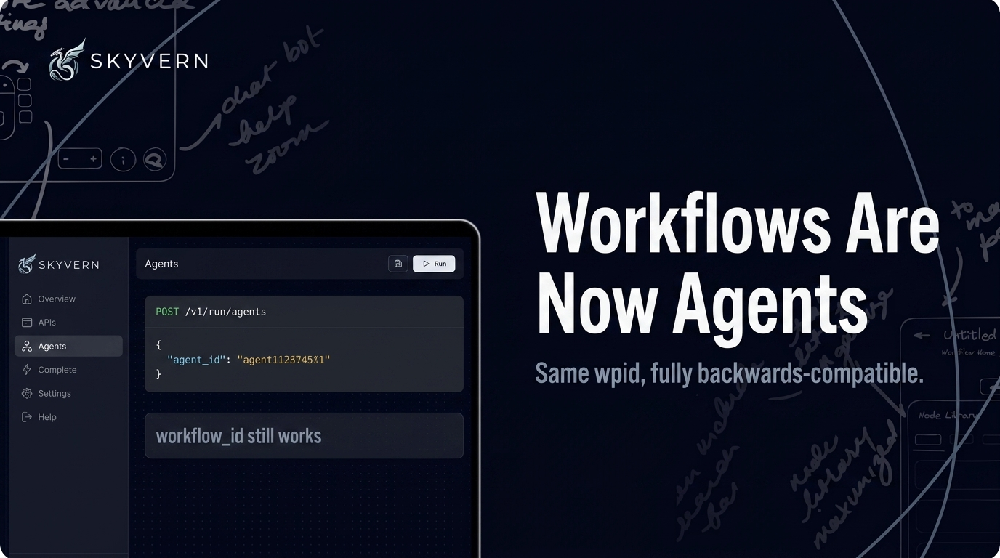
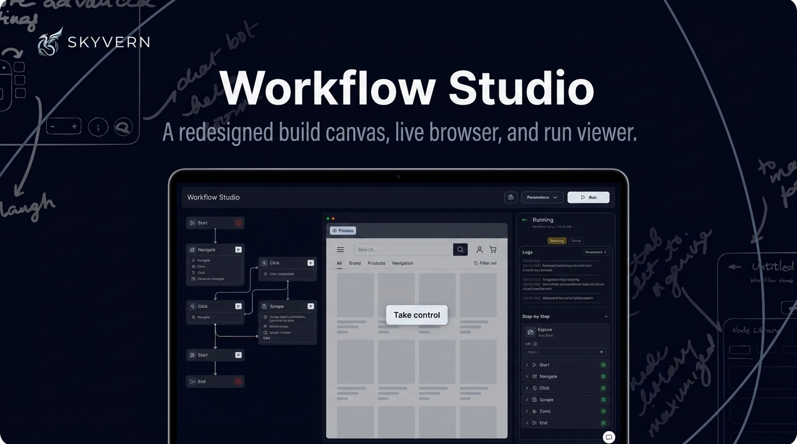
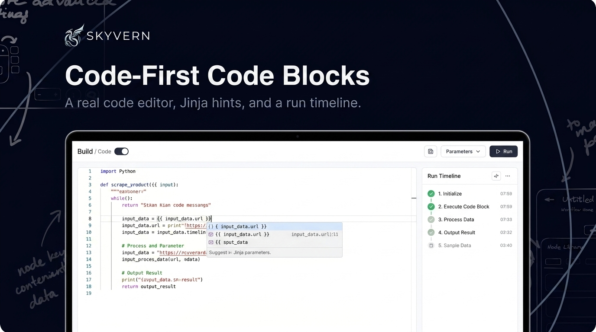
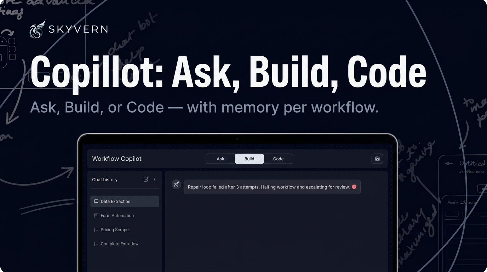
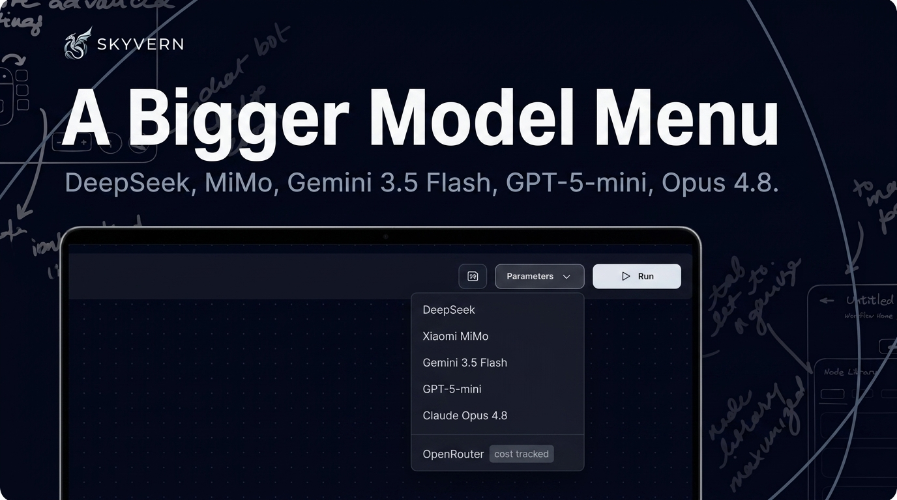
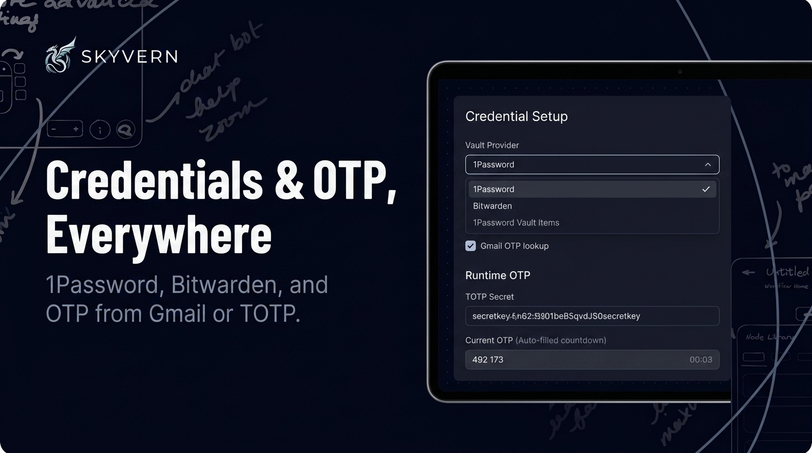
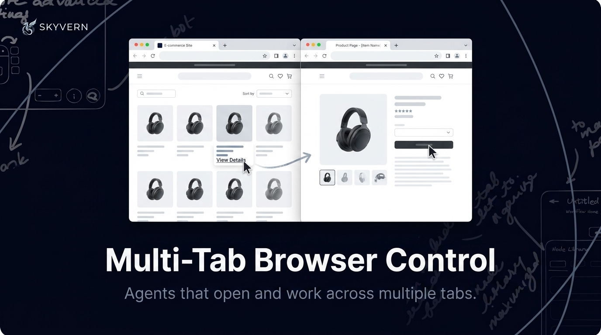
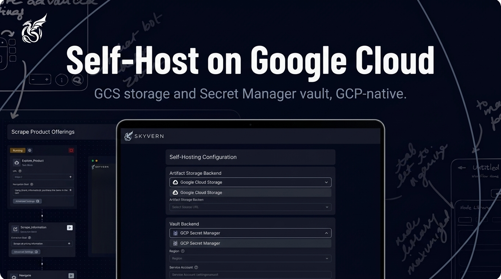

# Skyvern Changelog — June 2026

*Everything we shipped in June 2026 — weeks of June 1, 8, 15, and 22.*

---

## Workflows Are Now Agents

We renamed **Workflows to Agents** across the product, the public API, and the docs. The API now lives under **`/agents`** (e.g. `POST /v1/run/agents`) and accepts an **`agent_id`** alias for `workflow_id` — same `wpid_` value, echoed back in responses. It's fully backwards-compatible: your existing `workflow_id` inputs, `/workflows` endpoints, SDK methods, and bookmarked doc URLs all keep working.

---

## Workflow Studio (Preview)

Meet the next-generation editor. **Workflow Studio** is an opt-in preview that reimagines how you build: a refreshed **build canvas**, an **integrated live browser view**, and a built-in **run viewer** — all in one place. Take control of the live browser, center the viewport, and watch a run unfold without leaving the editor. Flip it on from Feature Preview in Settings.

---

## Code-First Code Blocks

For when you want to drop to code. Code blocks now have a **dedicated code editor** with **syntax highlighting**, **Jinja parameter hints**, and a **run timeline** that records every action — including `page.evaluate(...)` calls. A **Build ↔ Code toggle** flips between visual and code editing, block labels and extraction output render correctly, and Copilot-generated code blocks support a **typed extraction schema** and fill logins with your stored credentials.

---

## Copilot: Ask, Build, Code — With Memory

The Copilot got sharper about intent and context. It now **routes every request by mode** — **Ask** answers without touching your workflow, **Build** creates or edits it, **Code** generates executable code blocks. It **remembers the full chat history per workflow**, so prior context and decisions carry forward as you keep building. And its **repair loop is honest now**: when consecutive fixes make no verified progress, it stops after three tries and escalates cleanly — draft preserved — instead of spinning.

---

## A Bigger Model Menu

More choice for every run. New this month: **DeepSeek**, **Xiaomi MiMo** (and **MiMo-V2.5** via OpenRouter), **Gemini 3.5 Flash**, **GPT-5-mini** (your own OpenAI key or via OpenRouter), and **Claude Opus 4.8** (Anthropic + Bedrock). OpenRouter runs now track token counts and cost like every other provider. (Gemini 2.5 Pro/Flash are deprecated; CUA and the Claude Opus family are now enterprise-only.)

---

## Credentials & OTP, Everywhere

Logins that just work. Pull credentials straight from **1Password** (with an item picker) or **Bitwarden**, look up one-time passcodes from **Gmail** via OAuth, and **fill OTP at runtime** from your stored TOTP secrets — even inside code blocks. Expired credential sessions **auto re-save**, and you can **clear a saved credential** without deleting and recreating it.

---

## Multi-Tab Browser Control

Automations that span tabs. The autonomous agent loop can now **open and work across multiple browser tabs** at once — following new-tab links and handling pop-ups — so flows that jump between tabs no longer dead-end.

---

## Self-Host on Google Cloud

Full GCP-native deployments. Self-hosted Skyvern now supports **Google Cloud Storage** for artifacts and **GCP Secret Manager** as a vault backend — so you can run the whole stack on Google Cloud with your own storage and secrets.

---

## Quick List — June

**New features**
- **Analytics drill-down & tag filters** — period-aware per-agent drill-down (avg duration, credits/run, period-over-period trends) plus filtering runs and metrics by workflow tag
- **Agent Directory Tree** — the agents/folders list is now a navigable tree for nested hierarchies
- **Self-serve editor onboarding** — a get-started modal, a 4-stop guided tour, and smart empty states for faster time-to-first-automation
- **Bulk actions on the agents list** — select multiple agents and act on them at once
- **Label management in Settings** — rename, recolor, and soft-delete tags
- **Browser profiles in MCP sessions** — associate a browser profile with MCP-driven runs for credential/state reuse
- **Feature Preview panel in Settings** — opt into upcoming features before they're fully released
- **Workflow schedules in open source** — self-hosted deployments now support schedules
- **Uncapped workflow runtime** — configure long-running automations with no maximum time limit

**Improvements**
- Structured output is verified against its schema before a run is marked complete
- Tasks return a best-effort **partial deliverable** when they exhaust their credit budget
- The task planner prefers **loop-based tasks** for repeated same-shaped work, and can now emit EXTRACT_INFORMATION / GOTO_URL actions
- The agent **acts immediately on stalled pages** and **halts reliably on terminal blockers** instead of spinning
- Remote browser sessions capped at 4 hours; debug sessions stay open after a run so you can inspect the final page
- End-state screenshots captured for **every open tab** at completion; per-run recordings clipped to the run window and stored as downloadable artifacts
- Run app + recording URLs surfaced in MCP and CLI responses; run-ID search fallback on the runs list
- Batched cache invalidation on workflow save (removed a per-block N+1) for faster saves on large workflows
- OpenRouter cost tracking; analytics tag filters accept labels, groups, or `group:label`
- Improved authenticator-2FA credential setup; PDF field mapping by positional labels
- Copilot data-write blocks default to `continue_on_failure=false`; code-repair progress shown as quiet indicators

**Bug fixes**
- Fixed the workflow builder freezing on an infinite FlowRenderer layout loop
- Fixed the code editor crashing (stack overflow) on large or deeply-nested JSON
- Fixed the app failing to load after a deploy from stale chunks — it now auto-recovers with a cache-busting reload
- Fixed login credentials not reattaching after editing a workflow via MCP
- Fixed conditional routing not being preserved when loading a v1-format workflow
- Fixed the active run context being lost when switching organizations
- Fixed multi-step logins not advancing when credentials filled JavaScript-gated fields
- Fixed scanned PDFs being parsed as a single page instead of page-by-page
- Fixed shadow-DOM text nodes being missed during element text extraction
- Fixed runs not stopping when a configured time limit was exceeded
- Fixed credits not recorded when data was captured inside a Navigate block
- Fixed telephone inputs dropping digits on bare NANP-format numbers
- Fixed persistent sessions reporting a stale cached session as live
- Fixed FileUpload blocks silently skipping when no file was provided (now a clean no-op)
- Fixed the block library drawer overflowing its container in the workflow builder
