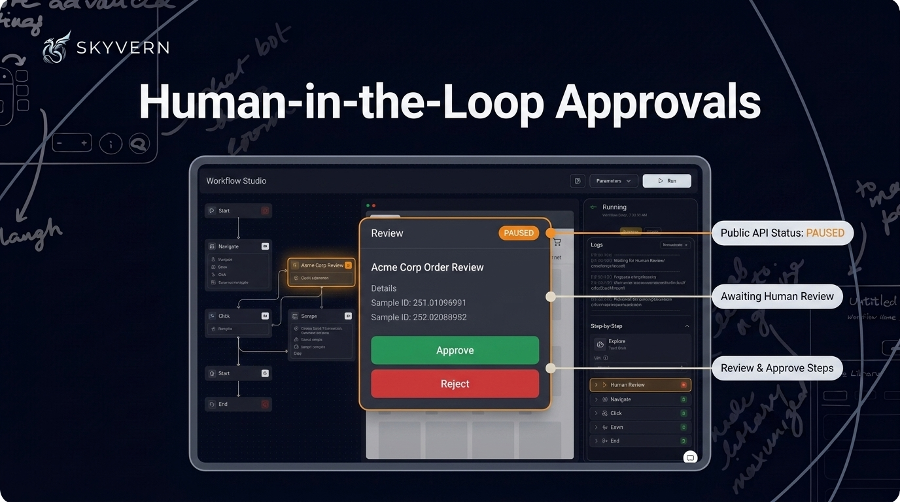
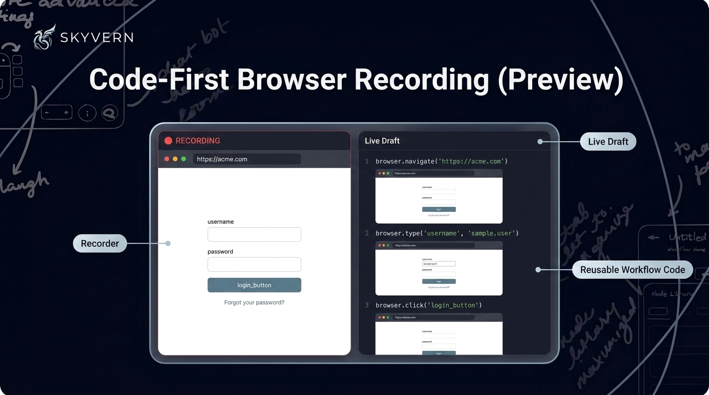

# Skyvern Changelog — July 2026

*Everything we shipped in July 2026 — weeks of June 30, July 6, 13, 20, and 27.*

---

## Workflow Studio, for Everyone

The next-generation editor is out of preview — **Workflow Studio is now available to all users**, with a month of upgrades to match:

- **Build**: a redesigned layout with resizable, drag-to-reorder panes, plus a **full-screen YAML editing mode**
- **Runs**: a **Past Runs tab**, run **inputs and outputs broken down field by field**, code-block outputs shown inline, and searchable JSON
- **Polish**: block search, jump-to-start/end buttons, an unsaved-changes indicator that summarizes what changed, recent-activity history on the canvas, shareable block selection in the URL, and light mode

---

## Human-in-the-Loop Approvals

When a step needs a human, you're in the loop. If a workflow step requires human review, you can now **approve or reject it directly from either run view** — no side channel required. The public run status API also reports a **`paused` state**, so your integrations get an accurate picture when a run pauses, including while it waits on review.

---

## Code-First Browser Recording (Preview)

Show it once, get code. **Record actions in a live browser session** and Skyvern generates **reusable workflow code** from what you did — available now as an opt-in preview. Recording itself was redesigned around a **live draft panel** instead of a separate editor, with cleaner screenshots and more step types. **Live-draft enrichment is noticeably faster** too, so suggestions show up sooner while you record.

---

## Credentials & Secrets, Leveled Up

Logins got a serious upgrade this month. The Credentials page adds a **Magic Link tab**, **passkey 2FA** for password credentials on enterprise plans, and an email-based 2FA identifier — point a credential at a connected inbox and Skyvern retrieves the code automatically.

Workflows got smarter about using them, too. They can **rotate through a pool of credentials** across runs and automatically retry with a fallback credential when one fails. Runs that share a credential are serialized, so they no longer clobber each other's login sessions. The builder's credential picker is searchable with no 100-item cap. And to keep secrets out of sight, a per-workflow **mask-secrets setting** hides sensitive values in run outputs and logs, while the HTTP Request block can fetch response values as secrets and pass them between blocks.

---

## Document & File Pipelines

Files in, files out — anywhere. A new **Email Inbox block** (Gmail and Outlook) lets workflows read and act on inbox messages. A **Split PDF block** divides documents into separate files, and the File Parser now unpacks ZIP archives.

On the way out, the Download File block can deliver to **SFTP, Amazon S3, Azure, and Google Drive**, and SFTP joins the Cloud Storage upload targets. Google Drive uploads handle **files larger than 5 MB** with resumable transfers that pick up where they left off. The Cloud Storage block takes an optional prompt to upload only the files you want, and downloaded files get the correct extension detected from their content.

---

## Run Tags & a Weekly Analytics Digest

Organize runs your way — and get the story delivered. Runs can now be **tagged**, manually or via **auto-detected platform tags**, managed in bulk, and filtered by agent or run type in Run History. Analytics gained **grouping by run metadata** and a restructured console for a clearer read on usage and cost. And a new **weekly email digest** lands in your inbox with run volume, credit usage, a status breakdown, week-over-week trend indicators, and your lowest-success-rate workflows.

---

## Custom LLMs & New Models

Bring your own brain — or pick a new one. Organizations can now set **default Smart and Fast custom LLMs** from account settings instead of configuring them on every workflow. Custom LLM setup accepts **provider-specific parameters**, and Google Gemini is natively supported as a provider. The model menu grew too: **Claude Opus 5**, **Grok 4.5**, Gemini 3.5 Flash Lite, Gemini 3.6 Flash, and DeepSeek V4 Flash are all selectable now.

---

## Self-Healing You Can See

Reliability, made visible. The workflows list now shows **reliability badges** when automatic recovery has kept a workflow on track. Run pages surface a **self-heal panel** showing exactly when recovery kicked in. And **self-healing can be switched on or off** right in workflow settings.

Under the hood, runs got harder to derail:

- Every browser action is bounded by a timeout, so a stuck action can't hang a run
- Workflows **wait through virtual queues and waiting-room pages** instead of failing
- Cloudflare Turnstile challenges are detected proactively for faster resolution, and simple arithmetic text CAPTCHAs hit during data lookups are solved automatically
- Code-block self-healing enforces a minimum retry floor before giving up

---

## Quick List — July

**New features**

- **In-app MCP setup** — configure the MCP connector directly inside the app, plus new MCP endpoints for **1Password and Bitwarden**
- **Google integrations with org-level OAuth** — centralized admin control over connected Google accounts
- **Browser session startup URL** — browser sessions can start at a specific URL
- **Recurring add-on credits** — set up monthly add-on credits on your subscription, with the amount configurable from billing
- **Persistent credential vault for self-hosted Docker** — saved credentials now survive restarts

**Improvements**

- MCP sessions gained a **live action timeline** and an artifact timeline tab
- MCP tool results now lead with the app + recording URLs so you can jump straight in
- MCP observe surfaces custom dropdown options that were previously hidden
- Large workflows are easier to read and safely edit through MCP
- Copilot follows test runs **live in the Live Browser**, narrates studio runs as they execute, and reveals its verification actions progressively
- Copilot **pauses to ask for a credential** when one is needed and surfaces a credential card right in chat
- Copilot auto-matches saved credentials to the login site and can read a one-time sign-in code from an email inbox
- Redesigned Copilot composer with a clearer mode indicator
- Copilot handles login and verification pages more safely mid-build, and says so honestly when a turn runs out of time
- Buy additional credits on demand from the billing page — and recurring add-on credits are cheaper at **$0.90 per 1,000**
- OTP parsing usage is now visible on the billing page
- Persistent browser sessions renew their lease automatically with activity
- Save & Reuse Session runs use a **consistent egress IP** and are backed by managed browser profiles
- Browser profiles can be refreshed in place, show role badges, and are protected from deletion while in use
- Loop block iteration limit raised from **500 to 1,000**
- The Cloud Storage block now handles up to **300 files** per run
- Google Sheets spreadsheet and sheet pickers accept **template expressions** for dynamic destinations
- Select-option now works on **custom and autocomplete-style dropdowns**, not just native selects
- Scheduling starts with a **guided date/time picker**
- The editor highlights run-blocking blocks and disables Run until they're resolved
- Improved extraction accuracy when requested data is **genuinely absent** from the page
- Failed Code blocks now include a **screenshot and the final page URL**, and failure messages surface the actual exception and failing line
- Run history loads much faster for workflows with many runs
- Expired integrations re-authenticate **in place**, without reconnecting from scratch
- Run views make screenshots easier to find, show output values more clearly, and display conditional/loop prompts in block settings
- Read-only workflow canvases let you click through conditional branches
- Login blocks prefill their goal from saved credential instructions and support an action history option
- The Labels page adds search and protects built-in system tags
- Files delivered via inline data URLs are captured as run files
- ZIP parsing always returns the list of extracted files

**Bug fixes**

- Fixed issues affecting automated solving of Cloudflare and reCAPTCHA challenges, including reCAPTCHA v2 being treated as solved before its token was ready
- The analytics dashboard now shows credit usage from actual billing records instead of an estimate, so the numbers match your invoice
- Fixed a race condition that could corrupt credential values — rotating or dropping characters — as they were typed into login fields
- Fixed a regression where downloaded files could lose their original filenames, and files being uploaded under a temporary name before the browser finished renaming them
- Fixed phone numbers being altered or rejected when country-aware form fields rewrote them with a country code
- Fixed Cmd+V paste not working in the Live Browser view on macOS
- Fixed screenshots, viewers, and artifact download links expiring — they now refresh automatically
- Fixed importing workflow exports bundled as multi-workflow YAML/JSON files
- Fixed the run detail page returning a 404 for runs based on a template workflow
- Fixed LLM blocks not enforcing their configured output schema, which could let malformed data reach downstream blocks
- Fixed custom segmented date inputs silently submitting the wrong month
- Fixed a valid "no" answer from a workflow causing an otherwise successful run to be marked as failed
- Fixed the Live Browser view showing blank frames during a run
- Fixed missed download popups causing file-download clicks to silently fail
- Fixed completed Copilot runs being incorrectly recorded as failures
- Fixed failures inside a Finally block not being propagated to the run outcome
- Fixed a Python comment causing an entire Code block to fail
