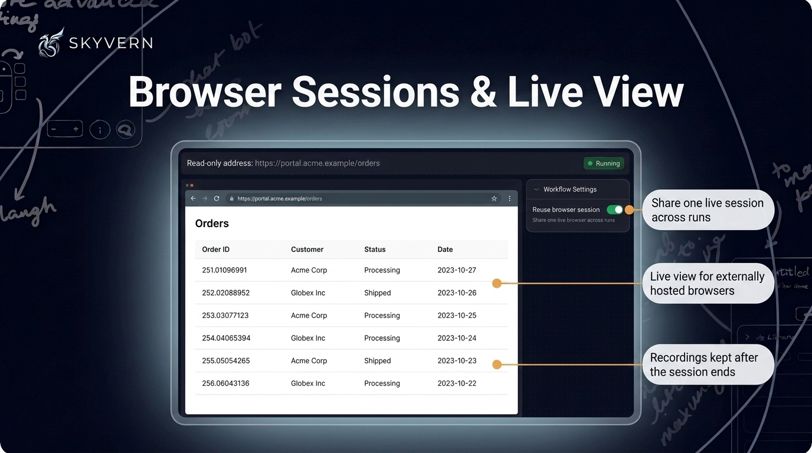

# Skyvern Changelog — August 2026

*Everything we shipped in August 2026 — weeks of August 3, 10, 17, and 24.*

---

## Workflow Copilot Updates

The updated Copilot chat is now the default everywhere, including the workflow editor and Workflow Studio.

- Build progress uses a **flat activity log** of what Copilot looked at, wrote, and ran. Write steps show code diffs. Narrator lines explain steps in place.
- Copilot can **repair and rerun one block** in a single step. If the browser remains on that block's page, Copilot reruns only that block without replaying the login. After a code block fails, Copilot receives the recorded browser error. It also receives the screenshot and any blocking overlay when they were captured.
- The Accept card lists added, changed, and unchanged blocks. Accept and Reject appear without a reload. The new **Test end-to-end** action runs the whole draft in a fresh browser.
- Select a connected Google account inline or choose credentials from a **searchable picker**. You can give Copilot a saved login by name. Copilot solves captchas and reads sign-in codes from a connected inbox without stopping to ask.

Copilot supports the human-approval block and knows today's date. It retains gathered page facts across long sessions. The new stop button ends the current Copilot run.

---

## Skyvern 3.0 Engine (Beta)

The opt-in **Skyvern 3.0** beta controls the browser through a persistent tool loop. Only actions count against your step budget. Perception turns do not count.

- Select Skyvern 3.0 (marked Beta) in the engine selector for task, navigation, login, action, and extraction blocks. You can also pass `engine="skyvern-3.0"` on a task run.
- When the page's text digest has gaps, the agent takes a **marked-up screenshot** and acts on its numbered marks.
- The engine solves captchas, including hCaptcha, and resolves **TOTP and emailed one-time codes**. It follows emailed magic links without those links reaching the model.
- Custom comboboxes, click-to-open selects, typeaheads, and shadow-DOM controls commit in **one action**. The engine verifies file uploads and toggle changes. It waits for the page to settle before completing a block.

The engine supports run replay and typed action history.

---

## Control Chrome through MCP

The new **Skyvern Agent** Chrome extension is available on the Chrome Web Store. It lets Skyvern MCP control your logged-in Chrome through `BROWSER_TYPE=extension-connect`. This includes existing sessions, cookies, and profiles. You share only the tabs you choose. Pairing requires one approval and persists per workstation. Several coding agents can share one Chrome at the same time.

You can select MCP scopes at install time or on the hosted URL.

- Set `--scope all|operate|build|browser` during installation. You can also opt into the **`lean`** scope for browser-only tools.
- The `lean` and `all` scopes include new tools. `skyvern_page` reads large pages with cursor pagination. `skyvern_extract_structured` returns schema-validated results. `skyvern_finish` declares a task's final outcome.
- Add Skyvern as a custom connector in **Claude.ai and Claude Desktop** through hosted MCP. Refresh tokens renew access without prompting you. Hosted MCP connects to the organization you picked at sign-in.

---

## Credentials and Login Updates

The Login block now lists 1Password items in its credential dropdown.

- Bind a **1Password** item directly from the Login block's credential dropdown. A five-step guide explains the service account token. Items that store one-time codes in a plain field can specify a custom TOTP field.
- **Passkey 2FA** is available for every cloud organization. You can use Outlook as a source for email two-factor codes.
- Store a credential with a username and no password. Leave a workflow credential's default blank to **run unauthenticated unless you pass one at run time**.
- Run workflows **sequentially per credential**, including scheduled runs. Save & Reuse Session keeps one browser profile per rotating credential.

Skyvern stores magic-link and OTP values exactly as received. Code blocks and cached scripts can complete an emailed sign-in with the new `magic_link` verb. Bitwarden updates reduce credential fetch time and failures. OTP logins use their full 15-minute polling budget.

---

## Files, Email & Storage

S3-compatible storage endpoints must use public HTTPS by default. Self-hosted deployments can allow internal hosts.

- Set the new **`endpoint_url`** field on File Upload and File Download blocks to use your S3-compatible storage.
- Configure **Custom SMTP** under Advanced Settings to send from your own mail server through the Send Email block.
- Set **`retention_days`** when uploading a file with `POST /v1/upload_file`. Delete any upload with `DELETE /v1/files/{id}`. Attach uploads to a run with `file_ids` to have Skyvern delete them when the run ends.
- File Download uses your connected Drive account for private Drive files. The Drive folder ID is optional. Leave it blank to save to My Drive root. Google Sheets appends use the column you specify. Sheets, Drive, Docs, and Gmail blocks resolve connections **by name or email**.

Inside a loop, the File Parser can skip files it cannot parse. It follows Drive links behind confirm pages. A slow parse of a large document fails only its own block, not the whole run.

---

## Browser Sessions & Live View

Workflow runs can share one browser while retaining logged-in state and tabs.

- Enable the new **`reuse_browser_session`** workflow setting. Each run can override the setting.
- Externally hosted browsers (US cloud) and session-backed runs now stream a **live view**. Take-control reaches the full page height. The view reports when its stream stops instead of freezing.
- The API **caps over-limit timeouts at 240 minutes** and reports them in a `warning` field instead of rejecting them. A closed session reports its status and what to do next.

Recordings from external providers are retained after teardown. A renewal never shortens a session.

---

## Code Block Errors and Outputs

Run status and webhooks identify typed business errors from code blocks.

- Declare **`error_code_mapping`** on a code block. Use `raise ErrorCode("out_of_stock", "why")` to identify the failed condition.
- A failed block reports the failing line and a plain-language next step. It includes the raised exception when redaction allows. User-code and browser failures link to the **block screenshot** when one was captured.
- Run detail displays **persisted code-block output** instead of a disabled Outputs panel.
- The sandboxed runner supports downloads, `page.url`, `Locator.or_`/`and_`, Python `class` statements, `page.frames`, and your configured timeouts. Advisory **security-scan warnings** appear when you save code in Copilot or lint through MCP.

---

## Analytics & Run History

The run failure rate now excludes runs you cancelled.

- **Group by workflow tag** on the analytics dashboard for per-tag run and credit chargeback. The existing run-metadata grouping remains available.
- An **Actions** tile shows action counts and failure rate on the dashboard and workflow health panel. The run chart switches to a **Failures view** with agents ranked by failures first.
- The selected **run status** applies to every chart, tile, table, and CSV export, including drill-downs. You can select several statuses at once.
- Run history search and status filters persist in the URL. `GET /runs` accepts the new `failure_category` filter for workflow runs.

---

## Quick List — August

**New features**

- `GET /v1/workflows/{workflow_id}/runs` and the MCP workflow run list accept `include_child_runs` to list child runs.
- Send Email works through the API, SDK, and MCP without declaring platform SMTP parameters for `send_email` blocks.
- Export several agents as a ZIP with one file per agent.
- Open a workflow's schema/YAML from the header menu in the classic workflow editor.
- Self-hosted deployments without a cron worker can enable an in-process reaper for stuck runs.
- Self-hosted deployments now solve Cloudflare challenges through the bundled solver extension.

**Improvements**

- A card shows Workflow Inputs where the flow starts. Its header shows the input count.
- Studio makes pane borders more distinct and simplifies timeline controls. The Run Timeline shows elapsed time, blocks, actions, and credits.
- Paste a full workflow export into the editor's YAML pane.
- New code blocks from browser recording, Browser Task steps, and PDF/SOP imports open in the new code block editor.
- Delete confirmations use the same dialog across the app.
- Run detail pages no longer freeze on multi-megabyte output values.
- A workflow run with no blocks fails immediately with a specific reason. An undefined for-loop parameter returns a 422.
- Ordinary text inputs fill atomically. Toggles and checkboxes use their intended state.
- Dropdown and custom-select fills verify that the value committed instead of reporting a false success.
- Runs recover from CDN access-denied interstitials and can click data-grid row checkboxes.
- When a large page causes prompt overflow, the step trims the element tree instead of failing.
- Proxied stealth browser launches start about 30 seconds faster. Timezone and locale default to the proxy's region unless you set them.
- Job-application fills on a major applicant-tracking platform no longer fabricate values. They commit dates and pickers correctly and recognize submit confirmation. They stop early when a posting shows you already applied.
- Revoked or rotated API keys stop working within 60 seconds.
- The CLI refuses to send an API key to the cloud default unless `SKYVERN_BASE_URL` is set explicitly.
- The API caps concurrent SDK `run_action` calls per organization with a 429 to prevent degraded service for everyone.
- The API returns 503 with `Retry-After` when the database connection drops, so SDK clients retry.
- MCP tools return a structured `SESSION_EXPIRED` result. Large MCP responses are compacted while keeping identifiers and errors.
- The standalone MCP server binds to localhost by default (`--host 0.0.0.0` to expose it).
- Connecting a Google integration requests only that integration's scopes.

**Bug fixes**

- Fixed scheduled runs failing for workflows whose credential is set to run sequentially.
- Fixed a workflow parameter that matched a credential being typed into the page as `[REDACTED_SECRET]`.
- Fixed long text typed into free-text fields keeping only its last ten characters.
- Fixed saved browser profiles that failed to load, dropped the sign-in, or showed the "Restore pages?" bubble.
- Fixed magic-link and OTP values changing before use. Fixed Gmail sign-in link emails failing to parse.
- Fixed Bitwarden logins without a two-factor secret failing to list or fill.
- Fixed downloads lost on adopted, vendor-hosted, and reused browser sessions. Fixed lost downloads from in-page PDF blobs and after a download closed the working page.
- Fixed a downloaded file being materialized twice and uploaded as duplicates.
- Fixed an aborted browser download reporting success with zero files.
- Fixed webhook deliveries leaving from a different IP than the documented relay.
- Fixed SDK and MCP actions against cloud browser sessions returning HTTP 500.
- Fixed live view flickering to black and showing a black screen on session-backed runs. Fixed frames stopping after a reconnect.
- Fixed Delete and Backspace not working in the hosted browser live view.
- Fixed browser session recordings failing to save after long sessions.
- Fixed runs stuck in `queued` after a sequential gate deadline. Fixed runs retrying indefinitely when the workflow body raised an exception.
- Fixed saving a workflow with many cached scripts hanging for minutes.
- Fixed selecting a block marking the workflow as unsaved. Fixed the Inputs card opening Workflow Settings.
- Fixed "Execute on any outcome" blocks being marked as disconnected or skipped by a conditional branch.
- Fixed run and task view tabs blanking the content area. Fixed shared Studio run links opening the wrong run.
- Fixed the Add Credential modal not opening from the Credentials page.
- Fixed the analytics dashboard counting cancelled runs as failures. Fixed enterprise plans seeing always-zero credit tiles.
- Fixed self-serve customers being able to start a duplicate subscription checkout.
- Fixed self-hosted deployments failing to launch browsers, initialize encryption, or authenticate the UI behind a proxy.
- Fixed the `skyvern doctor` check not recognizing `ENABLE_OPENAI_COMPATIBLE`.
- Patched third-party dependency vulnerabilities.
