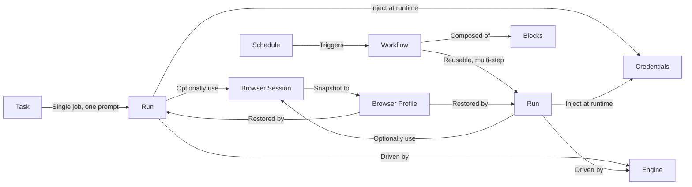

Every automation you build in Skyvern Cloud is composed of the same nine building blocks. This page is a quick tour of each one — what it is, where you find it in the dashboard, and when to reach for it.

If you've already poked around the dashboard, this map will tie what you've seen to the underlying concepts.

---

## Tasks

A **Task** is a single automation job. You describe what you want, Skyvern opens a browser and does it.

You create tasks from the **Discover** page. Type your prompt and target URL into the input bar, pick an engine, and hit send.

Tasks are the right starting point for one-off automations, ad-hoc data extraction, or quickly testing whether an idea is feasible before turning it into an agent.

When you outgrow a single task — you need parameters, branching, loops, or to run the same flow on a schedule — graduate to an Agent.

<Card title="Run a task →" icon="play" href="/cloud/getting-started/run-a-task">
  Walkthrough of every option on the Discover page.
</Card>

---

## Agents

An **Agent** is a reusable automation built by chaining blocks together on a visual canvas. Agents are versioned, parameterized, and shareable across your team.

You build them on the **Agents** page. Click any agent to open the editor, where blocks appear as connected nodes you can drag and configure.

Use an agent when:

- The same flow needs to run repeatedly with different inputs
- You need to loop over a list, branch on a condition, or pass data between steps
- You want to schedule the automation to run on a cadence
- You want a teammate to be able to re-run it without re-deriving the logic

<Card title="Build an agent →" icon="diagram-project" href="/cloud/building-agents/build-an-agent">
  Tutorial covering blocks, parameters, branching, and execution.
</Card>

---

## Blocks

**Blocks** are the units an agent is built from. Each block performs one thing — navigate, log in, extract data, branch on a condition, send an email — and passes its output to the next block.

In the agent editor, click the **+** button on any node to insert a new block. The picker groups every available block by category.

There are 20+ block types organized into:

- **Browser automation** — Browser Task, Browser Action, Login, Extraction, Go to URL, Print Page
- **Data and extraction** — Text Prompt, File Parser
- **Control flow** — Loop, Conditional, AI Validation, Code, Wait
- **Files** — File Download, Cloud Storage Upload
- **Communication** — Send Email, HTTP Request, Human Interaction

Each block has its own configuration panel. The full reference, with every field for every block, lives at [Agent Blocks](/cloud/building-agents/configure-blocks).

---

## Runs

Every time a task or agent executes, Skyvern creates a **Run** — a record of what happened, with a video, screenshots, action log, and any extracted data.

The **Runs** page is your history. Filter by status, search by run ID, click any row to drill in.

Inside a run detail page you'll find:

- **Live viewer / recording** — full video of the browser as it executed
- **Actions** — every step the agent took, with the LLM's reasoning
- **Output** — the structured data extracted (matches the schema you defined)
- **Code** — auto-generated Python/TypeScript/cURL to reproduce this run via API
- **Downloaded files** — anything Skyvern saved, with signed URLs and checksums

A run can be `queued`, `running`, `completed`, `failed`, `terminated`, `timed_out`, or `canceled`. You're billed per **step** — one screenshot + LLM decision + browser action.

<Card title="Read run details →" icon="list-check" href="/cloud/viewing-results/run-details">
  How to interpret the actions tab, recordings, and output.
</Card>

---

## Browser sessions

A **browser session** is a live browser instance you keep open across multiple runs. Sessions preserve everything that lives in the browser — cookies, login state, cached pages, the current tab — so a follow-up task picks up exactly where the previous one left off.

You manage sessions on the **Browsers** page. Create a session, run tasks against it, then close it when you're done.

Sessions are perfect when you want to:

- Log in once, then run a sequence of tasks behind that login
- Hand off a partially-completed flow between an agent and a human (Take Control)
- Keep a long-running automation warm without re-authenticating each step

Sessions live for 5 minutes to 24 hours (default 60 minutes). When the timer ends or you close it manually, the browser is destroyed and its state goes with it.

<Card title="Browser sessions →" icon="window" href="/cloud/browser-management/browser-sessions">
  Create, attach, and reuse sessions across runs.
</Card>

---

## Browser profiles

A **browser profile** is the persistent counterpart to a session. Where a session is a live browser that times out, a profile is a saved snapshot — cookies, auth tokens, local storage — that you can reload weeks later to skip the login flow entirely.

Profiles are listed on the **Browsers** page under the Profiles tab. You create one from any completed run, then attach it to future runs to start in an already-authenticated state.

| | Browser session | Browser profile |
|---|---|---|
| **Live or saved?** | Live, in-memory browser | Saved snapshot of state |
| **Lifetime** | 5 min – 24 hr | Indefinite |
| **Best for** | Chaining tasks in real time | Skipping login on repeat runs |

<Card title="Browser profiles →" icon="floppy-disk" href="/cloud/browser-management/browser-profiles">
  Save and reuse authenticated state across days or weeks.
</Card>

---

## Credentials

A **credential** is a stored login, credit card, or 2FA secret that Skyvern injects directly into the browser at runtime. Credentials are encrypted at rest and **never sent to the LLM** — the agent decides where the password field is, and the value is filled in via the browser layer.

The **Credentials** page is where you manage them.

Three credential types are supported:

- **Password** — username + password, optionally with a TOTP secret or email/SMS 2FA
- **Credit card** — card number, expiry, CVC, billing address
- **Secret** — any single value you want to keep out of the LLM context

You can also sync credentials from **Bitwarden**, **1Password**, or **Azure Key Vault** instead of storing them in Skyvern.

<Card title="Credentials overview →" icon="lock" href="/cloud/managing-credentials/credentials-overview">
  Security model, supported types, and external vault integration.
</Card>

---

## Schedules

A **schedule** runs an agent automatically on a recurring cadence. You set a cron expression and timezone, and Skyvern fires the agent at every interval — no manual trigger needed.

Schedules are configured per agent. Open any agent's actions menu and choose **Schedule**.

<Frame>

</Frame>

Use schedules for daily reports, hourly monitoring, periodic data syncs, or anything that should "just keep running" without you remembering to click Run.

<Card title="Scheduling →" icon="calendar" href="/cloud/building-agents/scheduling">
  Cron syntax, timezones, and managing scheduled runs.
</Card>

---

## Engines

An **engine** is the AI model Skyvern uses to drive the browser. Different engines have different strengths — speed, accuracy on complex pages, cost — and you can pick one per task or per block.

The engine picker appears in API/SDK task requests and on supported browser-driven blocks in the agent editor.

| Engine | When to use |
|--------|-------------|
| **Skyvern 1.0** | Default for new tasks. Lighter and faster for simple, single-page interactions. |
| **Skyvern 2.0** | Available for existing V2 agents and explicitly requested V2 task runs. |
| **OpenAI CUA** | OpenAI's Computer Use Agent. Good for visual reasoning. |
| **Anthropic CUA** | Anthropic's Claude Computer Use. Strong at multi-step planning. |
| **UI-TARS** | Lightweight CUA model option. |

If you're not sure, use the default. Move repeated automations into agents when you need scheduling, reusable parameters, or cached code replays.

---

## How they fit together

A typical day in the dashboard:

1. **Prototype** with a Task on the Discover page. Iterate on the prompt until it works.
2. **Productionize** by turning the prompt into an Agent with Blocks, Parameters, and a Schedule.
3. **Persist state** by saving a Browser Profile after the first authenticated run, so future runs skip login.
4. **Audit** every execution on the Runs page — recording, actions, output, downloaded files.

---

## Next steps

<CardGroup cols={2}>
  <Card
    title="Run Your First Task"
    icon="play"
    href="/cloud/getting-started/run-your-first-task"
  >
    Hands-on tutorial — go from prompt to extracted data in a few minutes.
  </Card>
  <Card
    title="Build an Agent"
    icon="diagram-project"
    href="/cloud/building-agents/build-an-agent"
  >
    Wire blocks together into a reusable, parameterized automation.
  </Card>
</CardGroup>
