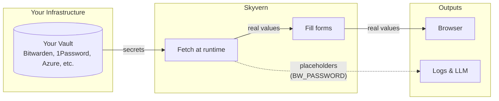

Skyvern provides a credential management layer that gives you a unified API to create, use, and delete credentials. Your actual secrets are never stored in Skyvern. They live in your external vault (Bitwarden by default, or 1Password, Azure Key Vault, or your own service).

---

## How it works

When you create a credential via Skyvern's API, two things happen:

**Skyvern stores metadata** for easy lookup: credential names, IDs like `cred_xyz789`, usernames, and non-sensitive identifiers (like the last 4 digits of a card). This lets you list and manage credentials without exposing secrets.

**Your vault stores the secrets**: passwords, TOTP keys, full card numbers, and API tokens. Skyvern only retrieves these at runtime when needed, then discards them immediately after use.



This gives you:

- **Friendly IDs**: Reference credentials by `cred_xyz789` instead of vault-specific item IDs
- **Vault abstraction**: Switch between Bitwarden, Azure, or custom vaults without changing your code
- **Security by design**: Secrets never appear in logs, API responses, or LLM prompts

---

## Credential types

Skyvern supports three credential types, each designed for specific use cases.

### Password credentials

Store usernames, passwords, and optional TOTP secrets for website logins.

<CodeGroup>
```python Python
import os
from skyvern import Skyvern

client = Skyvern(api_key=os.getenv("SKYVERN_API_KEY"))

credential = await client.create_credential(
    name="Acme Portal Login",
    credential_type="password",
    credential={
        "username": "user@example.com",
        "password": "secure_password_here",
    },
)

print(f"Credential ID: {credential.credential_id}")
```

```typescript TypeScript
import { SkyvernClient } from "@skyvern/client";

const client = new SkyvernClient({
  apiKey: process.env.SKYVERN_API_KEY,
});

const credential = await client.createCredential({
  name: "Acme Portal Login",
  credential_type: "password",
  credential: {
    username: "user@example.com",
    password: "secure_password_here",
  },
});

console.log(`Credential ID: ${credential.credential_id}`);
```

```bash cURL
curl -X POST "https://api.skyvern.com/v1/credentials" \
  -H "x-api-key: $SKYVERN_API_KEY" \
  -H "Content-Type: application/json" \
  -d '{
    "name": "Acme Portal Login",
    "credential_type": "password",
    "credential": {
      "username": "user@example.com",
      "password": "secure_password_here"
    }
  }'
```
</CodeGroup>

### Credit card credentials

Store payment information for checkout automations. Skyvern only stores the last 4 digits in metadata for identification.

<CodeGroup>
```python Python
credential = await client.create_credential(
    name="Corporate Card",
    credential_type="credit_card",
    credential={
        "card_number": "4242424242424242",
        "card_cvv": "123",
        "card_exp_month": "12",
        "card_exp_year": "2028",
        "card_brand": "visa",
        "card_holder_name": "John Smith",
    },
)
```

```typescript TypeScript
const credential = await client.createCredential({
  name: "Corporate Card",
  credential_type: "credit_card",
  credential: {
    card_number: "4242424242424242",
    card_cvv: "123",
    card_exp_month: "12",
    card_exp_year: "2028",
    card_brand: "visa",
    card_holder_name: "John Smith",
  },
});
```

```bash cURL
curl -X POST "https://api.skyvern.com/v1/credentials" \
  -H "x-api-key: $SKYVERN_API_KEY" \
  -H "Content-Type: application/json" \
  -d '{
    "name": "Corporate Card",
    "credential_type": "credit_card",
    "credential": {
      "card_number": "4242424242424242",
      "card_cvv": "123",
      "card_exp_month": "12",
      "card_exp_year": "2028",
      "card_brand": "visa",
      "card_holder_name": "John Smith"
    }
  }'
```
</CodeGroup>

**Supported card brands:** `visa`, `mastercard`, `amex`, `discover`

### Secret credentials

Store API keys, tokens, or other sensitive strings for use in HTTP Request blocks or custom integrations.

<CodeGroup>
```python Python
credential = await client.create_credential(
    name="API Key",
    credential_type="secret",
    credential={
        "secret_value": "sk-abc123xyz",
        "secret_label": "Production API Key",  # optional
    },
)
```

```typescript TypeScript
const credential = await client.createCredential({
  name: "API Key",
  credential_type: "secret",
  credential: {
    secret_value: "sk-abc123xyz",
    secret_label: "Production API Key",
  },
});
```

```bash cURL
curl -X POST "https://api.skyvern.com/v1/credentials" \
  -H "x-api-key: $SKYVERN_API_KEY" \
  -H "Content-Type: application/json" \
  -d '{
    "name": "API Key",
    "credential_type": "secret",
    "credential": {
      "secret_value": "sk-abc123xyz",
      "secret_label": "Production API Key"
    }
  }'
```
</CodeGroup>

---

## Vault integrations

Skyvern integrates with external password managers so credentials never leave your infrastructure.

### Bitwarden

Connect Skyvern to your Bitwarden organization to use existing vault items.

**Cloud setup:**

1. Create a Bitwarden organization at [bitwarden.com](https://bitwarden.com)
2. Create a collection to share with Skyvern
3. Contact [support@skyvern.com](mailto:support@skyvern.com) to complete the integration
4. Get your collection ID from the Bitwarden URL
5. Reference credentials by collection ID in your workflows

**Self-hosted setup:**

For self-hosted Bitwarden or Vaultwarden, configure these environment variables:

```bash
SKYVERN_AUTH_BITWARDEN_ORGANIZATION_ID=your-org-id
SKYVERN_AUTH_BITWARDEN_MASTER_PASSWORD=your-master-password
SKYVERN_AUTH_BITWARDEN_CLIENT_ID=user.your-client-id
SKYVERN_AUTH_BITWARDEN_CLIENT_SECRET=your-client-secret
BW_HOST=https://your-bitwarden-server.com
```

### 1Password

Connect via service account tokens for secure credential access.

1. Create a 1Password service account with access to your vault
2. Store the service account token in Skyvern:

```bash
curl -X POST "https://api.skyvern.com/v1/credentials/onepassword/create" \
  -H "x-api-key: $SKYVERN_API_KEY" \
  -H "Content-Type: application/json" \
  -d '{
    "token": "your-1password-service-account-token"
  }'
```

3. Reference vault items by ID in your workflows

### Azure Key Vault

Store credentials in Azure Key Vault for enterprise environments.

```bash
curl -X POST "https://api.skyvern.com/v1/credentials/azure_credential/create" \
  -H "x-api-key: $SKYVERN_API_KEY" \
  -H "Content-Type: application/json" \
  -d '{
    "credential": {
      "client_id": "your-azure-client-id",
      "client_secret": "your-azure-client-secret",
      "tenant_id": "your-azure-tenant-id"
    }
  }'
```

### Custom HTTP vault

Integrate your own credential service via HTTP API. Your service must implement these endpoints:

| Endpoint | Method | Description |
|----------|--------|-------------|
| `{base_url}` | POST | Create credential, return `{"id": "..."}` |
| `{base_url}/{id}` | GET | Return credential data |
| `{base_url}/{id}` | DELETE | Delete credential |

Configure via environment variables:

```bash
CREDENTIAL_VAULT_TYPE=custom
CUSTOM_CREDENTIAL_API_BASE_URL=https://credentials.company.com/api/v1/credentials
CUSTOM_CREDENTIAL_API_TOKEN=your_api_token
```

Or via API for per-organization configuration:

```bash
curl -X POST "https://api.skyvern.com/v1/credentials/custom_credential/create" \
  -H "x-api-key: $SKYVERN_API_KEY" \
  -H "Content-Type: application/json" \
  -d '{
    "config": {
      "api_base_url": "https://credentials.company.com/api/v1/credentials",
      "api_token": "your_api_token"
    }
  }'
```

---

## Using credentials in workflows

Workflows are the recommended way to use credentials. Add a credential parameter to your workflow, then reference it in login blocks.

<CodeGroup>
```python Python
# Run a workflow with credential parameter
result = await client.run_workflow(
    workflow_id="wpid_abc123",
    parameters={
        "login_credential": "cred_xyz789",  # Your credential ID
        "target_url": "https://portal.example.com",
    },
)
```

```typescript TypeScript
const result = await client.runWorkflow({
  body: {
    workflow_id: "wpid_abc123",
    parameters: {
      login_credential: "cred_xyz789",
      target_url: "https://portal.example.com",
    },
  },
});
```

```bash cURL
curl -X POST "https://api.skyvern.com/v1/run/workflows" \
  -H "x-api-key: $SKYVERN_API_KEY" \
  -H "Content-Type: application/json" \
  -d '{
    "workflow_id": "wpid_abc123",
    "parameters": {
      "login_credential": "cred_xyz789",
      "target_url": "https://portal.example.com"
    }
  }'
```
</CodeGroup>

<Note>
You can also manage credentials directly from the Skyvern UI. See the [Managing Credentials](/cloud/managing-credentials/overview) guide for details.
</Note>

---

## Using credentials with login

For direct login automations, use the dedicated `login` method which handles credential retrieval and authentication:

<CodeGroup>
```python Python
result = await client.login(
    credential_type="skyvern",
    url="https://portal.example.com/login",
    credential_id="cred_xyz789",
    prompt="Navigate to the dashboard after logging in",
)
```

```typescript TypeScript
const result = await client.login({
  credential_type: "skyvern",
  url: "https://portal.example.com/login",
  credential_id: "cred_xyz789",
  prompt: "Navigate to the dashboard after logging in",
});
```

```bash cURL
curl -X POST "https://api.skyvern.com/v1/run/tasks/login" \
  -H "x-api-key: $SKYVERN_API_KEY" \
  -H "Content-Type: application/json" \
  -d '{
    "credential_type": "skyvern",
    "url": "https://portal.example.com/login",
    "credential_id": "cred_xyz789",
    "prompt": "Navigate to the dashboard after logging in"
  }'
```
</CodeGroup>

**Credential types for login:**

| Type | Description |
|------|-------------|
| `skyvern` | Use credentials created via Skyvern's API (stored in your configured vault) |
| `bitwarden` | Directly reference Bitwarden vault items by collection/item ID |
| `1password` | Directly reference 1Password vault items by vault/item ID |
| `azure_vault` | Directly reference Azure Key Vault secrets by name |

---

## Managing credentials

### List credentials

<CodeGroup>
```python Python
credentials = await client.get_credentials()

for cred in credentials:
    print(f"{cred.name}: {cred.credential_id}")
```

```bash cURL
curl -X GET "https://api.skyvern.com/v1/credentials" \
  -H "x-api-key: $SKYVERN_API_KEY"
```
</CodeGroup>

### Get credential metadata

<CodeGroup>
```python Python
credential = await client.get_credential("cred_xyz789")
print(f"Name: {credential.name}")
print(f"Type: {credential.credential_type}")
```

```bash cURL
curl -X GET "https://api.skyvern.com/v1/credentials/cred_xyz789" \
  -H "x-api-key: $SKYVERN_API_KEY"
```
</CodeGroup>

<Note>
The GET endpoint returns metadata only, never the actual credential values. This is by design for security.
</Note>

### Delete a credential

<CodeGroup>
```python Python
await client.delete_credential("cred_xyz789")
```

```bash cURL
curl -X POST "https://api.skyvern.com/v1/credentials/cred_xyz789/delete" \
  -H "x-api-key: $SKYVERN_API_KEY"
```
</CodeGroup>

<Warning>
Credential deletion is permanent. Workflows using the deleted credential will fail on their next run.
</Warning>

---

## Security architecture

Skyvern's credential handling is designed with security at every layer:

1. **Vault fetch**: Credentials are retrieved from your external vault only when needed
2. **Memory only**: Values exist in Skyvern's memory briefly during execution
3. **Placeholder tokens**: When sending data to LLMs, real values are replaced with tokens like `BW_PASSWORD`
4. **No persistence**: Real values are never written to databases, logs, or API responses
5. **LLM isolation**: Credentials are never sent to language models. The LLM sees only placeholder tokens

<Note>
When you view a run's artifacts or recordings, you'll see placeholder values like `BW_PASSWORD`, `BW_USERNAME`, or `BW_TOTP` instead of actual credentials.
</Note>

---

## Next steps

<CardGroup cols={2}>
  <Card title="Handle 2FA" icon="shield" href="/credentials/handle-2fa">
    Set up two-factor authentication for your automations
  </Card>
  <Card title="Troubleshooting" icon="wrench" href="/credentials/troubleshooting-login">
    Debug common login failures
  </Card>
</CardGroup>
