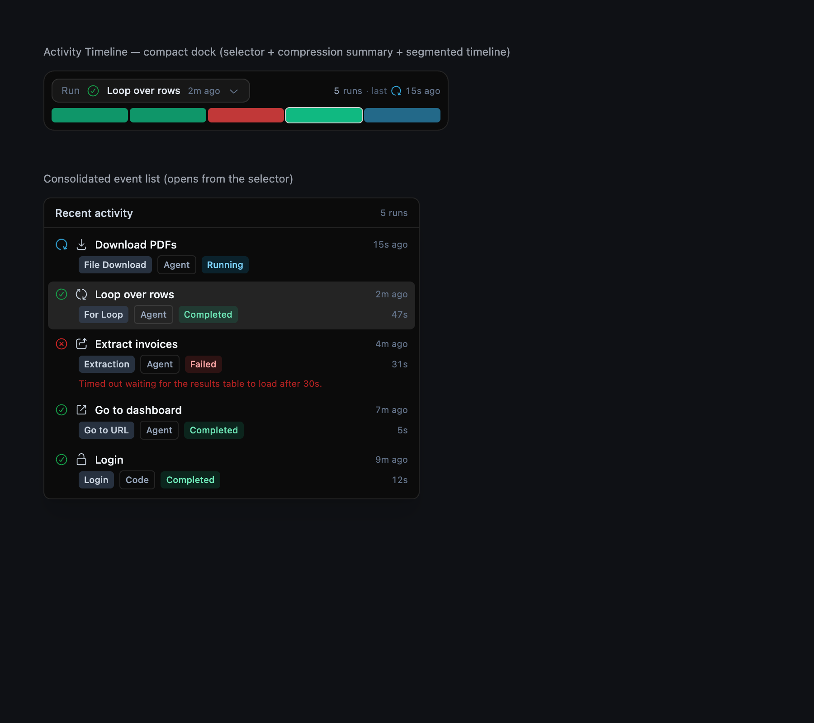
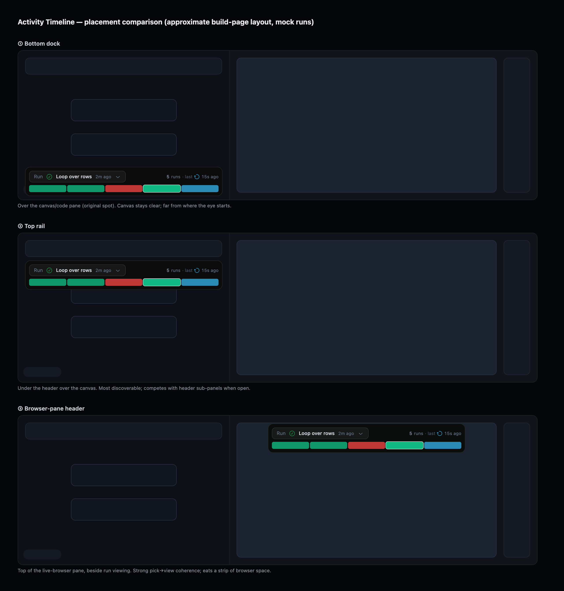

# Workflow Build — Recent Activity History (SKY-11075)

Replace the bottom-of-canvas **dot/carousel indicator** on `/workflows/:id/build` with a
real recent-activity history view that's easy to scan and lets you jump directly to a
specific recent activity.

Status: **Final — recent activity is a compact run selector locked to the right
run-detail panel; the A/B/C style and placement preview toggles were removed. See
the Round 7 section below.**

---

## 1. Frame

- **Page:** Workflow editor, *build* mode — `/workflows/:id/build` (and the run-loaded
  variant `/workflows/:wpid/:workflowRunId/:blockLabel/build`). The history surface only
  renders in **debug/browser mode** (`showBrowser`), bottom-center over the canvas+code
  pane. Redesign of an existing affordance.
- **Job to be done:** While iterating on a workflow you fire blocks/the workflow many times
  in one debug session. Today those runs collapse into a row of identical ~16px dots whose
  only metadata is a hover tooltip. You can't tell at a glance *what* ran, *whether it
  passed*, *how long it took*, or *which mode* (agent vs cached code) — you must hover each
  dot one by one. The job: make each recent run legible at a glance and jump straight to it.
- **Deciding constraint — what counts as "recent activity":** **Debug-session runs**
  (confirmed with requester). Each entry = one block/workflow run triggered in the current
  debug session, sourced from `GET /debug-session/{id}/runs` (`useDebugSessionRunsQuery`).
  No new backend. Deliberately distinct from (a) the global **Runs** page and (b) the
  right-side **run-detail timeline** (`DebuggerRun`/`DebuggerRunTimeline`) which shows the
  *inside* of one selected run. This surface is the *list of runs*; selecting one drives the
  existing detail rail — no overlapping history surfaces.
- **Open sub-question (requester):** is a dock/strip the best surface, or do we want a
  "proper timeline"? → resolved via the concepts below; requester to pick direction.
- **Platform:** web.
- **North star references:** Databricks pipeline run-selector + event log; Vercel Activity feed.

### Data available per entry (`DebugSessionRun`) — today all hidden behind one dot
`block_label`, `status` (running/completed/failed/terminated/timed_out/canceled/queued/
skipped), `created_at` / `queued_at` / `started_at` / `finished_at` (→ duration + "x ago"),
`failure_reason`, `run_with` (agent | code), `code_gen`, `ai_fallback`, `workflow_run_id`,
`workflow_permanent_id`, `script_run_id`. Selecting → `navigate(/workflows/{wpid}/{workflow_run_id}/{block_label}/build)`.

---

## 2. DS inventory (read from code — Figma DS is thin by design)

| Need | Reuse (exists in repo) |
|---|---|
| Status glyph | `StatusDot` pattern (WorkflowRunTimelineBlockItem): `CheckCircledIcon text-success`, `CrossCircledIcon text-destructive`, `ReloadIcon animate-spin text-sky-400`, neutral `rounded-full bg-slate-600` |
| Block-type glyph | `WorkflowBlockIcon` (per `WorkflowBlockType`) |
| Type / mode pills | inline pill convention `rounded bg-slate-700/70 px-1.5 py-0.5 text-[10px] font-medium` |
| Relative time / duration | `formatMs(Date.now()-created).ago`, `formatDuration(toDuration(ms))`, `tabular-nums` |
| Tooltip | `Tip` (`@/components/Tip`) |
| Scroll container | `ScrollArea` (`@/components/ui/scroll-area`) |
| Dropdown / flyout | `Popover` (`@/components/ui/popover`) |
| Expand / collapse | `Collapsible` (`@/components/ui/collapsible`) |
| Buttons / badges | `Button`, `Badge` |
| Surface tokens | `bg-neutral-50 dark:bg-background`, `border-neutral-200 dark:border-neutral-800`, focus `focus-visible:ring-1 focus-visible:ring-white/40` |

Conventions: build-mode rails skew dark (`slate-*`); pills `text-[10px]`, `tabular-nums` for
numbers; every interactive row is a `<button>` with a visible focus ring.

## 3. Gap ledger (DS lacks → candidate Step-5 tickets)
- No dedicated **Status badge** component — status color/icon mapping is re-derived inline in
  several places (`StatusDot`, run cards). Candidate: extract a shared `RunStatusBadge`.
- No **horizontal "activity strip"/run-history rail** primitive.
- (Append as concepts/implementation pressure the library.)

---

## 4. Inspiration (Mobbin — web)

1. **Databricks — pipeline "Update details"** — editor canvas with a **Run: {timestamp}
   [status]** selector top-left, a detail panel (Update ID, *Status, Duration, Start time,
   Run time, Completion date*), and a timestamped **Event log** below. Closest analog: a
   build canvas whose run history is a compact selector + per-run metadata.
   [link](https://mobbin.com/screens/2a53f9eb-b8e1-4958-afb7-f441acbdf414). a11y: the
   selector must be a real listbox/menu button, not a click-only div.
2. **Vercel — Activity** — scannable vertical feed: each row = entity icon + plain-language
   description + **relative time** ("42m"), grouped by date, left filter rail. Gold standard
   for "legible at a glance."
   [link](https://mobbin.com/screens/2f3056eb-a31a-4b3e-ae4b-1bcc1352117f). a11y: relative
   time needs a `title`/`<time datetime>` with the absolute timestamp.
3. **WorkOS — Events** — master-detail: list (event + date/time) on the left, metadata on the
   right. [link](https://mobbin.com/screens/a5b50327-60e0-4075-9cfd-7f383d18265c).
4. **Okta — System Log** / **Stripe — Events** / **Cloudflare — Observability** — dense log
   tables (timestamp · type · message), some with a count-over-time bar.
   [Okta](https://mobbin.com/screens/70f42b3f-1823-4cb2-872d-346ad3eab8dc) ·
   [Stripe](https://mobbin.com/screens/5423e185-8374-4b6c-a4a0-2d3ae9adc1d0) ·
   [Cloudflare](https://mobbin.com/screens/db64bfde-eac6-4786-8c29-62b98eb1a149). a11y:
   color-coded status must pair with an icon/text, not color alone.

---

## 5. Concepts

All three keep the data scope (debug-session runs), keep the existing bottom-center anchor
over the canvas+code pane, and preserve the existing select→navigate behavior. They differ in
*how the history is surfaced*.

### Concept A — "Activity Strip" (in-place horizontal chips)
- **Thesis:** smallest change. Swap the row of bare dots for a row of legible **chips** in the
  same pill, scrolling horizontally. Each chip: status glyph + block icon + block label +
  "x ago"; duration/mode in tooltip. Click → navigate.
- **Lineage:** Databricks run-selector (canvas-anchored) + Vercel chip legibility.
- **DS:** `StatusDot`, `WorkflowBlockIcon`, pills, `ScrollArea`, `formatMs`. Same wrapper/position.
- **Tradeoffs:** + tiny diff, preserves muscle memory, fast. − horizontal scroll is less
  scannable than vertical; limited metadata per chip; long lists hide off-screen.

### Concept B — "Activity History panel" (collapsed timeline bar → expanding vertical list) — RECOMMENDED
- **Thesis:** the dock's **collapsed** state is a slim **status-segment bar** — one thin
  segment per run, colored by status, newest on the right, labeled "N runs · last ✓ 2m ago".
  That's the at-a-glance, time-ordered "timeline." Click/hover **expands upward** into a
  **vertical, scannable list**: one rich row per run = status glyph · block icon · block name ·
  type pill · mode pill (Agent/Code) · duration · "x ago", with a one-line failure reason on
  failures. Newest first. Row click → navigate (existing behavior); current run highlighted.
- **Lineage:** Vercel Activity feed (legible rows) + Okta count-over-time bar (collapsed
  status density) + WorkOS master-detail (list feeds the existing right-side detail rail).
- **DS:** `Popover`/`Collapsible` + `ScrollArea`, the `WorkflowRunTimelineBlockItem` row
  vocabulary, `StatusDot`, pills. New: a small **status-segment bar** (gap-ledger item).
- **Tradeoffs:** + most legible (vertical rows, full metadata — directly satisfies the AC),
  + collapsed footprint stays tiny so the canvas isn't crowded, + serves *both* the
  "scannable history" and "proper timeline" instincts, + scales to long lists.
  − one extra primitive (segment bar); − popover sizing over the canvas needs care.

### Concept C — "Run Selector + Segmented Timeline" (header selector + bottom bar)
- **Thesis:** Databricks-style. A **run selector** near the header ("Run: Login ✓ · 2m ago ▾")
  opens the activity list, *and* a persistent thin **segmented timeline bar** sits at the
  bottom (each run a proportional, status-colored segment; hover→tooltip, click→navigate).
- **Lineage:** Databricks run-selector + Okta status-density bar.
- **DS:** `Popover`, segment bar (new), `StatusDot` colors.
- **Tradeoffs:** + strongest "timeline" metaphor, scales well. − most net-new UI and two
  surfaces (header + bottom) risk fragmenting the history; − largest build/QA; − header is
  already busy in build mode.

## 6. Recommendation & Decision

**Recommend Concept B.** It's the most faithful to the acceptance criteria — each entry
legible at a glance with real metadata, and one click to jump to a run — while keeping the
collapsed footprint as small as today's dot pill. Its collapsed status-segment bar answers the
requester's "proper timeline?" instinct without splitting the history across two surfaces
(Concept C's main risk), and it reuses the established run-row vocabulary so it looks native.

Decision (2026-06-15): requester chose to **build all three (A, B, C) behind a live variant
toggle** so they can compare directly in the PR preview, then collapse to one winner later.
Implementation ships a `RecentActivity` orchestrator that renders the variant selected by a
persisted (localStorage + `?activityVariant=` URL seed) toggle; default = B.

## 7. Implementation (shipped)

New module `skyvern-frontend/src/routes/workflows/debugger/recentActivity/`:
- `useRecentActivity.ts` — data hook (debug-session runs, sorted asc; block-type map;
  `navigateToRun` preserving the old select→navigate target, now also resolving nested loop
  blocks for the "block still exists" guard).
- `runActivity.ts` / `RunGlyphs.tsx` — shared status/duration/time helpers + status/block glyphs.
- `RecentActivitySegmentBar.tsx`, `RecentActivityList.tsx` — shared primitives.
- `RecentActivityStrip.tsx` (A), `RecentActivityPanel.tsx` (B), `RecentActivityTimeline.tsx`
  (C), `RecentActivityVariantToggle.tsx`, `RecentActivity.tsx` (orchestrator).
- `src/store/RecentActivityVariantStore.ts` — variant store.
- `Workspace.tsx` now renders `<RecentActivity />`; `DebuggerBlockRuns.tsx` deleted.

Verification: `tsc --noEmit` ✓, `eslint --max-warnings 0` ✓, `vite build` ✓. Live visual
verification of the populated state needs a debug session with ≥1 run (backend + browser
session) — delegated to the PR preview by design (the whole point of the A/B/C toggle).

### Gap ledger outcome (→ Step 5 DS ticket)
- Shipped one-off **`RecentActivitySegmentBar`** (status-segment/timeline-bar primitive) — DS has none.
- Re-derived **run-status → icon/color** inline (`RunGlyphs` + `STATUS_PILL_TONE`/`SEGMENT_FILL`)
  because there's no shared `RunStatusBadge`.
- Filed **SKY-11082** (team Skyvern AI) to extract both primitives into the DS once the winning
  variant is chosen. Pure helpers covered by `runActivity.test.ts`.

---

# Round 2 — Placement exploration (2026-06-16)

The A/B/C work settled the *surface design*; this round explores *where on the build page*
the surface lives. Orthogonal axis: any style (A/B/C) can sit at any placement.

## Frame (placement)

The surface only renders in **debug/browser mode** (`showBrowser`), inside the vertical
`Splitter`. Candidate regions and their occupants:
- **Left pane** = code (left half) + infinite canvas (right half). Bottom-left corner holds the
  FlowRenderer controls (FitView/Lock/GlobalCollapse); top is overlaid by `WorkflowHeader`
  (`absolute left-6 top-8 h-20`) and header-anchored sub-panels (`top-[8.5rem]`).
- **Right pane** (`skyvern-split-right`) = live browser + footer (copilot/power/reload); far
  right edge holds the run-detail **timeline rail** (`w-[5rem]`, expandable, `z-[15]`).

**Deciding constraint:** a placement must not block the live browser, the canvas controls, or
the run-detail timeline, and should not fight the header/sub-panels. So placements are
pointer-events-transparent floating bands (only the dock itself captures clicks).

## Inspiration (Mobbin — web, node-canvas editors)
- **WRITER — Blueprints**: execution log as a full-width **bottom** panel (node rows + status +
  Trace + duration). [link](https://mobbin.com/screens/2368f17d-4fcc-4590-912d-08cb39245dab)
- **n8n — Executions**: run history as a **left side panel** (status + duration, auto-refresh),
  entered via a top **Editor | Executions** tab.
  [link](https://mobbin.com/screens/d3af4413-04f9-4534-8aa4-01916d2b4910)
- **StackAI — Version history / Run Details**: **right side panel** co-located with the run
  (status, timestamps, duration, tokens).
  [link](https://mobbin.com/screens/cffa32bb-fa1e-43fa-913b-27001b35f395) ·
  [link](https://mobbin.com/screens/bb0174f4-60aa-4e30-ac5f-73679b160f38)
- **Databricks** (round 1): top **run-selector** + bottom **event log** in one editor.

## Placement concepts

- **P1 — Bottom dock (baseline, current):** floating bottom-center over the canvas/code pane.
  Lineage: WRITER bottom log + StackAI bottom toolbar. + canvas stays clear, controls reachable.
  − easy to miss; far from where the eye starts.
- **P2 — Top rail (under header):** pinned top-center over the canvas/code pane, just below the
  header. Lineage: n8n Editor|Executions top tab + Databricks top run-selector. + high
  discoverability, reads top-down, near run controls. − competes with header sub-panels when one
  is open; popover opens downward over the canvas.
- **P3 — Browser-pane header (co-located with run viewing):** pinned to the top of the right
  (live-browser) pane, so picking a recent run sits beside viewing that run + its detail
  timeline. Lineage: StackAI right-side run history/details. + strongest pick→view coherence
  (directly answers the ticket's "reconcile with run viewing"). − eats a strip of browser space;
  must clear the far-right timeline rail.

**Recommendation:** **P3 (browser-pane header)** for coherence — it puts "which run" right next
to "this run's browser + timeline," which is the actual debugging loop — with **P1** as the
low-risk default if we want the canvas untouched. P2 is the most discoverable but the most
crowded.

**Decision (2026-06-16):** per the established pattern, build all three behind a **placement
toggle** (orthogonal to the A/B/C style toggle; persisted via localStorage + `?activityPlacement=`
URL seed; default `bottom`) so they can be compared live in the PR preview.

### Gap-ledger addition
- No shared **floating-dock anchor** convention for build-canvas overlays (each overlay
  re-implements `absolute … pointer-events-none [&>*]:pointer-events-auto`). Minor; noted on
  [[SKY-11082]] rather than a new ticket.

## Round 2 decision — style converges to one "Activity Timeline" (2026-06-16)

Requester: "I like C the most, and B for its compression and all the events in one place."
→ **Merge B + C into a single default surface** and drop A (and the A/B/C style toggle):

**Activity Timeline** — compact two-row dock:
- Row 1: a **run selector** ("Run: ✓ Login · 2m ago ▾") + a compression summary ("N runs ·
  last ✓ 2m ago"). The selector opens **B's consolidated, scannable event list**
  (`RecentActivityList`) — all events in one place.
- Row 2: a **persistent segmented timeline bar** (C) — proportional, status-colored; hover→tip,
  click a segment → jump to that run.

This keeps C's timeline metaphor + direct segment navigation, with B's compression (compact
collapsed form) and single consolidated list. Built behind the **placement toggle** (bottom /
top / right) so location can still be compared in the PR preview.

## Round 3 decision — placement locked to browser-pane header (2026-06-16)

Requester locked the **browser-pane header (right)** placement. Removed the placement toggle +
store and the bottom/top anchors; `RecentActivity` now mounts unconditionally at the top of the
live-browser pane (`popoverSide="bottom"`). Rendered visual proof (mock runs) below — produced
via a throwaway standalone preview page, not committed.

## Round 4 — re-added the 3-way placement toggle (2026-06-16)

Reverted the round-3 lock: requester wants to compare bottom / top / right **by eye** in the
preview rather than commit blind. Restored `RecentActivityPlacementStore` +
`RecentActivityPlacementToggle` and the three Workspace anchors (default `bottom`,
`?activityPlacement=` URL seed). Decide, then re-lock.

## Round 5 — drop floating, integrate the run selector (2026-06-16)

Real screenshots showed every floating placement collides with canvas/browser content and
duplicates the existing right-side run-detail panel (`DebuggerRunTimeline`: Actions/Steps/Credits
+ block/action timeline) — the overlap the ticket warned about. So: **remove the floating dock,
segmented bar, and placement toggle**, and make recent-activity a compact **run selector** that
opens the consolidated list. Two integration points behind a small mode toggle (default `panel`,
`?activityMode=panel|toolbar`):
- **panel:** selector at the top of the right run-detail panel (`DebuggerRun`) — co-located with
  viewing; picking a run drives the panel below.
- **toolbar:** selector as a dropdown in the editor header toolbar (`EditorActionToolbar`).
Removed: `RecentActivity`, `RecentActivityTimeline`, `RecentActivitySegmentBar`,
`RecentActivityPlacementToggle`, `RecentActivityPlacementStore`. Added: `RecentActivityRunSelector`,
`RecentActivityIntegrationStore`, `RecentActivityIntegrationToggle`.

## Round 6 — timeline strip below the browser (2026-06-16)

Panel/toolbar selectors still read as bolted-on. Requester idea: dock the timeline as a
horizontal strip **below the live browser session window** — the browser is what you're
watching, so a run history beneath it is contextual (WRITER bottom log / Databricks event-log
lineage). Added as a third integration option (`browser`) on the mode toggle:
`RecentActivityStrip` — a scannable horizontal row of run chips (oldest→newest, auto-scrolled to
newest, click→jump) + an "N runs ▾" button opening the consolidated list. Mounted between the
browser stream and its footer in both VNC and CDP panels. Compare via the Panel/Toolbar/Browser
toggle (`?activityMode=panel|toolbar|browser`).

## Round 7 — placement locked to the run-detail panel; preview toggle removed (final, 2026-06-29)

Compared the three integrations live in the PR preview and **locked `panel`**: the run
selector mounts at the top of the right run-detail panel (`DebuggerRun`), co-located with
viewing a run, which reconciles the history surface with run viewing (the ticket's open
question) without a second overlapping surface. Removed the exploration scaffolding —
`RecentActivityIntegrationStore` (+test), `RecentActivityIntegrationToggle`, and
`RecentActivityStrip` — plus the toolbar/browser wirings in `WorkflowHeader`/`Workspace`.
`RecentActivityRunSelector` mounts unconditionally (it self-hides until the debug session has
≥1 run) and its now-single-use `variant`/`popoverSide` props were dropped. Run rows in the
consolidated list are disabled while a workflow run is in progress (navigation is a no-op
then), covered by `RecentActivityList.test.tsx`. Dead exports `SEGMENT_FILL` and
`getRunTooltip` (orphaned when the segment bar / strip were cut) were removed.
