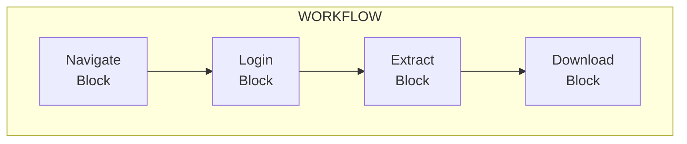
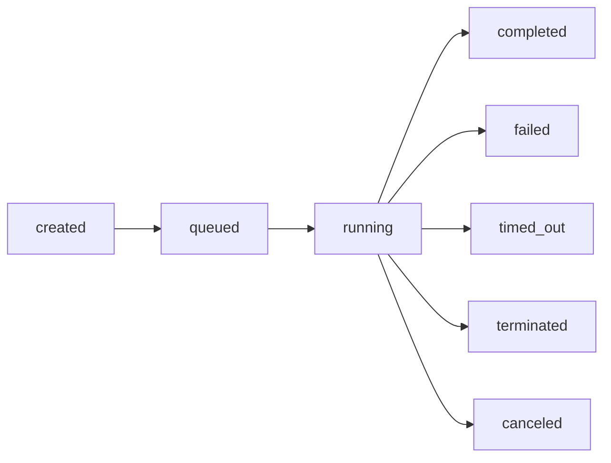
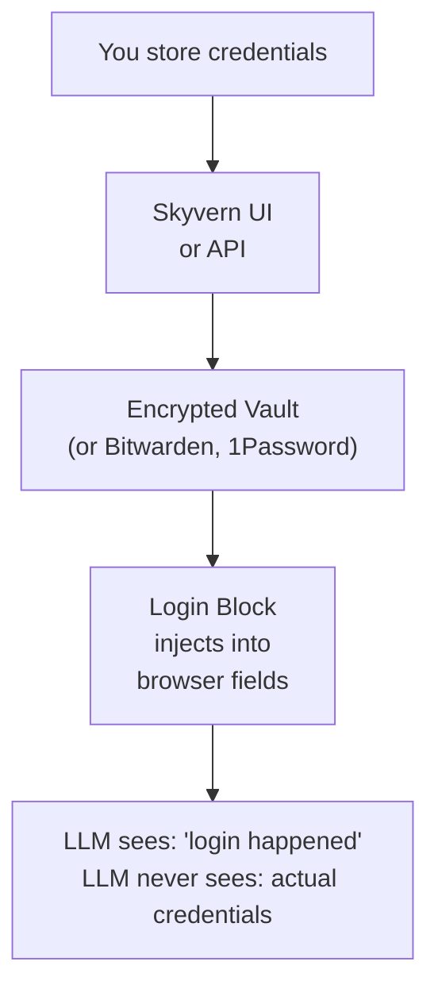
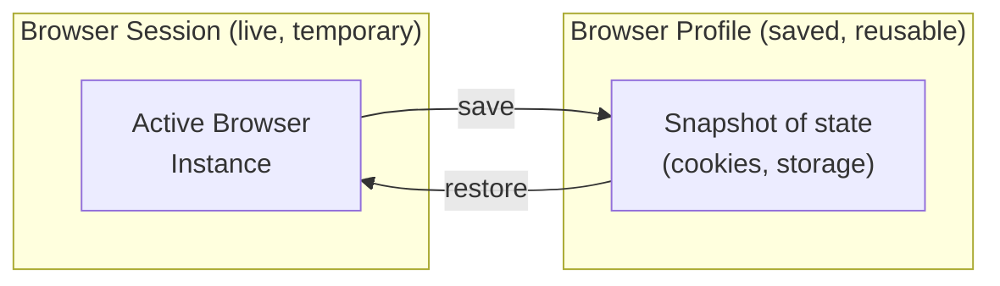

Skyvern has nine core concepts. Master these and you can build any browser automation.

---

## Tasks

A **Task** is a single automation job. You provide a prompt describing the goal, and Skyvern navigates the browser to complete it.

```python
from skyvern import Skyvern

skyvern = Skyvern(api_key="YOUR_API_KEY")

result = await skyvern.run_task(
    prompt="Find the top 3 posts on the front page",
    url="https://news.ycombinator.com",
    data_extraction_schema={
        "type": "object",
        "properties": {
            "posts": {
                "type": "array",
                "items": {"type": "string"}
            }
        }
    }
)

print(result.output)  # {"posts": ["Post 1", "Post 2", "Post 3"]}
```

**Key properties:**

| Property | Description |
|----------|-------------|
| `prompt` | Natural language description of the goal (required) |
| `url` | Starting URL for the task |
| `data_extraction_schema` | JSON Schema defining expected output structure |
| `max_steps` | Maximum steps allowed (controls cost) |
| `engine` | AI model to use (see [Engines](#engines) below) |
| `browser_session_id` | Run in an existing browser session |
| `webhook_url` | Callback URL for async completion |

**Use Tasks for:** one-off automations, quick data extraction, prototyping.

When a single task isn't enough, you have two options for multi-step work:

<CardGroup cols={2}>
  <Card
    title="Browser Automation (Code)"
    icon="code"
    href="#browser-automation"
  >
    Write multi-step automations in Python or TypeScript with full Playwright control. Best for developers who want to version, test, and deploy automation code.
  </Card>
  <Card
    title="Workflows (Visual)"
    icon="window-maximize"
    href="#workflows"
  >
    Build multi-step automations visually in the Cloud UI with drag-and-drop blocks. No code required. Best for reusable templates shared across your team.
  </Card>
</CardGroup>

---

## Browser Automation

**Browser Automation** is multi-step automation in code. Skyvern SDK connects to a cloud Chromium instance over CDP, layers Playwright on top, and injects AI into every page. Three layers, from innermost to outermost:

### Page

A **Page** wraps a Playwright page with AI. Standard calls (`goto`, `click("#id")`, `fill`) work as-is. AI actions work without selectors - Skyvern screenshots the page and decides what to interact with from your prompt.

```python
# AI actions - no selectors needed
await page.act("Click the login button")
data = await page.extract("Extract all product names and prices")
is_ok = await page.validate("The cart has 3 items")

# AI-enhanced Playwright - try selector first, fall back to AI
await page.click("#checkout", prompt="Click the checkout button")
await page.fill("#email", value="user@example.com", prompt="Fill the email field")
```

**Use Pages for:** direct page interaction. Selectors are fast and deterministic; AI prompts survive layout changes. Combine both.

### Agent

An **Agent** runs complete multi-step AI tasks inside a page you already have open. It reuses the current page with its cookies, login state, and navigation history. You control when to hand off to the agent and when to take back control.

```python
browser = await skyvern.launch_cloud_browser()
page = await browser.get_working_page()

await page.goto("https://app.example.com")
await page.agent.login(credential_type="skyvern", credential_id="cred_123")

# Page is now logged in - hand off a complex goal to the agent
result = await page.agent.run_task(
    "Go to billing, download the latest invoice"
)

# Or run a workflow you built in the Cloud UI
await page.agent.run_workflow("wpid_monthly_report")

await browser.close()
```

**Use Agents for:** multi-step goals within a single browser session. Login then extract. Chain multiple tasks. Mix agent calls with direct Playwright operations.

### Browser

A **Browser** is a cloud Chromium instance with a Playwright context. Cookies, storage, and auth state persist across every page you open inside it.

```python
browser = await skyvern.launch_cloud_browser()
page = await browser.get_working_page()

await page.goto("https://example.com")
# ... do work across multiple pages ...

await browser.close()
```

**Use Browsers for:** every code-based automation starts here. One browser per run. All pages share the same session state.

<Note>
**Full method reference:** [Page](/sdk-reference/browser-automation/act), [Agent](/sdk-reference/browser-automation/agent-run-task), [Browser](/sdk-reference/browser-automation/launch-cloud-browser).

**Developer guide:** [Multi-Step Automations](/multi-step-automations/overview).
</Note>

---

## Workflows

A **Workflow** is a reusable automation template built in the [Cloud UI workflow editor](/cloud/building-workflows/build-a-workflow). You drag and drop blocks onto a canvas, wire them together, and save. Workflows can be versioned, shared across your team, scheduled on a cron, and run repeatedly with different parameters.



> **Parameters:** `{{search_query}}`, `{{max_price}}`
> Each block can reference outputs from previous blocks.

Run a workflow you built in the UI from code:

```python
result = await skyvern.run_workflow(
    workflow_id="wpid_abc123",
    parameters={
        "search_query": "wireless headphones",
        "max_price": 100
    }
)

print(result.output)
```

Workflows support Jinja templating:
- Reference parameters: `{{search_query}}`
- Reference previous block outputs: `{{extract_block.product_name}}`

**Use Workflows for:** no-code automation, team-shared templates, scheduled recurring jobs, visual drag-and-drop logic.

<Tip>
**Building workflows?** See the [Workflow Editor guide](/cloud/building-workflows/build-a-workflow) for step-by-step instructions.

**Running workflows from code?** See [Running Workflows](/multi-step-automations/build-a-workflow) in the developer docs.
</Tip>

### Blocks

Blocks are the building units of workflows. Each block performs one operation in the visual editor.

**Navigation & Interaction:**

| Block | Purpose |
|-------|---------|
| **Navigation** | AI-guided navigation toward a goal |
| **Action** | Perform a single specific action (click, type, select, upload) |
| **Go to URL** | Navigate directly to a specific URL |
| **Login** | Authenticate using stored credentials |
| **Wait** | Pause execution for a specified duration |
| **Human Interaction** | Pause for manual intervention (CAPTCHA, approval, etc.) |

**Data & Files:**

| Block | Purpose |
|-------|---------|
| **Extract** | Pull structured data from a page into JSON |
| **File Download** | Download files from websites |
| **File Upload** | Upload files to form fields |
| **File Parser** | Process PDFs, CSVs, and Excel files |
| **PDF Parser** | Specialized PDF text extraction |

**Logic & Control Flow:**

| Block | Purpose |
|-------|---------|
| **Conditional** | Branch workflow based on conditions (if/else) |
| **For Loop** | Repeat a sequence of blocks over a list |
| **Validation** | Assert conditions; halt workflow on failure |
| **Code** | Execute custom Python/Playwright scripts |

**Communication & Integration:**

| Block | Purpose |
|-------|---------|
| **HTTP Request** | Make API calls to external services |
| **Text Prompt** | Text-only LLM prompt (no browser interaction) |
| **Send Email** | Send email messages |

For detailed block configuration, see [Block Types and Configuration](/cloud/building-workflows/configure-blocks).

---

## Runs

Every time you execute a task or workflow, Skyvern creates a **Run** to track progress and store outputs.



```python
result = await skyvern.run_task(
    prompt="Extract the main heading",
    url="https://example.com"
)

print(result.run_id)   # "tsk_abc123"
print(result.status)   # "completed"
print(result.output)   # {"heading": "Welcome"}
```

**Run identifiers:**
- Task runs: `tsk_*` prefix
- Workflow runs: `wr_*` prefix

**Run response fields:**

| Field | Description |
|-------|-------------|
| `run_id` | Unique identifier |
| `status` | Current lifecycle state |
| `output` | Extracted data (matches your schema) |
| `recording_url` | Video of the execution |
| `screenshot_urls` | Screenshots captured during execution |
| `downloaded_files` | Files retrieved (with URLs and checksums) |
| `failure_reason` | Error details if failed |
| `step_count` | Number of steps taken |

<Warning>
**Billing:** You're billed per step. A step is one AI decision + action cycle. Use `max_steps` to cap costs during development.
</Warning>

---

## Schedules

A **Schedule** runs a workflow automatically on a recurring basis. You define a cron expression and timezone, and Skyvern triggers the workflow at each interval.

<CodeGroup>
```python Python
result = await client.agent.create_workflow_schedule(
    workflow_permanent_id="wpid_abc123",
    cron_expression="0 9 * * 1-5",  # Weekdays at 9 AM
    timezone="America/New_York",
    parameters={
        "url": "https://example.com/dashboard"
    }
)
```

```typescript TypeScript
const result = await skyvern.agent.createWorkflowSchedule("wpid_abc123", {
  cron_expression: "0 9 * * 1-5", // Weekdays at 9 AM
  timezone: "America/New_York",
  parameters: {
    url: "https://example.com/dashboard",
  },
});
```
</CodeGroup>

**Key properties:**

| Property | Description |
|----------|-------------|
| `cron_expression` | 5-field cron expression defining the recurrence (minimum 5-minute interval) |
| `timezone` | IANA timezone identifier (e.g., `America/New_York`) |
| `parameters` | Workflow parameters passed to each scheduled run |
| `enabled` | `true` (active) or `false` (paused) |

**Use Schedules for:** recurring data extraction, periodic report generation, daily monitoring tasks, any workflow you want to run without manual intervention.

---

## Credentials

Credentials provide secure storage for authentication data. Skyvern encrypts credentials at rest and in transit, and injects them directly into the browser. Credentials are never sent to or seen by the LLM.



**Supported credential types:**
- Usernames and passwords
- TOTP codes (authenticator apps)
- Credit cards

**Credential sources:**
- **Skyvern** - Native encrypted storage
- **Bitwarden** - Sync from your Bitwarden vault
- **1Password** - Sync from your 1Password vault
- **Azure Key Vault** - Enterprise secret management

See [Credentials](/sdk-reference/credentials/create-credential) for setup instructions.

---

## Browser Sessions & Profiles

Skyvern offers two ways to manage browser state across runs:



| | Browser Session | Browser Profile |
|---|---|---|
| **Lifetime** | Expires after timeout (max 24h) | Persists indefinitely |
| **Use case** | Real-time task chaining | Skip login on repeated runs |
| **Sharing** | Single use | Shared across team |

### Browser Sessions

A live browser instance that maintains state across multiple tasks. Use sessions when you need to chain tasks in real-time or allow human intervention.

```python
# Create a session (default: 60 minutes, max: 24 hours)
session = await skyvern.create_browser_session(timeout=120)

# Run tasks in the same session
await skyvern.run_task(
    prompt="Log in with the test account",
    url="https://example.com/login",
    browser_session_id=session.browser_session_id
)

# Second task reuses the authenticated state
await skyvern.run_task(
    prompt="Extract the account balance",
    url="https://example.com/dashboard",
    browser_session_id=session.browser_session_id
)

# Clean up
await skyvern.close_browser_session(
    browser_session_id=session.browser_session_id
)
```

**Session limits:** 5 to 1,440 minutes (24 hours max). Default: 60 minutes.

### Browser Profiles

A saved snapshot of browser state. Unlike sessions, profiles persist indefinitely and can be reused across days or weeks - perfect for skipping login on repeated runs.

```python
# Create a profile from a completed run
profile = await skyvern.create_browser_profile(
    name="my-authenticated-profile",
    workflow_run_id=run.run_id
)

# Future runs restore the authenticated state
await skyvern.run_workflow(
    workflow_id="wpid_extract_data",
    browser_profile_id=profile.browser_profile_id
)
```

**What's saved:** Cookies, authentication tokens, local storage, session storage.

See [Browser Sessions](/optimization/browser-sessions) for details.

---

## Artifacts

Every run generates artifacts for observability, debugging, and audit trails.

```python
result = await skyvern.run_task(
    prompt="Download the quarterly report",
    url="https://example.com"
)

print(result.recording_url)      # Full video of execution
print(result.screenshot_urls)    # List of screenshot URLs
print(result.downloaded_files)   # [{"url": "...", "checksum": "..."}]
```

| Artifact | Description |
|----------|-------------|
| **Recordings** | End-to-end video of the entire run |
| **Screenshots** | Captured after each action |
| **Downloaded files** | Files retrieved during execution |
| **Logs** | JSON-structured logs at step, task, and workflow levels |
| **HAR files** | HTTP Archive data for network debugging |

In the Skyvern UI, go to **Runs** > click a run > view the **Actions** and **Recording** tabs.

---

## Engines

Skyvern supports multiple AI engines for task execution:

| Engine | Description |
|--------|-------------|
| `skyvern-2.0` | Latest Skyvern model (default, recommended) |
| `skyvern-1.0` | Previous Skyvern model |
| `openai-cua` | OpenAI Computer Use Agent |
| `anthropic-cua` | Anthropic Computer Use Agent |
| `ui-tars` | UI-TARS model |

Specify the engine when running a task:

```python
from skyvern.schemas.runs import RunEngine

result = await skyvern.run_task(
    prompt="Extract pricing data",
    url="https://example.com",
    engine=RunEngine.skyvern_v2
)
```

---

## Quick Reference

| I want to... | Use |
|--------------|-----|
| Run a one-off automation | [Task](#tasks) |
| Build multi-step automation in code | [Browser Automation](#browser-automation) |
| Build multi-step automation visually | [Workflow](#workflows) |
| Run a UI-built workflow from code | [`run_workflow`](/sdk-reference/workflows/run-workflow) |
| Keep a browser open between tasks | [Browser Session](#browser-sessions) |
| Skip login on repeated runs | [Browser Profile](#browser-profiles) |
| Store secrets securely | [Credentials](#credentials) |
| Debug a failed run | [Artifacts](#artifacts) |

---

## Choose your path

<CardGroup cols={2}>
  <Card
    title="Use the dashboard"
    icon="window-maximize"
    href="/cloud/getting-started/overview"
  >
    Run tasks, build workflows visually, and monitor runs - no code required.
  </Card>
  <Card
    title="Build with the API"
    icon="code"
    href="/getting-started/quickstart"
  >
    Integrate Skyvern into your product with Python, TypeScript, or REST.
  </Card>
</CardGroup>

<CardGroup cols={2}>
  <Card
    title="AI Agents Quickstart"
    icon="robot"
    href="/getting-started/ai-agents-quickstart"
  >
    Give Claude Code, Cursor, or Windsurf full browser automation via MCP.
  </Card>
  <Card
    title="Self-host Skyvern"
    icon="server"
    href="/self-hosted/overview"
  >
    Deploy on your own infrastructure with your own LLM keys.
  </Card>
</CardGroup>
