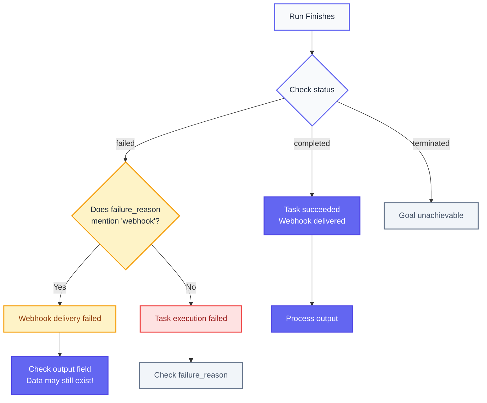

Workflows and task runs are asynchronous. When you call `run_task` or `run_workflow`, the API returns immediately with a run ID, but the actual execution happens in the background and can take variable time.

Instead of polling the `get_runs` endpoint, you can use Webhooks to get notified when they finish.

This page covers setting them up, explains payload structure, signature verification, and handling delivery failures.

---

## Step 1: Set webhook URL

### For tasks
<CodeGroup>
```python Python
result = await client.run_task(
    prompt="Get the price of this product",
    url="https://example.com/product/123",
    webhook_url="https://your-server.com/webhook",
)
```

```typescript TypeScript
const result = await client.runTask({
  body: {
    prompt: "Get the price of this product",
    url: "https://example.com/product/123",
    webhook_url: "https://your-server.com/webhook",
  },
});
```

```bash cURL
curl -X POST "https://api.skyvern.com/v1/run/tasks" \
  -H "x-api-key: $SKYVERN_API_KEY" \
  -H "Content-Type: application/json" \
  -d '{
    "prompt": "Get the price of this product",
    "url": "https://example.com/product/123",
    "webhook_url": "https://your-server.com/webhook"
  }'
```
</CodeGroup>

### For workflows
Set a default webhook when creating the workflow, or override it per-run:

<CodeGroup>
```python Python
# Set default on workflow (webhook_callback_url goes inside json_definition)
workflow = await client.create_workflow(
    json_definition={
        "title": "Invoice Downloader",
        "webhook_callback_url": "https://your-server.com/webhook",
        "workflow_definition": {
            "parameters": [],
            "blocks": [
                {
                    "block_type": "task",
                    "label": "download_invoice",
                    "url": "https://vendor-portal.example.com",
                    "prompt": "Download the latest invoice"
                }
            ]
        }
    }
)

# Override for a specific run
run = await client.run_workflow(
    workflow_id=workflow.workflow_permanent_id,
    parameters={},
    webhook_url="https://your-server.com/different-webhook"
)
```

```typescript TypeScript
// Set default on workflow (webhook_callback_url goes inside json_definition)
const workflow = await client.createWorkflow({
  body: {
    json_definition: {
      title: "Invoice Downloader",
      webhook_callback_url: "https://your-server.com/webhook",
      workflow_definition: {
        parameters: [],
        blocks: [
          {
            block_type: "task",
            label: "download_invoice",
            url: "https://vendor-portal.example.com",
            prompt: "Download the latest invoice",
          },
        ],
      },
    },
  },
});

// Override for a specific run
const run = await client.runWorkflow({
  body: {
    workflow_id: workflow.workflow_permanent_id,
    parameters: {},
    webhook_url: "https://your-server.com/different-webhook",
  },
});
```

```bash cURL
# Set default on workflow (webhook_callback_url goes inside json_definition)
curl -X POST "https://api.skyvern.com/v1/workflows" \
  -H "x-api-key: $SKYVERN_API_KEY" \
  -H "Content-Type: application/json" \
  -d '{
    "json_definition": {
      "title": "Invoice Downloader",
      "webhook_callback_url": "https://your-server.com/webhook",
      "workflow_definition": {
        "parameters": [],
        "blocks": [
          {
            "block_type": "task",
            "label": "download_invoice",
            "url": "https://vendor-portal.example.com",
            "prompt": "Download the latest invoice"
          }
        ]
      }
    }
  }'

# Override for a specific run (use workflow_permanent_id from create response)
curl -X POST "https://api.skyvern.com/v1/run/workflows" \
  -H "x-api-key: $SKYVERN_API_KEY" \
  -H "Content-Type: application/json" \
  -d '{
    "workflow_id": "wpid_123456789",
    "parameters": {},
    "webhook_url": "https://your-server.com/different-webhook"
  }'
```
</CodeGroup>

<Info>
When creating a workflow, use `webhook_callback_url` inside `json_definition` — this sets the default for all runs. When running a workflow, use `webhook_url` at the top level to override for that specific run.
</Info>

**Quick reference:**

| Context | Parameter | Location |
|---------|-----------|----------|
| Task run | `webhook_url` | Top-level parameter |
| Workflow creation | `webhook_callback_url` | Inside `json_definition` |
| Workflow run (override) | `webhook_url` | Top-level parameter |

<Warning>
**Watch the parameter names.** Using `webhook_url` when creating a workflow (instead of `webhook_callback_url` inside `json_definition`) silently results in no webhook being sent. The API won't return an error—your runs will just complete without notifications.
</Warning>

---

## Step 2: Understand the payload

Skyvern sends a JSON payload with run results. Here's a real example from a completed task:

**Webhook Payload:**
```json
{
  "run_id": "tsk_v2_490440779503357994",
  "task_id": "tsk_v2_490440779503357994",
  "status": "completed",
  "output": {
    "top_post_title": "Antirender: remove the glossy shine on architectural renderings"
  },
  "summary": "I have successfully retrieved the title of the top post from the Hacker News homepage.",
  "prompt": "Get the title of the top post on Hacker News",
  "url": "https://news.ycombinator.com/",
  "downloaded_files": [],
  "recording_url": "https://skyvern-artifacts.s3.amazonaws.com/v1/production/o_485917350850524254/tsk_490440844256003946/.../recording.webm?AWSAccessKeyId=...&Signature=...&Expires=...",
  "screenshot_urls": ["https://skyvern-artifacts.s3.amazonaws.com/v1/production/o_485917350850524254/tsk_490441394011816060/.../screenshot_final.png?AWSAccessKeyId=..."],
  "failure_reason": null,
  "errors": [],
  "step_count": 4,
  "run_type": "task_v2",
  "app_url": "https://app.skyvern.com/runs/wr_490440779503358000",
  "organization_id": "o_485917350850524254",
  "workflow_run_id": "wr_490440779503358000",
  "workflow_id": "w_490440779503357996",
  "workflow_permanent_id": "wpid_490440779503357998",
  "proxy_location": "RESIDENTIAL",
  "webhook_callback_url": "https://webhook.site/d8d013c1-0481-48d0-8d13-281e8563a508",
  "webhook_failure_reason": null,
  "created_at": "2026-01-31T15:20:42.160725",
  "modified_at": "2026-01-31T15:23:34.993138",
  "queued_at": "2026-01-31T15:20:42.371545",
  "started_at": "2026-01-31T15:20:44.391756",
  "finished_at": "2026-01-31T15:23:34.992815"
}
```

**Request Headers Sent:**
```http
POST /d8d013c1-0481-48d0-8d13-281e8563a508 HTTP/1.1
Host: webhook.site
Content-Type: application/json
x-skyvern-signature: 024025ccf0bbfe1c8978bdaae43fc136fc8b614b92e2f63c3485be5a36866f68
x-skyvern-timestamp: 1769873016
Content-Length: 8208
User-Agent: python-httpx/0.28.1

{...json payload above...}
```

| Field | Type | Description |
|-------|------|-------------|
| `run_id` | string | Unique identifier for this run |
| `task_id` | string | Same as `run_id` |
| `status` | string | `completed`, `failed`, `terminated`, `timed_out`, or `canceled` |
| `output` | object \| null | Extracted data from the task. If you configured [`error_code_mapping`](/going-to-production/error-handling#step-3-use-error_code_mapping), failed runs include `output.error` with your custom error code. |
| `summary` | string | AI-generated description of what was done |
| `prompt` | string | The prompt from the original request |
| `url` | string | The URL from the original request |
| `downloaded_files` | array | Files downloaded during execution |
| `recording_url` | string \| null | Video recording of the browser session |
| `screenshot_urls` | array \| null | Screenshots captured (latest first) |
| `failure_reason` | string \| null | Error message if the run failed |
| `errors` | array | List of errors encountered |
| `step_count` | integer \| null | Number of steps executed |
| `run_type` | string | Type of run: `task_v2`, `openai_cua`, `anthropic_cua` |
| `app_url` | string | Link to view this run in Skyvern Cloud |
| `organization_id` | string | Your organization ID |
| `workflow_run_id` | string | Associated workflow run ID |
| `workflow_id` | string | Internal workflow ID |
| `workflow_permanent_id` | string | Permanent workflow ID used to run the workflow |
| `proxy_location` | string | Proxy location used (e.g., `RESIDENTIAL`) |
| `webhook_callback_url` | string | The webhook URL that received this payload |
| `webhook_failure_reason` | string \| null | Error message if a previous webhook delivery failed (always `null` in the payload you receive) |
| `created_at` | datetime | When the run was created |
| `modified_at` | datetime | When the run was last updated |
| `queued_at` | datetime \| null | When the run entered the queue |
| `started_at` | datetime \| null | When execution began |
| `finished_at` | datetime \| null | When execution completed |

---

## Optional: Verify webhook signatures

Skyvern signs every webhook with your API key using HMAC-SHA256, so you can verify the request actually came from Skyvern before acting on it.

**Headers sent with every webhook:**
- `x-skyvern-signature` — HMAC-SHA256 signature of the payload
- `x-skyvern-timestamp` — Unix timestamp when the webhook was sent
- `Content-Type: application/json`

<CodeGroup>
```python Python
import hmac
import hashlib
from fastapi import Request, HTTPException

async def handle_webhook(request: Request):
    signature = request.headers.get("x-skyvern-signature")
    payload = await request.body()

    expected = hmac.new(
        SKYVERN_API_KEY.encode("utf-8"),
        msg=payload,
        digestmod=hashlib.sha256
    ).hexdigest()

    if not hmac.compare_digest(signature, expected):
        raise HTTPException(status_code=401, detail="Invalid signature")

    data = await request.json()
    # Process the webhook...
```

```typescript TypeScript
import crypto from "crypto";
import express from "express";

app.post("/webhook", express.raw({ type: "application/json" }), (req, res) => {
  const signature = req.headers["x-skyvern-signature"];
  const payload = req.body;

  const expected = crypto
    .createHmac("sha256", process.env.SKYVERN_API_KEY)
    .update(payload)
    .digest("hex");

  // Use timing-safe comparison to prevent timing attacks
  let valid = false;
  try {
    crypto.timingSafeEqual(
      Buffer.from(signature || ''),
      Buffer.from(expected)
    );
    valid = true;
  } catch (err) {
    valid = false;
  }

  if (!valid) {
    return res.status(401).send("Invalid signature");
  }

  const data = JSON.parse(payload);
  // Process the webhook...
  res.status(200).send("OK");
});
```

```go Go
package main

import (
    "crypto/hmac"
    "crypto/sha256"
    "encoding/hex"
    "io"
    "net/http"
    "os"
)

func webhookHandler(w http.ResponseWriter, r *http.Request) {
    signature := r.Header.Get("x-skyvern-signature")
    payload, err := io.ReadAll(r.Body)
    if err != nil {
        http.Error(w, "Failed to read request body", http.StatusBadRequest)
        return
    }

    mac := hmac.New(sha256.New, []byte(os.Getenv("SKYVERN_API_KEY")))
    mac.Write(payload)
    expected := hex.EncodeToString(mac.Sum(nil))

    if !hmac.Equal([]byte(signature), []byte(expected)) {
        http.Error(w, "Invalid signature", http.StatusUnauthorized)
        return
    }

    // Process the webhook...
    w.WriteHeader(http.StatusOK)
}
```
</CodeGroup>


<Note>
**Use constant-time comparison** to prevent timing attacks:
- Python: `hmac.compare_digest()`
- TypeScript: `crypto.timingSafeEqual()`
- Go: `hmac.Equal()`

Never use simple equality operators (`==` or `===`) for signature comparison as they are vulnerable to timing attacks.
</Note>

<Warning>
**Always validate against the raw request body bytes.** Skyvern normalizes JSON before signing: it removes whitespace (using compact separators) and converts whole-number floats to integers (`3.0` becomes `3`). If you parse the JSON and re-serialize it, the byte representation will differ and signature validation will fail.
</Warning>

---

## Handling webhook failures

Task execution and webhook delivery are independent—a task can succeed while webhook delivery fails. When this happens, the run shows `status: "failed"` even though your data was extracted successfully.



Webhook delivery can fail due to network issues, server errors, or misconfigured URLs.

When this happens, the run is marked as `failed` and the error is recorded in the `failure_reason` field. Check it by calling `get_run` after the run terminates:

<CodeGroup>
```python Python
run = await client.get_run(run_id)

if run.status == "failed" and "webhook" in (run.failure_reason or "").lower():
    print(f"Webhook failed: {run.failure_reason}")
    # The task may have completed successfully before webhook delivery failed
    # Output data is still available
    if run.output:
        process_output(run.output)
```

```typescript TypeScript
const run = await client.getRun(runId);

if (run.status === "failed" && run.failure_reason?.toLowerCase().includes("webhook")) {
  console.log(`Webhook failed: ${run.failure_reason}`);
  // The task may have completed successfully before webhook delivery failed
  // Output data is still available
  if (run.output) {
    processOutput(run.output);
  }
}
```

```bash cURL
curl -X GET "https://api.skyvern.com/v1/runs/$RUN_ID" \
  -H "x-api-key: $SKYVERN_API_KEY"

# Check status and failure_reason fields in response
```
</CodeGroup>

The `failure_reason` field contains the specific error message, for example:

```json
{
  "run_id": "tsk_v2_486305187432193504",
  "status": "failed",
  "output": {"price": "$29.99"},
  "failure_reason": "Failed to run task 2.0: Failed to send webhook.    task_v2_id=tsk_v2_486305187432193504"
}
```

<Note>
Even when webhook delivery fails, the task's `output` field may still contain extracted data if the browser automation completed successfully before the webhook attempt.
</Note>

**Common reasons webhooks fail:**

- **Server unreachable** — Your server is down, behind a firewall, or the URL is incorrect. Verify the URL is publicly accessible (not `localhost`) and check your server logs for incoming requests.
- **Timeout** — Skyvern waits 10 seconds for a response. If your server takes longer, the delivery is marked as failed even if processing eventually succeeds. Return `200 OK` immediately and process the payload in a background job.
- **Server returns an error** — Your endpoint received the payload but responded with a non-2xx status code (e.g., 500). Check your server logs to identify the issue.
- **Signature validation fails** — If your verification logic rejects the request, make sure you're validating against the raw request body, not parsed-and-re-serialized JSON (re-serializing changes the byte representation). Also verify you're using the same API key that created the run.

**Recommended pattern:** Always have a fallback polling mechanism for critical workflows. If you don't receive a webhook within your expected window, call `get_run` to check if the run completed and retrieve the data directly.

### Retrying webhooks

Once you've identified and fixed the issue, you can replay the webhook using `retry_run_webhook`.

<Note>
Skyvern does not automatically retry failed webhooks. This is intentional—automatic retries can cause duplicate processing if your server received the payload but returned an error. You must explicitly call `retry_run_webhook` after fixing the issue.
</Note>

<CodeGroup>
```python Python
from skyvern.client import RetryRunWebhookRequest

await client.retry_run_webhook("tsk_v2_486305187432193504")

# Or send to a different URL
await client.retry_run_webhook(
    "tsk_v2_486305187432193504",
    request=RetryRunWebhookRequest(webhook_url="https://your-server.com/new-webhook")
)
```

```typescript TypeScript
await client.retryRunWebhook("tsk_v2_486305187432193504");

// Or send to a different URL
await client.retryRunWebhook("tsk_v2_486305187432193504", {
  webhook_url: "https://your-server.com/new-webhook",
});
```

```bash cURL
curl -X POST "https://api.skyvern.com/v1/runs/tsk_v2_486305187432193504/retry_webhook" \
  -H "x-api-key: $SKYVERN_API_KEY" \
  -H "Content-Type: application/json" \
  -d '{}'

# Or send to a different URL
curl -X POST "https://api.skyvern.com/v1/runs/tsk_v2_486305187432193504/retry_webhook" \
  -H "x-api-key: $SKYVERN_API_KEY" \
  -H "Content-Type: application/json" \
  -d '{"webhook_url": "https://your-server.com/new-webhook"}'
```
</CodeGroup>

<Warning>
`retry_run_webhook` is fire-and-forget—it returns immediately without waiting for delivery confirmation. To verify success, monitor your webhook endpoint directly or check the run's `failure_reason` field after a short delay.
</Warning>

<Tip>
**Implement idempotency.** If you call `retry_run_webhook`, you may receive the same payload twice (once from the original attempt that your server processed but returned an error, and once from the retry). Use the `run_id` as an idempotency key—check if you've already processed this run before taking action.
</Tip>

You can pass a different `webhook_url` to send the payload to a new endpoint—useful if the original URL was misconfigured.

---

## Next steps

<CardGroup cols={2}>
  <Card
    title="Error Handling"
    icon="triangle-exclamation"
    href="/going-to-production/error-handling"
  >
    Handle failures and map custom error codes
  </Card>
  <Card
    title="Reliability Tips"
    icon="shield-check"
    href="/going-to-production/reliability-tips"
  >
    Write robust prompts and add validation blocks
  </Card>
</CardGroup>
