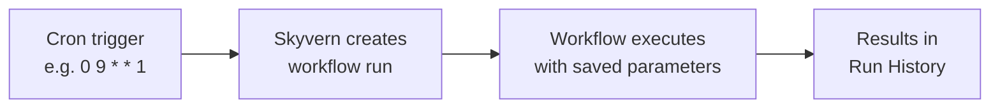

Schedules let you run any workflow automatically on a recurring basis.

Define a cron expression and timezone, and Skyvern triggers the workflow at each interval.

Scheduled runs appear in your run history with `trigger_type: "scheduled"` so you can distinguish them from manual or API-triggered runs.

---

## How schedules work

A schedule links a **cron expression** and a **timezone** to a workflow. At each scheduled time, Skyvern creates a new workflow run with the parameters you configured when creating the schedule.



Each scheduled run is identical to a manually triggered run — same blocks, same parameters, same outputs. The only difference is the `trigger_type` field, which is set to `"scheduled"` instead of `"manual"` or `"api"`.

---

## Cron expression format

Schedules use standard 5-field cron expressions:

```
┌───────── minute (0-59)
│ ┌─────── hour (0-23)
│ │ ┌───── day of month (1-31)
│ │ │ ┌─── month (1-12)
│ │ │ │ ┌─ day of week (0-6, Sun=0)
│ │ │ │ │
* * * * *
```

**Common patterns:**

| Cron expression | Description |
|----------------|-------------|
| `0 9 * * 1-5` | Every weekday at 9:00 AM |
| `0 */6 * * *` | Every 6 hours |
| `0 9 * * 1` | Every Monday at 9:00 AM |
| `0 0 1 * *` | First day of every month at midnight |
| `*/30 * * * *` | Every 30 minutes |
| `0 8,17 * * *` | Twice daily at 8:00 AM and 5:00 PM |

<Warning>
The minimum interval is **5 minutes**. Cron expressions that resolve to intervals shorter than 5 minutes return a validation error:

```json
{
  "detail": "Cron interval must be at least 5 minutes"
}
```

Invalid cron syntax returns `"Invalid cron expression"`.
</Warning>

### Timezone handling

Schedules use [IANA timezone identifiers](https://en.wikipedia.org/wiki/List_of_tz_database_time_zones) (e.g., `America/New_York`, `Europe/London`, `Asia/Tokyo`). If you don't specify a timezone, it defaults to **UTC**.

---

## Create a schedule

Send a `POST` request to `/api/v1/workflows/{workflow_permanent_id}/schedules` with your cron expression and timezone.

<CodeGroup>
```python Python
import os
import asyncio
from skyvern import Skyvern

async def main():
    client = Skyvern(api_key=os.getenv("SKYVERN_API_KEY"))

    result = await client.agent.create_workflow_schedule(
        workflow_permanent_id="wpid_123456789",
        cron_expression="0 9 * * 1-5",
        timezone="America/New_York",
        name="Weekday morning report",
        description="Runs the data extraction workflow every weekday at 9 AM ET",
        parameters={
            "url": "https://example.com/dashboard",
            "output_format": "csv"
        }
    )

    print(f"Schedule ID: {result.schedule.workflow_schedule_id}")

asyncio.run(main())
```

```bash cURL
curl -X POST "https://api.skyvern.com/api/v1/workflows/wpid_123456789/schedules" \
  -H "x-api-key: $SKYVERN_API_KEY" \
  -H "Content-Type: application/json" \
  -d '{
    "cron_expression": "0 9 * * 1-5",
    "timezone": "America/New_York",
    "name": "Weekday morning report",
    "description": "Runs the data extraction workflow every weekday at 9 AM ET",
    "parameters": {
      "url": "https://example.com/dashboard",
      "output_format": "csv"
    }
  }'
```
</CodeGroup>

<Info>
All Python examples on this page assume you've initialized the client as shown above:

```python
client = Skyvern(api_key=os.getenv("SKYVERN_API_KEY"))
```
</Info>

### Request body

| Field | Type | Required | Description |
|-------|------|----------|-------------|
| `cron_expression` | string | Yes | 5-field cron expression (minimum 5-minute interval) |
| `timezone` | string | Yes | IANA timezone identifier (e.g., `America/New_York`) |
| `name` | string | No | Human-readable name for the schedule |
| `description` | string | No | Description of what this schedule does |
| `parameters` | object | No | Workflow parameters to pass on each run |
| `enabled` | boolean | No | Whether the schedule is active. Defaults to `true` |

### Example response

```json
{
  "schedule": {
    "workflow_schedule_id": "wfs_510037469402471882",
    "organization_id": "o_510009610576515030",
    "workflow_permanent_id": "wpid_510013188284271440",
    "cron_expression": "0 9 * * 1-5",
    "timezone": "America/New_York",
    "enabled": true,
    "parameters": null,
    "temporal_schedule_id": "wf-sched-wfs_510037469402471882",
    "name": "Weekday morning report",
    "description": "Runs the data extraction workflow every weekday at 9 AM ET",
    "created_at": "2026-03-25T10:45:52.193974",
    "modified_at": "2026-03-25T10:45:52.221999",
    "deleted_at": null
  },
  "next_runs": [
    "2026-03-25T13:00:00Z",
    "2026-03-26T13:00:00Z",
    "2026-03-27T13:00:00Z",
    "2026-03-30T13:00:00Z",
    "2026-03-31T13:00:00Z"
  ]
}
```

**Response fields:**

| Field | Type | Description |
|-------|------|-------------|
| `schedule.workflow_schedule_id` | string | Unique identifier for this schedule (prefixed `wfs_`) |
| `schedule.organization_id` | string | The organization that owns this schedule |
| `schedule.workflow_permanent_id` | string | The workflow this schedule triggers |
| `schedule.cron_expression` | string | The cron expression defining the recurrence |
| `schedule.timezone` | string | IANA timezone for the cron expression |
| `schedule.enabled` | boolean | Whether the schedule is active (`true`) or paused (`false`). Defaults to `true` on creation |
| `schedule.parameters` | object \| null | Workflow parameters passed to each run |
| `schedule.temporal_schedule_id` | string | Internal identifier used by the scheduling engine |
| `schedule.name` | string \| null | Human-readable name |
| `schedule.description` | string \| null | Description of the schedule |
| `schedule.created_at` | string | When the schedule was created |
| `schedule.modified_at` | string | When the schedule was last updated |
| `schedule.deleted_at` | string \| null | When the schedule was deleted, if applicable |
| `next_runs` | array | Upcoming execution times in UTC based on the cron expression and timezone |

Workflow runs triggered by this schedule will include `trigger_type: "scheduled"` and `workflow_schedule_id` pointing back to the schedule, so you can distinguish them from manual or API-triggered runs.

---

## List schedules

To list all schedules in your organization:

<CodeGroup>
```python Python
result = await client.agent.list_organization_schedules()

for schedule in result.schedules:
    status = "active" if schedule.enabled else "paused"
    print(f"{schedule.workflow_schedule_id}: {schedule.name} ({status})")
```

```bash cURL
curl -X GET "https://api.skyvern.com/api/v1/schedules" \
  -H "x-api-key: $SKYVERN_API_KEY"
```
</CodeGroup>

### Example response

```json
{
  "schedules": [
    {
      "workflow_schedule_id": "wfs_510037469402471882",
      "organization_id": "o_510009610576515030",
      "workflow_permanent_id": "wpid_510013188284271440",
      "workflow_title": "New Workflow",
      "cron_expression": "0 9 * * 1-5",
      "timezone": "America/New_York",
      "enabled": true,
      "parameters": null,
      "name": "Weekday morning report",
      "description": "Runs the data extraction workflow every weekday at 9 AM ET",
      "next_run": "2026-03-25T13:00:00Z",
      "created_at": "2026-03-25T10:45:52.193974",
      "modified_at": "2026-03-25T10:45:52.221999"
    }
  ],
  "total_count": 1,
  "page": 1,
  "page_size": 10
}
```

**Response fields:**

| Field | Type | Description |
|-------|------|-------------|
| `schedules` | array | List of schedule objects |
| `schedules[].workflow_schedule_id` | string | Schedule identifier |
| `schedules[].workflow_permanent_id` | string | The workflow this schedule triggers |
| `schedules[].workflow_title` | string | Title of the associated workflow |
| `schedules[].enabled` | boolean | Whether the schedule is active |
| `schedules[].next_run` | string | Next scheduled execution time in UTC |
| `total_count` | integer | Total number of schedules matching the query |
| `page` | integer | Current page number |
| `page_size` | integer | Number of results per page |

To list schedules for a specific workflow:

<CodeGroup>
```python Python
result = await client.agent.list_workflow_schedules(
    workflow_permanent_id="wpid_123456789"
)
```

```bash cURL
curl -X GET "https://api.skyvern.com/api/v1/workflows/wpid_123456789/schedules" \
  -H "x-api-key: $SKYVERN_API_KEY"
```
</CodeGroup>

---

## Get schedule details

Retrieve a single schedule, including upcoming run times in `next_runs`.

<CodeGroup>
```python Python
result = await client.agent.get_workflow_schedule(
    workflow_permanent_id="wpid_123456789",
    workflow_schedule_id="wfs_abc123"
)

print(f"Next runs: {result.next_runs}")
```

```bash cURL
curl -X GET "https://api.skyvern.com/api/v1/workflows/wpid_123456789/schedules/wfs_abc123" \
  -H "x-api-key: $SKYVERN_API_KEY"
```
</CodeGroup>

The response has the same shape as the [create response](#example-response) — a `schedule` object with a `next_runs` array.

---

## Update a schedule

Change the cron expression, timezone, name, description, or parameters.

<CodeGroup>
```python Python
result = await client.agent.update_workflow_schedule(
    workflow_permanent_id="wpid_123456789",
    workflow_schedule_id="wfs_abc123",
    cron_expression="0 8 * * 1-5",
    timezone="America/Chicago",
    name="Updated morning report",
    description="Updated description"
)
```

```bash cURL
curl -X PUT "https://api.skyvern.com/api/v1/workflows/wpid_123456789/schedules/wfs_abc123" \
  -H "x-api-key: $SKYVERN_API_KEY" \
  -H "Content-Type: application/json" \
  -d '{
    "cron_expression": "0 8 * * 1-5",
    "timezone": "America/Chicago",
    "name": "Updated morning report",
    "description": "Updated description"
  }'
```
</CodeGroup>

<Warning>
Updates **replace** all fields — any optional field you omit (like `description` or `parameters`) will be set to `null`. Re-send all fields you want to keep.
</Warning>

The response has the same shape as the [create response](#example-response).

---

## Enable and disable a schedule

You can pause a schedule by disabling it. Compared to deleting a schedule, this keeps its configuration saved to be re-enabled at any time.

<CodeGroup>
```python Python
# Disable
await client.agent.disable_workflow_schedule(
    workflow_permanent_id="wpid_123456789",
    workflow_schedule_id="wfs_abc123"
)

# Re-enable
await client.agent.enable_workflow_schedule(
    workflow_permanent_id="wpid_123456789",
    workflow_schedule_id="wfs_abc123"
)
```

```bash cURL
# Disable
curl -X POST "https://api.skyvern.com/api/v1/workflows/wpid_123456789/schedules/wfs_abc123/disable" \
  -H "x-api-key: $SKYVERN_API_KEY"

# Re-enable
curl -X POST "https://api.skyvern.com/api/v1/workflows/wpid_123456789/schedules/wfs_abc123/enable" \
  -H "x-api-key: $SKYVERN_API_KEY"
```
</CodeGroup>

Both endpoints return the same shape as the [create response](#example-response), with `enabled` set to `false` or `true`.

---

## Delete a schedule

Permanently remove a schedule. This cannot be undone. Runs that were already triggered by this schedule are not affected.

<CodeGroup>
```python Python
await client.agent.delete_workflow_schedule_route(
    workflow_permanent_id="wpid_123456789",
    workflow_schedule_id="wfs_abc123"
)
```

```bash cURL
curl -X DELETE "https://api.skyvern.com/api/v1/workflows/wpid_123456789/schedules/wfs_abc123" \
  -H "x-api-key: $SKYVERN_API_KEY"
```
</CodeGroup>

### Example response

```json
{
  "ok": true
}
```

---

## Limits

| | Self-hosted (OSS) | Skyvern Cloud |
|---|---|---|
| **Schedules per workflow** | Unlimited | Configurable per plan |
| **Total schedules per org** | Unlimited | Configurable per plan |
| **Minimum interval** | 5 minutes | 5 minutes |

---

## What's next

<CardGroup cols={2}>
  <Card
    title="Cloud UI: Scheduling"
    icon="calendar"
    href="/cloud/building-workflows/scheduling"
  >
    Create and manage schedules from the Skyvern dashboard
  </Card>
  <Card
    title="Cost Control"
    icon="gauge"
    href="/optimization/cost-control"
  >
    Set step limits and optimize scheduled workflow costs
  </Card>
  <Card
    title="Webhooks"
    icon="bell"
    href="/going-to-production/webhooks"
  >
    Get notified when scheduled runs complete
  </Card>
  <Card
    title="Run History"
    icon="clock-rotate-left"
    href="/cloud/viewing-results/run-history"
  >
    View and filter scheduled run results
  </Card>
</CardGroup>
