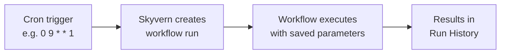

Schedules let you run any workflow automatically on a recurring basis. 

Define a cron expression and timezone, and Skyvern triggers the workflow at each interval.

Scheduled runs appear in your run history with `trigger_type: "scheduled"` so you can distinguish them from manual or API-triggered runs.

---

## How schedules work

A schedule links a **cron expression** and a **timezone** to a workflow. At each scheduled time, Skyvern creates a new workflow run with the parameters you configured when creating the schedule.



Each scheduled run is identical to a manually triggered run — same blocks, same parameters, same outputs. The only difference is the `trigger_type` field, which is set to `"scheduled"` instead of `"manual"` or `"api"`.

---

## Cron expression format

Schedules use standard 5-field cron expressions:

```
┌───────── minute (0-59)
│ ┌─────── hour (0-23)
│ │ ┌───── day of month (1-31)
│ │ │ ┌─── month (1-12)
│ │ │ │ ┌─ day of week (0-6, Sun=0)
│ │ │ │ │
* * * * *
```

**Common patterns:**

| Cron expression | Description |
|----------------|-------------|
| `0 9 * * 1-5` | Every weekday at 9:00 AM |
| `0 */6 * * *` | Every 6 hours |
| `0 9 * * 1` | Every Monday at 9:00 AM |
| `0 0 1 * *` | First day of every month at midnight |
| `*/30 * * * *` | Every 30 minutes |
| `0 8,17 * * *` | Twice daily at 8:00 AM and 5:00 PM |

<Warning>
The minimum interval is **5 minutes**. Cron expressions that resolve to intervals shorter than 5 minutes will be rejected.
</Warning>

### Timezone handling

Schedules use [IANA timezone identifiers](https://en.wikipedia.org/wiki/List_of_tz_database_time_zones) (e.g., `America/New_York`, `Europe/London`, `Asia/Tokyo`). If you don't specify a timezone, it defaults to **UTC**.

---

## Create a schedule

Send a `POST` request to `/workflows/{workflow_id}/schedules` with your cron expression and timezone.

<CodeGroup>
```python Python
import os
import asyncio
from skyvern import Skyvern

async def main():
    client = Skyvern(api_key=os.getenv("SKYVERN_API_KEY"))

    schedule = await client.create_schedule(
        workflow_id="wpid_123456789",
        cron_expression="0 9 * * 1-5",
        timezone="America/New_York",
        name="Weekday morning report",
        description="Runs the data extraction workflow every weekday at 9 AM ET",
        parameters={
            "url": "https://example.com/dashboard",
            "output_format": "csv"
        }
    )

    print(f"Schedule ID: {schedule.schedule_id}")

asyncio.run(main())
```

```typescript TypeScript
import { Skyvern } from "@skyvern/client";

const client = new Skyvern({ apiKey: process.env.SKYVERN_API_KEY! });

const schedule = await client.createSchedule({
  workflowId: "wpid_123456789",
  body: {
    cron_expression: "0 9 * * 1-5",
    timezone: "America/New_York",
    name: "Weekday morning report",
    description: "Runs the data extraction workflow every weekday at 9 AM ET",
    parameters: {
      url: "https://example.com/dashboard",
      output_format: "csv",
    },
  },
});

console.log(`Schedule ID: ${schedule.schedule_id}`);
```

```bash cURL
curl -X POST "https://api.skyvern.com/v1/workflows/wpid_123456789/schedules" \
  -H "x-api-key: $SKYVERN_API_KEY" \
  -H "Content-Type: application/json" \
  -d '{
    "cron_expression": "0 9 * * 1-5",
    "timezone": "America/New_York",
    "name": "Weekday morning report",
    "description": "Runs the data extraction workflow every weekday at 9 AM ET",
    "parameters": {
      "url": "https://example.com/dashboard",
      "output_format": "csv"
    }
  }'
```
</CodeGroup>

### Request body

| Field | Type | Required | Description |
|-------|------|----------|-------------|
| `cron_expression` | string | Yes | 5-field cron expression (minimum 5-minute interval) |
| `timezone` | string | No | IANA timezone identifier. Defaults to `UTC` |
| `name` | string | No | Human-readable name for the schedule |
| `description` | string | No | Description of what this schedule does |
| `parameters` | object | No | Workflow parameters to pass on each run |

### Example response

```json
{
  "schedule_id": "sched_abc123",
  "workflow_id": "wpid_123456789",
  "cron_expression": "0 9 * * 1-5",
  "timezone": "America/New_York",
  "name": "Weekday morning report",
  "description": "Runs the data extraction workflow every weekday at 9 AM ET",
  "parameters": {
    "url": "https://example.com/dashboard",
    "output_format": "csv"
  },
  "enabled": true,
  "next_runs": [
    "2026-03-25T09:00:00-04:00",
    "2026-03-26T09:00:00-04:00",
    "2026-03-27T09:00:00-04:00"
  ],
  "created_at": "2026-03-24T12:00:00.000000",
  "modified_at": "2026-03-24T12:00:00.000000"
}
```

**Response fields:**

| Field | Type | Description |
|-------|------|-------------|
| `schedule_id` | string | Unique identifier for this schedule |
| `workflow_id` | string | The workflow this schedule triggers |
| `cron_expression` | string | The cron expression defining the recurrence |
| `timezone` | string | IANA timezone for the cron expression |
| `name` | string \| null | Human-readable name |
| `description` | string \| null | Description of the schedule |
| `parameters` | object \| null | Workflow parameters passed to each run |
| `enabled` | boolean | Whether the schedule is active (`true`) or paused (`false`). Defaults to `true` on creation. |
| `next_runs` | array | Upcoming execution times based on the cron expression and timezone |
| `created_at` | datetime | When the schedule was created |
| `modified_at` | datetime | When the schedule was last updated |

Workflow runs triggered by this schedule will include `trigger_type: "scheduled"` and `workflow_schedule_id` pointing back to the schedule, so you can distinguish them from manual or API-triggered runs.

---

## List schedules

To list all schedules in your organization:

<CodeGroup>
```python Python
schedules = await client.list_schedules()

for schedule in schedules:
    print(f"{schedule.schedule_id}: {schedule.name} ({schedule.status})")
```

```typescript TypeScript
const schedules = await client.listSchedules();

for (const schedule of schedules) {
  console.log(`${schedule.schedule_id}: ${schedule.name} (${schedule.status})`);
}
```

```bash cURL
curl -X GET "https://api.skyvern.com/v1/schedules" \
  -H "x-api-key: $SKYVERN_API_KEY"
```
</CodeGroup>

To list all schedules for a specific workflow:

<CodeGroup>
```python Python
schedules = await client.list_workflow_schedules(
    workflow_id="wpid_123456789"
)
```

```typescript TypeScript
const schedules = await client.listWorkflowSchedules({
  workflowId: "wpid_123456789",
});
```

```bash cURL
curl -X GET "https://api.skyvern.com/v1/workflows/wpid_123456789/schedules" \
  -H "x-api-key: $SKYVERN_API_KEY"
```
</CodeGroup>

---

## Get schedule details

Retrieve a single schedule, including upcoming run times in `next_runs`.

<CodeGroup>
```python Python
schedule = await client.get_schedule(
    workflow_id="wpid_123456789",
    schedule_id="sched_abc123"
)

print(f"Next runs: {schedule.next_runs}")
```

```typescript TypeScript
const schedule = await client.getSchedule({
  workflowId: "wpid_123456789",
  scheduleId: "sched_abc123",
});

console.log(`Next runs: ${schedule.next_runs}`);
```

```bash cURL
curl -X GET "https://api.skyvern.com/v1/workflows/wpid_123456789/schedules/sched_abc123" \
  -H "x-api-key: $SKYVERN_API_KEY"
```
</CodeGroup>

---

## Update a schedule

Change the cron expression, timezone, name, description, or parameters.

<CodeGroup>
```python Python
schedule = await client.update_schedule(
    workflow_id="wpid_123456789",
    schedule_id="sched_abc123",
    cron_expression="0 8 * * 1-5",
    timezone="America/Chicago",
    name="Updated morning report"
)
```

```typescript TypeScript
const schedule = await client.updateSchedule({
  workflowId: "wpid_123456789",
  scheduleId: "sched_abc123",
  body: {
    cron_expression: "0 8 * * 1-5",
    timezone: "America/Chicago",
    name: "Updated morning report",
  },
});
```

```bash cURL
curl -X PUT "https://api.skyvern.com/v1/workflows/wpid_123456789/schedules/sched_abc123" \
  -H "x-api-key: $SKYVERN_API_KEY" \
  -H "Content-Type: application/json" \
  -d '{
    "cron_expression": "0 8 * * 1-5",
    "timezone": "America/Chicago",
    "name": "Updated morning report"
  }'
```
</CodeGroup>

---

## Enable and disable a schedule

You can pause a schedule by disabling it. Compared to deleting a schedule, this keeps its configuration saved to be re-enabled at any time.

<CodeGroup>
```python Python
# Disable
await client.disable_schedule(
    workflow_id="wpid_123456789",
    schedule_id="sched_abc123"
)

# Re-enable
await client.enable_schedule(
    workflow_id="wpid_123456789",
    schedule_id="sched_abc123"
)
```

```typescript TypeScript
// Disable
await client.disableSchedule({
  workflowId: "wpid_123456789",
  scheduleId: "sched_abc123",
});

// Re-enable
await client.enableSchedule({
  workflowId: "wpid_123456789",
  scheduleId: "sched_abc123",
});
```

```bash cURL
# Disable
curl -X POST "https://api.skyvern.com/v1/workflows/wpid_123456789/schedules/sched_abc123/disable" \
  -H "x-api-key: $SKYVERN_API_KEY"

# Re-enable
curl -X POST "https://api.skyvern.com/v1/workflows/wpid_123456789/schedules/sched_abc123/enable" \
  -H "x-api-key: $SKYVERN_API_KEY"
```
</CodeGroup>

---

## Delete a schedule

Permanently remove a schedule. This cannot be undone. Runs that were already triggered by this schedule are not affected.

<CodeGroup>
```python Python
await client.delete_schedule(
    workflow_id="wpid_123456789",
    schedule_id="sched_abc123"
)
```

```typescript TypeScript
await client.deleteSchedule({
  workflowId: "wpid_123456789",
  scheduleId: "sched_abc123",
});
```

```bash cURL
curl -X DELETE "https://api.skyvern.com/v1/workflows/wpid_123456789/schedules/sched_abc123" \
  -H "x-api-key: $SKYVERN_API_KEY"
```
</CodeGroup>

---

## Limits

| | Self-hosted (OSS) | Skyvern Cloud |
|---|---|---|
| **Schedules per workflow** | Unlimited | Configurable per plan |
| **Total schedules per org** | Unlimited | Configurable per plan |
| **Minimum interval** | 5 minutes | 5 minutes |

---

## What's next

<CardGroup cols={2}>
  <Card
    title="Cloud UI: Scheduling"
    icon="calendar"
    href="/cloud/building-workflows/scheduling"
  >
    Create and manage schedules from the Skyvern dashboard
  </Card>
  <Card
    title="Cost Control"
    icon="gauge"
    href="/optimization/cost-control"
  >
    Set step limits and optimize scheduled workflow costs
  </Card>
  <Card
    title="Webhooks"
    icon="bell"
    href="/going-to-production/webhooks"
  >
    Get notified when scheduled runs complete
  </Card>
  <Card
    title="Run History"
    icon="clock-rotate-left"
    href="/cloud/viewing-results/run-history"
  >
    View and filter scheduled run results
  </Card>
</CardGroup>
