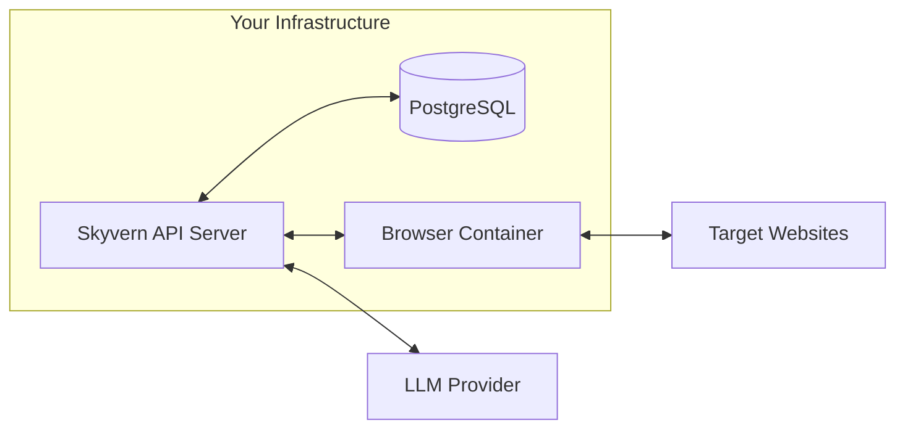

Self-hosted Skyvern runs entirely on your infrastructure: your servers, your browsers, your LLM API keys. This guide helps you decide if self-hosting fits your needs and which deployment method to choose.

## Architecture

Self-hosted Skyvern has four components running on your infrastructure:

| Component | Role |
|-----------|------|
| **Skyvern API Server** | Orchestrates tasks, processes LLM responses, stores results |
| **PostgreSQL** | Stores task history, workflows, credentials, and organization data |
| **Browser Container** | Playwright-managed Chromium that executes the actual web automation |
| **LLM Provider** | Analyzes screenshots and determines actions. You provide the API key (OpenAI, Anthropic, Azure, or local via Ollama) |

### How a task executes

Skyvern runs a perception-action loop for each task step:

1. **Screenshot**: The browser captures the current page state
2. **Analyze**: The screenshot is sent to your LLM, which identifies interactive elements and decides the next action
3. **Execute**: Skyvern performs the action in the browser (click, type, scroll, extract data)
4. **Repeat**: Steps 1-3 loop until the task goal is met or the step limit (`MAX_STEPS_PER_RUN`) is reached

This loop is why LLM choice and browser configuration are the two most impactful self-hosting decisions. They affect every task step.

## What changes from Cloud

| You gain | You manage |
|----------|------------|
| Full data control: browser sessions and results stay on your network | Infrastructure: servers, scaling, uptime |
| Any LLM provider, including local models via Ollama | LLM API costs: pay your provider directly |
| No per-task pricing | Proxies: bring your own provider |
| Full access to browser configuration and extensions | Software updates: pull new Docker images manually |
| Deploy in air-gapped or restricted networks | Database backups and maintenance |

<Note>
The most significant operational difference is **proxies**. Skyvern Cloud routes browser traffic through managed residential proxies to avoid bot detection. Self-hosted deployments need you to configure your own proxy provider.
</Note>

## Prerequisites

Before deploying, ensure you have:

<Steps>
  <Step title="Docker and Docker Compose">
    Required for containerized deployment. [Install Docker](https://docs.docker.com/get-docker/)
  </Step>
  <Step title="4GB+ RAM">
    Browser instances are memory-intensive. Production deployments benefit from 8GB+.
  </Step>
  <Step title="LLM API key">
    From OpenAI, Anthropic, Azure OpenAI, Google Gemini, or AWS Bedrock. Alternatively, run local models with Ollama.
  </Step>
  <Step title="Proxy provider (recommended)">
    For automating external websites at scale. Not required for internal tools or development.
  </Step>
</Steps>

PostgreSQL 14+ is included in the Docker Compose setup. If you prefer an external database, you can configure `DATABASE_STRING` to point to your own instance.

## Choose your deployment method

| Method | Best for |
|--------|----------|
| **Docker Compose** | Getting started, small teams, single-server deployments |
| **Kubernetes** | Production at scale, teams with existing K8s infrastructure, high availability requirements |

Most teams start with Docker Compose. It's the fastest path to a working deployment. Move to Kubernetes when you need horizontal scaling or want to integrate with existing orchestration infrastructure.

## Next steps

<CardGroup cols={2}>
  <Card title="Docker Setup" icon="docker" href="/self-hosted/docker">
    Get Skyvern running in 10 minutes with Docker Compose
  </Card>
  <Card title="Kubernetes Deployment" icon="dharmachakra" href="/self-hosted/kubernetes">
    Deploy to production with Kubernetes manifests
  </Card>
</CardGroup>
