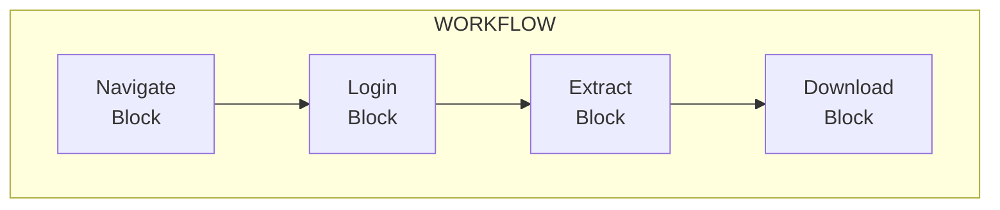
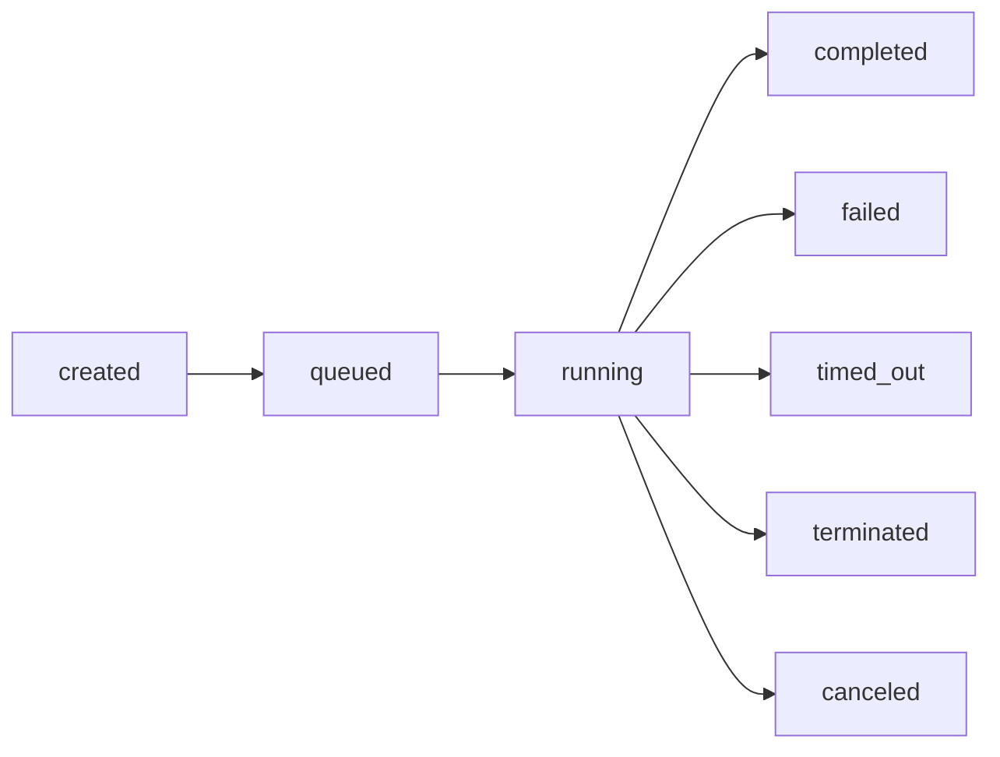
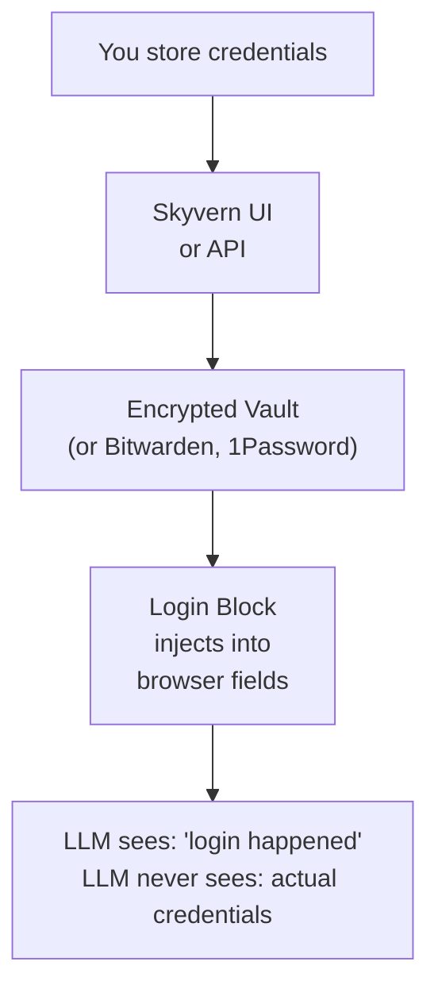
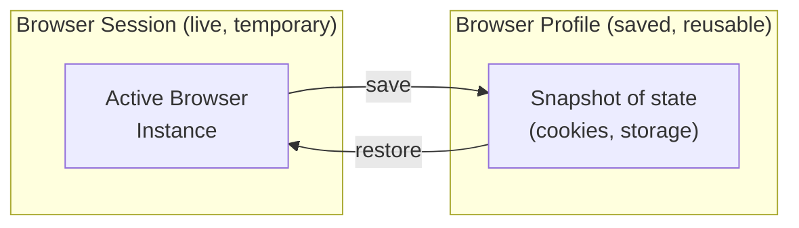

Skyvern has a handful of core concepts. Once you understand how they fit together, you can build any browser automation.

## Tasks

A Task is a single automation job. You provide a natural-language prompt describing the goal, a starting URL, and optionally a JSON schema for structured output. Skyvern navigates the browser and returns the result.

```python
from skyvern import Skyvern

skyvern = Skyvern(api_key="YOUR_API_KEY")

result = await skyvern.run_task(
    prompt="Find the top 3 posts on the front page",
    url="https://news.ycombinator.com",
    data_extraction_schema={
        "type": "object",
        "properties": {
            "posts": {
                "type": "array",
                "items": {"type": "string"}
            }
        }
    }
)

print(result.output)  # {"posts": ["Post 1", "Post 2", "Post 3"]}
```

The two most important parameters are `prompt` (what to do) and `url` (where to start). Beyond those, `data_extraction_schema` defines the shape of structured output, `max_steps` caps the number of AI decision cycles (which controls cost), and `webhook_url` lets you receive async notifications when the task completes. See [Task Parameters](/running-automations/task-parameters) for the full list.

Tasks are best for one-off automations, quick data extraction, and prototyping. When a single task isn't enough, you have two options for multi-step work:

<CardGroup cols={2}>
  <Card
    title="Browser Automation (Code)"
    href="#browser-automation"
  >
    Write multi-step automations in Python or TypeScript with full Playwright control. Version, test, and deploy automation code like any other software.
  </Card>
  <Card
    title="Workflows (Visual)"
    href="#workflows"
  >
    Build multi-step automations visually in the Cloud UI with drag-and-drop blocks. No code required. Share templates across your team.
  </Card>
</CardGroup>

## Browser Automation

Browser Automation is the code-first way to build multi-step automations. The Skyvern SDK connects to a cloud Chromium instance over CDP, layers Playwright on top, and injects AI into every page interaction. There are three layers that nest inside each other: Browser, Page, and Agent.

### Browser

Every code-based automation starts by launching a browser. A Browser is a cloud Chromium instance with a Playwright context. Cookies, storage, and auth state persist across every page you open inside it.

```python
browser = await skyvern.launch_cloud_browser()
page = await browser.get_working_page()

await page.goto("https://example.com")
# ... work across multiple pages ...

await browser.close()
```

One browser per run. All pages share the same session state.

### Page

A Page wraps a Playwright page with AI. Standard Playwright calls like `goto`, `click("#id")`, and `fill` work as-is. AI actions work without selectors: Skyvern screenshots the page and decides what to interact with from your prompt.

```python
# AI actions: no selectors needed
await page.act("Click the login button")
data = await page.extract("Extract all product names and prices")
is_ok = await page.validate("The cart has 3 items")

# AI-enhanced Playwright: try the selector first, fall back to AI if it fails
await page.click("#checkout", prompt="Click the checkout button")
await page.fill("#email", value="user@example.com", prompt="Fill the email field")
```

Selectors are fast and deterministic. AI prompts survive layout changes. You can combine both in the same automation, using selectors for stable elements and AI for things that move around.

### Agent

An Agent runs complete multi-step AI tasks inside a page you already have open. It reuses the current page with its cookies, login state, and navigation history. You control when to hand off to the agent and when to take back control.

```python
browser = await skyvern.launch_cloud_browser()
page = await browser.get_working_page()

await page.goto("https://app.example.com")
await page.agent.login(credential_type="skyvern", credential_id="cred_123")

# The page is now logged in. Hand off a complex goal to the agent.
result = await page.agent.run_task(
    "Go to billing, download the latest invoice"
)

# Or trigger a workflow you built in the Cloud UI
await page.agent.run_workflow("wpid_monthly_report")

await browser.close()
```

Agents are useful when you want to mix precise Playwright control with open-ended AI goals. Log in with a direct call, then hand off "find and download the invoice" to the agent, then take back control to process the file.

<Note>
Full method reference: [Page](/sdk-reference/browser-automation/act), [Agent](/sdk-reference/browser-automation/agent-run-task), [Browser](/sdk-reference/browser-automation/launch-cloud-browser). Developer guide: [Multi-Step Automations](/developers/browser-automations/overview).
</Note>

## Workflows

A Workflow is a reusable automation template built in the [Cloud UI workflow editor](/cloud/building-workflows/build-a-workflow). You drag and drop blocks onto a canvas, wire them together, and save. Workflows can be versioned, shared across your team, scheduled on a cron, and run repeatedly with different parameters.



Each block can reference outputs from previous blocks using Jinja templating: `{{search_query}}` for parameters, `{{extract_block.product_name}}` for upstream block outputs.

Workflows are the right choice when you want no-code automation, team-shared templates, scheduled recurring jobs, or visual drag-and-drop logic.

<Tip>
**Building workflows?** See the [Workflow Editor guide](/cloud/building-workflows/build-a-workflow). **Need to trigger a workflow from code?** See [Run from Code](/cloud/building-workflows/run-from-code) in the Cloud UI docs.
</Tip>

### Blocks

Blocks are the building units of workflows. Each block performs one operation.

**Navigation and interaction:** Navigate (AI-guided navigation toward a goal), Action (click, type, select, upload), Go to URL (direct navigation), Login (authenticate with stored credentials), Wait (pause for a duration), and Human Interaction (pause for manual intervention).

**Data and files:** Extract (pull structured data into JSON), File Download, File Upload, File Parser (PDFs, CSVs, Excel), and PDF Parser (specialized text extraction).

**Logic and control flow:** Conditional (if/else branching), For Loop (repeat over a list), Validation (assert conditions, halt on failure), and Code (custom Python/Playwright scripts).

**Communication:** HTTP Request (external API calls), Text Prompt (text-only LLM prompt, no browser), and Send Email.

For detailed block configuration, see [Block Types and Configuration](/cloud/building-workflows/configure-blocks).

## Runs

Every time you execute a task or kick off a workflow, Skyvern creates a Run to track progress and store outputs. A run moves through a lifecycle:



```python
result = await skyvern.run_task(
    prompt="Extract the main heading",
    url="https://example.com"
)

print(result.run_id)   # "tsk_abc123"
print(result.status)   # "completed"
print(result.output)   # {"heading": "Welcome"}
```

Task runs get a `tsk_` prefix, workflow runs get `wr_`. The response includes the `run_id`, `status`, `output` (matching your extraction schema), `recording_url`, `screenshot_urls`, `downloaded_files`, `failure_reason` (if something went wrong), and `step_count`.

<Warning>
You're billed per step. A step is one AI decision + action cycle. Use `max_steps` to cap costs during development.
</Warning>

## Schedules

A Schedule runs a workflow automatically on a recurring basis. You define a cron expression and timezone, and Skyvern triggers the workflow at each interval.

<CodeGroup>
```python Python
result = await client.agent.create_workflow_schedule(
    workflow_permanent_id="wpid_abc123",
    cron_expression="0 9 * * 1-5",  # Weekdays at 9 AM
    timezone="America/New_York",
    parameters={
        "url": "https://example.com/dashboard"
    }
)
```

```typescript TypeScript
const result = await skyvern.agent.createWorkflowSchedule("wpid_abc123", {
  cron_expression: "0 9 * * 1-5", // Weekdays at 9 AM
  timezone: "America/New_York",
  parameters: {
    url: "https://example.com/dashboard",
  },
});
```
</CodeGroup>

The `cron_expression` is a standard 5-field cron (minimum 5-minute interval), `timezone` is an IANA identifier like `America/New_York`, and `parameters` are passed to each scheduled run. You can pause a schedule by setting `enabled` to `false`.

## Credentials

Credentials provide secure storage for authentication data. Skyvern encrypts credentials at rest and in transit, injects them directly into the browser, and never sends them to the LLM.



Supported credential types are usernames and passwords, TOTP codes (authenticator apps), and credit cards. You can store them in Skyvern's native encrypted storage, or sync from Bitwarden, 1Password, Azure Key Vault, or a custom HTTP vault.

See [Credentials](/sdk-reference/credentials/create-credential) for setup instructions.

## Browser Sessions and Profiles

Skyvern offers two ways to manage browser state across runs.



**Browser Sessions** are live browser instances that maintain state across multiple operations. Cookies, storage, and page context persist for the duration of the session (up to 24 hours). They're useful for chaining operations in real-time or allowing human intervention between steps.

```python
browser = await skyvern.launch_cloud_browser()
page = await browser.get_working_page()

await page.goto("https://example.com/login")
await page.agent.login(credential_type="skyvern", credential_id="cred_123")

# Authenticated state persists. Extract data from another page.
await page.goto("https://example.com/dashboard")
balance = await page.extract("Extract the account balance")

await browser.close()
```

**Browser Profiles** are saved snapshots of browser state (cookies, auth tokens, local storage, session storage). Unlike sessions, profiles persist indefinitely and can be reused across days or weeks, which makes them ideal for skipping login on repeated runs.

```python
profile = await skyvern.create_browser_profile(
    name="my-authenticated-profile",
    workflow_run_id=run.run_id
)

# Future runs restore the authenticated state without logging in again.
browser = await skyvern.launch_cloud_browser(
    browser_profile_id=profile.browser_profile_id
)
page = await browser.get_working_page()
await page.goto("https://example.com/dashboard")
data = await page.extract("Extract the monthly report data")
await browser.close()
```

See [Browser Sessions](/developers/optimization/browser-sessions) for details.

## Artifacts

Every run generates artifacts for observability, debugging, and audit trails: end-to-end video recordings, screenshots captured after each action, downloaded files, JSON-structured logs at step/task/workflow levels, and HAR files for network debugging.

```python
result = await skyvern.run_task(
    prompt="Download the quarterly report",
    url="https://example.com"
)

print(result.recording_url)      # Full video of execution
print(result.screenshot_urls)    # List of screenshot URLs
print(result.downloaded_files)   # [{"url": "...", "checksum": "..."}]
```

In the Skyvern UI, go to **Runs**, click a run, and view the **Actions** and **Recording** tabs.

## Engines

Skyvern supports multiple AI engines. `skyvern-2.0` is the latest and default for the Cloud UI (the SDK defaults to `skyvern-1.0`). Other options include `openai-cua` (OpenAI Computer Use Agent), `anthropic-cua` (Anthropic Computer Use Agent), and `ui-tars`.

```python
from skyvern.schemas.runs import RunEngine

result = await skyvern.run_task(
    prompt="Extract pricing data",
    url="https://example.com",
    engine=RunEngine.skyvern_v2
)
```

## Quick Reference

| I want to... | Use |
|--------------|-----|
| Run a one-off automation | [Task](#tasks) |
| Build multi-step automation in code | [Browser Automation](#browser-automation) |
| Build multi-step automation visually | [Workflow](#workflows) |
| Trigger a UI-built workflow from code | [Run from Code](/cloud/building-workflows/run-from-code) |
| Keep a browser open between operations | [Browser Session](#browser-sessions-and-profiles) |
| Skip login on repeated runs | [Browser Profile](#browser-sessions-and-profiles) |
| Store secrets securely | [Credentials](#credentials) |
| Debug a failed run | [Artifacts](#artifacts) |

## Choose your path

<CardGroup cols={2}>
  <Card
    title="Use the dashboard"
    href="/cloud/getting-started/overview"
  >
    Run tasks, build workflows visually, and monitor runs. No code required.
  </Card>
  <Card
    title="Build with the API"
    href="/developers/getting-started/quickstart"
  >
    Integrate Skyvern into your product with Python, TypeScript, or REST.
  </Card>
</CardGroup>

<CardGroup cols={2}>
  <Card
    title="AI Agents Quickstart"
    href="/developers/getting-started/ai-agents-quickstart"
  >
    Give Claude Code, Cursor, or Windsurf browser automation via MCP.
  </Card>
  <Card
    title="Self-host Skyvern"
    href="/developers/self-hosted/overview"
  >
    Deploy on your own infrastructure with your own LLM keys.
  </Card>
</CardGroup>
