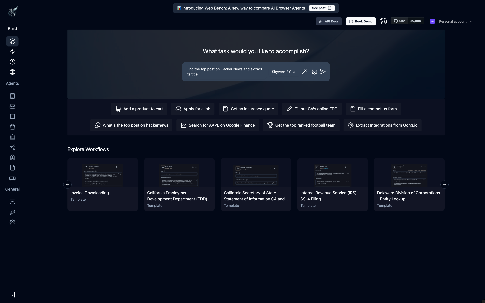
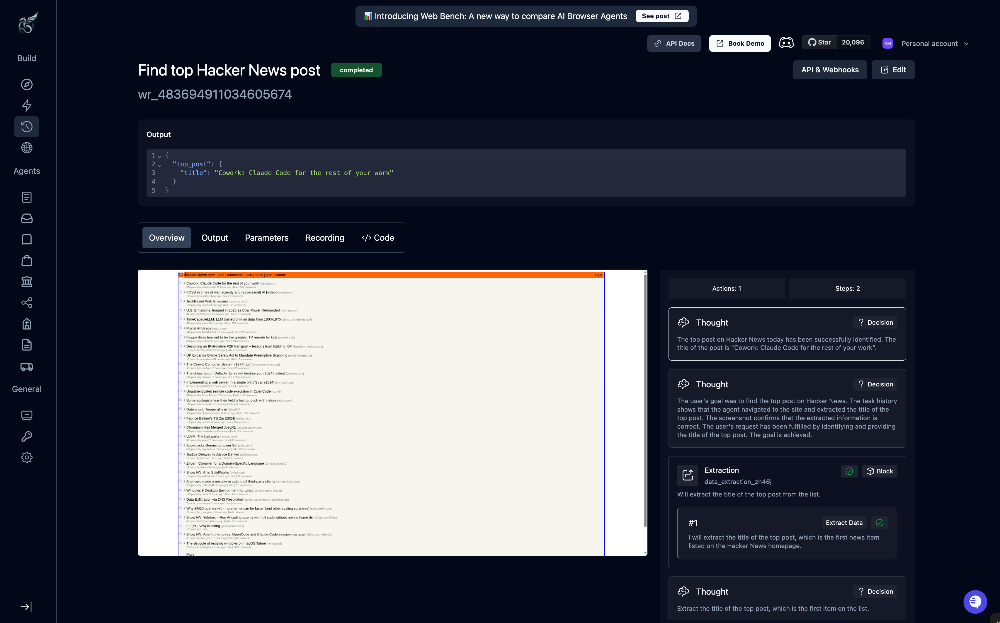

Run browser automations without writing code. This guide walks you through running your first task in the Cloud UI.

<Note>
Prefer to integrate via code? Check out the [SDK Quickstart](/getting-started/quickstart) instead.
</Note>

## Opening Skyvern Cloud

Visit [app.skyvern.com](https://app.skyvern.com) and sign-up or sign-in to your account.

You'll land on the **Discover** page—your starting point for running automations.


## Understanding the Interface

The left sidebar organizes everything you need:

**Build**
- **Discover** — Run one-off tasks with natural language prompts
- **Workflows** — Create and manage multi-step automations
- **Runs** — View execution history for all your tasks and workflows
- **Browsers** — Monitor active browser sessions

**Agents**
- Pre-built templates for common use cases: form filling, data extraction, job applications, insurance quotes, and more. Select one to start with a working example.

**General**
- **Billing** — View usage and manage your plan
- **Credentials** — Store logins securely for authenticated sites
- **Settings** — Copy your API key and configure account settings

## Run Your First Task

The fastest way to see Skyvern in action is to run a task directly from the Discover page.

### Step 1: Enter your prompt



In the main input field, describe what you want to accomplish.

<Tip title="Prompting tip" icon="lightbulb">
Be specific about the goal, completion criteria, visual indicators, and all necessary data.
</Tip>

Check out our detailed [Prompting Guide](/prompting-guide).

You can also select one of the quick-action buttons below the input for common example tasks like "Add a product to cart" or "Get an insurance quote."

### Step 2: Configure settings (optional)

Click the gear icon to access additional options:


| Setting | What it does |
|---------|-------------|
| **Proxy Location** | Run automations from different geographic locations |
| **Browser Session ID** | Share login state between workflows |
| **2FA Identifier** | Handle two-factor authentication automatically |
| **Publish Workflow** | Save this task as a reusable template |
| **Data Schema** | Define structured JSON output format |

<Accordion title="Example: Data Schema">
Use a JSON schema to get typed output:

```json
{
  "type": "object",
  "properties": {
    "product_name": { "type": "string" },
    "price": { "type": "number" }
  }
}
```
</Accordion>

### Step 3: Run the task

Click the send button to start.

In the background, Skyvern opens a browser, navigates to the URL you specified (or finds it using search), and interacts with the website component to get the job done.

## Watch the Live Browser

Once your task starts, you'll see the execution screen with two main panels:


**Left panel: Task configuration**

Shows the block being executed with its URL and prompt. The status badge indicates whether the task is running, completed, or failed.

**Right panel: Live Browser**

A real-time view of the browser as Skyvern navigates. You'll see pages load, forms fill, and buttons click—exactly as if you were doing it yourself.

The **"take control"** button lets you intervene and use the agent's browser yourself if it needs help with something unexpected, like a CAPTCHA or unusual login flow.

## Review the Results

After the task completes, go to **Runs** and open your latest task.



### Extracted Data

The AI extracts data based on your prompt and returns it as structured JSON:

```json
{
  "post_title": "There's a ridiculous amount of tech in a disposable vape"
}
```

### Results Tabs

The results page has several tabs:

- **Actions** — Step-by-step breakdown of every action the AI took, with screenshots and reasoning
- **Recording** — Full video replay of the browser session
- **Parameters** — The task configuration you submitted (URL, prompt, webhooks, proxy, schema)
- **Diagnostics** — Debug info for troubleshooting: LLM prompts, element trees, annotated screenshots

## What's Next?

<CardGroup cols={2}>
  <Card
    title="Build a Workflow"
    icon="diagram-project"
    href="/workflows/manage-workflows"
  >
    Create reusable, multi-step automations with the visual workflow builder
  </Card>
  <Card
    title="Handle Logins"
    icon="key"
    href="/credentials/introduction"
  >
    Store credentials securely for sites that require authentication
  </Card>
</CardGroup>
