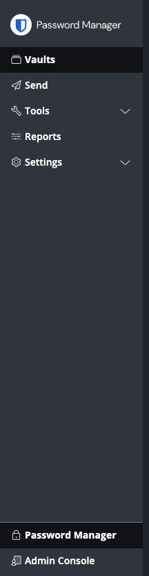
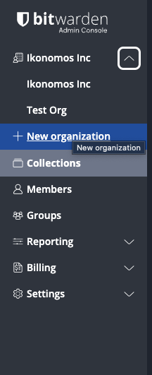
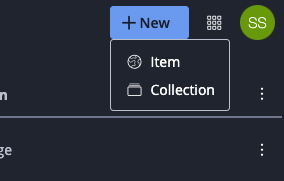
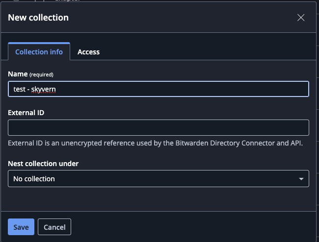
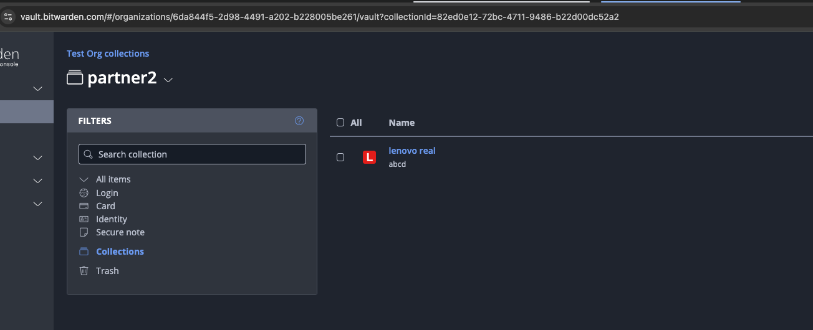
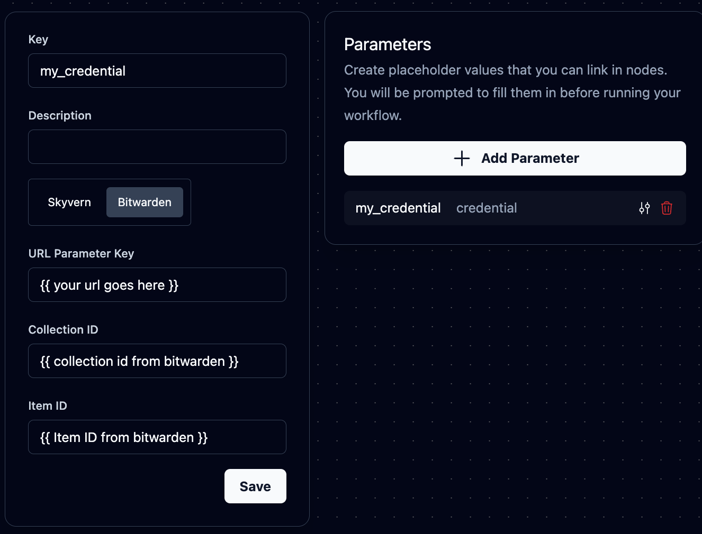
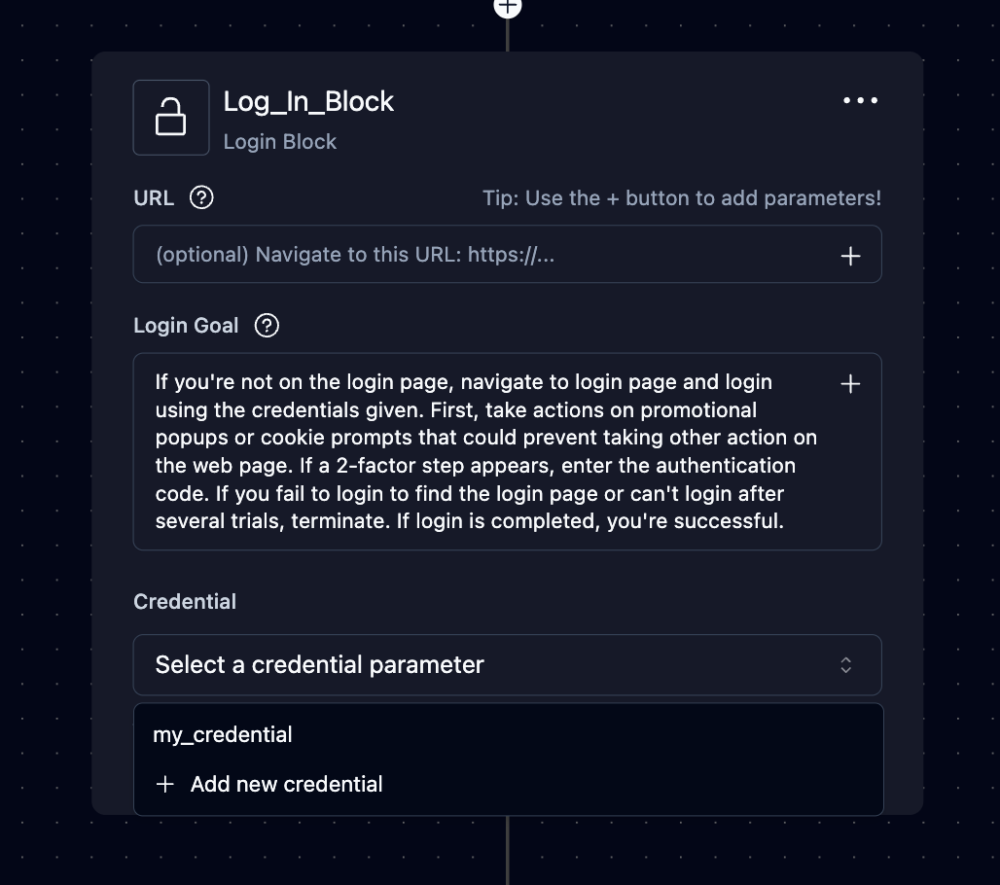

<Note>This feature is only available on our enterprise plan. Please reach out to sales@skyvern.com for more information</Note>
Skyvern can integrate with your Bitwarden account. Skyvern agent can read the credentials on the fly to complete tasks while keeping your credentials secure. Skyvern never stores your Bitwarden credentials or sends them to LLMs.

## How to integrate Bitwarden with Skyvern

### Bitwarden Integration in Skyvern Cloud
**Step 1. Make a Bitwarden account**
Go to https://bitwarden.com/ and create an account. <Warning>💡 Make sure you create an account on `bitwarden.com` not `bitwarden.eu`</Warning>

**Step 2: Make sure you have a Bitwarden Organization created**
1. Log into Bitwarden and navigate to "Admin Console"


2. Make sure you have an organization created


**Step 3: Create a collection you'd like to share with Skyvern (Skip if you already have a collection of items to share with Skyvern)**
1. Click New > Create a collection

2. Type in a name (helpful to put your name - Skyvern) 


**Step 4: Go to “Access” and follow the instructions provided by the enterprise support team**
Please contact sales@skyvern.com to set up the integration for this step.

**Step 5: Grab your collection id and go to Skyvern**
1. Click into the collection and inspect the url for a collection uuid

2. Create a new workflow in Skyvern. Click on Parameters + add a credential parameter + pick the "Bitwarden" tab. 
    a. The URL is the website you'd like to navigate to. This can be parameterized by different `input_parameter`
    b. Enter the collection id above. This can be parameterized by another input parameter

3. Create a login block and select the credentials as input parameters and you should be good to go!


### Bitwarden Integration in Open Source

Skyvern can integrate with self-hosted Bitwarden-compatible services like [vaultwarden](https://github.com/dani-garcia/vaultwarden). Since vaultwarden only implements the client API (not the server endpoints), we use a Bitwarden CLI server as a bridge.

#### Architecture

```text
Skyvern → bw serve (CLI Server) → vaultwarden
```

The CLI server provides the REST API endpoints that Skyvern expects, while connecting to your vaultwarden instance.

#### Quick Setup

**Step 1: Get vaultwarden API Credentials**

1. Log into your vaultwarden web interface
2. Go to **Account Settings → Security → API Key**
3. Click **View API Key**
4. Save the `client_id` and `client_secret`

**Step 2: Configure Environment Variables**

Add these to your `.env` file:

```bash
# Skyvern Bitwarden Configuration
SKYVERN_AUTH_BITWARDEN_ORGANIZATION_ID=your-org-id-here
SKYVERN_AUTH_BITWARDEN_MASTER_PASSWORD=your-master-password-here
SKYVERN_AUTH_BITWARDEN_CLIENT_ID=user.your-client-id-here
SKYVERN_AUTH_BITWARDEN_CLIENT_SECRET=your-client-secret-here

# Vaultwarden Configuration
BW_HOST=https://your-vaultwarden-server.com
BW_CLIENTID=${SKYVERN_AUTH_BITWARDEN_CLIENT_ID}
BW_CLIENTSECRET=${SKYVERN_AUTH_BITWARDEN_CLIENT_SECRET}
BW_PASSWORD=${SKYVERN_AUTH_BITWARDEN_MASTER_PASSWORD}

# CLI Server Configuration (defaults are correct)
BITWARDEN_SERVER=http://localhost
BITWARDEN_SERVER_PORT=8002
```

**Step 3: Start the Services**

The Bitwarden CLI server is included in the main Docker Compose setup:

```bash
docker-compose up -d bitwarden-cli
```

**Step 4: Verify Setup**

Test that the CLI server is working:

```bash
# Check status
curl http://localhost:8002/status

# List items from your vault
curl http://localhost:8002/list/object/items
```

#### How It Works

1. **vaultwarden** - Your existing password manager server
2. **bitwarden-cli container** - Runs `bw serve` to provide REST API endpoints
3. **Skyvern** - Uses the CLI server's REST API to access credentials

#### Available API Endpoints

The CLI server provides these endpoints on port 8002:

- `GET /status` - Server status
- `POST /unlock` - Unlock vault
- `GET /list/object/items` - List all items
- `GET /object/item/{id}` - Get specific item
- `POST /object/item` - Create new item
- `GET /object/template/item` - Get item template

#### Troubleshooting

**CLI Server Won't Start**

Check the container logs:
```bash
docker-compose logs bitwarden-cli
```

Common issues:
- Invalid API credentials
- Wrong vaultwarden server URL
- Network connectivity issues
- Incorrect master password

**Skyvern Can't Connect**

1. Verify CLI server is running: `curl http://localhost:8002/status`
2. Check that `BITWARDEN_SERVER=http://localhost` and `BITWARDEN_SERVER_PORT=8002`
3. Ensure proper organization ID and credentials are set

#### Security Notes

- The CLI container runs as a non-root user
- Only binds to localhost by default for security
- Vault remains encrypted until explicitly unlocked
- Uses API key authentication with vaultwarden
