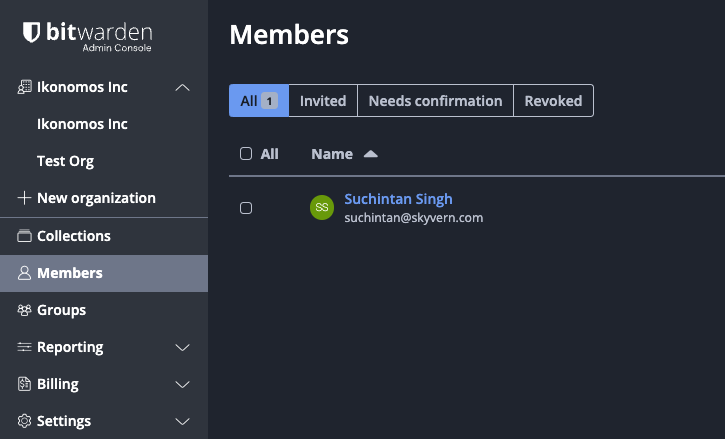
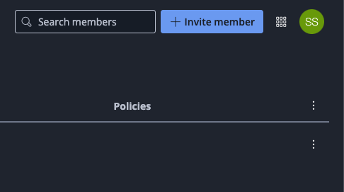
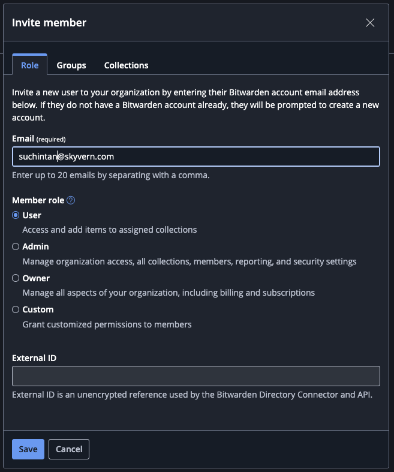
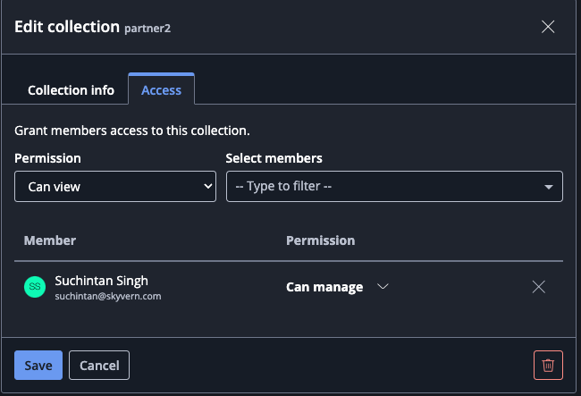

Skyvern can integrate with your Bitwarden account. Skyvern agent can read the credentials on the fly to complete tasks while keeping your credentials secure. Skyvern never stores your Bitwarden credentials or sends them to LLMs.

## How to integrate Bitwarden with Skyvern

### Bitwarden Integration in Skyvern Cloud
**Step 1. Make a Bitwarden account**
Go to https://bitwarden.com/ and create an account. <Warning>💡 Make sure you create an account on `bitwarden.com` not `bitwarden.eu`</Warning>

**Step 2: Make sure you have a Bitwarden Organization created**
1. Log into Bitwarden and navigate to "Admin Console"

2. Make sure you have an organization created

**Step 3: Go to Members and invite suchintan@skyvern.com**
1. Click on "Members" in the left pane 

2. Click on "Invite Member"

3. Invite suchintan@skyvern.com

**Step 4: Create a collection you'd like to share with Skyvern (Skip if you already have a collection of items to share with Skyvern)**
1. Click New > Create a collection

2. Type in a name (helpful to put your name - Skyvern) 

3. Go to "Access" and add suchintan@skyvern.com 

**Step 5: Grab your collection id and go to Skyvern**
1. Click into the collection and inspect the url for a collection uuid

2. Create a new workflow in Skyvern. Click on Parameters + add a credential parameter + pick the "Bitwarden" tab. 
    a. The URL is the website you'd like to navigate to. This can be parameterized by different `input_parameter`
    b. Enter the collection id above. This can be parameterized by another input parameter

3. Create a login block and select the credentials as input paramters and you should be good to go!

### Bitwarden Integration in Open Source
