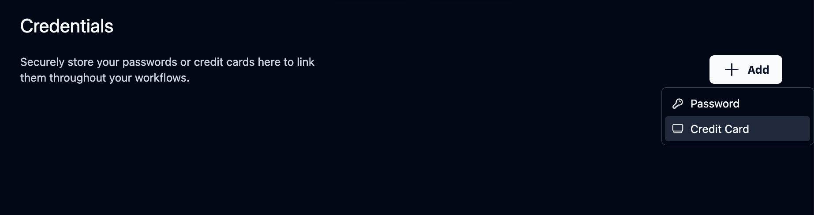
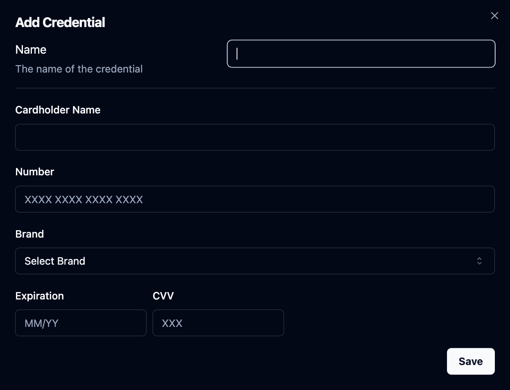

## Manage Credit Cards in Skyvern Cloud
You can go to [Skyvern's Credentials page](https://app.skyvern.com/credentials) to manage your credit cards.


**Add a new credit card credential:**





**Delete a credit card credential:**

Click the trash icon and confirm the deletion. If you do this, the credit card will be deleted from Skyvern PERMANENTLY.


**Update a credit card credential:**
<Warning>Skyvern only supports adding and deleting credit cards. To update a credit card, you need to delete the existing credit card and create a new one.</Warning>

## Manage Credit Cards with API & SDK
We also have [API and SDK](/api-reference/api-reference/credentials/create-credential) supports for credit card management:

**Create a new credit card credential:**

<CodeBlocks>
```python title="python"
from skyvern import Skyvern
skyvern = Skyvern(api_key="YOUR_API_KEY")
await skyvern.credentials.create_credential(
    name="My Credit Card",
    credential_type="credit_card",
    credential={
        "card_number": "4242424242424242",
        "card_cvv": "424",
        "card_exp_month": "12",
        "card_exp_year": "2028",
        "card_brand": "visa",
        "card_holder_name": "John Doe",
    },
)
```

```bash title="curl"
curl -X POST https://api.skyvern.com/v1/credentials \
     -H "x-api-key: YOUR_API_KEY" \
     -H "Content-Type: application/json" \
     -d '{
      "name": "My Credit Card",
      "credential_type": "credit_card",
      "credential": {
        "card_number": "4242424242424242",
        "card_cvv": "424",
        "card_exp_month": "12",
        "card_exp_year": "2028",
        "card_brand": "visa",
        "card_holder_name": "John Doe"
      }
    }'
```
</CodeBlocks>

**Delete a password credential:**

<CodeBlocks>
```python title="python"
from skyvern import Skyvern

skyvern = Skyvern(api_key="YOUR_API_KEY")
await skyvern.credentials.delete_credential(credential_id="cred_123456789")
```

```bash title="curl"
curl -X POST https://api.skyvern.com/v1/credentials/cred_1234567890/delete \
	 -H "x-api-key: YOUR_API_KEY"
```
</CodeBlocks>
