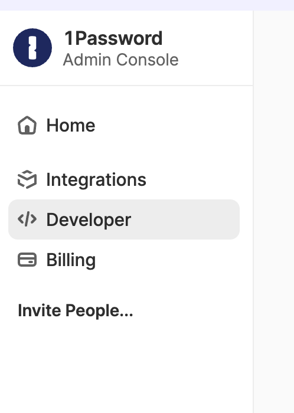

## How to integrate 1password with Skyvern

### Integration in Skyvern Cloud
<Note>This feature is only available on our enterprise plan. Please reach out to sales@skyvern.com for more information</Note>

Skyvern can integrate with your 1password Vault. It reads the credentials on the fly to complete tasks while keeping your credentials secure. Skyvern never stores your credentials or sends them to LLMs.

**Step 1. Create a new vault**
Assume you have a 1password account already - sign in and go to the [home page](https://my.1password.com/home). Create a new vault in 1password.

**Step 2. Share your vault with Skyvern**
Please contact sales@skyvern.com for this step.

### Integration for Self Hosted Skyvern
**Step 1. Create a new vault**
Assume you have a 1password account already - sign in and go to the [home page](https://my.1password.com/home). Create a new vault in 1password.

**Step 2: Create a service account and generate a token**
TODO
Click the "Developer" tab.


**Step 3: Add the token to the self-hosted environment**

```bash
OP_SERVICE_ACCOUNT_TOKEN=YOUR_SERVICE_ACCOUNT_TOKEN
```

TODO, more steps to write:
- select the vault the service account with only READ access
- it should come with at “service account token”
    - add this to the `.env` :
        - `OP_SERVICE_ACCOUNT_TOKEN=xxx`
- set the secret reference (not required any more; input vault id and item id instead):
    - op://vaultID/service_account/username
- select parameters