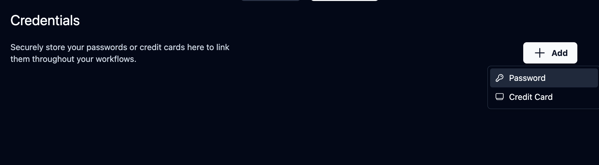
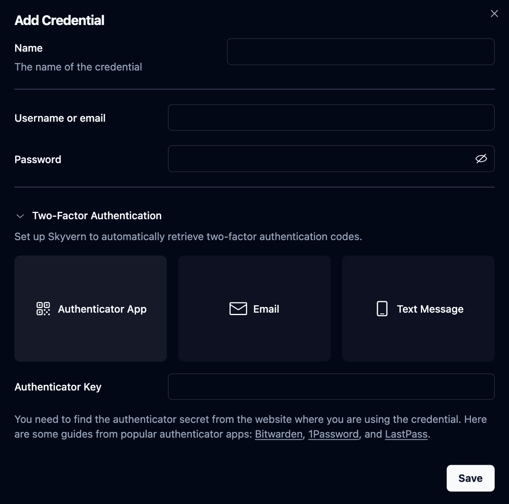
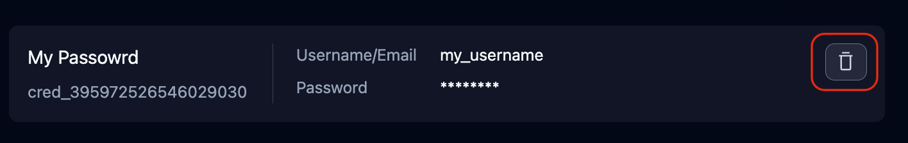

## Password Management

You can store password information in Skyvern. Skyvern agent can use the stored password information to log into a website without sending your username or password to LLMs.

## How To Manage Passwords
This can be done in the [Skyvern's Credentials](https://app.skyvern.com/credentials) page.

### Add a new password:



Besides the username and password, you can also add the Two Factor Authentication (TOTP) information with the authentication key/secret. If you need to set up TOTP, here are some guides from popular authenticator apps: [Bitwarden](https://bitwarden.com/help/integrated-authenticator/#manually-enter-a-secret), [1Password](https://support.1password.com/one-time-passwords#on-1passwordcom), and [LastPass](https://support.lastpass.com/s/document-item?language=en_US&bundleId=lastpass&topicId=LastPass/create-totp-vault.html&_LANG=enus).



### Delete a password:

Click the trash icon and confirm the deletion. If you do this, the password will be deleted from Skyvern PERMANENTLY.


### Update a password:
<Warning>Skyvern allows only adding and deleting passwords. If you would like to update a password, you need to delete the existing password and create a new one.</Warning>

## Manage Passwords with API & SDK
We also have [API and SDK](/api-reference/api-reference/credentials/create-credential) supports for password management:

**Create a new password credential:**

<CodeBlocks>
```python title="python"
from skyvern import Skyvern

skyvern = Skyvern(api_key="YOUR_API_KEY")
await skyvern.create_credential(
    name="My Credential",
    credential_type="password",
    credential={"username": "username", "password": "password"},
)
```

```bash title="curl"
curl -X POST https://api.skyvern.com/v1/credentials \
	 -H "x-api-key: YOUR_API_KEY" \
     -H "Content-Type: application/json" \
     -d '{
	  "name": "My Credential",
	  "credential_type": "password",
	  "credential": {
		"password": "securepassword123",
		"username": "user@example.com",
		"totp": "JBSWY3DPEHPK3PXP"
	  }
	}'
```
</CodeBlocks>

**Delete a password credential:**

<CodeBlocks>
```python title="python"
from skyvern import Skyvern

skyvern = Skyvern(api_key="YOUR_API_KEY")
await skyvern.delete_credential(credential_id="cred_123456789")
```

```bash title="curl"
curl -X POST https://api.skyvern.com/v1/credentials/cred_1234567890/delete \
	 -H "x-api-key: YOUR_API_KEY"
```
</CodeBlocks>