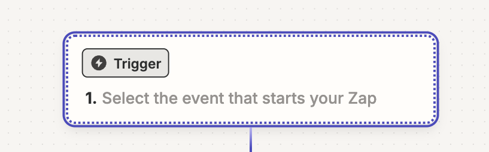
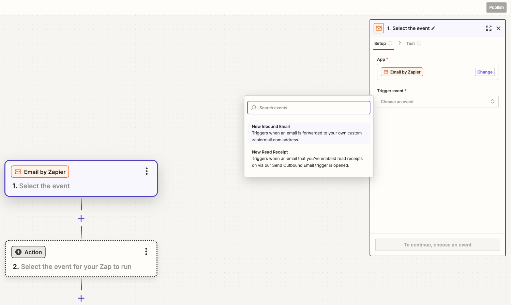
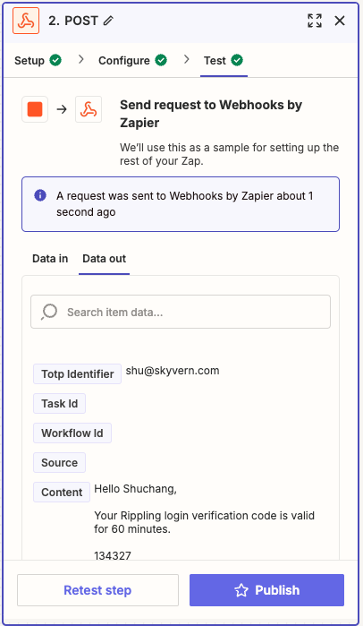

Skyvern supports logging into websites that require a 2FA/MFA/Verification code. There are 5 kinds of 2FA we support today:
- [Option 1: Google Authenticator (TOTP)](#option-1-google-authenticator-totp)
- [Option 2: Email Verification Code](#option-2-email-verification-code)
- [Option 3: Phone Verification Code](#option-3-phone-verification-code)
- [Option 4: Let Skyvern get the code from your server (webhook)](#option-4-let-skyvern-get-the-code-from-your-server-webhook)
- [Option 5: One Time Login Link](#option-5-one-time-login-link)

## Option 1: Google Authenticator (TOTP)

Step 1: Save your username and password in [Skyvern Credential](https://app.skyvern.com/credentials). See [Password Management](/credentials/passwords#manage-passwords-in-skyvern-cloud) for more details.

Step 2: Add your account by manually entering the secret key (extracted from the QR code). Not sure how to get it? [Follow this guide](https://bitwarden.com/help/integrated-authenticator/).

> 💡 Don't have the key? Contact [Skyvern Support](mailto:support@skyvern.com) and we can help you get it.

## Option 2: Email Verification Code
Email verification codes require you to set up a forwarding rule that forwards these emails to a Skyvern endpoint.

The forwarding rule can be set up using [Gmail + Zapier](https://zapier.com/app/home) or similar tools. (instructions below)

> 💡 *Coming Soon*: We plan to provide email forwarding addresses that make this easier to set up

You can pass `totp_identifier` when running [a task](/api-reference/api-reference/agent/run-task) or a [workflow](/api-reference/api-reference/agent/run-workflow). When the TOTP code arrives at your inbox, all you need to do is to send the email/message to Skyvern's [TOTP endpoint](/api-reference/api-reference/credentials/send-totp-code).

### Forwarding Your Email To Skyvern (Gmail + Zapier)
This setup requires a Zapier Pro plan account.

**Step 1. Create a Zapier Zap**

Go to https://zapier.com/app/home and create new Zaps
<p align="center">
  
</p>

In the newly created Zap draft, Click the “Trigger” button
<p align="center">
  
</p>

Click `Email by Zapier`
<p align="center">
  
</p>

In the Email “Setup”, pick `New Inbound Email` in the `Trigger event` selection. Click `Continue` to complete the “Setup”
<p align="center">
  
</p>

In Email “Configure”, create an email address which will be used to forward emails for TOTP codes. Click “Continue”.
<p align="center">
  
</p>

Let’s add the Action to complete the Zapier setup before coming back to test it. Click the “Action” button and add `Webhooks by Zapier`
<p align="center">
  
</p>

<p align="center">
  
</p>

In the Setup, choose “POST” under the `Action event` selection. Then click “Continue”.
<p align="center">
  
</p>

In the “Configure”, set up these in order to make a POST request to Skyvern’s TOTP API:

- URL: [`https://api.skyvern.com/v1/credentials/totp`](https://api.skyvern.com/v1/credentials/totp)
- Payload Type: json
- Data:
    - totp_identifier: choose `Raw To Email` after clicking the “+” sign
    - content: choose `Body Plain` after clicking the “+” sign
    - source: email
- Headers:
    - x-api-key: `Your Skyvern API Key`

<p align="center">
  
</p>
Click Continue

**Step 2. Add forwarding email and create a filter in Gmail**

Go to Gmail Settings → Forwarding and POP/IMAP (https://mail.google.com/mail/u/0/#settings/fwdandpop) → click “Add a forwarding address” → enter the zapier email address you just created. There might be some verifications, including a verification email from Zapier, you have to complete here.

After setting up the forwarding email address, go to “Filters and Blocked Addresses” (https://mail.google.com/mail/u/0/#settings/filters). Click “Create a new filter” and set up your email filtering rule for your TOTP (2FA/MFA) emails. Click “Create filter”. Check “Forward it to” and pick the new email address and update filter.

<p align="center">
  
</p>

**Step 3. Test it end to end!**

You can forward any previous TOTP (2FA/MFA) email to the Zapier email address you created in Step 1.

In Zapier: under the “Test” of the Webhooks action, send a request to test it out. If your test is successful, you should see a `A request was sent to Webhooks by Zapier` message

<p align="center">
  
</p>


## Option 3: Phone Verification Code

Phone verification codes are supported the same way as email verification codes. You will need to set up a forwarding rule that forwards these messages to a Skyvern endpoint.

A good solution to set up this forwarding rule is to use virtual phone number services such as [Twilio](https://www.twilio.com/en-us/docs/usage/tutorials/how-to-use-your-free-trial-account) or [Pilvo](https://www.pilvo.com/en/us/virtual-phone-number).


Make sure you pass `totp_identifier` when running [a task](/api-reference/api-reference/agent/run-task) or a [workflow](/api-reference/api-reference/agent/run-workflow). When the TOTP code arrives at your virtual phone number, all you need to do is to send the message to Skyvern's TOTP endpoint.

You can use the following code to forward the message to Skyvern:

```python
// Twilio Function to post 2FA data to Skyvern API

exports.handler = async function(context, event, callback) {
  const axios = require('axios');
  const apiUrl = 'https://api.skyvern.com/v1/credentials/totp';
  const apiKey = '{{your api key}}';
  const totpIdentifier = '{{your totp identifier (could be phone number)}}';

  const requestBody = {
    totp_identifier: totpIdentifier,
    content: event.Body || "Default 2FA message",
    source: "phone"
  };

  const response = new Twilio.Response();
  response.appendHeader('Content-Type', 'application/json');

  try {
    const apiResponse = await axios.post(apiUrl, requestBody, {
      headers: {
        'Content-Type': 'application/json',
        'x-api-key': apiKey
      }
    });

    response.setStatusCode(200);
    response.setBody({
      status: 'success',
      message: '2FA message sent',
      data: apiResponse.data
    });
  } catch (error) {
    response.setStatusCode(500);
    response.setBody({
      status: 'error',
      message: error.message,
      details: error.response?.data || null
    });
  }

  return callback(null, response);
};

```


## Option 4: Let Skyvern get the code from your server (webhook)
You can pass `totp_url` when running [a task](/api-reference/api-reference/agent/run-task) or a [workflow](/api-reference/api-reference/agent/run-workflow). Inside this endpoint hosted by you, you have to conform to the following schema:

### Set Up Your TOTP Endpoint
For websites that requires a verification code to complete a task, you have to set up a TOTP endpoint for Skyvern to fetch the verification code.

Here's the TOTP endpoint contract you should use:

Request (POST):
| Parameter | Type | Required? | Sample Value | Description |
| --- | --- | --- | --- | --- |
| task_id | String | yes | tsk_123 | The task ID that needs the verification to be done |

Response:
| Parameter | Type | Required? | Sample Value | Description |
| --- | --- | --- | --- | --- |
| task_id | String | yes | tsk_123 | The task ID that needs the verification to be done |
| verification_code | String | no | 123456 | The verification code |

### Validate The Sender of The Request
Same as the webhook API, your server needs to make sure it’s Skyvern that’s making the request.

- a python example for how to generate and validate the signature:

```python
def validate_skyvern_request_headers(request: Request) -> bool:
    header_skyvern_signature = request.headers["x-skyvern-signature"]
    payload = request.body() # this is a bytes
    hash_obj = hmac.new(SKYVERN_API_KEY.encode("utf-8"), msg=payload, digestmod=hashlib.sha256)
    client_generated_signature = hash_obj.hexdigest()
    return header_skyvern_signature == client_generated_signature
```

`SKYVERN_API_KEY`: you can get the API KEY from [Skyvern Settings](https://app.skyvern.com/settings).

## Option 5: One Time Login Link

One time login links are supported by breaking your workflow / task into two parts:
1. Login to trigger the one time login link
2. Trigger the rest of your task / workflow based on the one time login link as the starting point

You will need to set up something (e.g. Zapier) that monitors the email inbox for incoming magic links. Once you get the link, you can use it to trigger the rest of your task / workflow.

When triggering the rest of your task / workflow, you can pass the one time login link as the starting point (e.g. url parameter), and Skyvern will start the new session already logged in.

## Listing Recent TOTP Codes

Once your integration is forwarding codes, you can retrieve recent entries for your organization.

```bash
curl -X GET "https://api.skyvern.com/v1/credentials/totp?totp_identifier=user@example.com&limit=10" \
  -H "x-api-key: $SKYVERN_API_KEY"
```

**Query parameters**
- `totp_identifier` *(optional)* – filter by the identifier you provided when the code was sent (email, phone, etc.).
- `workflow_run_id` *(optional)* – restrict results to a particular workflow run.
- `otp_type` *(optional)* – filter on `totp` or `magic_link`.
- `limit` *(optional)* – number of records to return (default `50`, maximum `200`).

The response is a list of TOTP objects, ordered newest first. Skyvern only returns codes created within the last `TOTP_LIFESPAN_MINUTES` (10 minutes by default).
