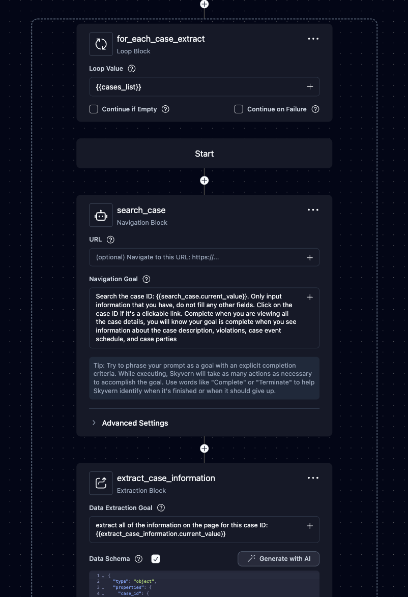
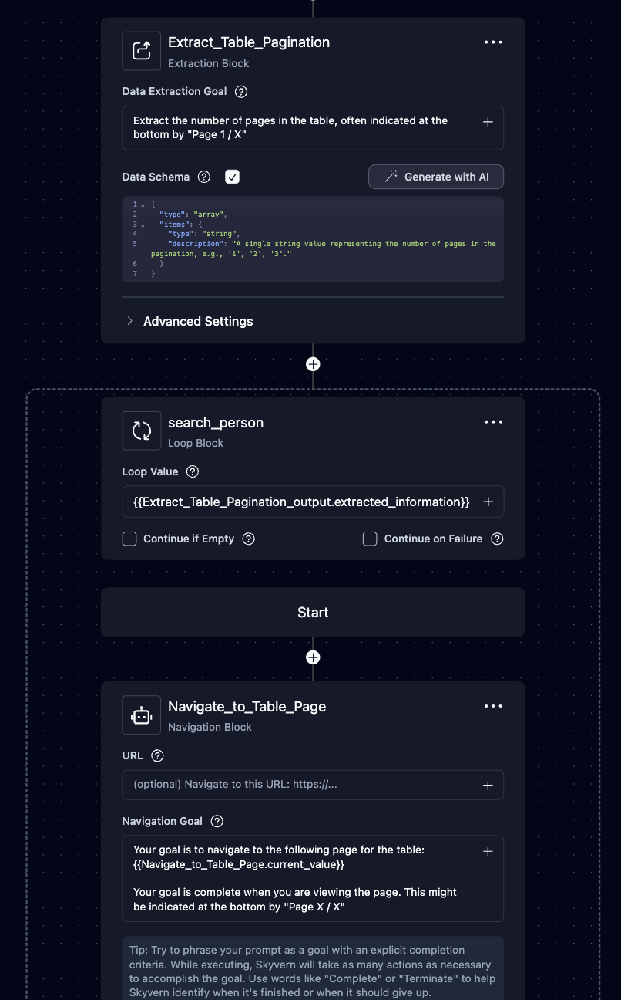

# What in the H-E-Double-Hockey-Sticks is a ForLoop?

A ForLoop iterates over a list, or an array, of items. If you have to say “for each item, do xyz” you probably need a ForLoop! 

We’ve designed ForLoops in Skyvern so that they contain blocks inside the Loop Block, which are run for each item in the list.Each item in the list is handled separately and passed one-by-one through the blocks within the loop.

# At a High Level

### **Required ForLoop values**

1. Loop Value, or the list that you are iterating over
    1. The structure for a properly formatted loop value is an array (not wrapped in a JSON object)
2. The Current Value, or a parameter placed into the block(s) within a ForLoop that allows that block to reference the current loop value 
    1. The structure for adding the current value parameter is always {{blockname.current_value}} or {{current_value}}

### **How the ForLoop runs**

- **Loop Value (or input list)** → `[Item 1, Item 2, Item 3, ..., Item N]`
- **ForLoop Block**:
    - Contains internal blocks
        
        ```
        For Loop (+ loop value)
          └── Navigation Block A
          └── Navigation Block B
        ```
        
- **Execution Flow**:
    - `Item 1` → Block A → Block B
    - `Item 2` → Block A → Block B
    - `Item 3` → Block A → Block B
    - ... continues until all items are processed
- **Key Behavior**:
    - Each item is isolated
    - Blocks run in sequence for each item
    - No overlap between items

# Examples

## 1. Iterating over a *provided* list

Let’s say I have a list of legal cases that I want to search and extract. Here’s the ForLoop I have built:
Let’s talk about the Loop Value we’re passing into the Loop Block: 


In this case, {{cases_list}} contains the following array, or list that was provided in advance because we knew the cases we wanted to search

```json
[
    {
      "case_ID": "TT123",
      "case_name": "Targaryen vs Targaryen",
      "summary": "This is a lawsuit over property"
    },
    {
      "case_ID": "LB123",
      "case_name": "Lannister vs Baratheon",
      "summary": "This is a lawsuit over property"
    },
    {
      "case_ID": "SL123",
      "case_name": "Stark vs Lannister",
      "summary": "This is a lawsuit over property"
    }
]
```

You know this is an array because the **square brackets** are surrounding the list of **JSON objects.** Any other input format will not be accepted.

There’s one other thing we need configure before we can run this ForLoop: the Current Value. The Loop Value’s current item needs to be inputted into the blocks nested within the ForLoop. In this case, we only need to add the current value to the search because there’s only one place Skyvern needs to act on that information. 

The structure for adding the current value parameter is always {{blockname.current_value}} or {{current_value}}

In this case the block name is **search_case** so the parameter could be either **{{search_case.current_value}}** or {{current_value}}

These would fail: 

- {{Search_case.current_value}} this is currently a case-sensitive parameter
- {{search case.current_value}} this is missing an underscore
- {{for_each_case_extract.current_value}} this is referencing the wrong block name

When this runs the loop will first…

Search for case 1 (Targaryen vs Targaryen), then extract case 1’s content 

Then the loop restarts 

Search for case 2 (Lannister vs Baratheon), then extract case 2’s content

Then the loop restarts again 

Search for case 3 (Stark vs Lannister), then extract case 3’s content

## 2. Iterating over a *scraped* list

Let’s say I conducted a search for all employees at a certain company and I am viewing a table with multiple pages. I want to scrape each page of the table. Here’s the ForLoop I have built: 


Unlike the previous example, this Loop Value has to be scraped from the site. Today the paginated list might have 5 pages, tomorrow 6, the next day 10. Since this is something that varies, we need to scrape it and feed it in as the workflow is running when we are viewing that table. 

In this case, instead of providing the Loop Value in advance, we need to make sure the Extract_Table_Pagination block extracts the pagination and formats it in a way that is compatible with the Loop Value. In short, the output needs to be an array! So we need the data schema, or blueprint for the output, structured so it produces an array. 

You can ask Chat GPT, or our “Generate with AI” prompt box, to make the data schema reflect the navigation goal. Make sure it is an array. The first line should say type: array. It should not be wrapped in another JSON object!

Here is the schema and the output it would have produced 

```json
{
"type": "array",
"items": {
"type": "string",
"description": "A single string value representing the number of pages in the pagination, e.g., '1', '2', '3'."
}
}
```

```json
[
  "1",
  "2", 
  "3",
  "4",
  "5"
]
```

Now that the extraction block’s data schema configured and it is producing a compatible JSON output, we need to make sure the current value is passed into the blocks within the ForLoop. In this case, the first block is bringing us to the page:

{{Navigate_to_Table_Page.current_value}}

When this runs the loop will first…

Go to page 1 and extract page 1’s content 

Then the loop restarts 

Go to page 2 and extract page 2’s content 

…so on so forth!

# Common Errors

If you get an error, don’t panic! There are some common ones that tend to appear again and again
## 1. It’s totally crashing! I.e. Jinja anything

Whether there’s a value undefined or whether the value is incompatible, all Jinja errors have to do with parameter formatting 

Common mistakes:

- The Current Value parameter is mislabeled and doesn’t match the block name
- The data schema produces an output that is not an array and is not compatible with the Loop Value
- The Loop Value is mislabeled and doesn’t match the extraction block that’s supposed to feed into it

## 2. The blocks aren’t running correctly within the ForLoop

If you go to the run, click on the problem block in the side panel, and click on parameters, you’ll see all the inputs for the block, double check em!

Common issues: 

- The parameter is missing entirely and is usually mislabeled within the workflow
- ALL of the ForLoop values are within one block! Usually a problem feeding the extracted output into the Loop Value
- Sometimes if the loop it ends on a different page, the ForLoop will struggle to start again from the top. Create a first “reset” block, to allow the loop to start from the same page with the onset of each loop
- Misc issues like failures or runaway ForLoops: it is especially important to add guardrails since each block builds on the last. Guardrails and termination criteria give it information on how to handle edge cases like if it’s looking at the wrong page when it starts a block or if the conditions required to continue aren’t there. Make sure to set continue on failure so the whole workflow doesn’t stop if it misses one item!
