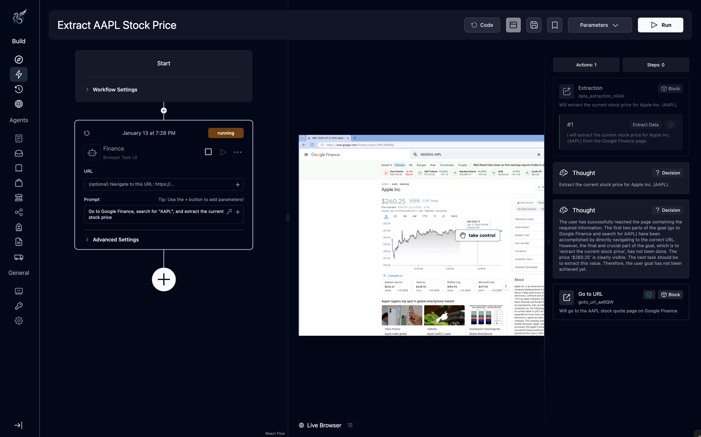

# Quickstart

Run your first browser automation task with the Skyvern agent in the next 5 mins.

This guide covers:
- Using the Cloud UI
- Getting your API key
- Installing the SDK
- Running the agent locally

## Try Skyvern Cloud

The fastest way to see Skyvern in action is through the web interface. No setup required.

### Step 1: Write a prompt

Open Skyvern Cloud and enter a task in the prompt box.

Some example prompts:
- "Go to hackernews.com and extract the titles of the top 3 posts."
- "Navigate to amazon.com, search for "wireless keyboard", and extract the name and price of the first 5 results."
- "Go to Google Finance, search for "AAPL", and extract the current stock price."


### Step 2: Watch the agent work

Click **Run**.

You can watch the action log and livestream of the browser feed as the Skyvern agent navigates, clicks, and extracts data.



## Integrate with Python SDK

### Step 1: Get your API key

To call Skyvern Agents from your application, you'll need an API key.

1. Go to Settings on Skyvern Cloud.
2. Copy your API key.

### Step 2: Install the Python SDK

<Tip title="Supported Python Versions" icon="fa-brands fa-python">
Python 3.11, 3.12 and 3.13
</Tip>

#### Using pip

Create a virtual environment and install the package:

On Linux/macOS:
```bash
python -m venv skyvern-env
source skyvern-env/bin/activate
pip install skyvern
```

On Windows:
```bash
python -m venv skyvern-env
skyvern-env\Scripts\activate
pip install skyvern
```

#### Using pipx

If you encounter Python version errors, consider using pipx. pipx installs Python CLI applications globally while still isolating them in virtual environments.

If you don't have pipx installed, follow the official pipx installation instructions.

```bash
pipx install skyvern
```

To uninstall:
```bash
pipx uninstall skyvern
```

### Step 3: Run a task with the SDK

This code sends a task to Skyvern Cloud, which executes it in a cloud-hosted browser.

You can watch the task recording or see logs in Skyvern Cloud

```python
from skyvern import Skyvern
import asyncio

skyvern = Skyvern(api_key="YOUR API KEY")

# OR pass the base_url to use any Skyvern service
# skyvern = Skyvern(base_url="http://localhost:8000", api_key="YOUR API KEY")

asyncio.run(skyvern.run_task(prompt="Find the top post on hackernews today"))
```

The SDK handles browser provisioning, task execution, and result retrieval. More details can be found in the [SDK Reference].

## Integrate with REST APIs

For JavaScript, TypeScript, or direct HTTP integrations, you can use the Skyvern API.

### Step 1: Get your API key

To call Skyvern Agents from your application, you'll need an API key.

1. Go to Settings on Skyvern Cloud.
2. Copy your API key.

### Step 2: Send a POST request

Execute a task via TypeScript. Install the client: `npm install @skyvern/client`

```typescript
import { SkyvernClient } from "@skyvern/client";

async function main() {
  const client = new SkyvernClient({
    apiKey: "YOUR_API_KEY",
  });
  
  await client.runTask({
    body: {
      prompt: "Find the top 3 posts on Hacker News.",
    },
  });
}

main();
```

Full endpoint documentation is available in the API Reference.

## Optional: Run tasks with the Skyvern Agent locally

The Skyvern Python CLI lets you run tasks in an emulated browser on your computer.

**Prerequisites:**
- Skyvern Python SDK installed
- Docker installed and running. Get it here.
- An OpenAI/Anthropic/Gemini API key. Get it here, here or here

### Step 1: Run setup command to generate local configuration

In the Python environment where you have the SDK installed, run:

```bash
skyvern init
```

This creates a `.env` file that contains your local `SKYVERN_API_KEY` among other settings.

### Step 2: Run a task

Once you have Skyvern server running on a local port, `http://0.0.0.0:8000`

```python
from skyvern import Skyvern
import asyncio

skyvern = Skyvern(base_url="http://localhost:8000", api_key="YOUR LOCAL API KEY")

asyncio.run(skyvern.run_task(prompt="Find the top post on hackernews today"))
```

This will open a browser window on your machine where Skyvern Agent will execute the task and close when completed. Recording and logs will be saved in the folder where Skyvern local server was initialized.

## Next steps

<CardGroup cols={2}>
  <Card
    title="Automations"
    icon="robot"
    href="/automations"
  >
    Learn how to extract structured data from Skyvern browser automation runs
  </Card>
  <Card
    title="Authentication"
    icon="key"
    href="/authentication"
  >
    Learn how to store login credentials workflows that involve signing-up or logging-in or even 2FA
  </Card>
  <Card
    title="Core Concepts"
    icon="book"
    href="/core-concepts"
  >
    Understand terms and concepts like Artifacts, Workflows and Tasks for agentic browser usage
  </Card>
  <Card
    title="Cookbook"
    icon="utensils"
    href="/cookbook"
  >
    See examples of complete workflows built with Skyvern
  </Card>
</CardGroup>
