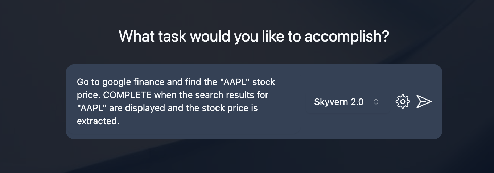
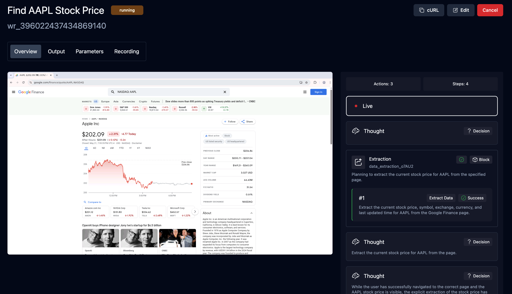

## Skyvern Cloud
Sign up on https://app.skyvern.com/ to get $5 free credits.

Ask the Skyvern agent to run a task and see it in action! Here are some examples you can try:
- `Navigate to the Hacker News homepage and get the top 3 posts.`
- `Go to google finance and find the "AAPL" stock price. COMPLETE when the search results for "AAPL" are displayed and the stock price is extracted.`




## Python SDK
<Tip title="Supported Python Versions" icon="fa-brands fa-python">
Python 3.11, 3.12 and 3.13
</Tip>

### Install Skyvern
```bash
pip install skyvern
```

### Run Task On A Skyvern Service
Get your API key from [Skyvern Cloud](https://app.skyvern.com/settings). Send the task to Skyvern Cloud:
```python
from skyvern import SkyvernAgent
import asyncio

skyvern = SkyvernAgent(api_key="YOUR API KEY")
# OR pass the base_url to use any Skyvern service
# skyvern = SkyvernAgent(base_url="http://localhost:8000", api_key="YOUR API KEY")

async def run_task():
	task = await skyvern.run_task(prompt="Find the top post on hackernews today")
	print(task)

asyncio.run(run_task())
```
More API & SDK information can be found in the [API Reference](/api-reference) section.

### Run Task Locally
You can also run browser tasks locally with Python code, with a little bit of set up:

1. **Configure Skyvern** Run the setup wizard which will guide you through the configuration process. This will generate a `.env` as the configuration settings file.
        ```bash
        skyvern init
        ```

2. **Run Task In Python Code**
        ```python
        from skyvern import SkyvernAgent
		import asyncio
        
        skyvern = SkyvernAgent()

		async def run_task():
	        task = await skyvern.run_task(
    	        prompt="Find the top post on hackernews today",
        	)
	        print(task.model_dump())
		
		asyncio.run(run_task())
	    ```
        A local browser will pop up. Skyvern will start executing the task in the browser and close the browser when the task is done.

<CardGroup cols={2}>
  <Card
    title="Quickstart (Skyvern Cloud)"
    icon="cloud"
    href="https://app.skyvern.com"
  >
    Start automating tasks with the hosted version of Skyvern
  </Card>
  <Card
    title="Quickstart (Open Source)"
    icon="github"
    href="https://github.com/Skyvern-AI/Skyvern"
  >
    Start automating tasks in your own cloud
  </Card>
</CardGroup>
