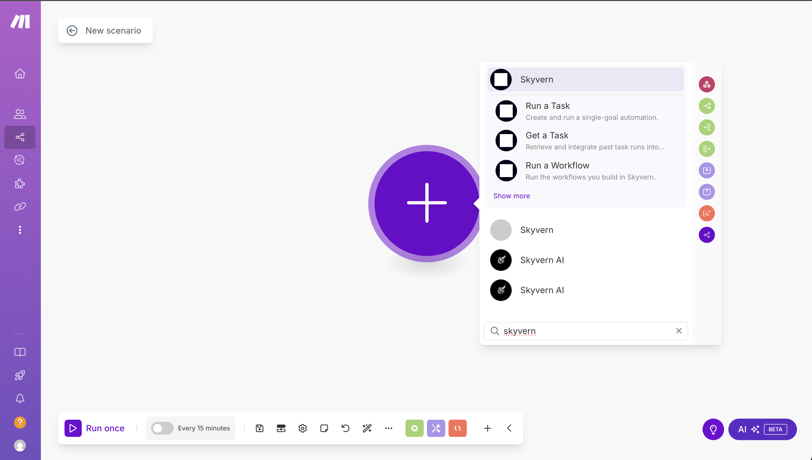
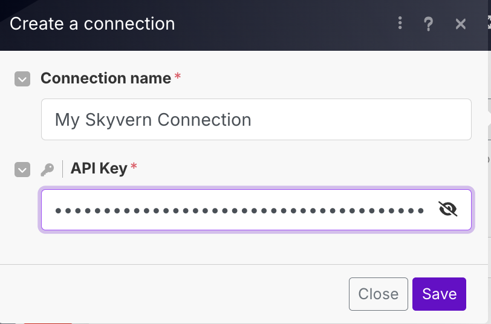
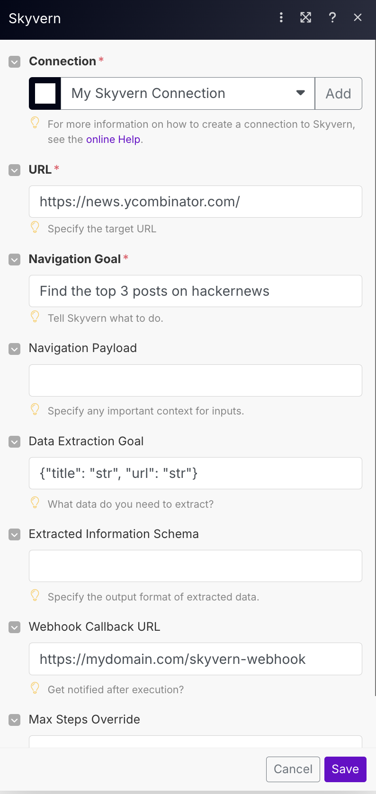

## Running a Skyvern Task in Make.com

1. Get a [Skyvern](https://app.skyvern.com/) account, navigate to settings and copy your API Key, you will need to link this in the make.com app.

2. Create a new scenario in Make.com. Search for the "Skyvern" app. Pick the Skyvern tool you want. Let's click the "Run a Task" for example.
   

3. Add a new connection and store the API Key from step 1 in the conn "API Key" field.
   

4. Run a task!
   