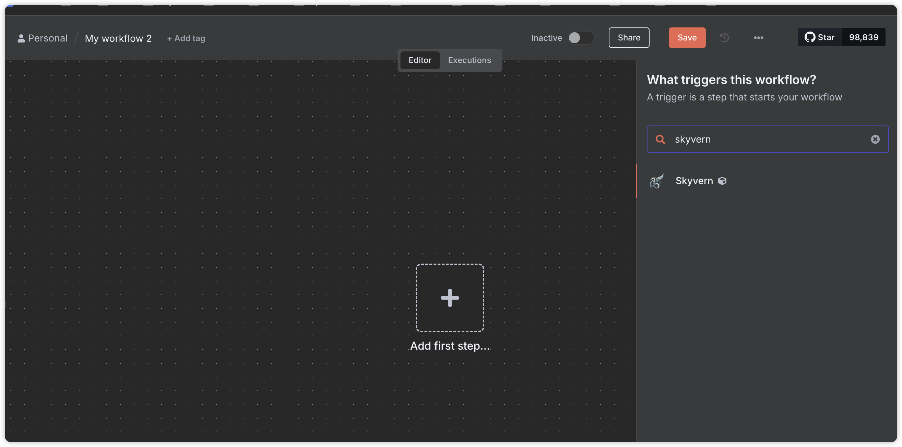
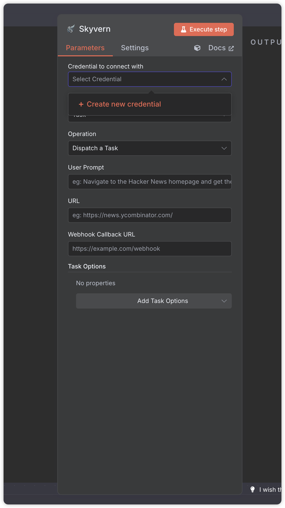
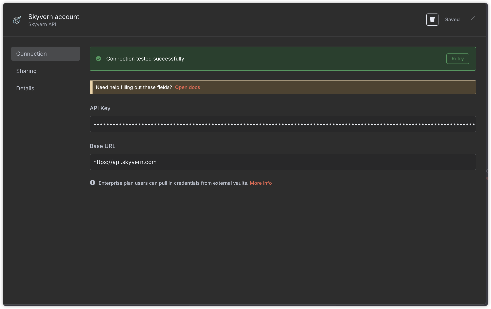
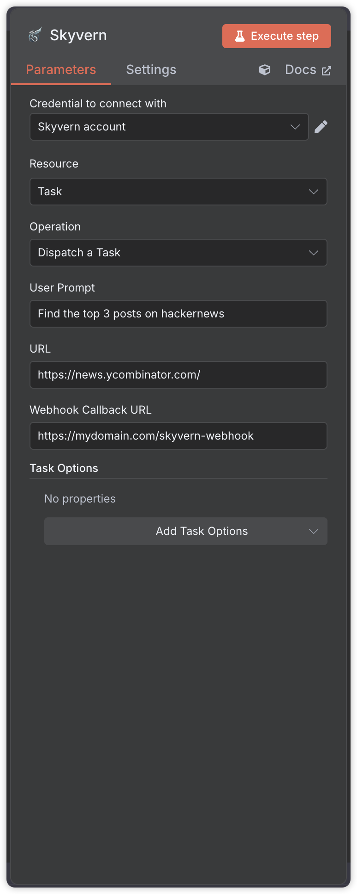
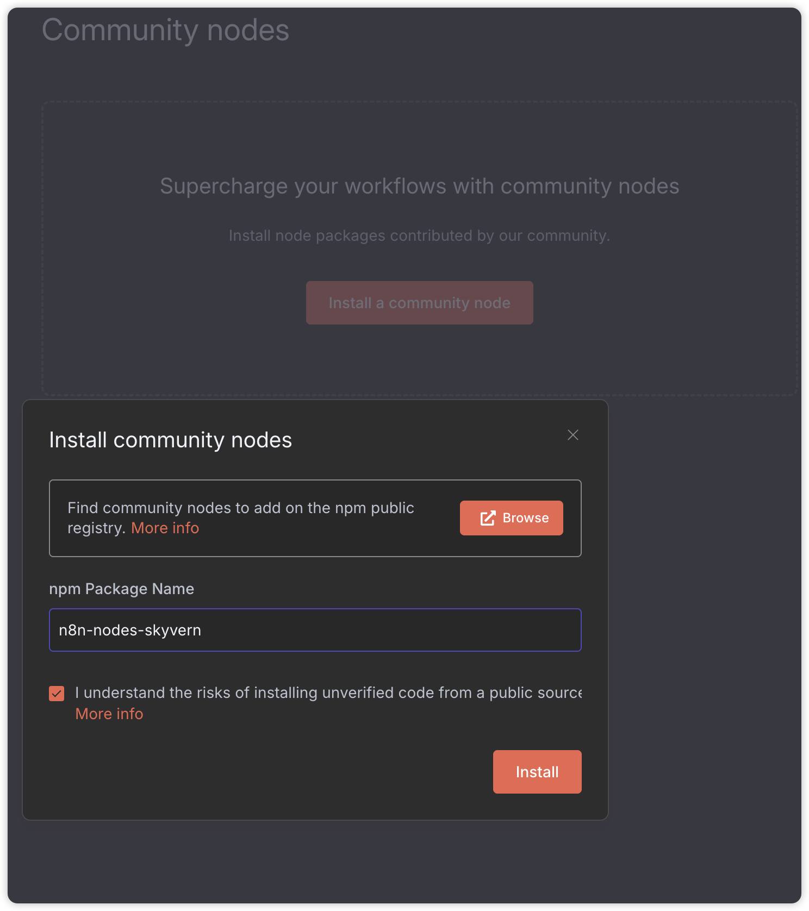
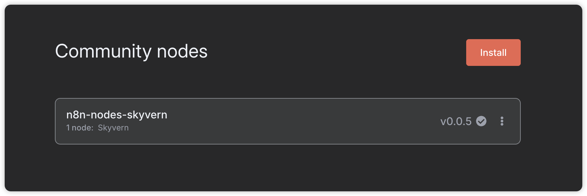

## Install Skyvern node in n8n
> official verified Skyvern node is coming soon.

1. Get a [Skyvern](https://app.skyvern.com/) account, navigate to settings and copy your API Key, you will need to link this in the n8n.

1. Install [Skyvern node](https://n8n.io/integrations/skyvern/Skyvern) in n8n. If you prefer using the Community Node, follow the [Community Node Setup](#community-node-setup) section.

## Running Skyvern
1. Create a new workflow. Search for the `Skyvern` node.
   

1. Create a new credential.
   

1. Store the API Key from step 1 in the `API Key` field and `Save`
   

1. Dispatch a task or workflow
   

## Community Node Setup

1. Install Skyvern as a community node. Following the [n8n docs](https://docs.n8n.io/integrations/community-nodes/installation/gui-install/) to install on GUI.

1. Search for `n8n-nodes-skyvern` and install.
    

1. Wait until it's successfully installed.
    