## Running a Skyvern Task in Workato

### Setup

1. Navigate to the community library tab, and search for Skyvern under “custom connectors”
   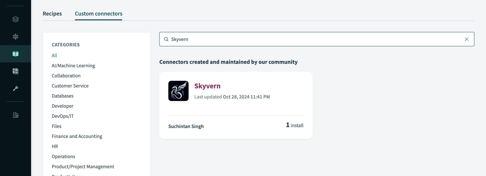

2. Once you find Skyvern and click into the app, you will be able to press “install” in the upper right hand corner
   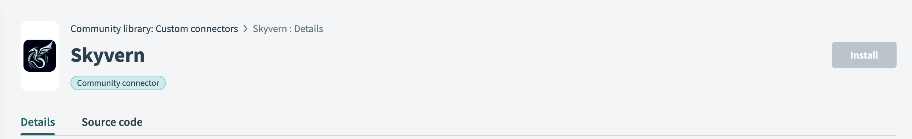

3. Make sure to select “release latest version” to be able to add your Skyvern integrator into your workflows
   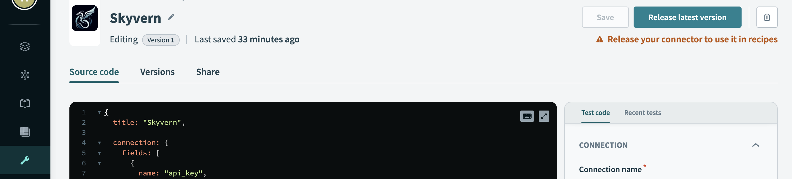

4. You will then need to create a new workflow or “recipe”

   1. If you are a returning user, you will configure setup, location, and starting point

   2. If you are a new user, you will configure recipe and project name, location, project description, and starting point

5. Once you’ve created your new workflow, set the trigger, add an “action in app” and search for Skyvern

   1. If Skyvern is not showing up in this search, it is likely that there was a misstep in tasks 1-3
      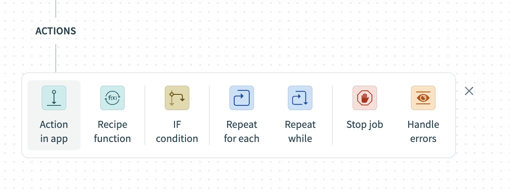

6. Once you select the Skyvern integration, pick your action. This section will describe how to set up, configure, and test the “Create and Run Task” action
   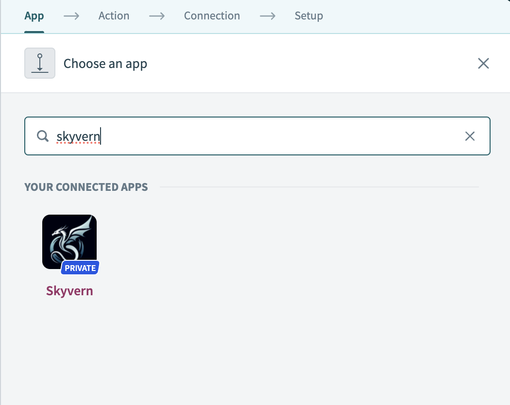
   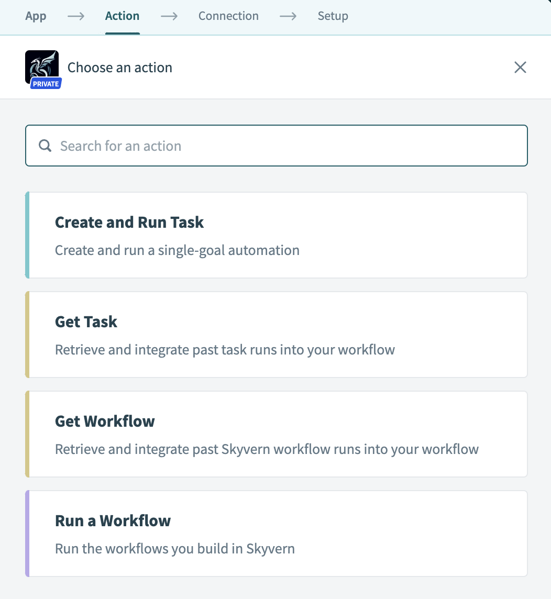

7. You will then be brought to the “Connection” tab where you need to link your Skyvern account. You will need to have a Skyvern account to be able to run to this integration. So after creating your account and/or logging in, navigate to settings and copy your API Key
   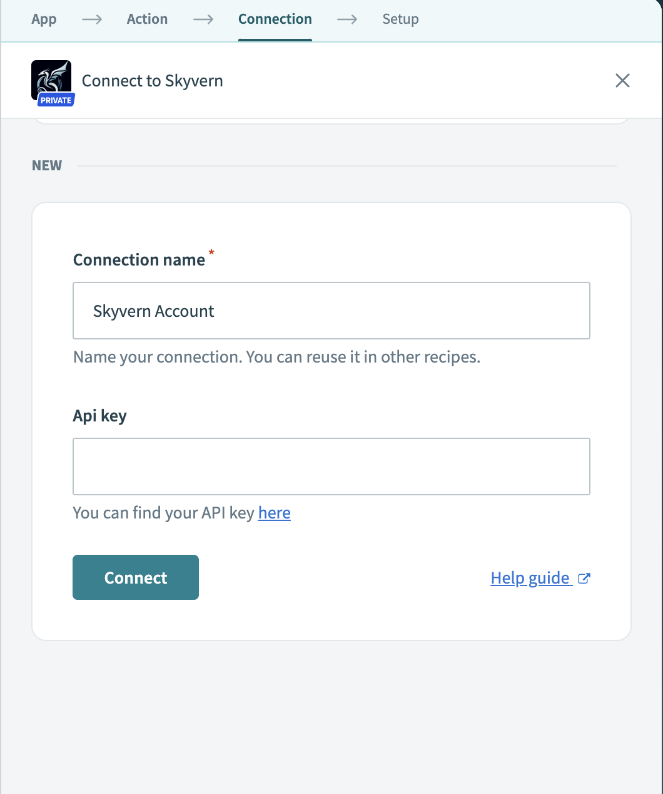

8. When you’re back to Workato, having copied your Skyvern API key, add a new connection and paste it under the API key input field

9. Once you’ve connected your account, all of the setup requirements are done and you will move onto setting up your integration

### Configure

1. *(required) URL:* Skyvern’s starting point

2. *(often required) Navigation Goal:* details where Skyvern is going and what Skyvern is doing. Clear Navigation Goals will be a single goal, broken down into steps. You need to specify when the goal is complete, using “COMPLETE”, or when to abandon that goal, using “TERMINATE”

   * The navigation goal is not used to load the URL. Asking Skyvern to “go to website A” in this field will not have the intended effect

   * Terminations result in Skyvern explaining why it stopped navigating

   * This field can be omitted if you only want Skyvern to extract data

3. *(optional) Data Extraction Goal:* aside from where Skyvern is going and what Skyvern is doing, is there anything that Skyvern is extracting and returning back? A good data extraction goal is specific about what Skyvern is returning to the user

   * Note that data extractions only happen AFTER Skyvern is finished navigating

4. *(optional) Navigation Payload:* if you need any content inputted during your task flow, that content goes here in JSON format

   * If you want to run the same task for different users (i.e. filling out the same form multiple times), you should keep everything else the same and update the Navigation Payload

5. *(optional) Extracted Information Schema:* if you have a data extraction goal, some users need it formatted in a certain way for internal purposes. Navigation payload accepts JSON formatted specifications for how the data should be returned

6. *(optional) Webhook Callback URL:* This URL can be specified if you would like Skyvern to notify you when it’s finished executing

7. *(optional) Max Steps:* some users want to cap cost through the number of steps the task can take

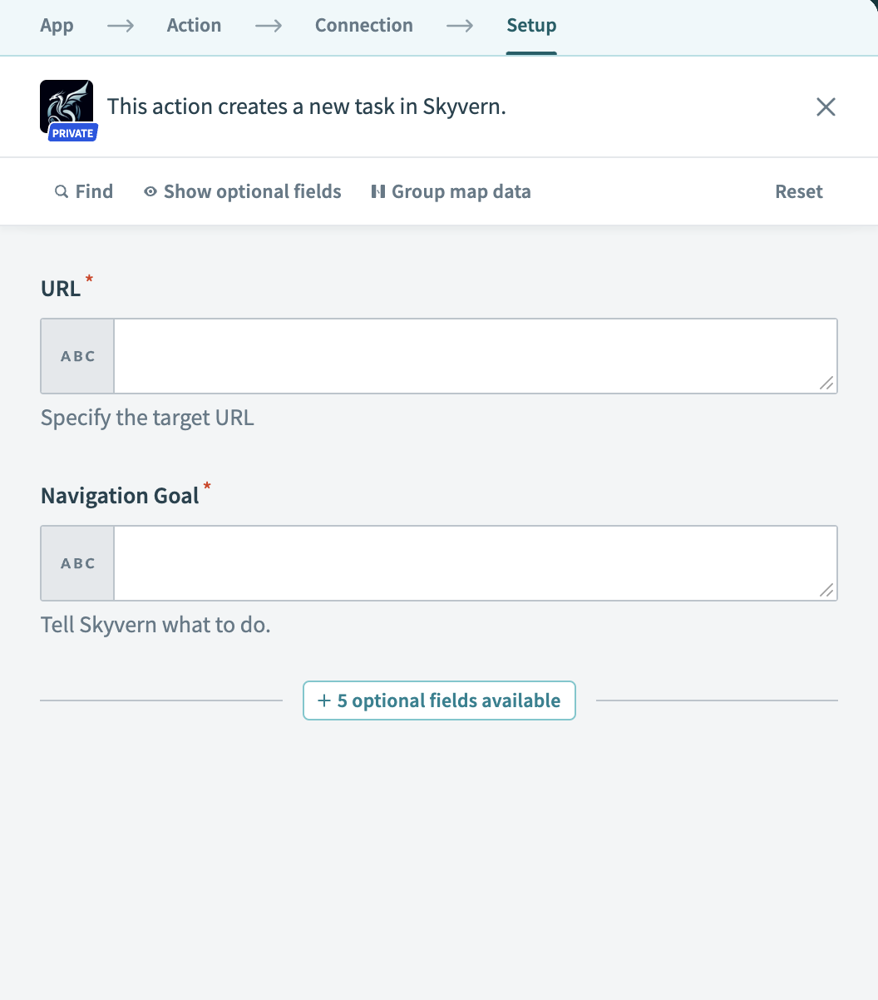

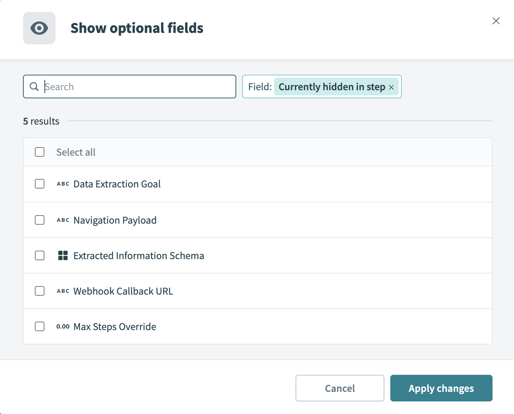

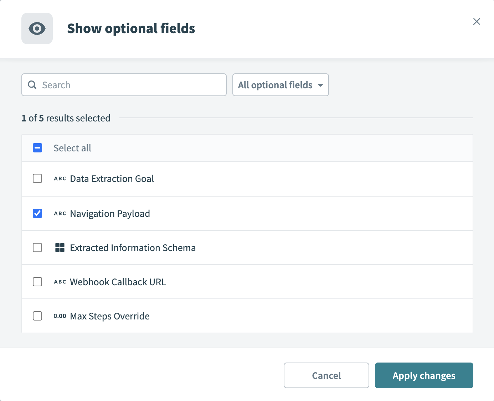

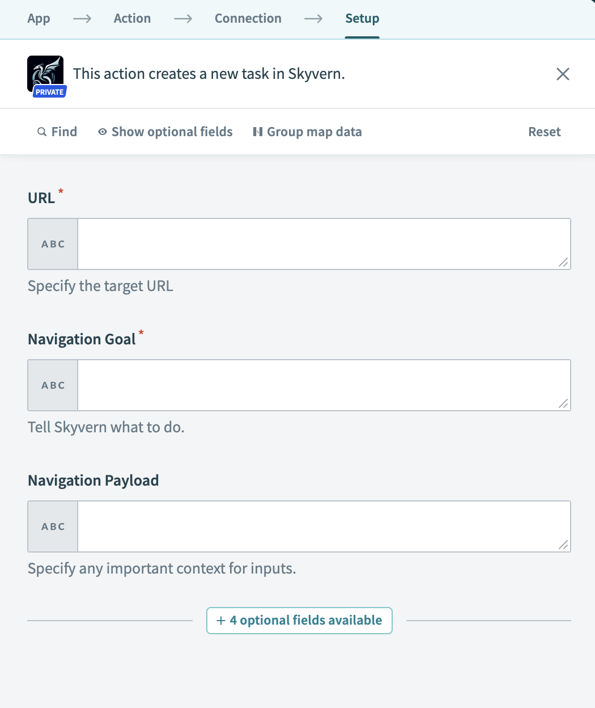

### Test

1. Testing in Workato is done by testing the entire “recipe,” or workflow. Make sure to hit the “save” button in the upper right hand corner and then “test recipe”

2. Once the flow is triggered, Workato will tell you what nodes in the sequence ran successfully, failed, and why. Make sure to click through each node to see what the inputs were and their corresponding outputs. Note that you should also check your Skyvern account to see if the task was correctly triggered and the contents are correct under “parameters”

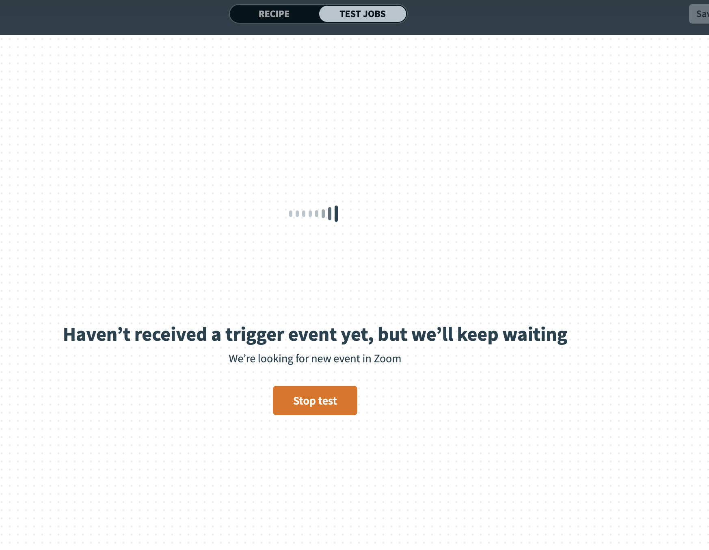

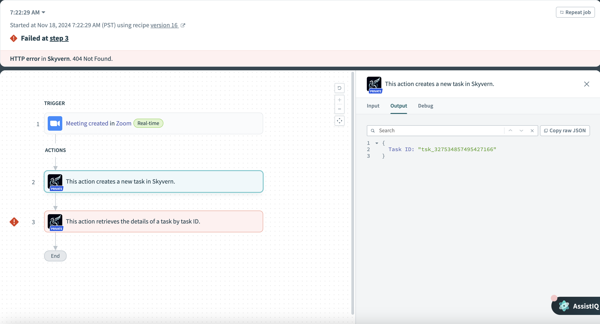

## Running a Skyvern Workflow in Workato

### Setup

1. First, create your workflow in Skyvern. The purpose of this block is to run a pre-configured workflow inside of Workato. Every workflow tool has limitations, allowing you to run a Skyvern workflow in another workflow builder extends the possibilities of their tool

2. Complete the same setup as detailed above in the task block instructions, following steps 1-9. At the end of the setup you will have configured a trigger, selected the “Run a Workflow” action, and connected your Skyvern account

### Configure

1. Select what workflow you would like to run

   1. If there are no selections, make sure to check your Skyvern account and see if you have any saved workflows you can run

2. Once you’ve selected the workflow you’d like to run, the only thing you need to configure are whatever parameters you have linked in your workflow.

   1. If you don’t have parameters, and instead have fixed values, don’t worry about this step!

3. If your workflow has parameters, they should populate. Add or amend the values to customize the workflow run

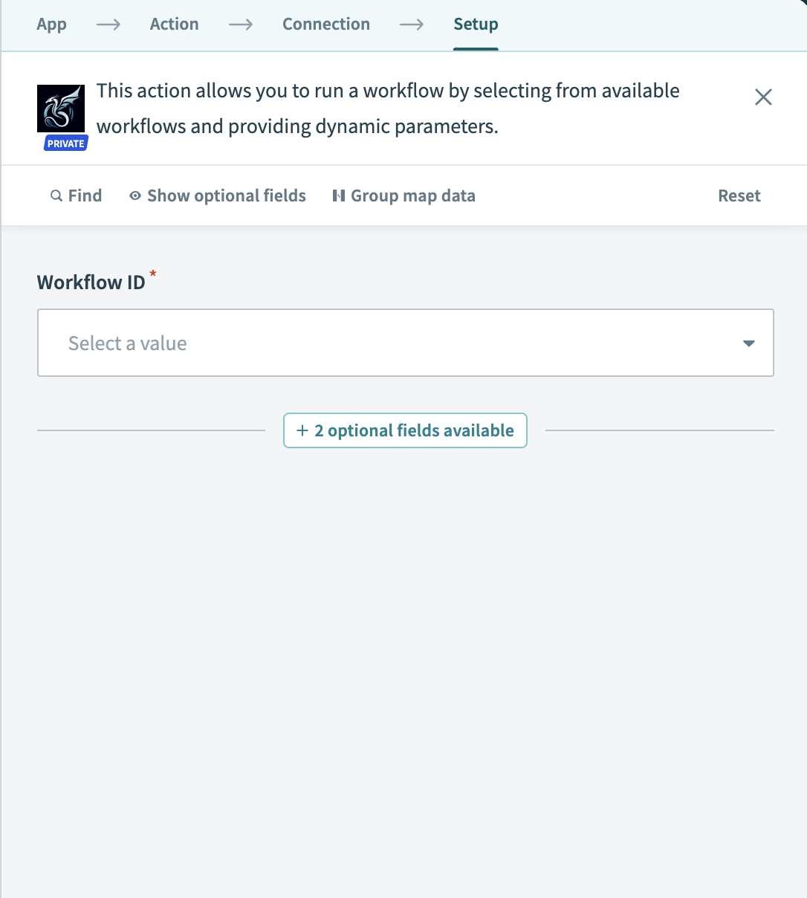

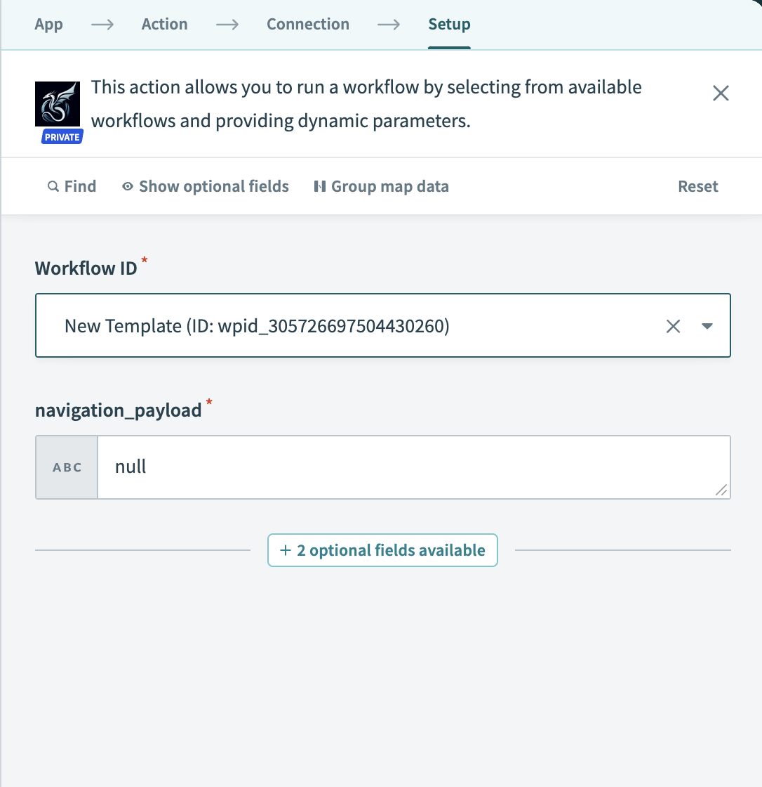

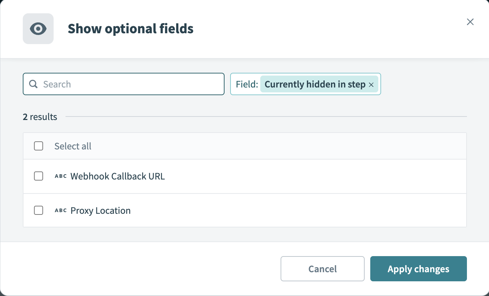

### Test

1. Testing in Workato is done by testing the entire “recipe,” or workflow. Make sure to hit the “save” button in the upper right hand corner and then “test recipe.” See the task block “test” instructions above for more detail on debugging

## Adding a Previously Ran Task or Workflow in Workato

### Setup

1. This block “gets,” or pulls the output of a previous run into your Workato workflow. The Get a Workflow does so for a workflow run, the Get a Task does so for a task run.

2. Complete the same setup as detailed above in the the task block instructions, following steps 1-9. At the end of the setup you will have configured a trigger, selected the “Get a Task” or “Get a Workflow” action, and connected your Skyvern account

### Configure

1. Since this action is pulling a previously ran task or workflow, the run you want to use needs to have already run/finished running to be able to pull it into your Workato workflow

2. Depending on whether you selected a “Get a Task” or “Get a Workflow” action, find the appropriate ID

   1. The Workflow Run ID starts with a WR and the Task ID starts with a TSK

3. Once you’ve selected the Workflow Run ID or Task ID for the run you would like to add to your action, paste it into the input field

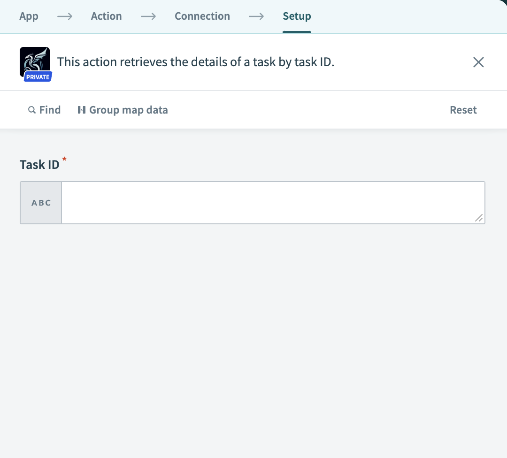

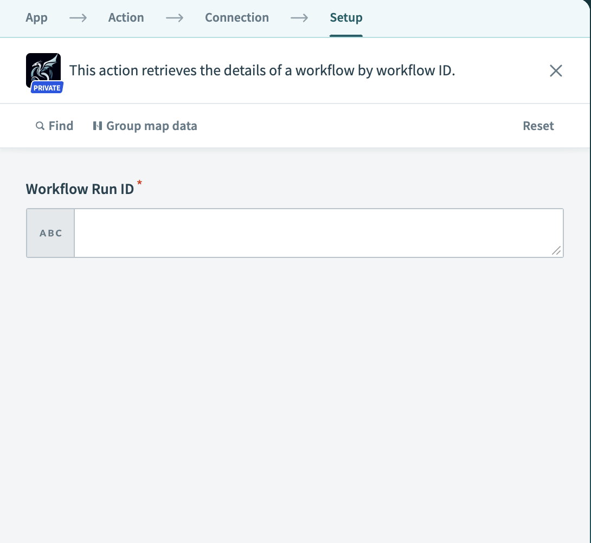

### Test

1. Testing in Workato is done by testing the entire “recipe,” or workflow. Make sure to hit the “save” button in the upper right hand corner and then “test recipe.” See the task block “test” instructions above for more detail on debugging