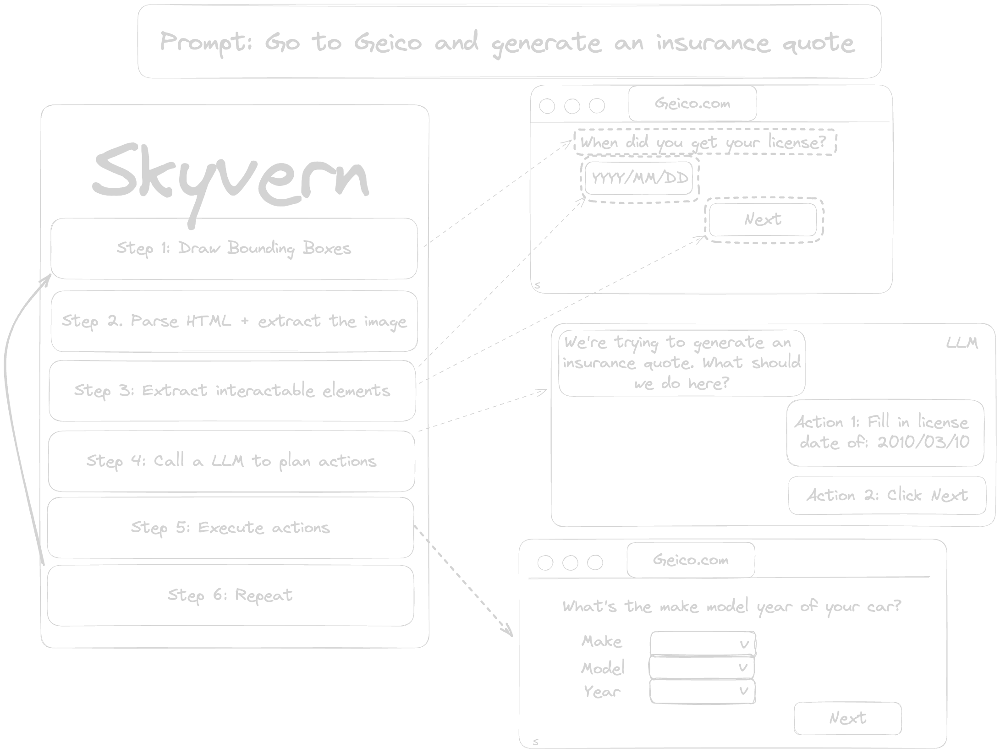

[Skyvern](https://www.skyvern.com) automates browser-based workflows using LLMs and computer vision. It provides a simple API endpoint to fully automate manual workflows, replacing brittle or unreliable automation solutions. 

  

# Why Skyvern?

Traditional approaches to browser automations required writing custom scripts for websites, often relying on DOM parsing and XPath-based interactions which would break whenever the website layouts changed.

Instead of relying solely on code-defined XPath interactions, Skyvern uses prompts along with computer vision and LLMs to parse items in the viewport in real time, plan interactions, and execute them

This approach gives us a few advantages:

1. Skyvern can operate on websites it’s never seen before, as it’s able to map visual elements to actions necessary to complete a workflow, without any customized code
1. Skyvern is resistant to website layout changes, as there are no pre-determined XPaths or other selectors our system is looking for while trying to navigate
1. Skyvern is able to take a single workflow and apply it to a large number of websites, as it’s able to reason through the interactions necessary to complete the workflow
1. Skyvern leverages LLMs to reason through interactions to ensure we can cover complex situations. Examples include:
    1. If you wanted to get an auto insurance quote from Geico, the answer to a common question “Were you eligible to drive at 18?” could be inferred from the driver receiving their license at age 16
    1. If you were doing competitor analysis, it understands that an Arnold Palmer 22‑oz can at 7/11 is almost certainly the same product as a 23‑oz can at Gopuff (even though the sizes are slightly different, which could be a rounding error!)

Want to see examples of Skyvern in action? [Check out some examples we have here](/getting-started/skyvern-in-action)

# How it works
Skyvern was inspired by the Task-Driven autonomous agent design popularized by [BabyAGI](https://github.com/yoheinakajima/babyagi) and [AutoGPT](https://github.com/Significant-Gravitas/AutoGPT) -- with one major bonus: we give Skyvern the ability to interact with websites using browser automation libraries like [Playwright](https://playwright.dev/).

<picture>
  
  
</picture>

## Skyvern use-cases

<CardGroup cols={2}>
  <Card
    title="Automatically apply to jobs"
    icon="magnifying-glass"
    href="/getting-started/skyvern-in-action#automatically-apply-to-jobs-on-sites-like-lever-co"
  >
    Watch Skyvern automatically apply to jobs
  </Card>
  <Card
    title="Automate e-commerce transactions"
    icon="cart-shopping"
    href="/getting-started/skyvern-in-action#automate-transactions-on-e-commerce-websites"
  >
    Watch Skyvern automate purchases on e-commerce websites
  </Card>
  <Card
    title="Interact with government websites"
    icon="landmark-dome"
    href="/getting-started/skyvern-in-action#navigating-to-government-websites-to-register-accounts-or-fill-out-forms"
  >
    Watch Skyvern automate interacting with government websites
  </Card>
  <Card
    title="Generate insurance quotes"
    icon="clipboard"
    href="/getting-started/skyvern-in-action#retrieving-insurance-quotes-from-insurance-providers-in-any-language"
  >
    Watch Skyvern navigate complex multi-page forms in any language
  </Card>
</CardGroup>
