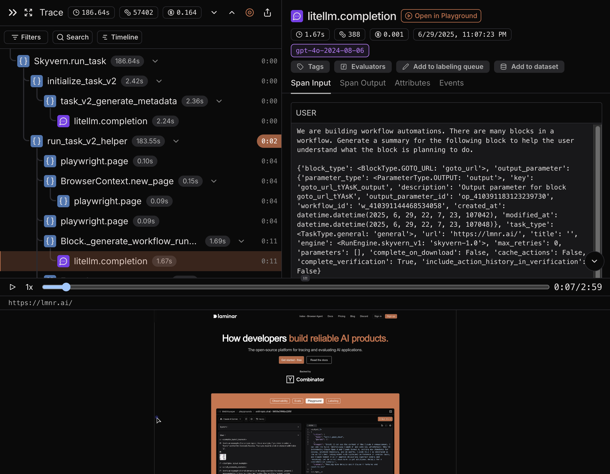

## Overview

[Laminar](https://lmnr.ai) is an open-source observability and evaluations platform for AI agents.

Laminar provides comprehensive instrumentation of Skyvern with all core functions being traced automatically. This includes full browser session recordings that capture every interaction, making it immensely valuable for debugging failed workflows and evaluating automation performance.

<Tip>
  Laminar excels at tracing AI-powered browser automation by providing visibility into LLM decision-making processes, browser interaction outcomes, and complete session recordings synchronized with execution steps.
</Tip>

Copy of this guide is available in the [Laminar documentation](https://docs.lmnr.ai/tracing/integrations/skyvern).

## Quickstart

To trace Skyvern workflows with Laminar, **initialize Laminar and configure LiteLLM callbacks at the top of your project**. This will automatically capture all LLM calls, browser session recordings, and workflow execution details.

```python {3-4} {8-12} {14-15}
from skyvern import Skyvern
import asyncio
import litellm
from lmnr import Laminar, LaminarLiteLLMCallback, Instruments
from dotenv import load_dotenv

load_dotenv()

# Initialize Laminar
# This will automatically trace all Skyvern functions
# Disable OpenAI to avoid double instrumentation of LLM calls
Laminar.initialize(disabled_instruments=set([Instruments.OPENAI]))

# Configure LiteLLM to trace all LLM calls made by Skyvern
litellm.callbacks = [LaminarLiteLLMCallback()]

skyvern = Skyvern()

async def main():
    task = await skyvern.run_task(
        prompt="go to lmnr.ai, summarize the pricing page."
    )
    print(task)

if __name__ == "__main__":
    asyncio.run(main())
```

## Viewing Traces

You can view traces in the Laminar UI by navigating to the traces tab in your project. When you select a trace, you can see:

- **Browser Session Recording**: Full video recording of the browser window synchronized with execution steps - immensely valuable for debugging failed workflows and evaluating automation quality
- **LLM Interactions**: All prompts sent to the language model and their responses
- **Workflow Steps**: Sequential execution of tasks and their outcomes
- **Performance Metrics**: Latency, token usage, and cost
- **Image tracing**: Browser screenshots that were sent to LLM for analysis
- **Error Handling**: Exceptions and errors that occurred during the execution

The trace timeline shows the complete workflow execution with synchronized browser recordings, making it easy to debug issues, understand failure points, and optimize performance. This is particularly powerful for evaluations where you can visually verify whether the automation achieved the intended outcome.


<picture>
  
</picture>