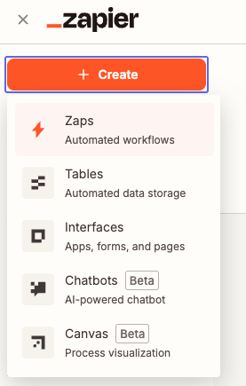
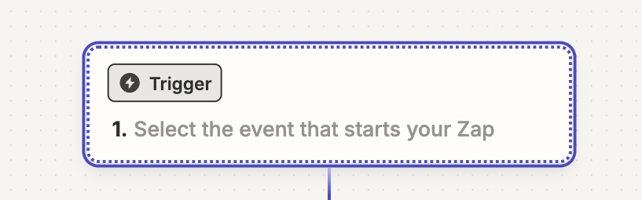
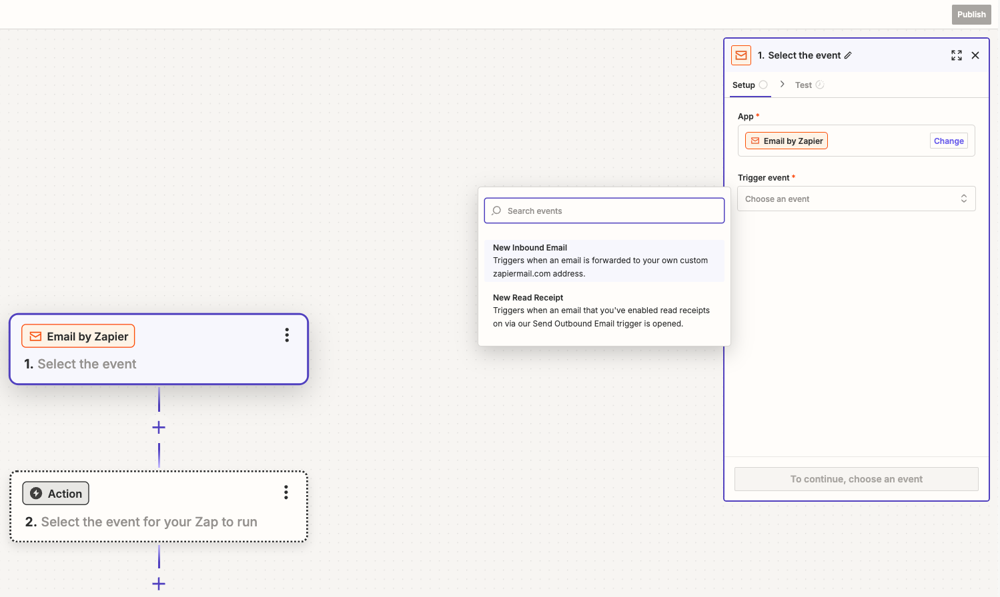
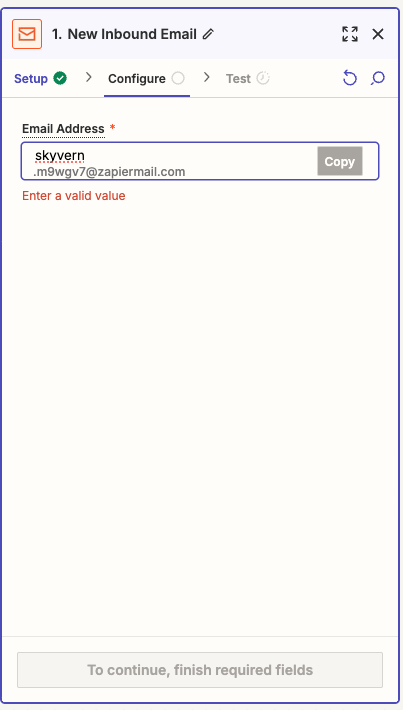
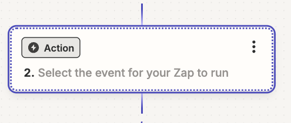
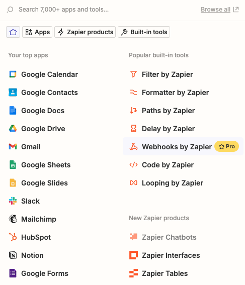
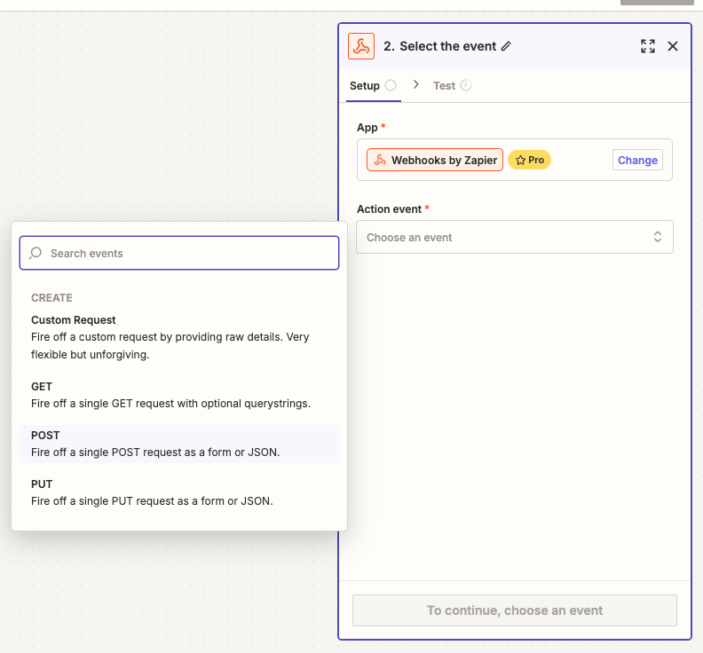
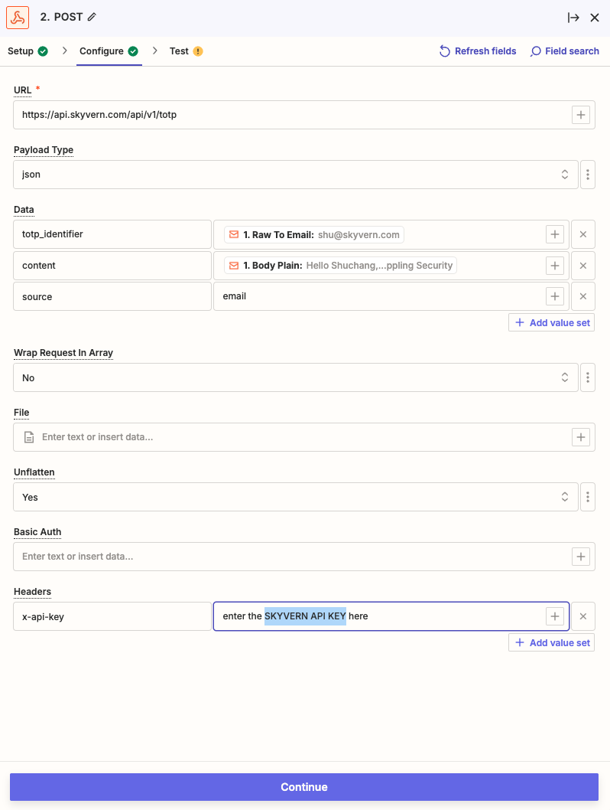
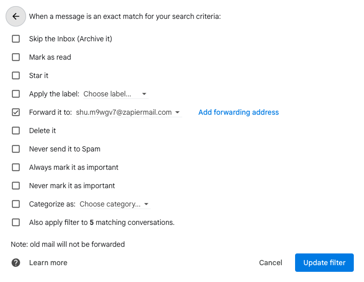
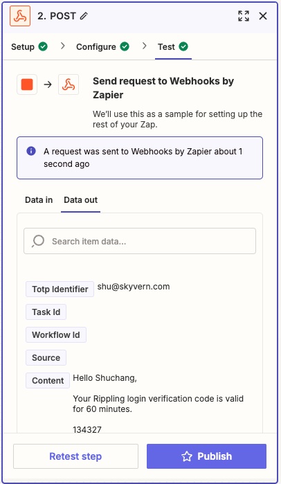

<Warning> DEPRECATION ALERT: the content in this page including endpoints mentioned here is being deprecated. Last supported date: Jan 1, 2026. If you're looking for TOTP (2FA/MFA) information, move to the new [TOTP](/credentials/totp) page.</Warning>

## Overriding the max_steps parameter in the task
If you want the task to execute for a specific number of steps, you can use the `x-max-steps-override` header in the request. This will override the default `max_steps` parameter set in the task.

```json
POST https://api.skyvern.com/api/v1/tasks 

Headers:
{
    "x-api-key": "YOUR_API_KEY",
    "x-max-steps-override": 10
}

Body:
.. usual task body ..
```

## Time-based One-time Password (TOTP)

Skyvern supports one-time password (see https://www.twilio.com/docs/glossary/totp for more information), also known as 2FA/MFA, in two ways: 1) Skyvern gets the code from your endpoint 2) You push the code to Skyvern.

### Get Code From Your Endpoint
You can pass `totp_verification_url` when [creating a task](/running-tasks/api-spec#request-initiate-a-task). Inside this endpoint hosted by you, you have to conform to the following schema:

#### Set Up Your TOTP Endpoint
For websites that requires a verification code to complete a task, you have to set up a TOTP endpoint for Skyvern to fetch the verification code.

Here's the TOTP endpoint contract you should use:

Request (POST):
| Parameter | Type | Required? | Sample Value | Description |
| --- | --- | --- | --- | --- |
| task_id | String | yes | tsk_123 | The task ID that needs the verification to be done |

Response:
| Parameter | Type | Required? | Sample Value | Description |
| --- | --- | --- | --- | --- |
| task_id | String | yes | tsk_123 | The task ID that needs the verification to be done |
| verification_code | String | no | 123456 | The verification code |

#### Validate The Sender of The Request
Same as the webhook API, your server needs to make sure it’s Skyvern that’s making the request.

- a python example for how to generate and validate the signature:

```python
def validate_skyvern_request_headers(request: Request) -> bool:
    header_skyvern_signature = request.headers["x-skyvern-signature"]
    payload = request.body() # this is a bytes
    hash_obj = hmac.new(SKYVERN_API_KEY.encode("utf-8"), msg=payload, digestmod=hashlib.sha256)
    client_generated_signature = hash_obj.hexdigest()
    return header_skyvern_signature == client_generated_signature
```

SKYVERN_API_KEY: this is the [api key](/running-tasks/introduction) specific to your organization

### Push Code To Skyvern
You can pass `totp_identifier` when [creating a task](/running-tasks/api-spec#request-initiate-a-task). When the TOTP code arrives at your inbox or as a text message, all you need to do is to send the email/message (Gmail + Zapier integration can be a good solution to set up email forwarding) to Skyvern's TOTP receiver endpoint (see below)

#### Skyvern's TOTP Endpoint
This endpoint takes your TOTP/2FA/MFA code, stores it in Skyvern’s database and uses it while running tasks/workflows.

Request type: `POST`

Endpoint url: `https://api.skyvern.com/api/v1/totp`

Authentication: same as other Skyvern APIs, you need to pass your api key with the `x-api-key` header.

Request data:
| field | required | type | example | description |
| --- | --- | --- | --- | --- |
| totp_identifier | yes | string | An email address or phone number which received the code | this is a required field as this is the best way for skyvern to know what the identifier  |
| content | yes | string |  | the email content of a 2FA email; the text message for the verification code |
| task_id | no | string | tsk_22222222 | used to help skyvern locate the totp code more accurately for your task |
| workflow_run_id | no | string | wr_123456 | The ID of your workflow run. It's used to help better locate the totp code accurately for a specific workflow run |
| source | no | string | email, phone, app, etc |  |
| expired_at | no | timestamp | 2024-09-18T05:15:02 | The expiration time of the code. If provided, skyvern uses it to decide if the code is valid |

#### Forwarding Your Email To Skyvern (Gmail + Zapier)
This setup requires a Zapier pro plan account.

**Step 1. Create a Zapier Zap**

Go to https://zapier.com/app/home and create new Zaps
<p align="center">
  
</p>

In the newly created Zap draft, Click the “Trigger” button
<p align="center">
  
</p>

Click `Email by Zapier`
<p align="center">
  
</p>

In the Email “Setup”, pick `New Inbound Email` in the `Trigger event` selection. Click `Continue` to complete the “Setup”
<p align="center">
  
</p>

In Email “Configure”, create an email address which will be used to forward emails for TOTP codes. Click “Continue”.
<p align="center">
  
</p>

Let’s add the Action to complete the Zapier setup before coming back to test it. Click the “Action” button and add `Webhooks by Zapier`
<p align="center">
  
</p>

<p align="center">
  
</p>

In the Setup, choose “POST” under the `Action event` selection. Then click “Continue”.
<p align="center">
  
</p>

In the “Configure”, set up these in order to make a POST request to Skyvern’s TOTP API:

- URL: [`https://api.skyvern.com/api/v1/totp`](https://api.skyvern.com/api/v1/totp)
- Payload Type: json
- Data:
    - totp_identifier: choose `Raw To Email` after clicking the “+” sign
    - content: choose `Body Plain` after clicking the “+” sign
    - source: email
- Headers:
    - x-api-key: `Your Skyvern API Key`

<p align="center">
  
</p>
Click Continue

**Step 2. Add forwarding email and create a filter in Gmail**

Go to Gmail Settings → Forwarding and POP/IMAP (https://mail.google.com/mail/u/0/#settings/fwdandpop) → click “Add a forwarding address” → enter the zapier email address you just created. There might be some verifications, including a verification email from Zapier, you have to complete here.

After setting up the forwarding email address, go to “Filters and Blocked Addresses” (https://mail.google.com/mail/u/0/#settings/filters). Click “Create a new filter” and set up your email filtering rule for your TOTP (2FA/MFA) emails. Click “Create filter”. Check “Forward it to” and pick the new email address and update filter.

<p align="center">
  
</p>

**Step 3. Test it end to end!**

You can forward any previous TOTP (2FA/MFA) email to the Zapier email address you created in Step 1.

In Zapier: under the “Test” of the Webhooks action, send a request to test it out. If your test is successful, you should see a `A request was sent to Webhooks by Zapier` message

<p align="center">
  
</p>
