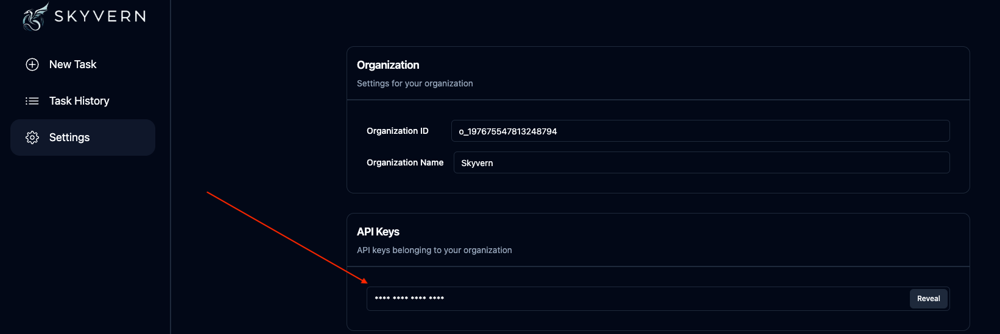

# Getting your API Key

1. Navigate to [app.skyvern.com](https://app.skyvern.com) and log into your account
1. Validate that you're in the correct account (personal vs organization)
1. Click on "Settings"
1. Click Reveal to see your API key. This is the unique key associated with your account that allows you to interact with Skyvern

