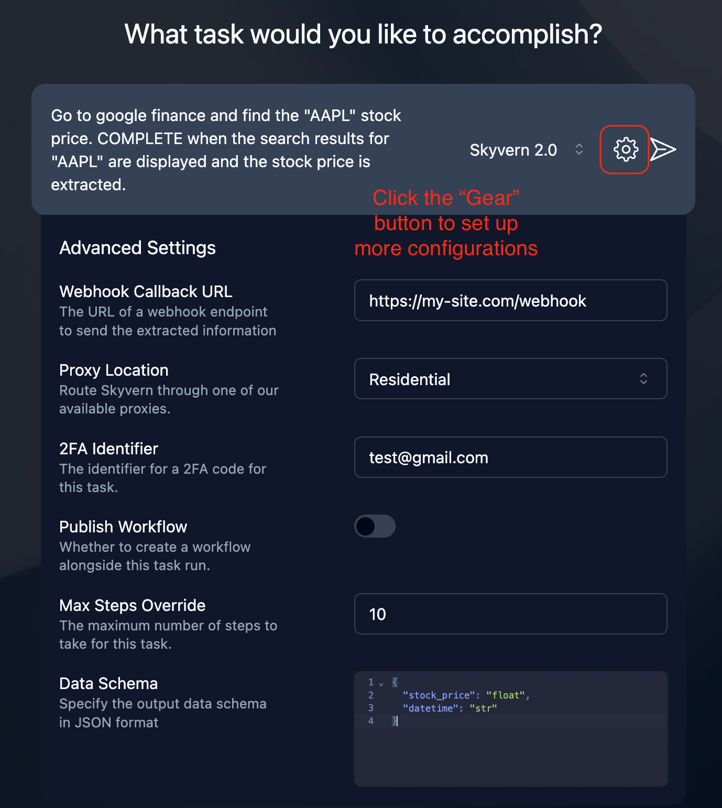

## Run A Task
- See the [Quickstart](/getting-started/quickstart) to run a simple task.
- See the [Run Task API and SDK](/api-reference/api-reference/agent/run-task).

There are many features to help automate and improve your task experience. Check out the features along with its parameter name below.

All the features are enabled through API & SDK. Some features are also enabled through [the Discover UI](https://app.skyvern.com/discover) as well.
<Frame caption="Run Task UI">

</Frame>

### [Engine](/api-reference/api-reference/agent/run-task#request.body.engine)

Parameter: `engine`

This parameter defines the engine that powers the agent task.

- `skyvern-2.0`: this is the default engine. It's the latest Skyvern agent that performs really well with complex and multi-step tasks. It scores **state of the art** 85.85% on the [WebVoyager benchmark](https://blog.skyvern.com/skyvern-2-0-state-of-the-art-web-navigation-with-85-8-on-webvoyager-eval/).
- `skyvern-1.0`: performs really well for tasks with a simple goal, like filling a form, or searching for information on Google.
- `openai-cua`: uses OpenAI's CUA model.
- `anthropic-cua`: uses Anthropic's Claude Sonnet 3.7 model with the computer use tool.


### [Data Extraction Schema](/api-reference/api-reference/agent/run-task#request.body.data_extraction_schema)

Parameter: `data_extraction_schema`

The schema for data to be extracted from the webpage. If you're looking for consistent data schema being returned by the agent, it's highly recommended to use https://json-schema.org/.

### [Send webhook when task is done](/api-reference/api-reference/agent/run-task#request.body.webhook_url)

Parameter: `webhook_url`

If the task takes long to complete, you can set the `webhook_url` to receive status updates when it's done. 

Here's the schema of the webhook payload:
```json
{
	"TODO": "Add webhook schema"
}
```

### [Max Steps](/api-reference/api-reference/agent/run-task#request.body.max_steps)

Parameter: `max_steps`

Maximum number of steps the task can take. Task will fail if it exceeds this number. Cautions: you are charged per step so please set this number to a reasonable value. Contact sales@skyvern.com for custom pricing.

### [Error Code Mapping](/api-reference/api-reference/agent/run-task#request.body.error_code_mapping)

Parameter: `error_code_mapping`

Custom mapping of error codes to error messages if Skyvern encounters an error.

For example:
```json
[
    {"login_failed": "The login credentials are incorrect or the account is locked"},
    {"maintenance_mode": "The website is down for maintenance"},
]
```
With this mapping, if Skyvern encounters a login failure, the task output will show `{"error": "login_failed"}`, which makes it easy to codify error handling.

### [Pick a proxy location](/api-reference/api-reference/agent/run-task#request.body.proxy_location)

Parameter: `proxy_location`

Some websites block requests from certain countries. You can set a proxy location to route the browser traffic through.

### TOTP (2FA/MFA/Verification) Code
- [totp_identifier](/api-reference/api-reference/agent/run-task#request.body.totp_identifier): Skyvern can receive the TOTP code and use this identifier to identify the code for authentication.
- [totp_url](/api-reference/api-reference/agent/run-task#request.body.totp_url): Skyvern makes a request to this URL to fetch the TOTP code when needed.

More details can be found in the [TOTP section](/credentials/totp).

### [Run Task in a Persistent Browser Session](/api-reference/api-reference/agent/run-task#request.body.browser_session_id) (`browser_session_id`)
You can set a browser session to use for the task. Having a browser session can persist the real-time state of the browser, so that the next run can continue from where the previous run left off.

See the [Browser Sessions](/browser-sessions/introduction) section to see how to create a browser session.


### Cancel A Running Task


### Replay Webhook of A Task