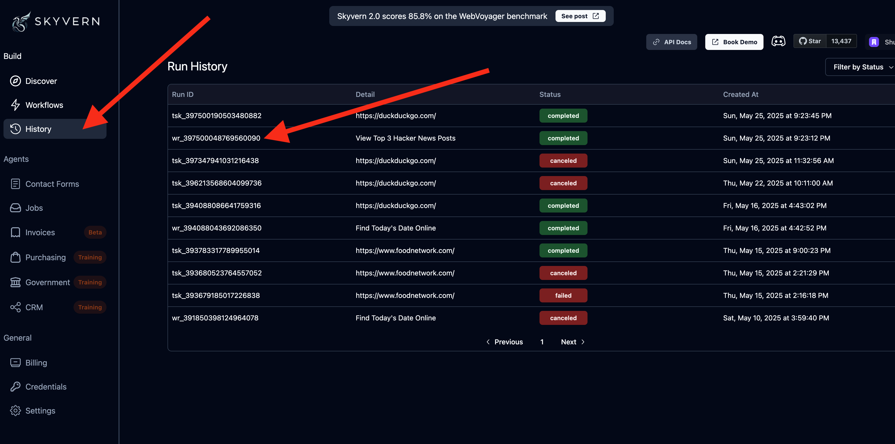
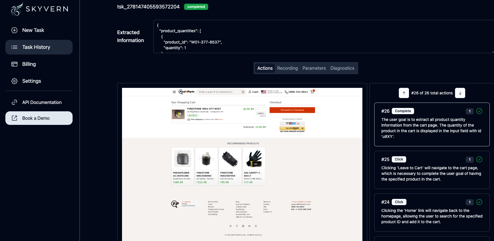
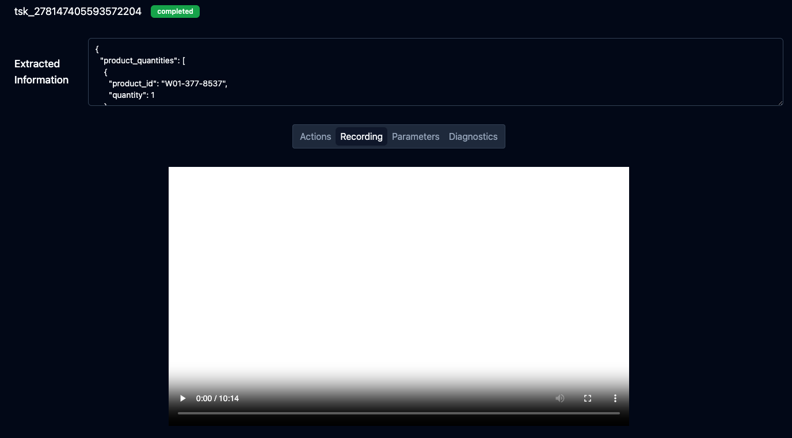
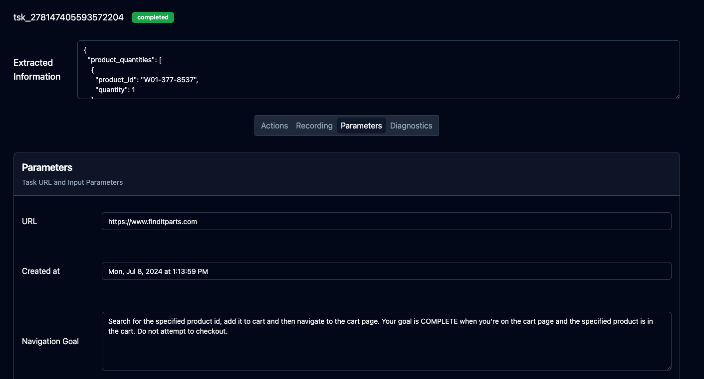
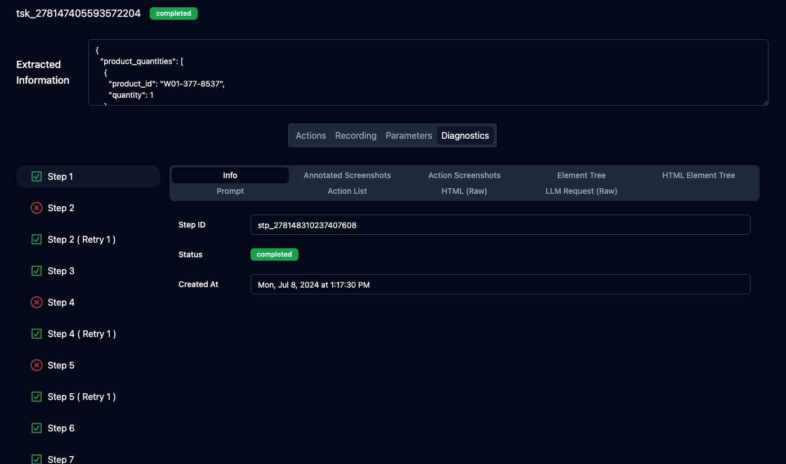

Skyvern comes bundled with a Visualizer to help you understand what's going on with your tasks. To get started, navigate to the history page and click on any agent run.

## Actions 
Each action that Skyvern takes can be viewed in the Action viewer. It's accompanied with a screenshot of the screen state *after* the action has executed

## Recording 
Each Skyvern task comes with a recording of the entire operation (end to end). To view the recording, click on the recording tab.

## Task Parameters 
The task parameters are the inputs that you provided to Skyvern. This includes the URL, the extraction rules, and any other information that you provided to Skyvern.

## Diagnostic Logs
The diagnostics tab contains information used by Skyvern to do its processing. It includes information such as the annotated screenshots, action screenshots, element tree, prompt, action list, page HTML, and the raw LLM Request. 

