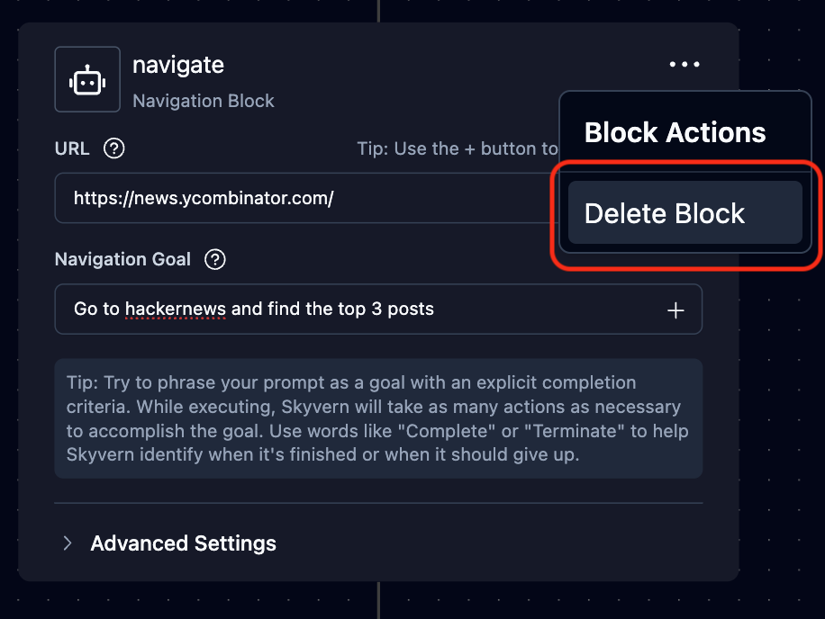

Skyvern's workflow consists of a sequence of workflow blocks. A workflow block usually represents a specific unit of task you can perform. We have [a library of blocks](/workflows/workflow-blocks-details) that you can use to build your workflow.

You can build and manage workflows using the [Skyvern Workflow UI](https://app.skyvern.com/workflows).

You can also manage them via [Workflow APIs](/api-reference/api-reference/workflows/get-workflows) if you want to do it programmatically.

### Create and edit workflows
#### Add a workflow block

Click "+" button to add a new block. There's a library of blocks that you can use to build your workflow. See details of how to use each block [here](/workflows/workflow-blocks-details).

<Warning>The workflow is not auto saved. Don't forget to click the "Save" button on the top after editing your workflow.</Warning>

#### Delete a workflow block

Click the ellipsis ("...") button and "Delete Block" on the top right corner of the block to delete it.

### Export, Import & Delete Workflows
These actions can be done on [Skyvern's Workflows](https://app.skyvern.com/workflows) page.

You can export and save a workflow definition in the format of a YAML or JSON file. You can also import a workflow definition from a YAML or JSON file.

If you want the workflow to be deleted from your workflow list, use the "Delete Workflow" button.

### Workflow Version Control
Version control is a common feature in any workflow builder. This feature is not supported in the UI yet but is coming soon!

To achieve version control today, you can clone a workflow and give the cloned workflow a new name to manage different versions.

