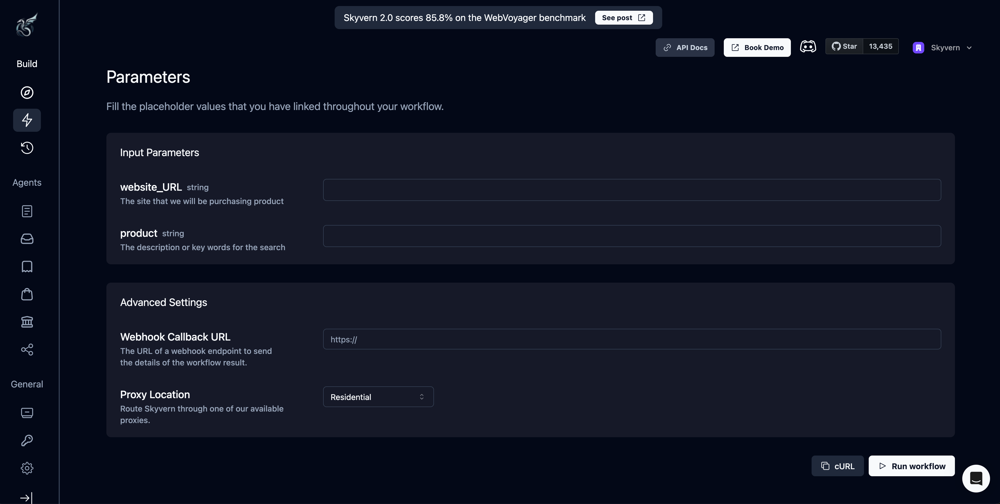

## Run workflows

You can run a workflow by clicking the "Run" button on the top right corner of the workflow editor.

Find the API doc [here](/api-reference/api-reference/workflows/run-workflow)

### Parameters

### Webhook
