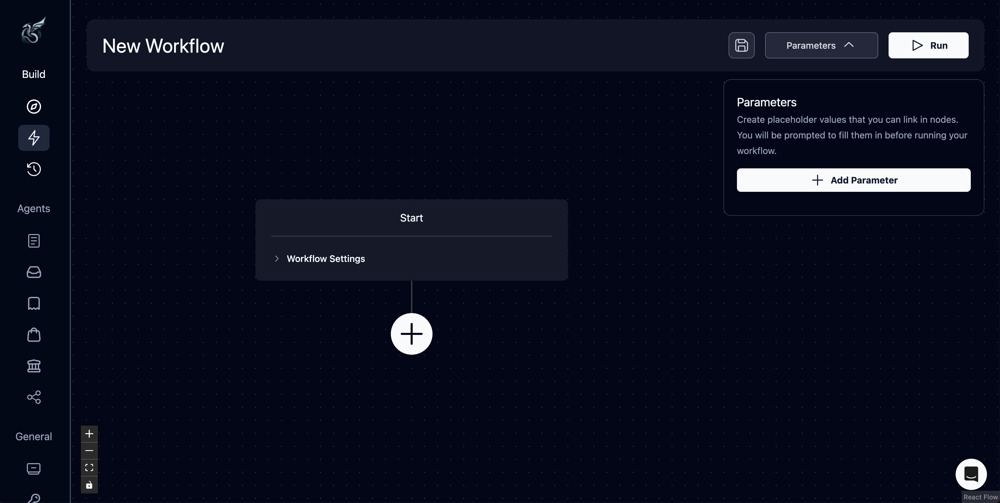
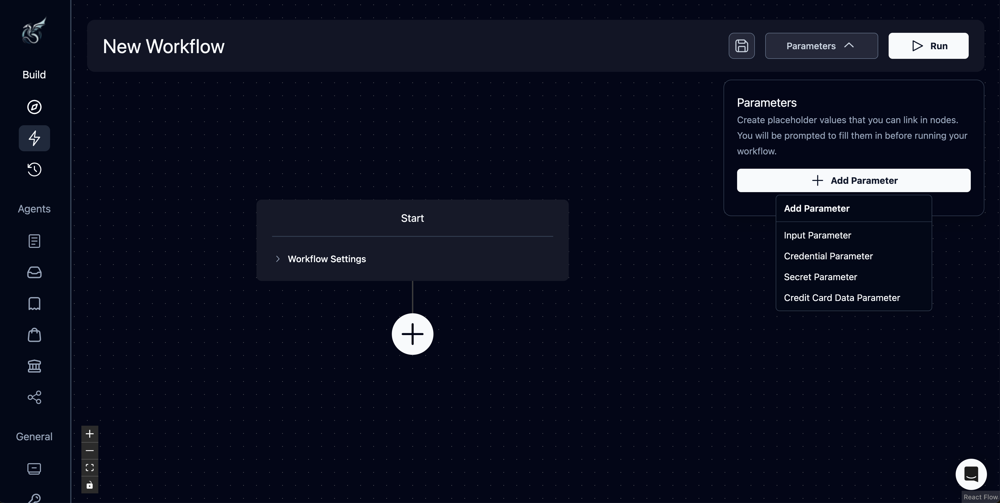
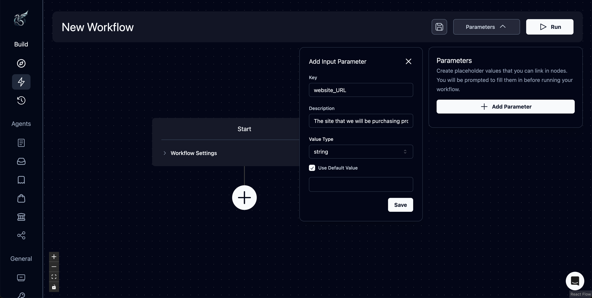

## What is a Parameter?

Parameters allow you to replace specific values with placeholders that can be customized run by run.

If I have a series of task blocks in a workflow that go to Sephora, search for a specific black mascara, add 100 to my cart and purchase, I would have to go in and manually change those items every time if I wanted to do so for a different website, a different product, and different quantity. For those three values, instead of putting in the fixed Sephora URL, product number, and quantity, I can create placeholders for those string value inputs. 

* So, instead of “www.sephora.com” the placeholder parameter would be “website_URL”
* Instead of “ID 123456”, “product_ID”
* And instead of “100”, “quantity”

With these registered as parameters, the user doesn’t have to change the values in each node if they want to change the site, product, or quantity, they only have to write them in after pressing “run”. In this case, the “Sephora Purchase Acquisition” becomes a template for more general “Purchase Acquisitions” that can be customized more easily without tampering with the inner workings of the workflow.

## Adding a Parameter

**Step 1.** To create a placeholder value, you must first create one using the “parameters” dropdown in the Workflow Editor

**Step 2.** Add a workflow parameter

* Note that if you are looking to add a username or password parameter, you must first contact us

**Step 3.** Add a key that will act as the name for the parameter. You can also include a description or set a default value if you wish. Note that a default value pre-populates the run parameter, but can be overridden

**Step 4.** Input the parameter. In this case, we are using the website_URL parameter in the URL of the task block (this is considered a “parameterized field”). For other parameters, you might need to link it in the parameters drop down. **Make sure you read the “Using Parameters” section—this is critical!**

**Step 5.** Press “Run” after you are done configuring your workflow and input values for any parameters you have linked throughout your workflow. Note that if you set a default value, it will automatically populate here. 

## Using Parameters

There are two ways to use parameters in Skyvern’s Workflow Agent (Beta):

### 1. Parameterized Fields: certain fields can accept a fixed string value or a parameter
    
    
If you are looking to load a parameterized value into the following fields, you can only do so by passing the parameter’s key, or name, as text into the input:
    
* Task block: URL, Suffix, TOTP Identifier
* For Loop: loop over value
* File Parser: URL
* Send Email: recipients, body
    
**Steps**
    
1. Create the parameter in the parameter dropdown in the menu. In this case, the key is “website_URL”
2. Type the key freeform into the task URL
    

    

### 2. Block Parameters: any parameter linked in the block that will be passed into the LLM as context Skyvern needs to complete the task. Any other non-parameterized fields accept block parameters this way.
    
    
Create this value when you have details that vary from run-to-run:
    
* For instance, you can parameterize usernames or passwords, how to do something, dates, or uploaded files
  * Ask yourself: does this vary run-by-run? If the answer is yes, there might be value in creating a parameter for it
* Examples: start_date, end_date, procurement_list_file, email_recipients, how_to_download_an_invoice
* to load these values, you can add them in the workflow editor using the run parameters tab in the header
* Make sure to check if this value needs to go into a parameterized field, if not, load them into the parameters drop down, you don’t need to worry about the placement or order as the LLM pieces together what goes where
    
**Steps**
    
1. Create the parameter in the parameter dropdown in the menu. In this case, the parameter keys are start_date, end_date, and how_to_find_invoices_page
2. Link the values in the parameters dropdown menu 
    

    

## Future Plans for Parameters

Our main goal is to make every field a parameterized field and remove block parameters

* We know it’s confusing, but it’s only temporary! In the future we’re headed toward loading parameters directly into each input field. 
* One day, your prompt may look like “Find the invoices page using **/how_to_find_invoices_page**, filter the invoices using **/start_date** and **/end_date** provided.” Or perhaps brackets as are traditionally used in code.
