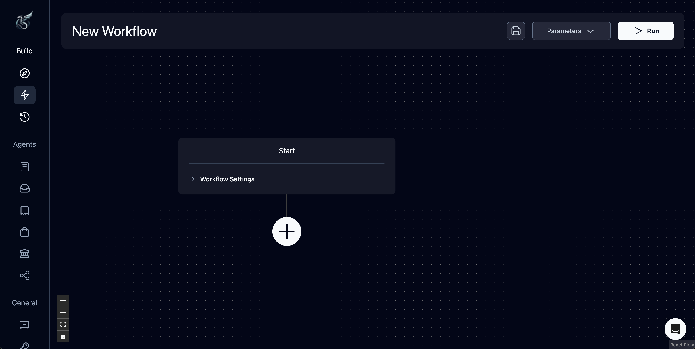
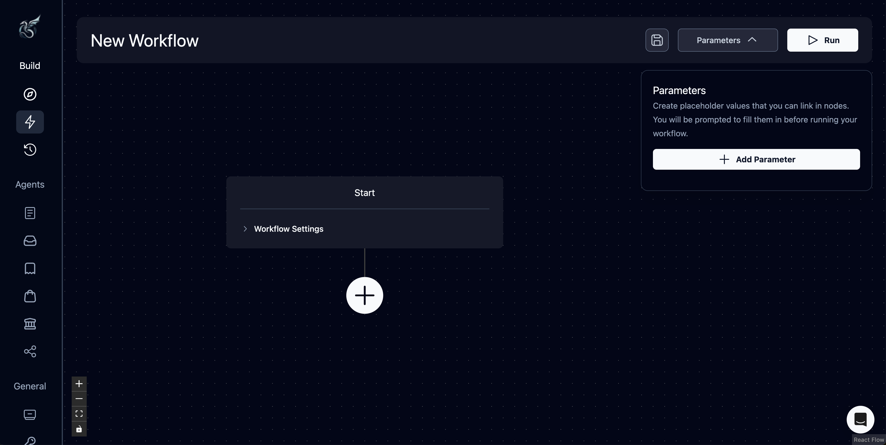
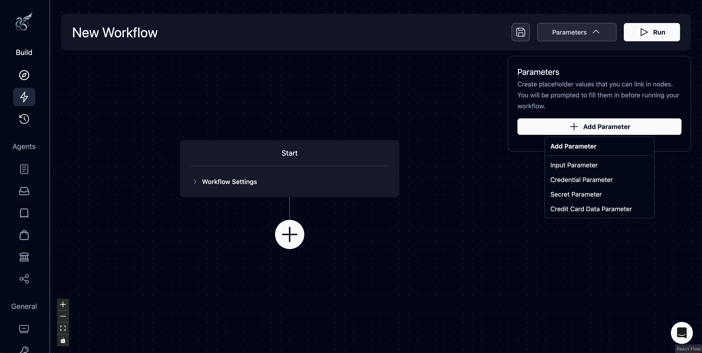
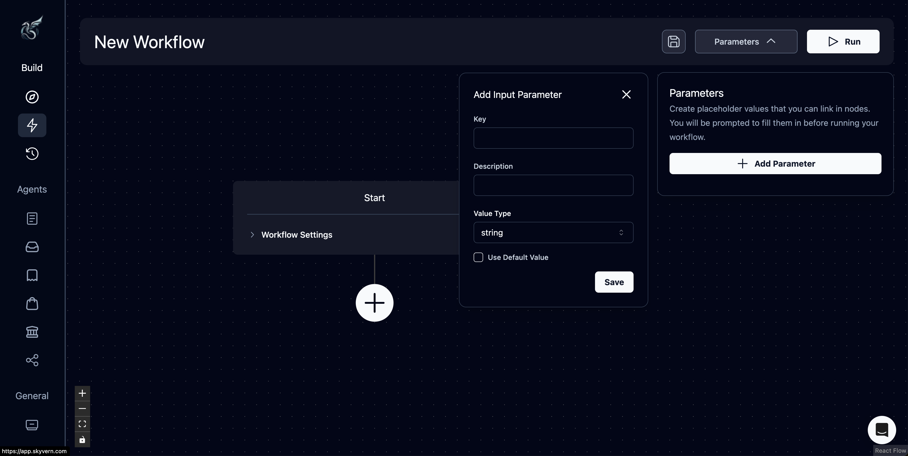
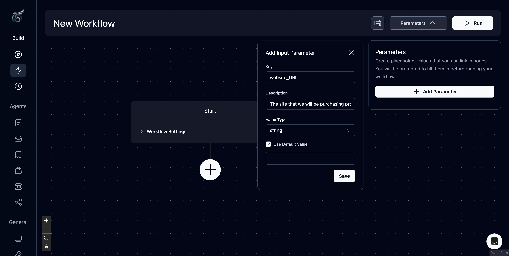
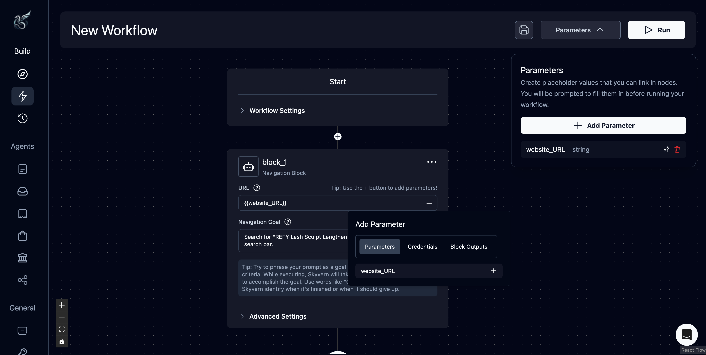
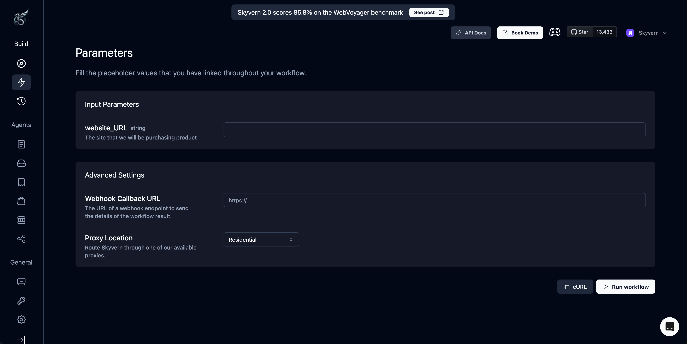
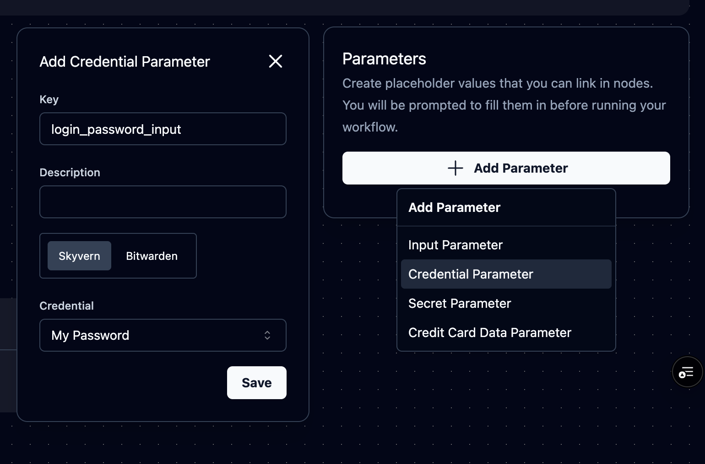
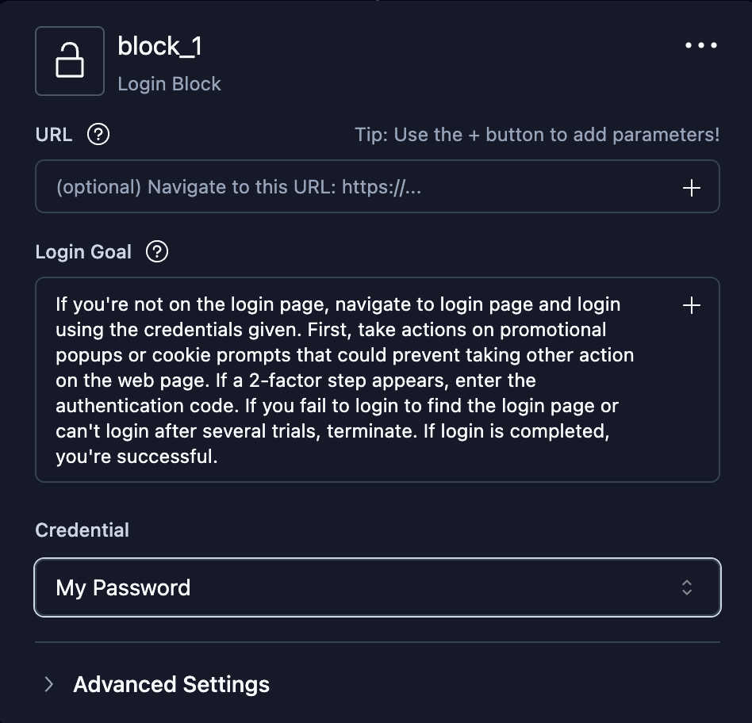
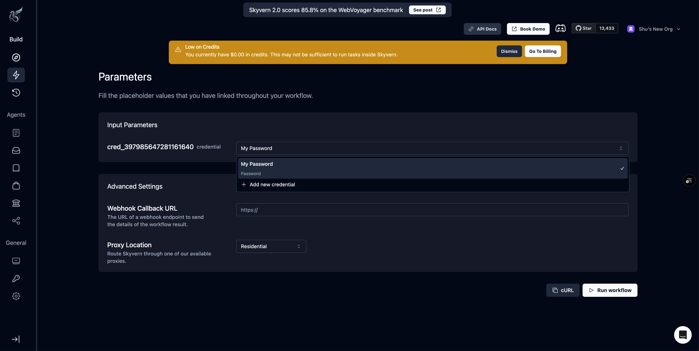

## What is a Parameter?

Parameters allow you to replace specific values with placeholders that can be customized run by run.

If I have a series of task blocks in a workflow that go to Sephora, search for a specific black mascara, add 100 to my cart and purchase, I would have to go in and manually change those items every time if I wanted to do so for a different website, a different product, and different quantity. For those three values, instead of putting in the fixed Sephora URL, product number, and quantity, I can create placeholders for those string value inputs. 

* So, instead of “www.sephora.com” the placeholder parameter would be “website_URL”
* Instead of “ID 123456”, “product_ID”
* And instead of “100”, “quantity”

With these registered as parameters, the user doesn’t have to change the values in each node if they want to change the site, product, or quantity, they only have to write them in after pressing “run”. In this case, the “Sephora Purchase Acquisition” becomes a template for more general “Purchase Acquisitions” that can be customized more easily without tampering with the inner workings of the workflow.

## Adding a Parameter

**Step 1.** To create a placeholder value, you must first create one using the “parameters” dropdown in the Workflow Editor

**Step 2.** Add a workflow parameter

**Step 3.** Add a key that will act as the name for the parameter. You can also include a description or set a default value if you wish. Note that a default value pre-populates the run parameter, but can be overridden.

**Step 4.** Input the parameter. In this case, we are using the website_URL parameter in the URL of the navigation block (this is considered a "parameterized field"). Skyvern uses [JINJA syntax](https://jinja.palletsprojects.com/en/stable/templates/) so you see `{{website_URL}}` after picking the parameter. You can also type the reference to website_URL with double curly braces around. **Make sure you read the “Using Parameters” section—this is critical!**

**Step 5.** Press "Run" after you are done configuring your workflow and input values for any parameters you have linked throughout your workflow. Note that if you set a default value, it will automatically populate here. 

## Credential Parameters 
Credential parameter can be an input for running a workflow.

You can also choose a credential parameter for a login block.

Pick the credential to use when running the workflow when you have defined a credential parameter in the workflow.

## Reserved Parameters
There are some parameters that are reserved by Skyvern and cannot be used as a parameter key/name:
- `{{current_value}}`: this is a reserved parameter within the scope of a for loop block. It represents the current value that the loop is iterating over.

## Block Output Parameters
Any block name ({{your_block_name}} or {{your_block_name_output}}) can be referenced as a parameter by a later block, with the exception of referencing a block within a for loop from outside of the for loop block.

## Referencing A Parameter
- Any parameter can be referenced in [JINJA syntax](https://jinja.palletsprojects.com/en/stable/templates/).
- Parameters can be referenced almost anywhere where you can type or whenever you see a "+" sign to pick a parameter.
- An earlier block is not allowed to reference any block that will be executed later.