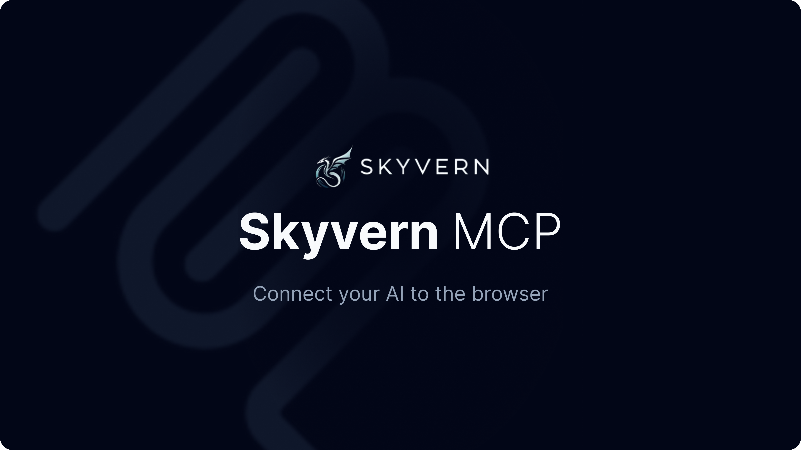

<!-- DOCTOC SKIP -->

- [Model Context Protocol (MCP)](#model-context-protocol-mcp)
  - [Integration Options](#integration-options)
  - [Supported Applications](#supported-applications)

<h1 align="center">
  <picture>
    <source media="(prefers-color-scheme: dark)" srcset="images/SkyvernMCP.png"/>
    
  </picture>
</h1>

# Model Context Protocol (MCP)

Skyvern's MCP server implementation helps connect your AI Applications to the browser. This allows your AI applications to do things like: Fill out forms, download files, research information on the web, and more.

## Quickstart
1. **Install Skyvern**
	```bash
	pip install skyvern
	```

2. **Configure Skyvern** Run the setup wizard which will guide you through the configuration process. You can connect to either [Skyvern Cloud](https://app.skyvern.com) or a local version of Skyvern. 
	```bash
	skyvern init
	```

3. ** (Optional) Launch the Skyvern Server. Only required in local mode** 

	```bash
	skyvern run server
	```

## Integration Options

You can connect your MCP-enabled applications to Skyvern in two ways:
1. **Local Skyvern Server**
   - Configure your applications to connect to skyvern server running on the localhost
   - To run Skyvern server locally: `skyvern run server`

2. **Skyvern Cloud**
   - Configure your applications to connect to Skyvern Cloud
   - Create an account at [app.skyvern.com](https://app.skyvern.com)
   - Get the API key from the settings page which will be used for setup

Follow the [installation instructions](#local) to set up. 

## Supported Applications
`skyvern init` helps configure the following applicaitons for you:
- Cursor
- Windsurf
- Claude Desktop
- Your custom MCP App?

Use the following config if you want to set up Skyvern for any other MCP-enabled application
```
{
  "mcpServers": {
    "Skyvern": {
      "env": {
        "SKYVERN_BASE_URL": "https://api.skyvern.com", # "http://localhost:8000" if running locally
        "SKYVERN_API_KEY": "YOUR_SKYVERN_API_KEY" # find the local SKYVERN_API_KEY in the .env file after running `skyvern init` or in your Skyvern Cloud console
      },
      "command": "PATH_TO_PYTHON",
      "args": [
        "-m",
        "skyvern",
        "run",
        "mcp"
      ]
    }
  }
}
```