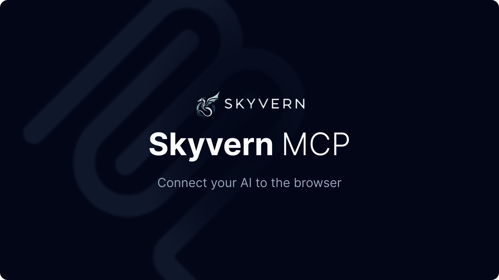

<!-- DOCTOC SKIP -->

<h1 align="center">
  <picture>
    <source media="(prefers-color-scheme: dark)" srcset="images/SkyvernMCP.png"/>
    
  </picture>
</h1>

# Model Context Protocol (MCP)

Skyvern's MCP server implementation helps connect your AI Applications to the browser. This allows your AI applications to do things like: Fill out forms, download files, research information on the web, and more.

You can connect your MCP-enabled applications to Skyvern in two ways:
1. **Local Skyvern Server**
   - Use your favourite LLM to power Skyvern
2. **Skyvern Cloud**
   - Create an account at [app.skyvern.com](https://app.skyvern.com)
   - Get the API key from the settings page which will be used for setup

## Quickstart
> ⚠️ **REQUIREMENT**: Skyvern only runs in Python 3.11 environment today ⚠️

1. **Install Skyvern**
	```bash
	pip install skyvern
	```

2. **Configure Skyvern** Run the setup wizard which will guide you through the configuration process. You can connect to either [Skyvern Cloud](https://app.skyvern.com) or a local version of Skyvern. 
	```bash
	skyvern init
	```

3. **(Optional) Launch the Skyvern Server. Only required in local mode** 
	```bash
	skyvern run server
	```

## Examples
### Skyvern allows Claude to look up the top Hackernews posts today

https://github.com/user-attachments/assets/0c10dd96-c6ff-4b99-ad99-f34a5afd04fe

### Cursor looking up the top programming jobs in your area

https://github.com/user-attachments/assets/084c89c9-6229-4bac-adc9-6ad69b41327d

### Ask Windsurf to do a form 5500 search and download some files 

https://github.com/user-attachments/assets/70cfe310-24dc-431a-adde-e72691f198a7

## Supported Applications
`skyvern init` helps configure the following applications for you:
- Cursor
- Windsurf
- Claude Desktop
- Your custom MCP App?

Use the following config if you want to set up Skyvern for any other MCP-enabled application
```json
{
  "mcpServers": {
    "Skyvern": {
      "env": {
        "SKYVERN_BASE_URL": "https://api.skyvern.com", # "http://localhost:8000" if running locally
        "SKYVERN_API_KEY": "YOUR_SKYVERN_API_KEY" # find the local SKYVERN_API_KEY in the .env file after running `skyvern init` or in your Skyvern Cloud console
      },
      "command": "PATH_TO_PYTHON",
      "args": [
        "-m",
        "skyvern",
        "run",
        "mcp"
      ]
    }
  }
}
```

## Glama Release Setup

Glama's "release" flow is different from publishing the package to PyPI or the
official MCP Registry. For Glama, you need a runnable server container so Glama
can boot the MCP server, inspect the tool schema, and publish an installable
release in their directory.

Use the dedicated [`Dockerfile`](./Dockerfile) in this directory for that flow.
The root [`Dockerfile`](../../Dockerfile) is for the full Skyvern app stack and
starts `python -m skyvern.forge`, which is the wrong runtime for an MCP-only
Glama release.

Recommended Glama setup:

1. Claim the server in Glama. This repository already includes
   [`glama.json`](../../glama.json), so authorized maintainers can claim the
   `Skyvern-AI/skyvern` entry.
2. In Glama's Dockerfile admin page, point the build to `Dockerfile.glama`.
3. Keep the default command unless Glama explicitly asks for HTTP transport.
   The image defaults to `python -m skyvern run mcp` over stdio.
4. If you want the hosted Glama release to use Skyvern Cloud browser sessions,
   add a real `SKYVERN_API_KEY` secret in Glama. Otherwise the container boots
   in local embedded mode, which is enough for inspection but not ideal for
   cloud-backed browser sessions.
5. Deploy, wait for inspection to pass, then use Glama's "Make Release" action
   in the server admin UI.

If you are also publishing to the official MCP Registry, treat that as a
separate step. The official registry uses package metadata and `server.json`;
Glama releases are container-based.
