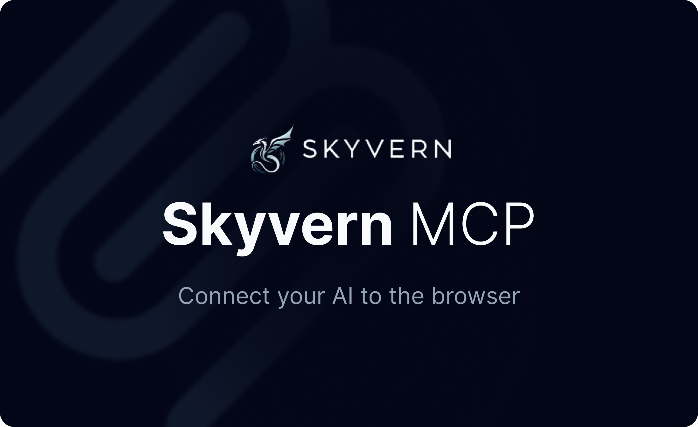

<!-- DOCTOC SKIP -->

<h1 align="center">
  <picture>
    <source media="(prefers-color-scheme: dark)" srcset="images/SkyvernMCP.png"/>
    
  </picture>
</h1>

# Model Context Protocol (MCP)

Skyvern MCP lets your MCP client control browser automation tools (navigation, extraction, workflows, screenshots, and more).

> Current availability: Skyvern MCP currently runs as a local stdio process (`skyvern run mcp`) on your machine.
> Remote-hosted MCP is planned, but is not the default setup today.

You can use MCP with:
1. **Skyvern Cloud** (`SKYVERN_BASE_URL=https://api.skyvern.com` + your API key)
2. **Local Skyvern Server** (`SKYVERN_BASE_URL=http://localhost:8000`)

## Quickstart
> Supported Python versions: 3.11, 3.12, 3.13

1. **Install Skyvern**
```bash
pip install skyvern
```

2. **Run the setup wizard**
```bash
skyvern init
```
The wizard will:
- ask whether to use Cloud or local mode
- collect/set `SKYVERN_BASE_URL` and `SKYVERN_API_KEY`
- auto-configure MCP for Claude Desktop, Cursor, and Windsurf

3. **Only for local mode: start the API server**
```bash
skyvern run server
```

4. **Restart your MCP client app** and ask it to use Skyvern tools.

## Config file locations

| Client | Auto-configured by `skyvern init` | Config location |
|---|---|---|
| Claude Desktop (macOS) | Yes | `~/Library/Application Support/Claude/claude_desktop_config.json` |
| Claude Desktop (Linux) | Yes | `~/.config/Claude/claude_desktop_config.json` (or `~/.local/share/Claude/claude_desktop_config.json`) |
| Cursor | Yes | `~/.cursor/mcp.json` |
| Windsurf | Yes | `~/.codeium/windsurf/mcp_config.json` |
| Claude Code (project scope) | No | `<project>/.mcp.json` |
| Claude Code (user/local scopes) | No | `~/.claude.json` |

## Manual configuration (any MCP client)

Use this if you are setting up a custom MCP client, or Claude Code.

```json
{
  "mcpServers": {
    "Skyvern": {
      "env": {
        "SKYVERN_BASE_URL": "https://api.skyvern.com",
        "SKYVERN_API_KEY": "YOUR_SKYVERN_API_KEY"
      },
      "command": "/absolute/path/to/python3",
      "args": ["-m", "skyvern", "run", "mcp"]
    }
  }
}
```

For local mode:
- set `SKYVERN_BASE_URL` to `http://localhost:8000`
- use your local `.env` API key from `skyvern init`
- run `skyvern run server` before using MCP

## Claude Code setup

`skyvern init` does not currently write Claude Code config automatically.

For Claude Code project scope, create `<project>/.mcp.json`:

```json
{
  "mcpServers": {
    "Skyvern": {
      "env": {
        "SKYVERN_BASE_URL": "https://api.skyvern.com",
        "SKYVERN_API_KEY": "YOUR_SKYVERN_API_KEY"
      },
      "command": "/absolute/path/to/python3",
      "args": ["-m", "skyvern", "run", "mcp"]
    }
  }
}
```

For Claude Code user/local scopes, place the same `mcpServers.Skyvern` object in `~/.claude.json`.

## Examples
### Skyvern allows Claude to look up the top Hackernews posts today

https://github.com/user-attachments/assets/0c10dd96-c6ff-4b99-ad99-f34a5afd04fe

### Cursor looking up the top programming jobs in your area

https://github.com/user-attachments/assets/084c89c9-6229-4bac-adc9-6ad69b41327d

### Ask Windsurf to do a form 5500 search and download some files 

https://github.com/user-attachments/assets/70cfe310-24dc-431a-adde-e72691f198a7
